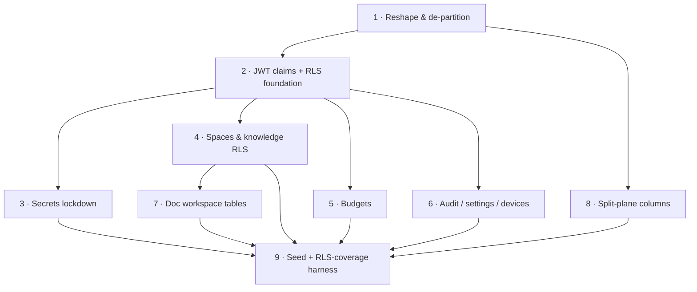

# F1 · Data model & schema — implementation plan

## Objective
Implement the approved [F1 spec](../specs/F1-data-model.md): reshape the existing `database/` design for the Supabase SaaS — **RLS-based tenant isolation** (drop partition-per-tenant), the locked decisions (`vector(1024)`, fixed tenant-level roles, MCP + agents deferred), and the new v1 tables. Everything applies through **dbd** (`dbd reset && dbd apply && dbd import`).

**Layer stack for this module** (the F1 "vertical slice"): `DDL (tables/columns) → RLS policies → JWT claims → seed → tests`. Downstream consumers (C1 gateway, web/desktop clients) are out of F1 scope. Each feature applies and is testable independently via dbd against a fresh Postgres.

## Features

### Feature 1 — Schema reshape & de-partition
- **Issue:** [#1](https://github.com/sensei-hq/strategos/issues/1)
- **Layers:** DDL → seed
- **Depends on:** —
- **Acceptance criteria:**
  - `dbd reset && dbd apply && dbd import` exits 0 on a fresh Postgres.
  - No partitioned tables and no per-tenant partitions exist; the `add_tenant_partitions` trigger + function are removed. `tenant_id` columns and composite FKs are retained.
  - Deferred objects are absent: `config.mcp_servers`, `public.tenant_mcp_servers`, `public.plans`, `public.planned_tasks`, `public.planned_task_interactions`, `public.curator_conversations` (and their history/views) → `to_regclass(...)` is NULL for each.
  - `public.document_embeddings.embedding` is `vector(1024)` with an HNSW index.
  - All timestamp columns are `timestamptz`.
- **Test scenarios:**
  - Given a fresh Postgres, When dbd reset/apply/import runs, Then it completes with exit 0 and creates zero tenant partitions.
  - Given the applied schema, When I check the deferred objects, Then none exist.

### Feature 2 — JWT claims hook & RLS tenant foundation
- **Issue:** [#2](https://github.com/sensei-hq/strategos/issues/2)
- **Layers:** JWT claims → RLS
- **Depends on:** Feature 1
- **Acceptance criteria:**
  - A Supabase auth hook injects `tenant_id`, `role`, `groups` into the access-token claims.
  - RLS is enabled on **every** tenant-scoped table, each with ≥1 policy; a coverage query returns 0 tables missing a policy.
  - An `authenticated` session carrying tenant A's JWT reads only tenant A rows from tenant-scoped tables; `service_role` reads across tenants.
- **Test scenarios:**
  - Given rows for tenant A and tenant B, When a user with tenant A's JWT selects, Then only tenant A rows return.
  - Given any tenant-scoped table, When RLS is inspected, Then it is enabled with at least one policy.

### Feature 3 — Secrets lockdown (key vault)
- **Issue:** [#3](https://github.com/sensei-hq/strategos/issues/3)
- **Layers:** RLS
- **Depends on:** Feature 2
- **Acceptance criteria:**
  - `public.router_keys` and `core.tenant_keys` deny all access to `anon`/`authenticated`; only `service_role` can read.
  - No view or function exposes raw/decrypted key material.
- **Test scenarios:**
  - Given a tenant key exists, When an `authenticated` user selects from `router_keys`, Then 0 rows / permission denied.
  - Given the schema, When views are enumerated, Then none select from `router_keys`/`tenant_keys`.

### Feature 4 — Spaces, knowledge access & confidentiality RLS
- **Issue:** [#4](https://github.com/sensei-hq/strategos/issues/4)
- **Layers:** DDL → RLS → seed
- **Depends on:** Feature 2
- **Acceptance criteria:**
  - A first-class `spaces` table (name, classification, owner) exists; `documents.space_id` FK is enforced in-tenant.
  - RLS on `documents`/`spaces` enforces access-group membership (recursive group walk) and classification (confidential → space members only), reconciled with `access_groups`/`group_levels`/`document_access`/`profile_groups`.
- **Test scenarios:**
  - Given a confidential document in space S, When a non-member queries it, Then 0 rows; When a member queries it, Then it returns.
  - Given a document, When its `space_id` references another tenant's space, Then the insert is rejected.

### Feature 5 — Budgets schema
- **Issue:** [#5](https://github.com/sensei-hq/strategos/issues/5)
- **Layers:** DDL → RLS → seed
- **Depends on:** Feature 2
- **Acceptance criteria:**
  - `budget_nodes` self-referential tree: `kind` (org/dept/team/user), `cap`, `period` (D/W/M), `enforcement` (hard/soft), `alert_threshold`, `free_floor_enabled`, `spent` rollup; composite in-tenant self-FK.
  - RLS scopes nodes to tenant; a node referencing another tenant's parent is rejected.
- **Test scenarios:**
  - Given an org→dept→team→user chain, When inserted, Then the hierarchy persists and resolves.
  - Given a node, When its parent is in another tenant, Then the insert is rejected.

### Feature 6 — Governance & ops tables (audit, settings, devices)
- **Issue:** [#6](https://github.com/sensei-hq/strategos/issues/6)
- **Layers:** DDL → RLS
- **Depends on:** Feature 2
- **Acceptance criteria:**
  - `audit_events` is append-only: `authenticated` may INSERT + SELECT within tenant but UPDATE/DELETE are denied.
  - `settings` supports `scope` = workspace|space with key/value (json); RLS scoped.
  - `devices` (device_id, profile_id, pubkey, app_version, config_version, last_seen, status) with tenant/owner RLS.
- **Test scenarios:**
  - Given an audit_event, When an `authenticated` user attempts UPDATE or DELETE, Then it is denied; SELECT within tenant succeeds.
  - Given a device row for another user, When queried by a non-owner non-admin, Then it is not returned.

### Feature 7 — Document workspace tables (collections, versions, assets)
- **Issue:** [#7](https://github.com/sensei-hq/strategos/issues/7)
- **Layers:** DDL → RLS
- **Depends on:** Feature 4
- **Acceptance criteria:**
  - `document_collections`, `document_versions`, `document_assets` (Storage path refs; `kind` md/csv/image/etc.) with in-tenant FKs to `documents`/`spaces`.
  - Access follows the parent document's access (RLS), versions/lineage modelable.
- **Test scenarios:**
  - Given a document with versions and assets, When a non-member queries its assets, Then 0 rows.
  - Given an asset, When its document is in another tenant, Then the insert is rejected.

### Feature 8 — Split-plane columns
- **Issue:** [#8](https://github.com/sensei-hq/strategos/issues/8)
- **Layers:** DDL
- **Depends on:** Feature 1
- **Acceptance criteria:**
  - `model_endpoints.local_capable boolean default false`; `fallback_chain_models.plane` (`'local'|'cloud'` default `'cloud'`); `gateway_tasks.execution_location` (`'local'|'cloud'`).
  - `effective_chain_models` and `viable_chain_models` views still resolve after the change.
- **Test scenarios:**
  - Given the schema, When I query `viable_chain_models`, Then it resolves and the `plane` column is available on chain models.

### Feature 9 — Seed refresh & RLS-coverage test harness
- **Issue:** [#9](https://github.com/sensei-hq/strategos/issues/9)
- **Layers:** seed → tests
- **Depends on:** Features 1–8
- **Acceptance criteria:**
  - `import/staging/*.jsonl` + `loader.sql` updated to the new schema (deferred seeds removed; default platform spaces/budgets added); `dbd import` loads cleanly.
  - An automated harness asserts (a) RLS coverage = 100% of tenant tables, (b) cross-tenant read returns 0 rows, (c) confidential-doc isolation — and **fails loudly** if a new tenant table lacks a policy. Runnable in CI.
- **Test scenarios:**
  - Given the full schema + seed, When the harness runs, Then RLS coverage is 100% and all negative tests pass.
  - Given a new tenant table added without a policy, When the harness runs, Then it fails and names the table.

## Dependency graph

**Suggested build order:** 1 → 2 → (3, 4, 5, 6 in parallel) → 7 → 8 → 9.
