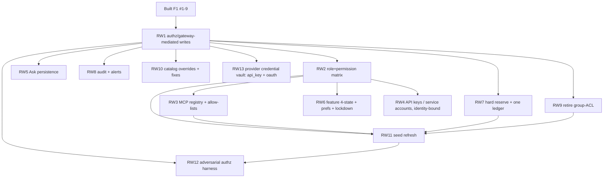

# F1 · Data model — security + scope REWORK plan

## Objective

The v1 schema in [`database/`](../../database/) is built and RLS-tested, but was authored under superseded assumptions and carries **critical security holes** (any `authenticated` member can escalate their role, raise their own budget, self-join a confidential space, declassify a doc, or forge audit rows; `config.feature_states` is anon-writable) and **scope gaps** (no permission matrix, no MCP/API-key tables, no Ask persistence, a dead group-ACL, and a broken `similarity_search`). This plan reworks it to [`DECISIONS.md`](../DECISIONS.md).

Applies through **dbd** (`dbd reset && dbd apply && dbd import` — no migrations pre-v1, per `project_db_workflow`). Every feature edits `.ddl`/policy/seed files and is independently testable against a fresh Postgres. The existing RLS-coverage harness (`tests/rls.sql`) is **extended with adversarial authz tests** (RW12) that must fail if any hole reopens.

**Guiding invariant (the premise):** *no `authenticated` client can, via PostgREST or any path, change a role/permission, raise a budget, exceed a hard cap, read a doc above its clearance, or forge audit — enforcement is server-side (RLS + gateway), never UI.*

## Features

### RW1 — Authz hardening: gateway-mediated writes on privileged tables
- **Layers:** RLS → grants
- **Depends on:** built F1 (Features 1–9)
- **Decision:** DECISIONS §2 W1.
- **Acceptance criteria:**
  - Privileged tables — `core.profile_tenants`, `public.budget_nodes`, `public.fallback_chains`, `public.fallback_chain_models`, `public.spaces`, `public.space_members`, `public.settings`, `documents.classification` writes, `documents.document_embeddings`, `documents.document_assets`, `documents.document_versions`, governance/feature tables, catalog-override tables — are **`service_role`-write-only**: `authenticated`/`anon` are `REVOKE`d INSERT/UPDATE/DELETE, and any RLS write policy is `service_role`-scoped. (`documents.document_collections` remains space-scoped **self-write** for members — embeddings/assets/versions are gateway-produced derivatives, never client-written.)
  - `authenticated` retains tenant-scoped `SELECT` on the readable subset, and INSERT/UPDATE only on self-owned benign rows (own draft `documents`, own `user_preferences`, own `budget_requests`, own `conversations`/`messages`).
  - The privilege-escalation path is closed: `UPDATE core.profile_tenants SET role=…` (or the RW2 equivalent) by `authenticated` is denied.
- **Test scenarios:**
  - Given tenant-A member JWT, When they attempt to raise their `budget_nodes.cap_amount` / change their role / insert into `space_members` for a space they don't own / `UPDATE documents SET classification='public'`, Then each is denied.
  - Given `service_role`, When the gateway performs the same mutations, Then they succeed.

### RW2 — Role + permission matrix (replace the fixed enum)
- **Layers:** DDL → JWT claims → RLS → seed
- **Depends on:** RW1
- **Decision:** #4 / DECISIONS §1.
- **Acceptance criteria:**
  - New `core.profiles` (`id` = `auth.users.id` PK/FK, `claims_version bigint NOT NULL DEFAULT 0`, display fields — display name, avatar, etc.); `core.profile_tenants` and `profile_roles` FK to `core.profiles(id)`. The `custom_access_token_hook` staleness gate reads `core.profiles.claims_version` (bumped whenever a user's role/capability grants change) to invalidate stale JWTs; `claims_version` is `i64`/`bigint` everywhere (DB column, JWT claim, gateway).
  - New `roles` (tenant-scoped; seeded defaults owner/admin/editor/viewer/member/service + custom), `role_permissions` (role × capability grant, capabilities enumerated), `profile_roles` (user↔role, tenant-scoped, composite FK).
  - `core.profile_tenants.role` enum is removed (or demoted to a cached convenience) and **no code path depends on it** for authz.
  - `custom_access_token_hook` injects the canonical claims — `tenant_id` + `role_ids[]` + `claims_version` (NO role enum, NO `groups[]`) — into the JWT; RLS predicates and C1 resolve capabilities from `role_ids[]` against the F2 §4.3 closed capability set.
  - One hierarchical tree (org→dept→team→user) is shared by permissions and `budget_nodes` (documented linkage).
- **Test scenarios:**
  - Given a role with capability `budget.write` absent, When that user attempts a budget mutation via the gateway, Then it's rejected by the server-side capability check.
  - Given a custom role, When assigned to a user, Then their JWT reflects the granted capabilities and RLS honors them.

### RW3 — MCP server registry + tool allow-lists (into v1)
- **Layers:** DDL → RLS → seed
- **Depends on:** RW1, RW2
- **Decision:** #1 / DECISIONS §1.
- **Acceptance criteria:**
  - `mcp_servers` (transport `stdio|http|sse`, url/command, scope `platform|tenant`, enabled), `tenant_mcp_servers` (tenant enablement/config), `tool_allow_lists` (grant keyed by role **and** space → allowed tool/server).
  - Orphan seed `import/dev/staging/mcp_servers.jsonl` is wired into `loader.sql` and loads cleanly.
  - RLS: tenant-scoped read; `service_role`-write (managed via the Admin Tools&MCP screen through the gateway).
- **Test scenarios:**
  - Given a tool not granted to a member's role×space, When the allow-list is resolved, Then the tool is absent (matching the Playground "blocked — not in allow-list" state).
  - Given `dbd import`, When it runs, Then `mcp_servers` is populated from the seed.

### RW4 — API keys / service accounts (programmatic access, identity-bound)
- **Layers:** DDL → RLS
- **Depends on:** RW1, RW2
- **Decision:** #2 / DECISIONS §1 + §2 W2.
- **Acceptance criteria:**
  - `service_accounts` (a first-class identity; is a node in the org/budget tree via `budget_nodes.kind='service'`). `api_keys` **authenticate an identity** — FK to a `profile` **or** a `service_account` — with `hashed_secret` + public `prefix`, `scope`/capabilities, `rate_limit`, `last_used_at`, `status active|revoked`, `created_by`.
  - **No budget column on `api_keys`.** Budget is resolved at execution from the *identity* the key authenticates → its `budget_nodes` (RW7); multiple keys for one identity share that identity's budget.
  - Raw key material is never stored or SELECTable (hash only; reveal-once at creation via the gateway).
  - RLS: tenant-scoped read of metadata; `service_role`-write; the gateway validates a presented key by prefix+hash → resolves the identity + capabilities (budget comes from the identity, not the key).
- **Test scenarios:**
  - Given an issued key, When any client SELECTs `api_keys`, Then no usable secret is returned (hash/prefix only) and no budget field exists on the key.
  - Given two keys for the same service account, When both spend, Then spend accrues to the **one** service-account budget node (shared), not per-key.
  - Given a revoked key, When presented to the gateway, Then the call is rejected.

### RW5 — Ask persistence (conversations / messages / citations)
- **Layers:** DDL → RLS
- **Depends on:** RW1
- **Decision:** DECISIONS §5. (These were specced in F1 but never built.)
- **Acceptance criteria:**
  - `conversations` (tenant, owner, space, title, created/modified), `messages` (conversation, role user|assistant, content, model/tier, cost, execution_location, created), `message_citations` (message → document/chunk + score).
  - RLS: owner + tenant-scoped; a member reads only their own conversations (plus shared-space rules where applicable).
- **Test scenarios:**
  - Given a conversation owned by user A, When user B (same tenant, non-shared) queries it, Then 0 rows.
  - Given an assistant message with citations, When read, Then citations resolve to accessible documents only.

### RW6 — Feature governance (4-state) + user preferences + lockdown
- **Layers:** DDL → RLS → grants
- **Depends on:** RW1, RW2
- **Decision:** DECISIONS §4 + §2 (feature_states lockdown).
- **Acceptance criteria:**
  - Feature governance expressed as a policy keyed `(feature, role, space)` with 4-state `locked|default-on|default-off|user-overridable`; precedence resolves **workspace → space → role → user**.
  - `config.feature_states` (or its replacement) gains `tenant_id` + RLS; **anon INSERT/UPDATE/DELETE is REVOKED** (`import/permissions.sql` fixed).
  - New `user_preferences` (tenant, profile, key/value) for the user layer of the control model; RLS = owner-write.
- **Test scenarios:**
  - Given an unauthenticated caller, When they attempt to write `feature_states`, Then denied.
  - Given a `locked` feature, When a user sets a `user_preferences` override, Then resolution still returns the locked value.

### RW7 — Budget hard-reserve + single ledger consolidation
- **Layers:** DDL → function → RLS
- **Depends on:** RW1
- **Decision:** DECISIONS §2 W2 + §3 (one ledger).
- **Acceptance criteria:**
  - CREATE `public.budget_holds` (C3 §3.1 canonical shape): `id`, `tenant_id`, `budget_node_id`, `path_node_ids` (ancestor node ids the hold reserves against, org→dept→team→user), `amount`, `status` `active|committed|released|expired`, `idempotency_key` (unique, for reserve retries), `created_at`, `expires_at`. `service_role`-write only; tenant-scoped SELECT.
  - ALTER `public.budget_nodes` to add `reserved_amount`, `period_started_at`, `soft_overshoot_limit`.
  - `inference_calls` is the single `service_role`-only call ledger; add C3 §3.1 attribution columns — `budget_node_id` + org/dept/team/user node attribution cols, `execution_location`, and `hold_id` (FK → `budget_holds`) — so a call rolls up the tree and links to the hold it committed. `gateway_tasks` cost/metering fields are retired.
  - A DB function performs the cascade check ("every ancestor has headroom") and `spent_amount` rollup; the gateway calls a **reserve→commit** for `hard` nodes (no client-writable metering). **Headroom formula:** available = `cap_amount − spent_amount − reserved_amount` at every node on `path_node_ids`; a reserve inserts an `active` hold (incrementing `reserved_amount`) only if every ancestor has headroom, commit converts it to an `inference_calls` row + `committed` hold (moving amount from `reserved_amount` to `spent_amount`), release/expire returns the reservation. **Hard-cap concurrency invariant:** for a `hard` node, concurrent reserves must admit ≤ headroom (serialized reserve so cap is never exceeded even under a race).
  - `budget_requests` (member increase request → admin approval → applies to `budget_nodes.cap_amount`).
- **Test scenarios:**
  - Given a `hard` node at its cap, When two calls race concurrently, Then at most the headroom is admitted (no overshoot) and the rest are rejected.
  - Given a client, When it attempts to write `inference_calls`/spend, Then denied.

### RW8 — Audit integrity + alerts
- **Layers:** RLS → DDL
- **Depends on:** RW1
- **Decision:** DECISIONS §2 (audit) + §5 schema (alerts).
- **Acceptance criteria:**
  - `audit_events` INSERT `WITH CHECK` binds `actor_id = auth.uid()` (or writes are `service_role`-only, gateway-emitted); UPDATE/DELETE remain denied to `authenticated`.
  - New `alert_rules`, `notification_channels` (email/Slack/webhook/SIEM), `alert_events`; RLS tenant-scoped, `service_role`-write.
  - CREATE `public.quality_signals` (C6 §3.1 shape): `id`, `tenant_id`, `inference_call_id` (FK, nullable), `message_id` (FK, nullable), `conversation_id` (FK, nullable), `signal_key`, `signal_class`, `value_num`, `value_text`, `value_json`, `unit`, `source`, `actor_id`, `schema_version`, `created_at`. RLS = `service_role`-write only + tenant-scoped SELECT; `CHECK` that at least one of `inference_call_id` OR `message_id` is non-null.
- **Test scenarios:**
  - Given a member, When they INSERT an audit row attributing an action to another user, Then denied (or `actor_id` forced to self).
  - Given an alert rule breach, When the gateway emits, Then an `alert_events` row + channel dispatch record exists.
  - Given an `authenticated` member, When they INSERT/UPDATE/DELETE `quality_signals`, Then denied; when the gateway (`service_role`) writes a signal, Then it succeeds and is tenant-SELECTable; a row with both `inference_call_id` and `message_id` null violates the `CHECK`.

### RW9 — Retire group-ACL; space+classification only
- **Layers:** DDL → RLS
- **Depends on:** RW1
- **Decision:** DECISIONS §3 (doc ACL).
- **Acceptance criteria:**
  - `access_groups`, `group_levels`, `*_lang`, `document_access`, `profile_groups`, and the `user_accessible_documents` view are **removed**; no policy/function/view references them.
  - `policies/knowledge.sql` enforces space membership + 4-level classification only, and the `groups[]` JWT claim / hook read is dropped or repurposed.
- **Test scenarios:**
  - Given the schema, When objects are enumerated, Then the retired tables/view do not exist and nothing references them.
  - Given confidential/restricted docs, When queried by non-member vs member vs owner, Then classification rules hold.

### RW10 — Catalog per-tenant overrides + fixes
- **Layers:** DDL → grants → function
- **Depends on:** RW1
- **Decision:** DECISIONS §5.
- **Acceptance criteria:**
  - Per-tenant/space/role **catalog override** tables — `model_overrides` and `provider_overrides` — layered over the platform `config.providers/models/model_endpoints`. Each has: `tenant_id`, `scope` (`tenant|space|role`) + `scope_id`, a model ref (`model_overrides`) / provider ref (`provider_overrides`), `enabled`, price overrides (`price_input`, `price_output`), `verified`, and audit cols (`created_at`, `updated_at`, `created_by`). `service_role`-write, tenant-scoped SELECT.
  - **Fixes:** `similarity_search` re-declared `vector(1024)` and re-pointed at the space/classification ACL; `config.*` catalog + `core.tenants` gain client `SELECT` grants (so the Models/Routing/Connections/WorkspaceChip UIs resolve); `devices` gains `last_seen` + offline-buffer-health; `prompt_templates` (shared/per-space, versioned) added.
- **Test scenarios:**
  - Given a 1024-dim query, When `similarity_search` is called, Then it runs (no dimension-mismatch error).
  - Given an `authenticated` user, When they read `core.tenants`/`config.models`, Then their own tenant/workspace + catalog resolve (no permission-denied).

### RW11 — Seed refresh (defaults for a first-run tenant)
- **Layers:** seed
- **Depends on:** RW2, RW3, RW7, RW9
- **Decision:** DECISIONS §5.
- **Acceptance criteria:**
  - `import/staging/*` + `loader.sql` updated: default `roles`/`role_permissions`, a default space + root `budget_nodes` per platform tenant, MCP seed wired, retired-table seeds removed.
  - A freshly reset+imported DB opens with a usable space, a root budget, and default roles — no empty first-run screens.
- **Test scenarios:**
  - Given `dbd reset && dbd apply && dbd import`, When it completes, Then a default space + root budget + default roles exist for the seed tenant.

### RW12 — Adversarial authz + budget-race test harness
- **Layers:** tests
- **Depends on:** RW1–RW11
- **Acceptance criteria:**
  - `tests/rls.sql` (or a new `tests/authz.sql`) extends coverage with **negative authz tests**: role self-escalation, self budget-raise, confidential self-join, classification downgrade, audit forgery, anon feature_states write, and a member direct PostgREST INSERT/UPDATE/DELETE on `documents.document_embeddings` / `documents.document_assets` / `documents.document_versions` — each must be **denied**; plus a concurrency test that a `hard` cap is not exceeded. The harness **fails loudly** naming any reopened hole, runnable in CI.
- **Test scenarios:**
  - Given the reworked schema, When the harness runs, Then every adversarial mutation is denied and the hard-cap race admits ≤ headroom.
  - Given a tenant member JWT, When they attempt a direct PostgREST INSERT/UPDATE/DELETE on `document_embeddings` / `document_assets` / `document_versions`, Then each is denied.
  - Given a regression that re-grants a privileged write to `authenticated`, When the harness runs, Then it fails and names the table.

### RW13 — Provider credential vault: API-key + OAuth accounts (F1 storage; F3 owns refresh)
- **Layers:** DDL → RLS
- **Depends on:** RW1
- **Decision:** DECISIONS §3 (provider credential vault) — Anthropic-style OAuth accounts, not just BYOK keys.
- **Acceptance criteria:**
  - `public.router_keys` is generalized to **`router_credentials`** with `type = api_key | oauth`. `api_key`: encrypted BYOK secret (as today). `oauth`: encrypted `access_token` **and** `refresh_token`, plus `expires_at`, `scopes`, `token_url`, and refresh metadata (`last_refreshed_at`, `refresh_status`).
  - Same at-rest custody as keys: RLS **deny-all** to `anon`/`authenticated`; `service_role`-only; DEK/KEK envelope; **no view or function** exposes decrypted material (neither the key secret nor OAuth tokens).
  - The uniqueness constraint permits rotation / a second credential during cutover (no `unique(tenant_id, router_id)` blocking dual-credential).
  - This feature lands the **schema + lockdown + a documented refresh contract** only; the actual refresher worker (call the `token_url`, swap tokens before `expires_at`) and the OAuth connect flow are **F3/central** (its own plan) — and the cloud adapter's bearer-credential support is a **gateway-repo issue** (create → implement → close).
- **Test scenarios:**
  - Given an `oauth` credential, When an `authenticated` client selects `router_credentials`, Then 0 rows / permission denied (no token leaks).
  - Given the schema, When `type='oauth'`, Then encrypted `access_token`/`refresh_token`/`expires_at`/`scopes`/`token_url` exist and no view selects them.

### RW14 — Routing schema addendum (C2 prerequisites)
- **Layers:** DDL → RLS
- **Depends on:** RW1
- **Decision:** surfaced by the C2 spec — F1 named "space/role binding" with no table.
- **Acceptance criteria:**
  - `chain_bindings` (tenant, named chain ↔ capability ↔ space/role scope) so multiple named chains per capability can bind per space/role; `routing_policies` (retry/timeout/region-pin/health as **operator config**, not hardcoded constants); `provider_health` (circuit-breaker / health state, per-instance for v1).
  - `service_role`-write (privileged; via C1 `/rpc/chains`), tenant-scoped SELECT; capability is per-model (chain steps reference models, not providers).
- **Test scenarios:**
  - Given two named chat chains, When bound to different spaces, Then each space resolves its bound chain.
  - Given a client, When it attempts to write `routing_policies`, Then denied (service_role only).

### RW15 — Schema addenda surfaced during spec authoring
- **Layers:** DDL → RLS
- **Depends on:** the owning feature (noted per item)
- **Acceptance criteria:**
  - `mcp_server_tools` (X1) — discovered/offered tool cache per MCP server (tool name + JSON-Schema), referenced by the allow-list (extends RW3).
  - `config.config_versions` (D4/D2) — one monotonic per-tenant `config_version` + a components sub-version map for coherent atomic reload + delta pulls.
  - **O2 analytics rollups** (reconstructable cache, not a parallel ledger): `analytics_usage_daily` / `analytics_quality_daily` rollup tables + `analytics_model_mix_daily` / `analytics_overview_current` materialized views, incremental-on-insert + periodic refresh, reconciled against the immutable `inference_calls` + `quality_signals`.
  - `structured_datasets` + `dataset_columns` (§3c) — dataset + per-column schema with sensitivity flag + field-level encryption for sensitive columns (decrypt only in the central trusted boundary for v1).
  - **Optional** `onboarding_state` — only if W1 onboarding is a server-persisted resumable wizard (vs a deep-linking checklist that needs no table). Decide in the W1 phase.
- **Test scenarios:**
  - Given an MCP server, When tools are discovered, Then `mcp_server_tools` holds their JSON-Schemas and the allow-list can reference them.
  - Given a config change, When `config_version` bumps, Then a device can pull only the changed components by sub-version.

## Dependency graph

**Suggested order:** RW1 → RW2 → (RW3, RW4, RW5, RW6, RW7, RW8, RW9, RW10, RW13 in parallel) → RW11 → RW12.

> **Note on RW2:** replacing the built enum reshapes the JWT hook + every role predicate. This is the highest-churn feature — do it immediately after RW1 so downstream features build on the matrix, not the enum.
