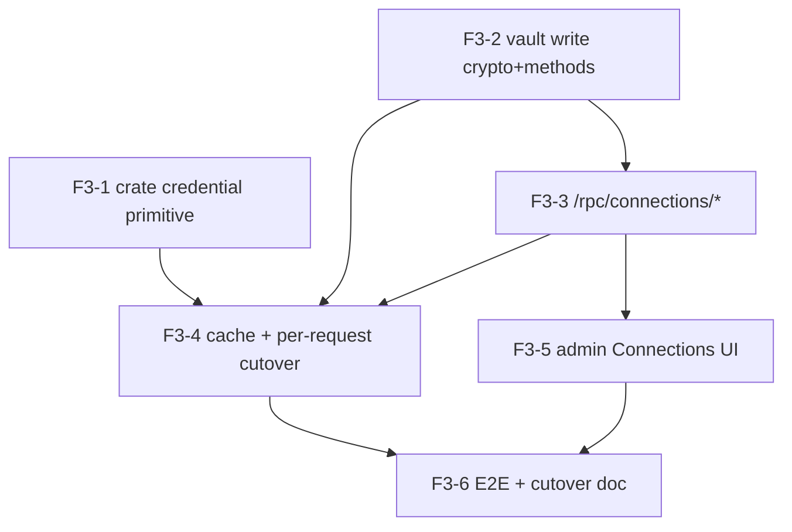

# F3 BYOK credential vault (option C) — implementation plan

## Objective
Implement the [F3 BYOK blueprint (option C)](../blueprints/f3-byok-credential-vault.md): store provider
API keys sealed in the DEK/KEK vault, make the vault the authoritative runtime credential source, and
serve **true per-tenant BYOK** via an opaque per-call `credentials` map on `InferenceRequest` (crate stays
tenant-agnostic). OAuth, prod KMS, and per-tenant `Gateway` instances (option B) are out of scope.

**Layers for this work** (bottom-up): `crate (kernel/gateway)` → `service (torii-gateway)` → `database` →
`admin (SvelteKit)`. Two repos: the crate lives in `../gateway` (dev via `[patch]`, released by lockstep
tag bump); everything else in `monorepo`.

**Process:** every feature ships with tests (mandatory rule) **and** an explicit **Verification** block
(runnable commands / observations). Approach is confirmed with the user before any issue is created and
before build starts. Never merge on red.

---

## Features

### F3-1: Crate — per-call credential primitive (tenant-agnostic)
- **Issue:** [#10](https://github.com/sensei-hq/torii/issues/10)
- **Layers:** crate (`kernel` types, `gateway` engine)
- **Depends on:** — (innermost; gates F3-4). Can build in parallel with F3-2.
- **Scope:** Add `InferenceRequest.credentials: HashMap<String,String>` (`#[serde(default,
  skip_serializing_if = "HashMap::is_empty")]`, router→api_key) with a **value-redacting `Debug`**. In
  `execute` **and** `execute_stream`, before dispatching a candidate, if `request.credentials` has an entry
  for the candidate's router, dispatch against a `RouterConfig` clone with `api_key = Some(that key)`;
  otherwise use the candidate config unchanged. No adapter changes (`resolve_api_key` already prefers
  `config.api_key`).
- **Acceptance criteria:**
  - `InferenceRequest` gains `credentials`; existing literals compile via `Default`/serde default (no
    behavioural change when the map is empty — proven by the existing suite staying green).
  - A request with `credentials = {"grok": "<key>"}` for a **keyless** router authenticates from the
    override (no env var set) on both `execute` and `execute_stream`.
  - `format!("{:?}", request)` never prints a credential value (redacted like `RouterConfig`).
- **Test scenarios:**
  - *Given* a chain whose primary router has no env/config key, *When* `execute` runs with a matching
    `credentials` entry, *Then* the attempt authenticates and succeeds (no `Authentication` error).
  - *Given* an empty `credentials` map, *When* `execute` runs, *Then* behaviour is byte-identical to today.
  - *Given* a populated `credentials`, *When* the request is `Debug`-formatted, *Then* no key value appears.
- **Verification:** `cargo test -p sensei-gateway -p sensei-kernel` green (incl. the two new tests) +
  `cargo clippy --workspace -- -D warnings`. Then **release:** `make bump` in `../gateway` (develop → bump →
  main → develop) and repin the service `tag` — OR keep dev `[patch]` for the build phase and bump before
  merge (decide at build time; the `[patch]` already resolves locally).

### F3-2: Vault write crypto + methods
- **Issue:** [#11](https://github.com/sensei-hq/torii/issues/11)
- **Layers:** service (`crypto.rs`, `vault.rs`) → database (`router_keys`, `core.tenant_keys`)
- **Depends on:** — (pure service+DB; parallel with F3-1)
- **Scope:** `crypto::seal_dek(kek, dek)` (mirror of `seal_credential`, seals under the KEK). `Vault`:
  `ensure_tenant_dek` (lazy-provision a fresh `OsRng` DEK sealed by the KEK when absent),
  `store_router_key` / `rotate_router_key` / `revoke_router_key` (seal + upsert with one active row per
  `(tenant, router_id, api_key)`, rotation deactivating the prior row), `resolve_tenant_keys(tenant) →
  {router_name: key}` (decrypt active rows). All plaintext in `Zeroizing`; `modified_by` = actor.
- **Acceptance criteria:**
  - `seal_dek`→`unseal_dek` round-trips; a tampered sealed DEK fails closed.
  - `store_router_key` on a **DEK-less** tenant auto-provisions a `tenant_keys` row, then persists an
    active sealed `router_keys` row; `resolve_tenant_keys` decrypts it back to the exact plaintext.
  - `rotate_router_key` leaves exactly one `is_active=true` row for the pair (prior row `is_active=false`).
  - `revoke_router_key` sets `is_active=false`; `resolve_tenant_keys` then omits that router.
- **Test scenarios:**
  - *Given* a tenant with no DEK, *When* `store_router_key` is called, *Then* a DEK is provisioned and the
    sealed key round-trips via `resolve_tenant_keys`.
  - *Given* an existing active key, *When* `rotate_router_key` runs, *Then* one active row remains and it
    decrypts to the new secret.
- **Verification:** `cargo test -p torii-gateway` green (new crypto + vault tests). DB proof against local
  Supabase (55322): after a `store_router_key`, `select count(*) from public.router_keys where is_active`
  = 1 for the pair, and the value is **bytea (not plaintext)**; a manual decrypt via `resolve_tenant_keys`
  returns the original.

### F3-3: `/rpc/connections/*` — connect / rotate / revoke
- **Issue:** [#12](https://github.com/sensei-hq/torii/issues/12)
- **Layers:** service (`routes/rpc.rs`) → database (audit) → admin data-layer (`lib/api.ts`)
- **Depends on:** F3-2 (vault write methods)
- **Scope:** Three capability-gated (`connection.manage`) RPC handlers following the existing `/rpc/*`
  pattern: `connect {router, key, label?}`, `rotate {router, key}`, `revoke {router}`. Each resolves the
  caller's tenant from the JWT, calls the F3-2 vault method, writes an `audit_events` row, returns
  `{ok:true}` — the key is **never** returned. Add `api.connect/rotate/revokeConnection` to `lib/api.ts`.
  (Cache `invalidate` hook lands with F3-4.)
- **Acceptance criteria:**
  - `POST /rpc/connections/connect` with `connection.manage` stores a sealed key and returns `{ok:true}`
    with no secret in the body.
  - The same call **without** the capability returns 403 and writes nothing.
  - Each connect/rotate/revoke emits exactly one `audit_events` row bound to the actor + router.
  - `GET /v1/connections` reflects `configured=true` for a router after connect, `false` after revoke.
- **Test scenarios:**
  - *Given* an admin with `connection.manage`, *When* they POST connect, *Then* a sealed row exists and the
    response carries no key.
  - *Given* a member without the capability, *When* they POST connect, *Then* 403 and `router_keys` is
    unchanged.
- **Verification:** curl the three endpoints against the running gateway with an owner JWT → `{ok:true}`;
  with a low-privilege JWT → 403. `select action,target_id from audit_events order by created_at desc
  limit 3` shows the three actions. `GET /v1/connections` flips `configured` as expected.

### F3-4: TenantKeyCache + per-request injection (env→vault cutover) ← vertical slice
- **Issue:** [#13](https://github.com/sensei-hq/torii/issues/13)
- **Layers:** service (`state.rs`, `routes/chat.rs`) — consumes crate (F3-1) + vault (F3-2) + invalidation (F3-3)
- **Depends on:** F3-1 (released/patched), F3-2, F3-3
- **Scope:** `TenantKeyCache` (`tenant → Arc<{router:key}>`, decrypt-on-miss via `resolve_tenant_keys`,
  `invalidate(tenant)` wired into the F3-3 RPCs). In `post_chat`/`post_chat_stream`, set
  `ireq.credentials = cache.get(tenant)`; routers absent from the map fall through to the platform/config
  key with a one-line `WARN` when env is used. C6 judge sets no credentials.
- **Acceptance criteria:**
  - After connecting key K for tenant T (F3-3), a `/v1/chat` on that router for T authenticates from K
    **with the env var unset**.
  - A second tenant U (no BYOK for that router) on the same call path does **not** use K — it uses the
    platform/config key or fails; K never leaks across tenants.
  - Rotating T's key makes the **next** `/v1/chat` use the new key (cache invalidated, no restart).
  - A router with no vault key logs exactly one env-fallback `WARN` naming the router.
- **Test scenarios:**
  - *Given* tenant T connected key K and the provider env var is unset, *When* T calls `/v1/chat` on that
    router, *Then* it authenticates via K.
  - *Given* T's key K, *When* tenant U calls the same router without BYOK, *Then* the attempt does not use K.
  - *Given* T rotates K→K2, *When* T next calls `/v1/chat`, *Then* K2 is used.
- **Verification:** live against the running gateway + local Supabase, using a router pointed at a mock/echo
  upstream so the key is observable without real spend (e.g. an ollama-compat local endpoint that echoes
  the received Authorization). Prove: env unset + connected key → 200; second tenant isolated; rotate →
  new key. Unit test: cache returns distinct maps for two tenants and `invalidate` forces re-decrypt.

### F3-5: Admin Connections UI — connect / rotate / revoke
- **Issue:** [#14](https://github.com/sensei-hq/torii/issues/14)
- **Layers:** admin (`routes/(app)/connections/+page.svelte`) → service (F3-3 RPCs, already built)
- **Depends on:** F3-3 (RPCs + `api.ts` methods)
- **Scope:** Make the read-only provider grid interactive: per-router **Connect** (paste key), **Rotate**,
  **Revoke**, calling the F3-3 `api.*` methods; show connected/last-rotated state from `GET /v1/connections`;
  never render the secret back; inline errors (403 → "needs connection.manage"). Match the Zen-Sumi kit.
- **Acceptance criteria:**
  - An admin pastes a key → row shows `configured` without ever displaying the key; a page reload keeps the
    connected state (from `GET /v1/connections`).
  - Rotate replaces the key (success toast, no key shown); Revoke returns the row to unconfigured.
  - A user lacking `connection.manage` sees the actions disabled/erroring inline, not a crash.
- **Test scenarios:**
  - *Given* the Connections screen, *When* an admin connects a key, *Then* the row shows connected and the
    key is never rendered.
  - *Given* a connected router, *When* the admin revokes, *Then* the row returns to unconfigured.
- **Verification:** browser-drive (Playwright) against the admin app + running gateway: connect → grid
  updates + `router_keys` has a sealed row; revoke → row cleared. Screenshot the connected state.

### F3-6: Live E2E isolation proof + cutover doc + follow-ups
- **Issue:** [#15](https://github.com/sensei-hq/torii/issues/15)
- **Layers:** cross-cutting (E2E) → docs
- **Depends on:** F3-1..F3-5
- **Scope:** End-to-end proof of tenant isolation + env retirement on the real stack; write the env→vault
  cutover doc (blueprint gap **G2** — vault authoritative, env only a logged fallback, exit criterion); file
  follow-up issues for the deferred pieces (OAuth/GH-2, prod KMS KEK, `router_keys`→`router_credentials`
  rename).
- **Acceptance criteria:**
  - A scripted E2E shows: tenant A's connected key used for A's call (env unset), tenant B's identical call
    not using A's key, rotate takes effect next call, revoke falls back/denies.
  - `docs/ops/` (or the blueprint) documents the env→vault cutover + when env retires.
  - Follow-up issues exist for OAuth, prod KMS, and the credential-table rename.
- **Test scenarios:**
  - *Given* the full stack, *When* the isolation script runs, *Then* every isolation/rotation/revoke
    assertion passes and no env provider key is required for a BYOK'd router.
- **Verification:** run the E2E script end-to-end (green); the cutover doc exists; `gh issue list` shows the
  three follow-ups.

---

## Dependency graph

- **F3-1** and **F3-2** have no dependencies → buildable in parallel first.
- **F3-4** is the integrating vertical slice (needs the crate primitive released/patched + vault + RPC invalidation).
- **F3-5** needs only F3-3. **F3-6** closes the loop.

## Verification summary (per the request)
Every feature carries: (a) unit/integration tests (crate `cargo test`, service `cargo test -p
torii-gateway`, admin unit where applicable), (b) an explicit **Verification** block with runnable
commands/observations, and (c) for F3-4/F3-5/F3-6, a **live** check against the running gateway + local
Supabase. Zero-lint / zero-test-error gates at start and finish of each feature; never merge on red.

## Confirmation gate
Approach + this decomposition are presented for confirmation **before** any GitHub issue is created and
**before** build starts (per the request). On approval: `gh issue create` per feature (label
`depth:build`, milestone `F3`), record numbers into `related_issues`, then `/sensei:build` from F3-1/F3-2.
