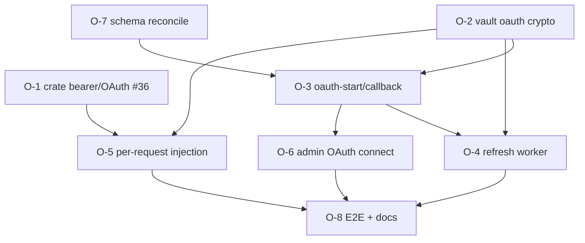

# F3 OAuth credential vault (Anthropic v1) — implementation plan

## Objective
Implement the **OAuth** credential type from the [F3 key-vault spec](../specs/F3-key-vault.md), building on
the shipped api_key vault ([F3 BYOK plan](./f3-byok-credential-vault-plan.md)). A workspace admin connects an
**Anthropic OAuth account** (access + refresh tokens) instead of pasting a static key; the gateway seals the
tokens under the tenant DEK, **auto-refreshes** before expiry, and presents the access token to Anthropic as
a bearer credential at call time. **Anthropic only in v1** (ratified — DECISIONS §W4/§F3); all other providers
stay api_key. Budgets bind to identity, never to the credential (DECISIONS §W2).

**Layers** (bottom-up): `crate (cloud-providers/kernel)` → `service (torii-gateway: vault, rpc, worker, chat)`
→ `database (router_credentials oauth columns)` → `admin (Connections OAuth connect)`.

**Process:** doc-before-code; every feature ships tests + an explicit **Verification** block; the crate change
(O-1) releases via lockstep tag bump before the service consumes it on `main`. Never merge on red.

---

## Open decisions (resolve before/within the plan)

1. **Anthropic OAuth app** *(external, blocking O-3/O-4/real calls)* — v1 assumes an authorization-code +
   **PKCE** flow yielding refreshable tokens. We need a registered Anthropic OAuth **client_id**, the
   **authorize** + **token** URLs, the redirect URI, and the **scopes**. Until confirmed, O-1/O-2/O-7 (crate +
   vault + schema) are buildable and testable with a **mock IdP**; O-3/O-4/O-6 land against the real provider.
   → *Recommendation: build O-1/O-2/O-7 now against a mock; gate O-3/O-4/O-6 on the confirmed Anthropic app.*
2. **Schema shape** — keep the **built compact columns** (`encrypted_oauth` = one sealed `{access,refresh}`
   JSON blob, `oauth_expires_at`, `oauth_scopes`, `token_url`, `refresh_status`, `last_refreshed_at`) and just
   **add `oauth_client_id`**; or realign to the spec's separate `encrypted_access_token`/`encrypted_refresh_token`
   + `scopes text[]`. → *Recommendation: keep the compact blob (fewer columns, one seal/unseal), add
   `oauth_client_id`.*
3. **Dual-credential cutover** — the spec wants two active credentials per router during rotation, but the
   table has `UNIQUE(tenant, router_id)`. → *Recommendation: for v1, allow **one api_key + one oauth** per
   router (relax the unique index to `(tenant, router_id, credential_type)`), and treat OAuth refresh as
   in-place (no dual-active needed — refresh replaces the sealed blob). Full dual-active cutover deferred.*
4. **Refresh worker placement** — an in-gateway tokio task (like the SIEM streamer) vs an external cron.
   → *Recommendation: in-gateway tokio task with a tick + jittered per-credential refresh window.*

---

## Features

### O-1: Crate GH-2 — OAuth/bearer credential mode (gateway #36)
- **Layers:** crate (`sensei-cloud-providers`, maybe `kernel`)
- **Depends on:** — (innermost; gates real OAuth calls)
- **Scope:** Let an adapter present an **OAuth access token** as `Authorization: Bearer <token>` (+ any
  provider-required header, e.g. Anthropic's `anthropic-beta`/oauth marker) instead of the api_key header
  (`x-api-key`). Distinguish the credential kind on the per-call `credentials` channel (F3-1) — e.g. a typed
  value or a reserved prefix — so `resolve_api_key` picks the right auth header. No token storage in the crate
  (tenant-agnostic).
- **Acceptance criteria:** an Anthropic call authenticates from a supplied OAuth access token via `Bearer`;
  api_key calls are unchanged; `Debug` still redacts the token.
- **Verification:** crate unit test (bearer path chosen for an oauth credential; x-api-key for api_key) +
  `cargo clippy --workspace -D warnings`. **Release:** `make bump` + tag repin before the service consumes it
  on `main`.

### O-2: Vault OAuth crypto + methods (service)
- **Layers:** service (`vault.rs`) → database
- **Depends on:** — (parallel with O-1)
- **Scope:** `seal_oauth`/`unseal_oauth` over the `{access,refresh,expires_at,scopes}` JSON bundle under the
  tenant DEK. `Vault`: `store_oauth` / `revoke_oauth` / `resolve_oauth(tenant,router) → {access_token, expiry}`
  (decrypt + report expiry so the worker/injection can act). Reuse `ensure_tenant_dek`. All plaintext in
  `Zeroizing`.
- **Acceptance criteria:** seal→unseal round-trips; `store_oauth` persists an active `credential_type='oauth'`
  row; `resolve_oauth` returns the access token + expiry; a tampered blob fails closed.
- **Verification:** ignored DB tests (like `vault_lifecycle`) against local Supabase (55322).

### O-7: Schema reconciliation (database)
- **Layers:** database (`router_credentials.ddl`)
- **Depends on:** — (do alongside O-2)
- **Scope:** Add `oauth_client_id text`; relax `UNIQUE(tenant, router_id)` →
  `UNIQUE(tenant, router_id, credential_type)` (one api_key + one oauth per router). Confirm the RLS/grants
  still deny-all + service_role (unchanged — table already locked down).
- **Acceptance criteria:** an oauth row and an api_key row coexist for one `(tenant, router)`; RLS still blocks
  `authenticated`.
- **Verification:** `dbd apply` clean; the `rls.sql` secrets assertion still passes; a coexistence insert test.

### O-3: `/rpc/connections/oauth-start` + callback (service) — gated on decision #1
- **Layers:** service (`routes/rpc.rs`) → admin data-layer
- **Depends on:** O-2, O-7, **Anthropic OAuth app**
- **Scope:** `oauth-start {router}` → generate PKCE verifier+challenge + `state`, persist them short-lived,
  return the Anthropic **authorize URL**. `oauth-callback {code,state}` → verify state, exchange code at the
  `token_url` (PKCE), seal the token bundle via O-2, audit. Capability `connection.manage`. Secret never
  returned.
- **Acceptance criteria:** start returns a valid authorize URL with a challenge; callback exchanges + stores a
  sealed oauth row; `GET /v1/connections` shows the router connected (oauth); replay/invalid `state` is
  rejected.
- **Verification:** against a **mock IdP** first (deterministic code→token), then the real Anthropic app.

### O-4: OAuth refresh worker (service) — gated on decision #1
- **Layers:** service (a tokio task in `main.rs`/a `worker.rs`)
- **Depends on:** O-2, O-3
- **Scope:** Tick task: find oauth rows within the refresh window (`oauth_expires_at - grace`), refresh via
  `token_url` + refresh token, reseal, update `oauth_expires_at`/`refresh_status`/`last_refreshed_at`; retry
  with backoff; mark `failed` + audit + alert on exhaustion; honor a grace window (serve the old token until
  hard expiry).
- **Acceptance criteria:** a near-expiry token is refreshed before expiry (new expiry persisted); a failing
  refresh flips `refresh_status='failed'` + audits; a healthy token isn't refreshed early.
- **Verification:** unit test with a mock token endpoint (clock injected); ignored integration against the
  mock IdP.

### O-5: Per-request OAuth injection (service)
- **Layers:** service (`chat.rs` `inject_tenant_credentials`, `state.rs` cache)
- **Depends on:** O-1 (released/patched), O-2
- **Scope:** Extend the tenant credential map to carry the **oauth** access token (typed per O-1) for a router
  the tenant connected via OAuth; the engine presents it as bearer. Cache invalidation already fires on writes;
  ensure a **refresh** also invalidates so the next call uses the new access token.
- **Acceptance criteria:** a tenant connected via OAuth authenticates an Anthropic call from the refreshed
  access token (api_key env unset); a refresh mid-life makes the next call use the new token; another tenant is
  isolated.
- **Verification:** live against the mock/real provider; unit test that the cache serves distinct typed creds
  per tenant and re-resolves after invalidate.

### O-6: Admin Connections — connect via OAuth (admin) — gated on decision #1
- **Layers:** admin (`connections/+page.svelte`, `lib/api.ts`)
- **Depends on:** O-3
- **Scope:** For an OAuth-capable router (Anthropic), a **Connect via OAuth** action → `oauth-start` → redirect
  to the authorize URL → handle the `torii://`/web callback → the grid shows connected (oauth) with
  last-refreshed. Alongside paste-a-key. Secret never rendered.
- **Acceptance criteria:** admin completes the OAuth connect and the row shows connected (oauth); reload keeps
  it; revoke clears it; a user lacking `connection.manage` sees the action disabled/erroring.
- **Verification:** Playwright against the admin + gateway + mock IdP; screenshot the oauth-connected state.

### O-8: E2E proof + docs
- **Layers:** cross-cutting → docs
- **Depends on:** O-1..O-6
- **Scope:** End-to-end: connect via OAuth → call uses the access token → worker refreshes → next call uses the
  new token → revoke denies. Update the cutover doc with the OAuth path + refresh/rotation/alerting.
- **Verification:** scripted E2E green (mock IdP); cutover doc updated.

---

## Dependency graph

- **O-1, O-2, O-7** have no cross-deps → buildable now (O-1 against a crate test, O-2/O-7 against local DB).
- **O-3, O-4, O-6** gate on the confirmed **Anthropic OAuth app** (decision #1) — build against a mock IdP
  meanwhile.
- **O-5** is the integrating slice (needs the released crate + vault).

## Verification summary
Every feature carries: (a) tests (crate `cargo test`; service `cargo test -p torii-gateway`, ignored DB tests
for vault/schema; admin Playwright); (b) an explicit **Verification** block; (c) for O-3..O-6/O-8 a **live**
check against the running gateway + local Supabase, using a **mock IdP** until the real Anthropic OAuth app is
confirmed. The crate (O-1) releases via lockstep tag bump before `main` consumes it.
