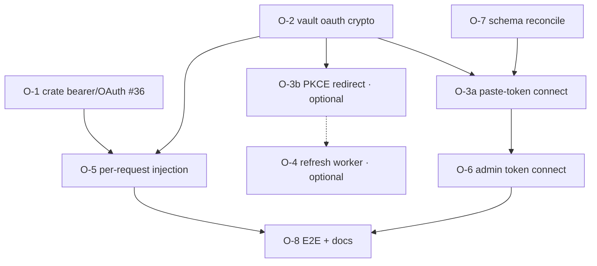

# F3 OAuth credential vault (Anthropic v1) — implementation plan

## Objective
Implement the **OAuth/bearer** credential type from the [F3 key-vault spec](../specs/F3-key-vault.md), building
on the shipped api_key vault ([F3 BYOK plan](./f3-byok-credential-vault-plan.md)). A workspace admin connects an
**Anthropic OAuth credential** (a bearer token) instead of pasting a static api_key; the gateway seals it under
the tenant DEK and presents it to Anthropic as `Authorization: Bearer` at call time. **Anthropic only in v1**
(ratified — DECISIONS §W4/§F3); all other providers stay api_key. Budgets bind to identity, never to the
credential (DECISIONS §W2).

**Two acquisition methods, one storage/injection path:**
1. **Paste a token (default, ToS-safe)** — `claude setup-token` → `CLAUDE_CODE_OAUTH_TOKEN`, Anthropic's own
   long-lived OAuth token for non-official clients. No redirect, no refresh worker needed.
2. **PKCE authorization-code redirect (config-driven, optional)** — full PKCE machinery, but `client_id` +
   authorize/token URLs + scopes + redirect are **operator config, never hardcoded**
   ([[project-gateway-no-hardcoded-ops]]). Usable only with a **legitimate client_id** (an official Anthropic
   OAuth app, or self-host at the operator's own risk).

> **⚠️ ToS / compliance.** The community "Claude subscription" PKCE flow uses a **public Claude Code client_id**
> against **unofficial, reverse-engineered** endpoints; Anthropic's ToS says subscription (Pro/Max) tokens may
> be used **only with official clients**. Harvesting subscription tokens into a **multi-tenant SaaS** risks
> customers' accounts being **banned** and can break without notice. v1 therefore ships the **paste-token**
> path; the PKCE redirect stays behind operator config and is **not** enabled for customer traffic.

**Layers** (bottom-up): `crate (cloud-providers/kernel)` → `service (torii-gateway: vault, rpc, worker, chat)`
→ `database (router_credentials oauth columns)` → `admin (Connections OAuth connect)`.

**Process:** doc-before-code; every feature ships tests + an explicit **Verification** block; the crate change
(O-1) releases via lockstep tag bump before the service consumes it on `main`. Never merge on red.

---

## Open decisions (resolve before/within the plan)

1. **Anthropic OAuth app** *(RESOLVED 2026-07-27)* — Anthropic offers **no self-serve third-party client_id**;
   the community "subscription" PKCE flow reuses the **public Claude Code client_id** on **unofficial**
   endpoints, which violates ToS for a SaaS (see the ⚠️ note above). **Decision:** v1 = **paste-token**
   (`setup-token`) as the connect method; **PKCE is built but config-driven** (client_id/URLs operator-supplied)
   and **off by default** — it lights up only with a legitimate client_id. So no external dependency blocks the
   build: O-1/O-2/O-7 + paste-token connect ship now; the PKCE redirect (O-3b) is inert until configured.
2. **Schema shape** — keep the **built compact columns** (`encrypted_oauth` = one sealed `{access,refresh}`
   JSON blob, `oauth_expires_at`, `oauth_scopes`, `token_url`, `refresh_status`, `last_refreshed_at`) and just
   **add `oauth_client_id`**; or realign to the spec's separate `encrypted_access_token`/`encrypted_refresh_token`
   + `scopes text[]`. → *Recommendation: keep the compact blob (fewer columns, one seal/unseal), add
   `oauth_client_id`.*
3. **Dual-credential cutover** — the spec wants two active credentials per router during rotation, but the
   table has `UNIQUE(tenant, router_id)`. → *Recommendation: for v1, allow **one api_key + one oauth** per
   router (relax the unique index to `(tenant, router_id, credential_type)`), and treat OAuth refresh as
   in-place (no dual-active needed — refresh replaces the sealed blob). Full dual-active cutover deferred.*
4. **Refresh worker placement** — an in-gateway tokio task (like the SIEM streamer) vs an external cron.
   → *Recommendation: in-gateway tokio task with a tick + jittered per-credential refresh window.*

---

## Features

### O-1: Crate GH-2 — OAuth/bearer credential mode (gateway #36)
- **Layers:** crate (`sensei-cloud-providers`, maybe `kernel`)
- **Depends on:** — (innermost; gates real OAuth calls)
- **Scope:** Let an adapter present an **OAuth access token** as `Authorization: Bearer <token>` (+ any
  provider-required header, e.g. Anthropic's `anthropic-beta`/oauth marker) instead of the api_key header
  (`x-api-key`). Distinguish the credential kind on the per-call `credentials` channel (F3-1) — e.g. a typed
  value or a reserved prefix — so `resolve_api_key` picks the right auth header. No token storage in the crate
  (tenant-agnostic).
- **Acceptance criteria:** an Anthropic call authenticates from a supplied OAuth access token via `Bearer`;
  api_key calls are unchanged; `Debug` still redacts the token.
- **Verification:** crate unit test (bearer path chosen for an oauth credential; x-api-key for api_key) +
  `cargo clippy --workspace -D warnings`. **Release:** `make bump` + tag repin before the service consumes it
  on `main`.

### O-2: Vault OAuth crypto + methods (service)
- **Layers:** service (`vault.rs`) → database
- **Depends on:** — (parallel with O-1)
- **Scope:** `seal_oauth`/`unseal_oauth` over the `{access,refresh,expires_at,scopes}` JSON bundle under the
  tenant DEK. `Vault`: `store_oauth` / `revoke_oauth` / `resolve_oauth(tenant,router) → {access_token, expiry}`
  (decrypt + report expiry so the worker/injection can act). Reuse `ensure_tenant_dek`. All plaintext in
  `Zeroizing`.
- **Acceptance criteria:** seal→unseal round-trips; `store_oauth` persists an active `credential_type='oauth'`
  row; `resolve_oauth` returns the access token + expiry; a tampered blob fails closed.
- **Verification:** ignored DB tests (like `vault_lifecycle`) against local Supabase (55322).

### O-7: Schema reconciliation (database)
- **Layers:** database (`router_credentials.ddl`)
- **Depends on:** — (do alongside O-2)
- **Scope:** Add `oauth_client_id text`; relax `UNIQUE(tenant, router_id)` →
  `UNIQUE(tenant, router_id, credential_type)` (one api_key + one oauth per router). Confirm the RLS/grants
  still deny-all + service_role (unchanged — table already locked down).
- **Acceptance criteria:** an oauth row and an api_key row coexist for one `(tenant, router)`; RLS still blocks
  `authenticated`.
- **Verification:** `dbd apply` clean; the `rls.sql` secrets assertion still passes; a coexistence insert test.

### O-3a: `/rpc/connections/oauth-connect` — paste a bearer token (service) ← ships in v1
- **Layers:** service (`routes/rpc.rs`) → admin data-layer
- **Depends on:** O-2, O-7
- **Scope:** `oauth-connect {router, token}` → seal the pasted OAuth/bearer token (`setup-token`) via O-2,
  store as the active `credential_type='oauth'` row, audit. Capability `connection.manage`. Token never
  returned. This is the **ToS-safe** connect path — no redirect.
- **Acceptance criteria:** an admin pastes a `setup-token`; a sealed oauth row is stored; `GET /v1/connections`
  shows the router connected (oauth); the token is never echoed; without the capability → 403.
- **Verification:** curl the endpoint with an owner JWT → `{ok:true}` + sealed bytea row; low-priv JWT → 403.

### O-3b: config-driven PKCE redirect (service) — optional, OFF by default
- **Layers:** service (`routes/rpc.rs`)
- **Depends on:** O-2, O-7; a configured, **legitimate** `client_id` + authorize/token URLs (operator config)
- **Scope:** `oauth-start {router}` → PKCE verifier+challenge + `state` (persisted short-lived) → the
  provider **authorize URL** built from **operator config**; `oauth-callback {code,state}` → verify state,
  exchange at the configured `token_url`, seal via O-2, audit. **Inert unless `oauth.<provider>.client_id` is
  configured** — never hardcode the Claude Code client_id; never enable for customer traffic (see ⚠️ ToS).
- **Acceptance criteria:** with config present, start returns a valid authorize URL with an S256 challenge and
  callback stores a sealed row; with **no** config the endpoints return `404/disabled`; replay/invalid `state`
  is rejected.
- **Verification:** against a **mock IdP** (deterministic code→token) with test config; assert disabled when
  unconfigured.

### O-4: OAuth refresh worker (service) — only for PKCE-obtained tokens (deferred with O-3b)
- **Layers:** service (a tokio task in `main.rs`/a `worker.rs`)
- **Depends on:** O-2, O-3b
- **Scope:** The paste-token (`setup-token`) path is **long-lived** → no refresh worker in v1. When O-3b PKCE
  is configured (short-lived access + refresh token), a tick task refreshes within
  (`oauth_expires_at - grace`) via `token_url`, reseals, updates `oauth_expires_at`/`refresh_status`/
  `last_refreshed_at`; retry/backoff; mark `failed` + audit + alert on exhaustion; grace window.
- **Acceptance criteria:** *(when O-3b active)* a near-expiry token refreshes before expiry; a failing refresh
  flips `refresh_status='failed'` + audits; a healthy token isn't refreshed early.
- **Verification:** unit test with a mock token endpoint (clock injected).

### O-5: Per-request OAuth injection (service)
- **Layers:** service (`chat.rs` `inject_tenant_credentials`, `state.rs` cache)
- **Depends on:** O-1 (released/patched), O-2
- **Scope:** Extend the tenant credential map to carry the **oauth** access token (typed per O-1) for a router
  the tenant connected via OAuth; the engine presents it as bearer. Cache invalidation already fires on writes;
  ensure a **refresh** also invalidates so the next call uses the new access token.
- **Acceptance criteria:** a tenant connected via OAuth authenticates an Anthropic call from the refreshed
  access token (api_key env unset); a refresh mid-life makes the next call use the new token; another tenant is
  isolated.
- **Verification:** live against the mock/real provider; unit test that the cache serves distinct typed creds
  per tenant and re-resolves after invalidate.

### O-6: Admin Connections — connect a bearer token (admin) ← ships in v1
- **Layers:** admin (`connections/+page.svelte`, `lib/api.ts`)
- **Depends on:** O-3a
- **Scope:** For an OAuth-capable router (Anthropic), a **Connect token** action (paste the `setup-token`, a
  password field) → `oauth-connect` → the grid shows connected (oauth). Alongside paste-a-key (api_key). Secret
  never rendered. (The PKCE "Connect via OAuth" redirect button is added only if O-3b is configured.)
- **Acceptance criteria:** admin pastes a token and the row shows connected (oauth); reload keeps it; revoke
  clears it; a user lacking `connection.manage` sees the action disabled/erroring.
- **Verification:** Playwright against the admin + gateway; screenshot the oauth-connected state.

### O-8: E2E proof + docs
- **Layers:** cross-cutting → docs
- **Depends on:** O-1..O-6
- **Scope:** End-to-end: connect via OAuth → call uses the access token → worker refreshes → next call uses the
  new token → revoke denies. Update the cutover doc with the OAuth path + refresh/rotation/alerting.
- **Verification:** scripted E2E green (mock IdP); cutover doc updated.

---

## Dependency graph

- **O-1, O-2, O-7** have no cross-deps → buildable now (O-1 against a crate test, O-2/O-7 against local DB).
- **O-3a paste-token + O-6 admin** ship in v1 (ToS-safe, no external dependency).
- **O-3b PKCE + O-4 refresh** are optional/config-gated and off by default (see ⚠️ ToS) — build against a
  mock IdP if/when a legitimate client_id exists.
- **O-5** is the integrating slice (needs the released crate + vault).

## Verification summary
Every feature carries: (a) tests (crate `cargo test`; service `cargo test -p torii-gateway`, ignored DB tests
for vault/schema; admin Playwright); (b) an explicit **Verification** block; (c) for O-3..O-6/O-8 a **live**
check against the running gateway + local Supabase, using a **mock IdP** until the real Anthropic OAuth app is
confirmed. The crate (O-1) releases via lockstep tag bump before `main` consumes it.
