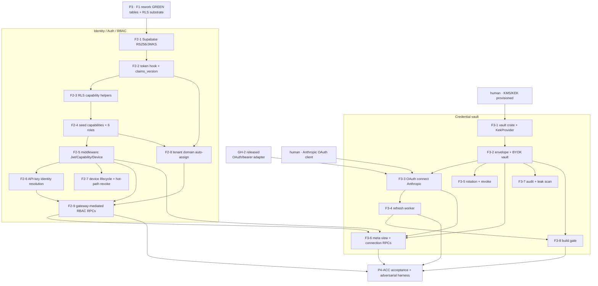

# Phase P4 · Identity/RBAC + Key vault (F2, F3) — Implementation Plan

> **For agentic workers:** REQUIRED SUB-SKILL: `superpowers:subagent-driven-development` + `superpowers:test-driven-development`. **Heavy Rust builds run via a BACKGROUND shell (controller), not inside a subagent** (the `sensei-*` crates + AWS/GCP KMS SDK + sqlx + ring/aes-gcm compile is minutes; a subagent watchdog will kill it). Subagents WRITE code + tests; the controller compiles + runs. **DB changes go through `dbd`** (`dbd reset && dbd apply && dbd import`) per `project_db_workflow` — no migrations pre-v1. Where anything here disagrees with [`../DECISIONS.md`](../DECISIONS.md), that record wins; [`F2`](../specs/F2-identity-auth-rbac.md)/[`F3`](../specs/F3-key-vault.md) specs are the module ground truth.

## Goal

Deliver the two **authorization + custody foundations** the hardened central plane (P5+) depends on:

- **F2 — Identity/Auth/RBAC.** Supabase Auth on **RS256/JWKS verify-only** (no shared HS256 secret); the **FROZEN JWT claims contract** (`tenant_id` + `role_ids[]` + `claims_version` + optional `device_id`, **ids only — capabilities resolved server-side**); the full **role + permission matrix** with the authoritative 26-capability enumeration; the C1 middleware stack (`JwtVerifier`/`CapabilityResolver`/`DeviceGuard`); Ed25519 **device lifecycle** + hot-path revocation; tenant auto-assignment by verified email domain; and **gateway-mediated, capability-gated** RBAC/identity writes.
- **F3 — Credential vault.** The **DEK/KEK AES-256-GCM envelope vault** over `router_credentials` (`type = api_key | oauth`); **OAuth connect** (Anthropic) alongside paste-a-BYOK-key; a **background refresher** that swaps OAuth access tokens before expiry (+ reactive-on-401); dual-credential / DEK / KEK rotation; and the **build gate** that forbids any plaintext-credential path.

**Phase acceptance gate (observable):** An admin connects a router **two ways** (paste BYOK key / OAuth-connect Anthropic); **both encrypt at rest** (`service_role`-only, no view/function leaks decrypted material); an **OAuth token auto-refreshes before expiry**; and a **capability-gated write is denied without the capability**.

## Architecture

P4 builds **on the P2a skeleton `services/gateway`** (Axum + `sensei-gateway` + Postgres `GatewayStore`) and the **P3-reworked F1 schema** (all RBAC/device/credential *tables* landed in P3: RW2 roles/permissions, RW4 api-keys, RW10 device fixes, RW13 `router_credentials`, RW8 alerts). P4 lands the **runtime behavior + F2/F3-owned SQL functions/views/seed + the two Rust crates** that consume those tables:

- **`crates/torii-auth`** (new lib crate) — `JwtVerifier` (RS256/JWKS), `CapabilityResolver`, `DeviceGuard`, `AuthContext` assembly, API-key resolution. Consumed by `services/gateway`.
- **`crates/torii-vault`** (new lib crate) — `KekProvider` (`KmsKekProvider` prod / `EnvKekProvider` local-dev fail-closed), `CredentialVault` (envelope encrypt/decrypt, lifecycle, rotation), the OAuth refresh worker. Consumed by `services/gateway` (the sole `service_role` decryptor).
- **`services/gateway`** gains: RS256 middleware (replacing the P2a HS256 skeleton), the F2 `/rbac`/`/members`/`/tenants`/`/devices` RPCs, the F3 connection RPCs (`connect`/`oauth`/`rotate`/`revoke`), and the co-located refresh worker `tokio` task.
- **dbd deltas (F2/F3-owned semantics; tables already exist from P3):** `custom_access_token_hook` + `profiles.claims_version`; the `SECURITY DEFINER` capability helpers `core.jwt_role_ids()`/`core.has_capability()`; the `core.capabilities` reference + 6 system-role seed; the tenant-domain auto-assignment trigger/function; the `router_credentials_meta` non-secret view.

**Tech stack:** Rust · Axum 0.8 · `sqlx` 0.8 · `tokio` · `jsonwebtoken` (RS256) + `jwks` fetch/cache · `ed25519-dalek` · `aes-gcm` + `zeroize`/`secrecy` · a KMS SDK (`aws-sdk-kms` **or** `google-cloud-kms` **or** Vault Transit — pinned by the provisioned KMS, §"Front-loaded human inputs") · `reqwest` (OAuth token endpoint) · Supabase Auth + Postgres · `sensei-*` @ `v0.4.6` (with **GH-2** released).

---

## Prerequisites & decisions (confirm before executing)

1. **P3 (F1 security + scope rework) is green** — `dbd reset && apply && import` passes and `tests/authz.sql` denies every adversarial mutation. P4's dbd work **extends** P3's `.ddl`/policy/seed files; it does not re-create the tables (RW2/RW4/RW8/RW10/RW13/RW14).
2. **GH-2 (OAuth/bearer provider-credential in `sensei-cloud-providers`) is filed → implemented → closed → released** via the lockstep tag bump, and the monorepo is repinned to that `v0.4.6+` tag. Until then, only the BYOK `api_key` path can make a real call (the crate does static `bearer_auth(key)` today). **Blocking for F3-3/F3-4.**
3. **KMS/KEK provisioned (human).** The production **KEK lives in a cloud KMS/HSM**; the managed provider (AWS KMS / GCP KMS / Vault Transit) + key reference/ARN are provided so `KmsKekProvider` can be wired. `STRATEGOS_KEK` is **local-dev only** and `EnvKekProvider` **fails closed under a prod profile**.
4. **Anthropic OAuth client (human).** `client_id` / `client_secret`, the registered `redirect` URI, `scopes`, and `token_url` for the Anthropic OAuth app. **v1 OAuth scope = Anthropic only**; all other providers use BYOK keys. Needed for F3-3/F3-4.
5. **RS256/JWKS confirmed (from P2a, reconfirm).** Asymmetric signing is enabled on the Supabase project; the JWKS endpoint serves the verify-only public key; `SUPABASE_JWT_*` / the JWKS URL are in C1's env. P4 upgrades the P2a middleware from the HS256 skeleton to full RS256/JWKS.
6. **No real paid inference call is required in this phase** — the acceptance gate exercises the *credential* path (encrypt-at-rest, OAuth refresh) and the *authz* path (capability denial), not a paid completion. The OAuth-connect exercise does perform a **real Anthropic OAuth token exchange** (needs prereq 4), not a paid LLM call.
7. **Deploy = local dev** (`cargo run`, `127.0.0.1:8787`) with a local `STRATEGOS_KEK` for dev; the `KmsKekProvider` path is exercised against the provisioned KMS in a staging profile.

---

## Feature decomposition

Two groups — **F2-*** (identity/auth/RBAC) and **F3-*** (credential vault) — plus a cross-cutting acceptance harness **P4-ACC**. Each feature lists **Layers**, **Depends on**, **Authority**, **observable Acceptance criteria**, and **Given/When/Then test scenarios**.

### Group A — Identity, Auth & RBAC (F2)

#### F2-1 — Supabase Auth configuration + RS256/JWKS verify-only
- **Layers:** Supabase config → env
- **Depends on:** P3; human prereq 3/5 (Supabase project + RS256 enabled)
- **Authority:** DECISIONS §2 W3, §3 (Identity/SSO); F2 §2.1, §5.1
- **Acceptance criteria:**
  - Email/password + **Google** + **GitHub** providers enabled; the SAML SSO + SCIM onboarding step is **present-but-stubbed** (v1.x fast-follow).
  - **Asymmetric RS256 signing enabled**; `/auth/v1/.well-known/jwks.json` serves ≥1 verify-only public key with a `kid`; **no HS256 shared secret** is configured in any service.
  - Access-token TTL = **1 hour**; refresh-token rotation enabled.
- **Test scenarios:**
  - Given the project, When the JWKS endpoint is fetched, Then it returns an RS256 key with a `kid`.
  - Given an **HS256**-signed token, When presented to C1, Then rejected (no shared secret exists to validate it).

#### F2-2 — `custom_access_token_hook` + `claims_version` machinery (FROZEN claims contract)
- **Layers:** dbd (SQL function + `profiles.claims_version`) → seed
- **Depends on:** F2-1; P3 RW2 (`roles`/`profile_roles`)
- **Authority:** F2 §4.1, §4.1.1, §6.3; §8.2/§8.6
- **Acceptance criteria:**
  - `public.custom_access_token_hook(event jsonb)` stamps the caller's **active** `tenant_id`, `role_ids[]` (ids only — **NO capability set**), `claims_version`, and `device_id` (iff device-bound). The legacy `groups[]` claim is **not** injected.
  - `profiles.claims_version int` counter, **bumped only** on role-assignment / membership / tenant-switch change — **not** on `role_permissions` edits.
  - A no-tenant user (unmatched domain, F2-8) gets **only** standard claims.
- **Test scenarios:**
  - Given an assigned user, When a token is minted, Then it carries `tenant_id`, non-empty `role_ids`, an integer `claims_version`, and **no** capability array.
  - Given a `role_permissions` grant edit with no assignment change, When the token refreshes, Then `claims_version` is unchanged.
  - Given a role **removal**, When `claims_version` is read, Then it incremented.

#### F2-3 — RLS capability-resolution helpers (F2-owned `SECURITY DEFINER`) + policy wiring
- **Layers:** dbd (functions + policy predicates)
- **Depends on:** F2-2
- **Authority:** F2 §5.2, §5.3; DECISIONS §2 W1
- **Acceptance criteria:**
  - `core.jwt_role_ids() → uuid[]` and `core.has_capability(cap text) → boolean` — `STABLE`, `SECURITY DEFINER`, `search_path` pinned to `core, public`, `EXECUTE` granted to `authenticated`; read `role_permissions` (which stays `service_role`-write / not directly selectable by `authenticated`) on the caller's behalf, returning **only a boolean** (no rows leak).
  - Every F1 privileged-table policy that admits a client read/write on a capability composes `core.has_capability('…')`; the legacy `groups[]` claim read is dropped.
- **Test scenarios:**
  - Given a user in a role granted `budget.write`, When `core.has_capability('budget.write')` runs, Then true; false for a user without it.
  - Given an `authenticated` user, When they `SELECT core.role_permissions` directly, Then denied (the helper is the only read path).

#### F2-4 — Seed: capabilities reference + 6 system roles (authoritative enumeration)
- **Layers:** dbd seed (extends P3 RW11)
- **Depends on:** F2-3
- **Authority:** F2 §4.2, §4.3; §8.7
- **Acceptance criteria:**
  - `core.capabilities` populated with **exactly** the F2 §4.3 set (26 rows: `member.manage`, `role.manage`, `device.manage`, `tenant.manage`, `tenant.transfer`, `budget.read/write/request/approve`, `chain.read/write`, `model.manage`, `connection.manage`, `space.create/join/manage`, `doc.read/write/declassify`, `dataset.manage`, `template.manage`, `mcp.manage`, `governance.manage`, `feature.manage`, `apikey.manage`, `audit.read`, `analytics.read`).
  - Six system roles (`owner`/`admin`/`editor`/`member`/`viewer`/`service`) seeded per tenant with `is_system=true` and the §4.2 grants (`owner`=**all**; `admin`=all−`tenant.transfer`); `role_permissions.capability` FKs `core.capabilities`.
  - `dbd reset && apply && import` green.
- **Test scenarios:**
  - Given a fresh import, When roles are enumerated for the seed tenant, Then the six system roles exist with the exact §4.2 grants.
  - Given `core.capabilities`, When compared to §4.3, Then it matches exactly — a drift test **fails** on any add/remove.

#### F2-5 — C1 auth middleware crate: `JwtVerifier` + `CapabilityResolver` + `DeviceGuard`
- **Layers:** Rust (`crates/torii-auth`, TDD) → wire into `services/gateway`
- **Depends on:** F2-1..F2-4; P2a skeleton C1
- **Authority:** F2 §4.5, §5.1, §5.7
- **Acceptance criteria:**
  - **`JwtVerifier`** — RS256/JWKS **verify-only**; caches JWKS per the endpoint's `Cache-Control`; refetches on an unknown `kid` (rotation); validates signature + `exp` + `iss` + `aud`.
  - **`CapabilityResolver`** — resolves capabilities from `role_permissions` (short-TTL cache, Realtime-invalidated); `require(ctx, cap) → Err(Forbidden(cap))` when absent; mirrors `core.has_capability` exactly.
  - **`DeviceGuard`** — `Err(DeviceRevoked)` if a `device_id` claim maps to `status != 'active'`; `Err(TokenStale)` if `claims_version < profiles.claims_version`; **≤30 s TTL cache**, Realtime-invalidated.
  - `AuthContext { tenant_id, identity_id, identity_kind, capabilities, device_id }` assembled from a JWT **or** an API key (F2-6) and threaded into every handler; `AuthError` maps to correct HTTP codes (401 invalid/expired/stale, 403 Forbidden, 429 RateLimited).
- **Test scenarios (TDD):**
  - Given a valid RS256 token, When verified, Then `Claims` parse; Given HS256 / unknown-`kid` / expired, Then the respective `AuthError`.
  - Given a role lacking `budget.write`, When `require(budget.write)`, Then `Forbidden`.
  - Given a revoked device, When `DeviceGuard::check` runs, Then `DeviceRevoked` within ≤30 s / immediately on the Realtime signal.

#### F2-6 — API-key / service-account identity resolution
- **Layers:** Rust (`crates/torii-auth`, TDD)
- **Depends on:** F2-5; P3 RW4 (`api_keys`/`service_accounts`)
- **Authority:** F2 §4.4; DECISIONS §1(#2), §2 W2
- **Acceptance criteria:**
  - A presented `prefix.secret` → lookup by `prefix` → verify `hash(secret)` → check `status='active'` + rate limit.
  - Resolves to an **identity** (`profile` or `service_account`) + capability scope = **min(identity role capabilities, key declared scope)**; **budget resolves from the identity node, never the key**.
  - Synthesizes an `AuthContext` **identical** in shape to a JWT context.
- **Test scenarios:**
  - Given a valid key, When resolved, Then caps = identity caps ∩ key scope and budget node = the identity's node.
  - Given two keys for one service account, When both used, Then the **same** budget node.
  - Given a revoked key, When presented, Then rejected.

#### F2-7 — Device lifecycle: Ed25519 enrollment + hot-path revocation
- **Layers:** Rust (C1 `/devices` endpoints + `DeviceGuard` on the hot path) + Tauri IPC contract (D1)
- **Depends on:** F2-5; P3 RW10 (`devices.last_seen`/`status`/`buffer_health`)
- **Authority:** F2 §4.6 (`/devices`), §4.7, §5.7, §6.2
- **Acceptance criteria:**
  - `POST /rpc/devices/enroll {pubkey,name,platform,challenge_sig}` verifies the `challenge_sig` over a server nonce (proves Ed25519 key possession), inserts `devices(status='active', last_seen=now())`, returns `{device_id}` — **no capability** (self-service).
  - `GET /v1/devices` (self; `device.manage` for others); `POST /v1/devices/:id/revoke` (self or `device.manage`) → `status='revoked'`, effective on the C1 hot path within **≤30 s / immediately** via the Realtime invalidation.
  - Device-bound sessions carry the `device_id` claim; the private key never leaves the client (OS keychain) — only the pubkey is stored.
- **Test scenarios:**
  - Given a valid keypair + signed nonce, When `enroll` is called, Then a `devices` row + `device_id`; a wrong signature is **rejected**.
  - Given a **revoked** device with an unexpired JWT, When it calls `/v1/chat`, Then `DeviceRevoked` within ≤30 s (a revoked device cannot keep spending).

#### F2-8 — Tenant auto-assignment by verified email domain
- **Layers:** dbd (trigger/function) + Rust (`POST /rpc/tenants/add-domain`)
- **Depends on:** F2-2, F2-4; P3 (`tenant_domains`)
- **Authority:** F2 §6.1, §4.6, §8 open-Q #2 (resolved → SQL)
- **Acceptance criteria:**
  - On first sign-in, a **SQL** post-signup path reads the verified email domain, matches `core.tenant_domains(verified=true)` → inserts `profile_tenants(active=true)` + assigns `auto_assign_role_id` via `profile_roles`; emits `tenant.assigned`.
  - **No match** → no-tenant state (no custom claims; RLS returns nothing).
  - `POST /rpc/tenants/add-domain` (`tenant.manage`) manages verified-domain → default-role mappings.
- **Test scenarios:**
  - Given a new `@northwind.co` sign-in (mapped, verified), Then placed in the Northwind tenant with the mapped default role + one `tenant.assigned` audit row.
  - Given an **unmapped** domain, Then no-tenant, zero data visibility.

#### F2-9 — Gateway-mediated RBAC/identity RPCs (capability-gated writes) + audit binding
- **Layers:** Rust (C1 `/rbac`, `/members`, `/tenants`)
- **Depends on:** F2-5, F2-6, F2-8
- **Authority:** F2 §4.6, §5.4, §5.5, §6.4; DECISIONS §2 W1
- **Acceptance criteria:**
  - `POST /rpc/rbac/{create-role,update-role,delete-role,assign-role,unassign-role}`, `POST /rpc/members/invite` — each **capability-gated server-side** (`role.manage` / `member.manage`); the **subset guard** (§5.4: an admin may grant only capabilities they themselves hold); **owner-floor** protection (cannot delete/unassign the last owner-holding role); an assignment **bumps the target's `claims_version`**.
  - The RBAC/identity tables are `service_role`-write-only (P3 RW1/RW2) — there is **no** PostgREST write path.
  - Every mutation writes `audit_events` with `actor_id = auth.uid()` (a client **cannot forge** the actor).
- **Test scenarios:**
  - Given a member without `role.manage`, When `POST /rpc/rbac/assign-role`, Then **403** even if the UI offered the control.
  - Given a `role.manage` admin lacking `budget.write`, When creating a role granting `budget.write`, Then the subset guard **rejects** it.
  - Given an assignment, Then the target's `claims_version` bumps and the next request with the old token → `TokenStale` 401.
  - Given any `/rbac` mutation, Then an `audit_events` row with `actor_id`=self; a forged `actor_id` is impossible.

### Group B — Credential vault & crypto (F3)

#### F3-1 — `torii-vault` crate + `KekProvider` (KMS prod / Env local-dev fail-closed)
- **Layers:** Rust (`crates/torii-vault`, TDD)
- **Depends on:** P3 RW13 (`router_credentials`/`tenant_keys`/`tenant_key_archive` DDL); human prereq 3 (KMS/KEK)
- **Authority:** F3 §4.1, §5 (KEK custody); DECISIONS §2 W4
- **Acceptance criteria:**
  - `KekProvider` trait (`wrap_dek`/`unwrap_dek`/`active_kek`). **`KmsKekProvider`** (prod — DEK unwrap is a **KMS call**, raw KEK bytes never enter the app process; ARN/`kek_ref` from prereq 3). **`EnvKekProvider`** (`STRATEGOS_KEK`, **local-dev only**) **refuses to start under a prod profile (fail-closed)**.
- **Test scenarios:**
  - Given a **prod** profile with `EnvKekProvider`, When the process starts, Then it **fails closed**.
  - Given a fresh 32-byte DEK, When wrapped then unwrapped, Then it round-trips; `active_kek()` returns `(version, ref)`.

#### F3-2 — Envelope encryption + `CredentialVault` BYOK path (AES-256-GCM DEK/KEK)
- **Layers:** Rust (`crates/torii-vault`, TDD)
- **Depends on:** F3-1
- **Authority:** F3 §2.1, §4.1, §5 (tenant isolation), §6(1,3)
- **Acceptance criteria:**
  - `put_api_key` encrypts the secret under a per-tenant **DEK** (fresh 12-byte IV; layout `[IV][tag][ct]`); creates/unwraps the tenant DEK via `KekProvider`; writes a `type='api_key'` row (`dek_version`, `status='active'`); **zeroizes** the plaintext; emits `credential.created`.
  - `resolve_for_call` selects the usable credential (`is_active`, `status IN ('active','refreshing')`, highest `priority`), decrypts in memory into a **zeroize-on-drop** `ResolvedCredential::ApiKey`, sets `last_used_at`, emits a **sampled** `credential.decrypted`.
  - A wrong-tenant DEK → **AEAD authentication failure** (no silent wrong-plaintext).
- **Test scenarios:**
  - Given `put_api_key` then `resolve_for_call`, Then the decrypted value equals the input; the DB stores only ciphertext.
  - Given a wrong-tenant DEK, When decrypting, Then an AEAD auth error (not garbage plaintext).

#### F3-3 — OAuth connect flow (Anthropic)
- **Layers:** Rust (C1 authorization-initiation + callback endpoints; `connect_oauth`)
- **Depends on:** F3-2; **GH-2 released**; human prereq 4 (Anthropic OAuth client)
- **Authority:** F3 §4.1 (`connect_oauth`), §4.2, §6(2); DECISIONS §3 (Anthropic-only)
- **Acceptance criteria:**
  - C1 initiates the provider OAuth authorization (out-of-band); the callback receives `access_token`/`refresh_token`/`expires_in`/`scopes` → `connect_oauth` encrypts **both tokens** under the tenant DEK, stores `expires_at`/`scopes`/`token_url`/`oauth_client_id`/`provider_account_label`, `status='active'`, emits `credential.created`.
  - The `type='oauth'` CHECK integrity holds (oauth token columns set; `encrypted_secret` NULL).
- **Test scenarios:**
  - Given the Anthropic OAuth callback tokens, When `connect_oauth` runs, Then a `type='oauth'` row with **both** tokens encrypted; `resolve_for_call` returns a `ResolvedCredential::Bearer` with a non-expired access token.

#### F3-4 — OAuth background refresh worker (proactive + reactive + retry/alert)
- **Layers:** Rust (`tokio` worker co-located with C1 `service_role` process, TDD)
- **Depends on:** F3-3; GH-2; P3 RW8 (`alert_rules`/`notification_channels`/`alert_events`)
- **Authority:** F3 §4.2, §6(4-7), §8
- **Acceptance criteria:**
  - **60 s tick** scans `router_credentials_refresh_idx` for `oauth` creds with `expires_at < now() + 10min` grace; takes a per-row `SELECT … FOR UPDATE SKIP LOCKED` (single-flight); sets `status='refreshing'`; decrypts the refresh token; POSTs `token_url` (§4.2); re-encrypts the new tokens; updates `expires_at`/`last_refreshed_at`/`refresh_status='ok'`/`status='active'`; emits `oauth.refreshed`.
  - **Reactive refresh on 401** (single-flighted by the row lock), then C1 retries once before failing over to the C2 chain.
  - **Failure:** increment `refresh_attempts`, set `refresh_status='failed'` + **redacted** `refresh_error`, emit `oauth.refresh_failed`, per-tick exponential backoff; threshold = **3 consecutive** OR terminal `invalid_grant` → `status='failed'` + `oauth.refresh_exhausted` → `alert_events` + channel dispatch; C2 excludes `status='failed'`.
  - **Grace:** the existing token stays usable until its real `expires_at` even while refreshes fail.
- **Test scenarios:**
  - Given an `oauth` cred expiring within 10 min, When a tick runs, Then `expires_at` advances, `last_refreshed_at` updates, `refresh_status='ok'`, `oauth.refreshed` emitted — **no client-visible token change**.
  - Given a 401 on a not-yet-expired token, Then F3 refreshes once and C1 retries transparently.
  - Given a provider returning `invalid_grant`, When the threshold is reached, Then `status='failed'` + `alert_events` + channel dispatch; while a valid token remains (pre-expiry) calls keep succeeding.
  - Given two concurrent refreshers on one cred, Then exactly **one** token swap (row lock) — the refresh token is never lost to a race.

#### F3-5 — Dual-credential rotation + revoke + DEK/KEK rotation
- **Layers:** Rust (ops methods, TDD)
- **Depends on:** F3-2
- **Authority:** F3 §4.1, §6(8-11), §3.3 (archive)
- **Acceptance criteria:**
  - `rotate_credential` inserts a **higher-`priority`** new credential (no `unique(tenant,router)` blocks the overlap); `resolve_for_call` prefers the new one; `revoke` sets `status='revoked'`/`is_active=false`, excluded immediately.
  - `rotate_dek`: new 32-byte DEK, wrap under the active KEK, **archive** the prior wrapped DEK (`core.tenant_key_archive`), re-encrypt **every** tenant `router_credentials` row (bump `dek_version`), delete the archive row when unreferenced.
  - `rotate_kek`: re-wrap the DEK under the new active KEK (bump `kek_version`/`kek_ref`); **`router_credentials` untouched**.
- **Test scenarios:**
  - Given `rotate_credential` then a resolve, Then the higher-priority credential resolves; after `revoke` of the old, only the new resolves — **no call failed** during the overlap.
  - Given `rotate_dek`, Then all pre- and post-rotation credentials still decrypt; the archive row is removed once unreferenced.
  - Given `rotate_kek`, Then **no** `router_credentials` row changes; credentials still decrypt.

#### F3-6 — `router_credentials_meta` view + connection endpoints (C1, capability-gated)
- **Layers:** dbd (view + RLS grant) + Rust (C1 connection RPCs)
- **Depends on:** F3-2, F3-3, F2-5, F2-9
- **Authority:** F3 §4.4, §5 (metadata read path), §6(1,2,8,9)
- **Acceptance criteria:**
  - `router_credentials_meta` exposes **only** non-secret metadata (`id, router_id, type, label, provider_account_label, is_active, priority, status, expires_at, last_refreshed_at, refresh_status, last_used_at`), tenant-scoped RLS, `SELECT` to `authenticated`; **no** `encrypted_*`/`token`/`scopes`/`token_url` column is reachable via any table, view, or function.
  - C1 connection RPCs (connect BYOK / OAuth connect + callback / rotate / revoke) are all gated by **`connection.manage`** server-side; there is **no** client write path to `router_credentials`.
- **Test scenarios:**
  - Given an `authenticated` member, When selecting `router_credentials_meta` for their own tenant, Then metadata is visible and **no** secret column exists; cross-tenant → 0 rows.
  - Given a caller **without** `connection.manage`, When connect/rotate/revoke via C1, Then **403**; with it → success.

#### F3-7 — Credential audit + alerts + no-plaintext-leak scan
- **Layers:** Rust + tests
- **Depends on:** F3-2..F3-5
- **Authority:** F3 §2.6, §4.3, §5 (secrets never leak), §9(13)
- **Acceptance criteria:**
  - Every credential op emits the §4.3 event (`credential.created/rotated/revoked/decrypted`, `oauth.refreshed/refresh_failed/refresh_exhausted`) with **actor + credential id + outcome, never the secret**; exhaustion drives `alert_events` + channel dispatch.
  - A **scan test** asserts **no** secret/token substring appears across logs, `refresh_error`, audit payloads, and error responses.
- **Test scenarios:**
  - Given any credential op, Then an audit row exists with no secret material.
  - Given the leak-scan test over logs/errors/audit, Then **zero** secret substrings.

#### F3-8 — Build gate: no plaintext-credential path
- **Layers:** Rust + deploy config
- **Depends on:** F3-2, F3-4
- **Authority:** DECISIONS §2 W4; F3 §9(14)
- **Acceptance criteria:**
  - C1's real-credential path is guarded so it **cannot decrypt/use** a provider credential unless the F3 vault (envelope + lockdown) is present; the **P2a env-key fallback is removed/guarded** — no plaintext-env-key path deploys under a prod profile; `STRATEGOS_KEK` under a prod profile fails closed (F3-1).
- **Test scenarios:**
  - Given a prod profile without the vault present, When C1 attempts a real credential, Then it **refuses (fail-closed)** — no env-key fallback resolves.

### Group C — Phase acceptance + adversarial harness

#### P4-ACC — Phase acceptance gate + adversarial authz extension
- **Layers:** tests (extends P3 `tests/authz.sql` + C1 integration tests)
- **Depends on:** F2-1..F2-9, F3-1..F3-8
- **Authority:** roadmap P4 gate; F2 §9, F3 §9
- **Acceptance criteria (the phase gate):**
  - **Two-way connect:** an admin (holding `connection.manage`) connects a router via **paste BYOK** and via **OAuth-connect Anthropic**; **both are stored encrypted at rest**, `service_role`-only; no view/function returns decrypted material (F3-2/F3-3/F3-6).
  - **Auto-refresh:** an OAuth token **auto-refreshes before expiry** — observed via `expires_at` advancing + an `oauth.refreshed` event with no client-visible change (F3-4).
  - **Capability denial:** a **capability-gated write** (`connection.manage` connect, or `role.manage` assignment) is **denied** for a caller without the capability (F2-9/F3-6).
  - **Adversarial extension** (added to the RW12 harness): RS256-only (HS256 / unknown-`kid` / expired rejected); no-escalation subset guard; `profile_tenants.role` enum grep-clean; device hot-path revocation; claims-freshness `TokenStale`; cross-tenant isolation; deny-all on secret columns; metadata-without-secrets; build-gate fail-closed.
- **Test scenarios:** the combined Given/When/Then above, runnable in CI (the live Anthropic OAuth exchange is `#[ignore]`/opt-in — needs prereq 4).

---

## Dependency graph

## Suggested build order

1. **F2-1** (Supabase RS256/JWKS config) — front-loaded; unblocks all F2. In parallel, **F3-1** (vault crate + `KekProvider`) once the KMS human input lands.
2. **F2-2** (token hook + `claims_version`) → **F2-3** (RLS helpers) → **F2-4** (seed capabilities + roles). dbd deltas, applied + green before the Rust work.
3. **F2-5** (middleware crate) — the highest-fan-out Rust artifact; land it next. In parallel, **F3-2** (envelope + BYOK vault) on top of F3-1.
4. **F2-6**, **F2-7**, **F2-8** (parallel after F2-5). **F3-3** (OAuth connect) after F3-2 **once GH-2 + Anthropic client are ready**; **F3-5** (rotation) after F3-2.
5. **F2-9** (gateway-mediated RBAC RPCs) after F2-5/6/8. **F3-4** (refresh worker) after F3-3.
6. **F3-6** (meta view + connection RPCs) after F3-2/3 + F2-5/9 (it depends on both the vault and the capability-gate/write pattern). **F3-7** (audit/leak) + **F3-8** (build gate) after F3-2..5.
7. **P4-ACC** last — the phase gate + adversarial-harness extension; the human checkpoint follows.

> **Sequencing note:** F2-5 (middleware) and F3-2 (BYOK vault) are the two critical-path Rust artifacts and can be developed concurrently by separate subagents (no shared state) with the controller compiling both. F3-3/F3-4 are the only features hard-blocked on external prerequisites (GH-2 + the Anthropic client) — if those slip, land the entire BYOK + RBAC + device slice first and gate only the OAuth features.

---

## Front-loaded human inputs (obtain before the noted feature)

| Human input | Needed by | Why / notes |
|---|---|---|
| **Supabase RS256/JWKS asymmetric signing + `SUPABASE_JWT_*` / JWKS URL** | F2-1 | Verify-only public key; **no** shared HS256 secret (DECISIONS §2 W3). Confirmed in P2a; reconfirm here. |
| **KMS/KEK provisioned** (managed KMS choice + key ARN/ref) | F3-1 | Prod KEK in cloud KMS/HSM; pins the KMS SDK dependency; `STRATEGOS_KEK` is local-dev only (DECISIONS §2 W4). |
| **Anthropic OAuth client** (`client_id`/`client_secret`, redirect URI, scopes, `token_url`) | F3-3 | v1 OAuth = **Anthropic only**; drives the connect + refresh flow; pairs with **GH-2** (DECISIONS §3). |
| **GH-2 released** (crate issue, not strictly "human") | F3-3/F3-4 | `sensei-cloud-providers` must accept a first-class bearer/OAuth credential + surface a 401 signal before a real OAuth call. |

---

## Decisions resolved (residuals — zero TBDs)

Settling the open questions from F2 §10 / F3 §10 per the ratified DEFAULTS:

- **`custom_access_token_hook` = a SQL function (not an Edge Function).** *Rationale:* v1 domains in `tenant_domains` are pre-verified, so the assignment branch needs no network I/O; a DB-local SQL hook is simpler and lower-latency (F2 §10.2). Revisit only if domain verification later needs DNS/HTTP.
- **Device-status cache invalidation = Supabase Realtime, ≤30 s TTL poll fallback.** *Rationale:* Realtime propagates a revoke in near-real-time; if a deployment can't run a Realtime channel per gateway instance, the ≤30 s TTL poll still satisfies the "revoked device cannot keep spending" gate (F2 §5.7/§10.3). Both are wired; Realtime is preferred.
- **Tenant-switch UX is out of P4 scope (API-ready, no UI).** *Rationale:* the active-tenant claim model supports switching (re-mint bumps `claims_version`); the switcher surface lands with W1/W2 (P8/P9). P4 exposes the mechanism, not the screen (F2 §10.1).
- **KMS envelope mode = app-side AES-256-GCM over a KMS-wrapped DEK.** *Rationale:* the per-field `[IV][tag][ct]` AEAD stays app-side (F3 §2.1); `KmsKekProvider.wrap/unwrap` are the only KMS calls, so raw KEK bytes never enter the process. The specific managed KMS is pinned by the provisioned-KMS human input (F3 §10.1).
- **Anthropic OAuth grant specifics come from the human OAuth-client input** and are confirmed against Anthropic's current OAuth docs at GH-2 implementation; §4.2's grant shape adjusts if refresh-token rotation is enforced (F3 §10.2). Not a schema blocker.
- **KEK rotation = scheduled (annual) + on-incident ops job.** *Rationale:* an operational policy, not a build blocker; `rotate_kek` (F3-5) exists and leaves `router_credentials` untouched (F3 §10.3).
- **`credential.decrypted` audit = sampled/rate-limited.** *Rationale:* per-call decrypts would be high-volume and the `inference_calls` ledger already records the call; sample per F3 §4.3/§10.4.
- **Custody = central (`server-proxied`) only in v1.** *Rationale:* device-local DEK custody is deferred; desktop steps needing a cloud credential proxy through C1 (F3 §8; DECISIONS §3c). F3 exposes **no** public HTTP / Tauri IPC.

---

## Self-review notes (author)

- **Spec coverage (F2):** Supabase/RS256 (F2-1), FROZEN claims contract + `claims_version` (F2-2), RLS capability helpers (F2-3), authoritative capability + role seed (F2-4), the three middleware traits (F2-5), API-key identity (F2-6), Ed25519 device lifecycle + hot-path revoke (F2-7), tenant domain auto-assign (F2-8), gateway-mediated RBAC RPCs + audit binding (F2-9) → covers F2 §4–§9. **SSO/SCIM runtime = designed-but-stubbed (v1.x), not built here** (F2 §6.6/§8.1).
- **Spec coverage (F3):** `KekProvider` (F3-1), envelope + BYOK (F3-2), OAuth connect (F3-3), refresh worker (F3-4), rotation/revoke (F3-5), meta view + connection RPCs (F3-6), audit + leak scan (F3-7), build gate (F3-8) → covers F3 §4–§9. **Field-level dataset encryption (§3c) reuses F3's DEK but is owned by C5 (P7) — not here.**
- **Build-gate honored:** F3-8 makes it impossible for C1 to touch a real provider credential without the vault present; this must be green **before P5** rebuilds C1 to handle broad BYOK/OAuth (DECISIONS §2 W4).
- **Deferred (flagged), by design:** full `/rpc/*` write surface + routing + budgets (P5); the Connections/roles/device **admin UI** (W1, P8) — P4 supplies the contracts + the specific endpoints the acceptance gate needs; SAML SSO + SCIM runtime (P14); device-local DEK custody (post-v1); reversible un-redaction (post-v1).
- **Biggest risks:** (a) **GH-2** slipping — mitigated by landing the BYOK + RBAC + device slice independently and gating only F3-3/F3-4; (b) KMS SDK/profile wiring (`KmsKekProvider` vs `EnvKekProvider` fail-closed) — exercise the KMS path in a staging profile early; (c) Realtime channel availability for the ≤30 s device-revoke gate — the TTL-poll fallback covers it; (d) the Anthropic OAuth grant details (token rotation, scope strings) — confirm at GH-2 impl against current docs.
- **Contract consistency:** the JWT claims (F2-2) → `Claims`/`AuthContext` (F2-5) → the same shape from API keys (F2-6) → capability gates on both the F2 RPCs (F2-9) and the F3 connection RPCs (F3-6); `core.has_capability` (F2-3) and `CapabilityResolver` (F2-5) resolve identically on both planes. `ResolvedCredential` (F3-2/F3-3) is what C1 hands the GH-2 adapter.
