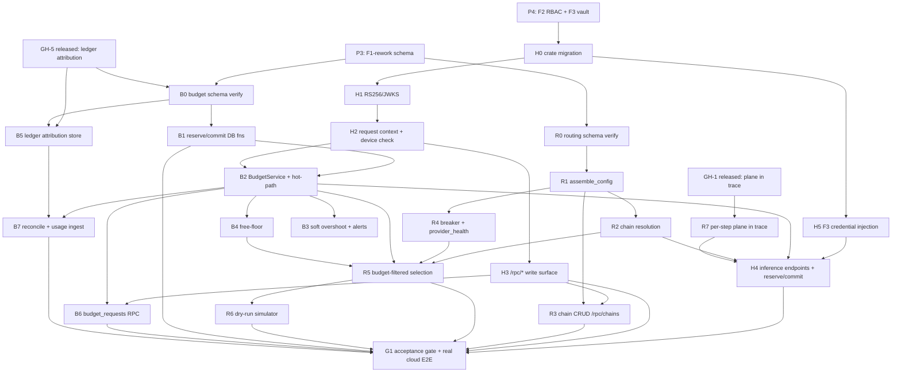

# Phase 3a (P5) · Gateway hardening + Routing + Budgets — Implementation Plan

> **For agentic workers:** REQUIRED SUB-SKILL: `superpowers:subagent-driven-development` + `superpowers:test-driven-development`. Steps use checkbox (`- [ ]`) syntax. **Heavy Rust builds run via a BACKGROUND shell (the controller), not inside a subagent** (the `sensei-gateway` + AWS SDK + `sqlx` compile is minutes; the watchdog kills a subagent). Subagents WRITE code + tests; the controller compiles, runs, and reports. DB changes go through **dbd** (`dbd reset && dbd apply && dbd import`) per [[project_db_workflow]] — no migrations pre-v1. TDD: write the failing test (SQL or Rust) first, then the code. `make clean` after the phase (Tauri/target fills disk, [[feedback_regular_cleanup]]); push to `develop` at each checkpoint.

## Objective

P5 turns the **insecure P2a skeleton** (`services/gateway`, built under HS256 + env-key + fixed-six-role assumptions) into the **ratified central authority**, running on the **P3-reworked schema** and the **P4 identity/vault** foundations. Three modules land together:

- **C1 · harden** — RS256/JWKS verify (HS256 removed), API-key→identity auth, server-side capability resolution, a per-request **device-status hot-path check**, F3 **credential injection** (decrypt `router_credentials`; env keys become a `#[cfg(dev)]` fallback), and the **gateway-mediated `/rpc/*` privileged-write surface** — the only writer of privileged F1 tables.
- **C2 · routing** — assemble the engine `GatewayConfig` from F1, resolve the **bound chain** for `(capability × space × role)`, own **chain CRUD/binding/policy** (via C1 `/rpc/chains`), wrap the crate **circuit breaker** into a `provider_health` projection, label each step with a **plane** (`local|cloud`, GH-1), and provide the **dry-run simulator**.
- **C3 · budgets** — the concurrency-safe **hard reserve→commit** cascade (org→dept→team→user) on the single `inference_calls` ledger, **soft** overshoot + alerts, **free-floor** step-down, `budget_requests`, reconciliation + hold reaper + period roll.

**C2 ⇄ C3 are co-developed** (roadmap §5.3): C2's budget-filtered selection consumes C3's headroom/step-down signal; C3's free-floor engages C2's local step. They share the same phase and the same acceptance harness.

**Guiding invariant (the phase gate, DECISIONS §2 W1+W2):** *No `authenticated` client can mutate a privileged table except through a capability-checked `/rpc/*` handler, and no `hard`-capped budget node can be exceeded even under concurrency — enforcement is server-side (RS256 + RLS + the C1 reserve→commit), never UI.*

## Acceptance gate (the phase is done when)

> **An admin defines a chain and a budget tree; a `hard` node at cap rejects the over-budget call under concurrency (≤ headroom admitted); every privileged write goes through `/rpc/*` (no direct PostgREST write to privileged tables).**

This decomposes into the observable criteria in each feature below and the consolidated harness **G1**.

---

## Prerequisites (must be true before P5 executes)

### Prior phases
- **P4 complete** — F2 full RBAC matrix + capability JWT claim (`role_ids` + `claims_version`) + device lifecycle/`DeviceGuard`; **F3 DEK/KEK envelope vault** live (`router_credentials` with `type api_key|oauth`, `service_role`-only, no decrypting view/function); OAuth connect + background refresher for Anthropic; RS256/JWKS verify-only confirmed on the Supabase project. C1 must not touch a real credential until F3 landed (DECISIONS §2 W4 build gate — satisfied by P4).
- **P3 complete (F1-rework, CRITICAL PATH)** — the reworked schema is the substrate for all of P5. Specifically P5 **assumes these P3 deliverables exist** and does not re-author them:
  - RW1 gateway-mediated write lockdown (privileged tables `service_role`-write-only; `authenticated`/`anon` REVOKEd);
  - RW2 `roles`/`role_permissions`/`profile_roles` + the `SECURITY DEFINER` capability-resolver helper + `custom_access_token_hook` injecting `role_ids`/`claims_version`;
  - RW7 `budget_nodes` deltas (`reserved_amount`, `period_started_at`, `soft_overshoot_limit`), **`budget_holds`**, **`budget_requests`**, `inference_calls` node-attribution columns, `gateway_tasks` cost fields retired, and a **first-cut** cascade/reserve function + the RW12 SQL concurrency test;
  - RW8 `alert_rules`/`notification_channels`/`alert_events`;
  - RW10 `similarity_search`→`vector(1024)`, catalog `SELECT` grants, catalog override tables;
  - RW13 `router_credentials` (`api_key|oauth`);
  - **RW14** routing schema — **`chain_bindings`**, **`routing_policies`**, **`provider_health`**, `fallback_chain_models.plane` — the C2 DDL prerequisites;
  - RW15 `config.config_versions` (D4 pull), analytics rollup addenda.
  - RW12 adversarial authz harness (extended in G1 with C1/C2/C3 integration coverage).

> **Reconciliation of the budget DB functions (resolved residual, not a TBD).** RW7 landed *tables + a first-cut `budget_reserve` sufficient for the P3 SQL concurrency test*. P5/C3 **owns the behavioral contract** and lands the **authoritative** `budget_reserve`/`budget_commit`/`budget_release`/`budget_headroom` `SECURITY DEFINER` functions (free-floor plane return, soft-overshoot-within-limit branch, idempotency `ON CONFLICT`, deterministic path-lock order, reaper) per C3 §4.3 — applied via **dbd** as an additive change in feature **B1**. If the RW7 first-cut already matches, B1 is a verify-only pass. This keeps one owner of the algorithm (C3) without a second source of truth.

### Crate prerequisites (gateway-repo issues — filed → implemented → closed → released via lockstep tag bump before P5 code depends on them)
- **GH-1 — RELEASED (blocking, prereq).** Per-step `plane` on `ChainEntry` + execution-location on `Attempt`/`ExecutionTrace` (`sensei-kernel`). P5 consumes it in C2 (RT7) + C1 trace persistence + C3 `execution_location`. Confirm the pinned `v0.4.x` tag carries it before RT7.
- **GH-5 — FILED + RELEASED before C3 build (blocking for attribution).** Extend the crate's `GatewayStore::InferenceCall` with `budget_node_id` + denormalized `{org,dept,team,user}_node_id` + `execution_location` + `hold_id`, and set `subject_id := budget_node_id` so `get_usage_since(subject,…)` returns node usage. Landed → C1's `PgGatewayStore` writes the columns (B5). *Decided/filed per task; implement + tag-bump before B5.*
- **GH-4 — DECIDED (consumer-side), close as "consumer-side".** Verified: `sensei-gateway::budget` is affordability-only (`estimated ≤ budget`, no lock); `GatewayError::BudgetExceeded` is dormant. **No crate change** — the concurrency-safe reserve→commit lives in C1/DB (B1/B2). The crate's per-request `budget` cap is passed only as a *soft affordability hint* into selection, never the authority. Record the close in `gateway-issues.md`.
- **GH-2 — released in P4** (OAuth/bearer adapter). P5 uses it via F3 credential injection (H5) for Anthropic OAuth accounts.
- **GH-6 (streaming redaction), GH-7 (MCP tool-calling)** — **not P5**. C4/X1 (P6/P11). P5's `/v1/chat/stream` persists + budgets a stream but the C4 governance/redaction wrapper is a no-op stub call site here (wired in P6).

### Front-loaded human inputs (roadmap §4)
- **Paid-provider-call approval — RECONFIRMED for broad BYOK (human).** P5's acceptance harness makes real (small, capped) cloud calls across the seeded BYOK routers; explicit re-authorization to spend on cloud inference is required before G1 runs. Keep live-call tests `#[ignore]`/opt-in and single-cheap-call where possible.
- **KMS/KEK + Anthropic OAuth client** — provisioned in P4; P5 reuses (no new human input).

---

## Residual decisions resolved in this plan (zero TBDs)

| # | Residual | Resolution (rationale) |
|---|----------|------------------------|
| PR-1 | Do the C2 tables (`chain_bindings`/`routing_policies`/`provider_health`) land in P3 or P5? | **P3 (RW14).** P5 consumes them; if RW14 slipped, B0/RT0 apply them via dbd as a corrective step before building on them (flagged, not silent). *Rationale: F1 owns all DDL; C2 is schema-light (C2 spec §3).* |
| PR-2 | Ownership of the authoritative `budget_reserve/commit/release/headroom` SQL functions. | **C3 (feature B1), additive dbd.** RW7 first-cut is a floor; B1 finalizes to C3 §4.3. *Rationale: single owner of the concurrency algorithm; avoids two sources of truth.* |
| PR-3 | Does P5 remove the P2a HS256 path and env keys? | **Yes.** HS256 verify deleted (H2); env-key resolver demoted to `#[cfg(dev)]` fallback behind F3 injection (H5). *Rationale: DECISIONS §2 W3/W4; a shared secret forges tokens, a deployed phase holds no plaintext keys.* |
| PR-4 | Reserve cost-estimate basis (over-hold risk on streaming). | **Worst-case `max_output_tokens` estimate at reserve; reconcile to actual at commit** (C3 §10). *Rationale: fail-closed on `hard` caps; transient over-hold is released at commit — acceptable for v1.* |
| PR-5 | Where the reserve→commit call sites sit. | **Inline in C1's inference handler** (C1 D7), around the engine `execute`/`execute_stream`. C3 provides the `BudgetService` trait + DB functions; C1 owns the call sites. *Rationale: C1 already holds `service_role` + config; no second deploy unit.* |
| PR-6 | Device usage reconciliation ingest (`/v1/usage/report`) — full in P5? | **Server-side ingest + anti-spoof verification land in P5 (B8); the device-side signed-buffer emitter is D4/P10.** P5 tests the ingest with a synthetic signed buffer. *Rationale: C3 owns reconciliation; the desktop emitter is device-plane (roadmap P10).* |
| PR-7 | Circuit-breaker scope. | **Per-process/in-memory (crate default) + a `provider_health` DB projection** for UI/analytics; a distributed breaker is post-v1 (C2 §10). *Rationale: matches the crate's ephemeral `CircuitBreakerManager`; breaker is availability-only, never a security control.* |
| PR-8 | Config-reload granularity after a `/rpc/*` write. | **Full `update_config` rebuild for v1** (assemble → register → `refresh_router_keys`), fired on chain/connection/model writes + `chain.config.changed` Realtime. Targeted delta reload is a later optimization (C1 §10). *Rationale: correctness over latency for v1; rebuild is bounded.* |
| PR-9 | Streaming redaction (GH-6) in P5. | **Out of scope** — C1 calls a `GovernanceGate` stub (identity pass-through) at the pre/post points so P6 can drop in C4 without re-plumbing. *Rationale: keeps C1 call sites stable; GH-6 investigated in P6.* |

---

## File structure (delta over the P2a scaffold)

```
monorepo/
  services/gateway/
    Cargo.toml                       # + sensei-kernel/cloud-providers pins @ v0.4.x; argon2/jsonwebkey/reqwest(JWKS); ed25519-dalek
    src/
      main.rs                        # MIG-2 adapter reg; JWKS bootstrap; config assembly; budget service wiring
      auth/
        mod.rs
        jwt.rs                       # RS256/JWKS verify (replaces HS256); kid-miss refetch
        apikey.rs                    # sk_str_<env>_<prefix>.<secret> → identity (argon2 verify)
        context.rs                   # RequestContext resolution (capabilities, budget node, device)
        device.rs                    # device-status short-TTL cache (Realtime-invalidated)
      capabilities.rs                # Capability enum (mirrors F2 slugs) + require(ctx, cap)
      rpc/
        mod.rs                       # /rpc/* router + per-domain capability guard
        budgets.rs                   # /rpc/budgets/* (nodes, requests, approve/deny)
        roles.rs chains.rs connections.rs governance.rs spaces.rs mcp.rs apikeys.rs models.rs
      routing/                       # C2
        mod.rs
        service.rs                   # RoutingService: assemble_config, resolve_chain, simulate, record_trace
        binding.rs                   # chain_bindings precedence resolver
        breaker.rs                   # CircuitBreakerManager wrap → provider_health projection
        simulate.rs                  # dry-run (no execute)
      budget/                        # C3
        mod.rs
        service.rs                   # BudgetService impl (reserve/commit/release) calling DB fns
        reconcile.rs                 # device usage ingest + rederive + drift audit
        reaper.rs                    # TTL hold sweep
        period.rs                    # period-roll reset
      store.rs                       # PgGatewayStore: + attribution columns (GH-5), get_usage_since
      config_loader.rs               # + catalog overrides (RW10), plane column, routing_policies
      routes/
        chat.rs embed.rs compare.rs generate.rs   # reserve→pre→execute→post→commit→persist
        routing.rs                   # GET/POST /v1/routing/* (chains/bindings/policy/health/simulate)
        usage.rs                     # POST /v1/usage/report (signed device buffer ingest)
        status.rs whoami.rs health.rs
  database/                          # dbd — ADDITIVE over P3 (functions/policies; tables already from P3)
    ddl/function/public/
      budget_reserve.ddl budget_commit.ddl budget_release.ddl budget_headroom.ddl   # C3 §4.3 (finalize)
      budget_reap_expired.ddl budget_period_roll.ddl
    tests/authz.sql                  # extend RW12 with C1/C2/C3 negative + concurrency cases (G1)
```

---

## Features

Prefixes: **H** = C1 harden · **R** = C2 routing · **B** = C3 budgets · **G** = shared acceptance gate. Each feature lists **Layers**, **Depends on**, **Decision** ref, **Acceptance criteria** (observable), and **Given/When/Then** scenarios.

### H0 — Crate migration + repin (MIG-1/2/3) — FIRST build task
- **Layers:** Cargo `[patch]` → adapter registration → compile loop
- **Depends on:** P4; pinned `sensei-*` tag carrying GH-1/GH-2
- **Decision:** C1 §6.7 · gateway-issues MIG-1/2/3
- **Acceptance criteria:**
  - Root `Cargo.toml` `[patch]` targets the real `sensei-*` packages at `../gateway/crates/*` (no `gateway`/`gateway-embedded`); `services/gateway/Cargo.toml` (+ desktop `src-tauri/Cargo.toml`) depend on `sensei-gateway` at the pinned `v0.4.x` git tag.
  - `main.rs` adapter registration uses the `v0.4.x` `AdapterRegistry` + `RegisterInto`/capability-trait model; **no `InferenceAdapter` reference** remains (it is deleted).
  - `cargo build -p torii-gateway` (controller, background) compiles clean; `cargo check` resolves the workspace.
- **Test scenarios:**
  - Given the repinned patch, When the controller runs `cargo build`, Then it compiles against `sensei-gateway@v0.4.x` with zero references to `gateway_embedded`/`InferenceAdapter`.
  - Given `list_adapters()` at boot, When logged, Then the cloud adapters register via the capability-trait registry.

### H1 — RS256/JWKS JWT verification (remove HS256)
- **Layers:** auth middleware → JWKS client
- **Depends on:** H0; P4 RS256/JWKS confirmed
- **Decision:** C1 D1 · DECISIONS §2 W3
- **Acceptance criteria:**
  - C1 fetches + caches the Supabase JWKS at startup; verifies **verify-only** asymmetric public key, `alg=RS256`, `aud=authenticated`, `exp`/`nbf` enforced; on a `kid` miss it refetches the JWKS **once** (rotation).
  - The P2a HS256 path + `SUPABASE_JWT_SECRET` env read are **removed**; no shared secret is read.
- **Test scenarios:**
  - Given a valid RS256 Supabase JWT, When `POST /v1/chat`, Then admitted.
  - Given an HS256 token / expired / wrong-`aud` / unknown-key token, When presented, Then each `401`.
  - Given a rotated signing key (new `kid`), When first seen, Then the JWKS refetches once and the token verifies.

### H2 — Request-context resolution (capabilities · API-key identity · budget node · device)
- **Layers:** auth → capability resolver → device cache
- **Depends on:** H1; P4 RBAC matrix + device lifecycle; RW2 capability-resolver helper
- **Decision:** C1 D2/D5/D6 · §4.4 · DECISIONS §1.2/§2
- **Acceptance criteria:**
  - `RequestContext { tenant_id, identity: Person|Service, capabilities: HashSet<Capability>, budget_subject_node, device, space_id, claims_version }` is resolved **once per request**; capabilities come from `role_permissions` server-side (JWT carries `role_ids`, never raw capabilities).
  - API key `sk_str_<env>_<prefix>.<secret>` → split on `.` → lookup by `prefix` → **argon2 constant-time** verify against `hashed_secret` → check `status='active'` + rate limit → resolve identity (person or `service_account`). Budget node comes from the **identity** (`budget_nodes.ref_id`), never the key.
  - **Device-status check** on the JWT hot path via a short-TTL cache invalidated by Supabase Realtime; a `revoked` device with a live JWT → `403 device_revoked`.
  - `tenant_id` is taken only from the verified credential; client-supplied tenant/identity/role is never trusted.
- **Test scenarios:**
  - Given a valid API key, When presented, Then it resolves to its identity + capabilities; a revoked key → `401`; `SELECT api_keys` by any client returns hash/prefix only (no secret, no budget column).
  - Given two keys for one service account, When both spend, Then spend accrues to the single service-account budget node.
  - Given a JWT whose device is `revoked`, When `POST /v1/chat` within the cache TTL, Then `403 device_revoked`.
  - Given a caller with `role_ids=[editor]`, When resolved, Then `capabilities` equals the editor's `role_permissions` set (not a client-supplied list).

### H3 — Gateway-mediated privileged-write surface (`/rpc/*`) + capability authz
- **Layers:** rpc router → per-domain handlers → audit emit
- **Depends on:** H2; RW1 write-lockdown; RW2 capabilities
- **Decision:** C1 D3/D7 · §4.2 · DECISIONS §2 W1 — **the phase gate's write half**
- **Acceptance criteria:**
  - A per-domain `/rpc/*` surface (not a generic mutation blob): `budgets`, `roles`, `chains`, `connections`, `governance`, `spaces`, `mcp`, `apikeys`, `models` (endpoints per C1 §4.2). Each handler calls `require(ctx, cap)` server-side **before** writing, writes as `service_role` scoped to `ctx.tenant_id`, and emits an `audit_events` row bound to `ctx.identity`.
  - Capability slugs reference the **F2-owned** set (`budget.write`, `chain.write`, `connection.manage`, `role.manage`, `governance.manage`, `feature.manage`, `space.create`, `member.manage`, `doc.declassify`, `mcp.manage`, `apikey.manage`, `model.manage`); C1 defines **no** new capability.
  - API-key issuance (`/rpc/apikeys/create`) is **reveal-once**: the only response ever carrying the secret; subsequent reads return `prefix` + metadata; the raw secret is never stored (hash only) or re-returned.
  - Config-affecting writes (chains/connections/models) trigger a config reload (PR-8) + fire `chain.config.changed`.
- **Test scenarios:**
  - Given a caller **with** `budget.write`, When `POST /rpc/budgets/upsert-node`, Then it succeeds and writes one `audit_events` row (`actor_id = caller`).
  - Given a caller **without** `budget.write`, When the same call, Then `403 { capability_required }` and no write occurs.
  - Given any `authenticated` client, When a **direct PostgREST** `UPDATE budget_nodes/fallback_chains/...`, Then RLS **denies** it (no privileged write outside `/rpc/*`).
  - Given `/rpc/apikeys/create`, When called once, Then the secret appears exactly once; a later `GET` returns prefix-only.

### H4 — Inference endpoints wired to pre/post + reserve→commit (chat/embed/compare/generate + SSE)
- **Layers:** routes → engine execute → GatewayStore persist
- **Depends on:** H2; H5 (credentials); B2 (BudgetService); RT2 (chain resolve); GovernanceGate stub (PR-9)
- **Decision:** C1 §6.1–6.4
- **Acceptance criteria:**
  - `POST /v1/chat` (+ `/chat/stream` SSE), `/v1/embed` (1024-dim via the embedding chain), `/v1/compare` (`panel`/`consensus`), `/v1/generate` follow the ordered flow: resolve context → **device check** → `GovernanceGate::pre` (stub in P5) → **`BudgetService::reserve`** → build `InferenceRequest` → `Gateway::execute`/`execute_stream` → `GovernanceGate::post` (stub) → **`commit`** → persist `inference_calls` + `execution_traces`. Any failure after reserve → `release`.
  - SSE ends with a `done` event carrying usage/cost; a completed stream persists exactly one ledger row; client disconnect → release/commit-so-far + a `status=partial` row.
  - `/v1/compare` reserves the **sum** of slots, commits per-slot actuals, persists one row per slot sharing a `compare_group_id`.
  - Response carries `execution_location` (`cloud` from C1; `local` only via D3), `inference_call_id`, `trace_id`.
- **Test scenarios:**
  - Given a seeded chain + provider credential, When `POST /v1/chat`, Then a real cloud answer returns, the credential never appears in the response/logs, and exactly one `inference_calls` row is written with correct tenant + node attribution + cost.
  - Given `POST /v1/chat/stream`, When it runs, Then chunks stream as `text/event-stream` and a `done` event carries usage/cost; one ledger row persists.
  - Given `POST /v1/embed`, When it runs, Then it returns 1024-dim vectors via the embedding chain.
  - Given `POST /v1/compare mode=panel`, When N models, Then N slots return and N ledger rows share a `compare_group_id`.

### H5 — F3 credential injection (decrypt `router_credentials`; env keys → dev fallback)
- **Layers:** config bootstrap → `refresh_router_keys`
- **Depends on:** H0; P4 F3 vault + GH-2 OAuth adapter
- **Decision:** C1 D8/D9 · §6.6 · DECISIONS §2 W4
- **Acceptance criteria:**
  - `refresh_router_keys(resolver)` where the resolver **decrypts `router_credentials` via the F3 DEK/KEK envelope** at call time: `api_key` → static bearer; `oauth` → current access token (Anthropic-only in v1, GH-2), cooperating with the F3 background refresher (401-triggered refresh path).
  - Plaintext key/token **never** enters a response, log line, trace row, or error; startup logs *counts* of resolved credentials only.
  - The P2a env-key resolver is demoted to a `#[cfg(dev)]` fallback (local dev), behind the vault path.
- **Test scenarios:**
  - Given an `api_key` credential in the vault, When a chat call runs, Then the decrypted bearer is injected server-side and absent from all output (log-scan test passes).
  - Given an `oauth` (Anthropic) credential near expiry, When a call runs, Then the refresher swaps the token and the call succeeds without exposing the token.
  - Given startup, When credentials load, Then the log shows counts only, never values.

### R0 — Routing schema verification (RW14 landed) + catalog-override read
- **Layers:** dbd verify → config_loader
- **Depends on:** P3 RW14/RW10
- **Decision:** PR-1 · C2 §3
- **Acceptance criteria:**
  - Verify `chain_bindings`, `routing_policies`, `provider_health`, `fallback_chain_models.plane` exist with the C2 §3 columns and `service_role`-write RLS; if RW14 slipped, apply corrective DDL via dbd (flagged in the commit).
  - `config_loader` reads per-tenant **catalog override** tables (RW10) when assembling `ModelConfig` (disabled model/router absent; custom pricing applied).
- **Test scenarios:**
  - Given the schema, When enumerated, Then the four routing objects + `plane` exist with `service_role`-write + tenant `SELECT`.
  - Given a per-tenant override disabling a model, When config assembles, Then that model is absent from the tenant's `GatewayConfig`.

### R1 — `RoutingService::assemble_config` (F1 → engine `GatewayConfig`)
- **Layers:** routing/service
- **Depends on:** R0; H0
- **Decision:** C2 §2.1 · AC1
- **Acceptance criteria:**
  - `assemble_config(tenant)` builds `GatewayConfig { routers, models, chains }` from `config.*` + overrides + `fallback_chains`/`fallback_chain_models`; chain step `plane` is carried (GH-1). Capability of a step derives from the **bound model's** `model_capabilities` (never the provider).
  - Pure builder fns (`build_routers`/`build_models`/`build_chains`) unit-tested over sample rows (no DB).
- **Test scenarios:**
  - Given a tenant with chains in F1, When `assemble_config`, Then `chains` keys/`models`/`routers` match the DB with overrides applied.
  - Given a chain step whose model lacks the chain's capability, When assembled, Then it is flagged (feeds R3 validation).

### R2 — Chain resolution precedence (`chain_bindings`) + feature governance
- **Layers:** routing/binding
- **Depends on:** R1
- **Decision:** C2 D2 · flow 1 · AC2
- **Acceptance criteria:**
  - `resolve_chain(ctx, capability, space_id, override?)` picks by precedence: **explicit override** (only if caller has `chain.read` + the chain is bound-visible) → **(space×role)** → **(space)** → **(role)** → **tenant default** (`fallback_chains.is_default`). Feature governance (4-state, workspace→space→role→user) may force/forbid a chain; a `locked` routing feature is not user-overridable.
  - No default for a capability → a **deterministic typed error**, never a silent wrong chain.
- **Test scenarios:**
  - Given bindings at tenant/role/space/space×role for one capability, When resolved, Then the most-specific bound chain wins.
  - Given no binding + a tenant default, When resolved, Then the default returns; with no default, a typed error.
  - Given a `locked` chain feature, When a user preference tries to override, Then resolution returns the locked chain.

### R3 — Chain CRUD / binding / policy via `/rpc/chains` (validation)
- **Layers:** rpc/chains → routing
- **Depends on:** H3; R1
- **Decision:** C2 §4.2 · AC3/AC4/AC9
- **Acceptance criteria:**
  - `POST/PATCH/PUT/DELETE /v1/routing/chains*`, `GET/PUT /v1/routing/bindings`, `GET/PUT /v1/routing/policy/{chain_id}` all route through C1's `chain.write`/`chain.read` guard. Create/update **validates** each step's model carries the chain's capability in `model_capabilities`; rejects unknown `fallback_triggers` (only the **5 engine triggers**: `RateLimit`, `Timeout`, `ProviderError`, `ModelUnavailable`, `BudgetExceeded`).
  - Delete of a bound chain is blocked (must rebind/force).
  - Every mutation emits an `audit_events` row + fires `chain.config.changed`.
- **Test scenarios:**
  - Given a chain whose step model lacks the capability, When `POST /v1/routing/chains`, Then `400` + reason; nothing persists.
  - Given an unknown trigger string, When submitted, Then rejected; the 5 valid triggers round-trip into `FallbackChainConfig.fallback_triggers` (serde snake_case).
  - Given a caller lacking `chain.write`, When any write, Then `403`; a direct PostgREST `UPDATE fallback_chains` by `authenticated` is RLS-denied.

### R4 — Circuit breaker + `routing_policies` + `provider_health` projection
- **Layers:** routing/breaker → provider_health
- **Depends on:** R1
- **Decision:** C2 D6/D7 · PR-7 · flow 4 · AC8
- **Acceptance criteria:**
  - Wrap the crate `CircuitBreakerManager` (per-process/in-memory); thresholds/timeouts from `routing_policies` (operator config; crate defaults threshold 5 / timeout 300s / half-open 3 as overridable fallbacks — **no hardcoded ops**). `region_pin`/retry/hard-timeout/health-interval are operator config, not constants.
  - On attempt outcomes, project `provider_health` (`status healthy|degraded|down`, `breaker_state closed|open|half_open`, `last_error`, `checked_at`) as `service_role`; tenant `SELECT`; fire `provider.health.changed` (Realtime). `GET /v1/routing/health` returns the snapshot.
  - Breaker state is **availability-only**, never a security control.
- **Test scenarios:**
  - Given `threshold` recorded failures for a router endpoint, When observed, Then `can_execute=false`, `provider_health.status→degraded/down`, `breaker_state=open`; after `timeout` it half-opens; `half_open_max` successes close it → `healthy`.
  - Given two independent endpoints, When one trips, Then the other is unaffected.

### R5 — Budget-filtered selection + step-down / free-floor signal (C2⇄C3)
- **Layers:** routing/service ↔ budget/service
- **Depends on:** R2, R4; B2 (headroom), B4 (free-floor)
- **Decision:** C2 D3 · flow 2 · AC6/AC7 — **co-development seam**
- **Acceptance criteria:**
  - C2 sets `SelectionCriteria.budget` = the caller's **remaining headroom** (min across the org→dept→team→user path, from C3). The engine's `filter_by_budget` (soft) + breaker `can_execute` order candidates; C2 reports which step served: `primary | stepped_down | free_floor | resilience_fallback | budget_blocked`.
  - **Hard cap is enforced by C3's reserve (B1/B2), not by C2's ordering.** On reserve failure, the resolver is asked for the next affordable/free-floor step.
  - At zero headroom with `free_floor_enabled`, the served step's plane is `local`/`$0`.
- **Test scenarios:**
  - Given decreasing `remaining_budget`, When resolved, Then `served_by.reason` transitions `primary → stepped_down → free_floor`.
  - Given a router outage, When resolved, Then the next-priority non-outaged step serves and the outaged router's candidates are `skipped: circuit_open`.
  - Given zero headroom + free-floor, When resolved, Then the served step is `local`/`$0` and no cloud call is made.

### R6 — Dry-run simulator (`POST /v1/routing/simulate`)
- **Layers:** routing/simulate → routes/routing
- **Depends on:** R5
- **Decision:** C2 D9 · §4.5 · AC11
- **Acceptance criteria:**
  - `simulate(ctx, {capability, space_id?, chain_id?, remaining_budget?, input_tokens?, simulate_outage?})` runs `ModelSelectionService` with the given headroom, returns `{ chain_id, served_by, reason, candidates[], skipped[] }` (mirrors `SelectionResult` + plane + est-cost) and **executes nothing** — no provider call, no `inference_calls` row.
- **Test scenarios:**
  - Given a simulate request, When run, Then candidates/skips/est-cost/plane return and **zero** ledger rows + zero provider calls occur.
  - Given `simulate_outage=<router>`, When run, Then that router's candidates are `skipped` and the served model is the next-priority alternative.

### R7 — Per-step plane in the unified trace (GH-1)
- **Layers:** trace persistence
- **Depends on:** GH-1 released; R1; H4
- **Decision:** C2 D4 · AC10 · DECISIONS §3
- **Acceptance criteria:**
  - A resolved chain `[opus(cloud) → sonnet(cloud) → gemma(local)]` carries correct `plane` per step; executed `ExecutionTrace.attempts[*]` carry `execution_location` matching the step plane; C1 persists it on `execution_traces` + `inference_calls.execution_location`.
  - (Desktop D3 acts on the plane in P10; P5 only records/persists it for cloud steps.)
- **Test scenarios:**
  - Given a plane-spanning chain executed via C1 (cloud steps), When persisted, Then `execution_traces` + `inference_calls.execution_location='cloud'` are recorded per attempt; the `routing_resolved_chain` shape exposes each step's plane.

### B0 — Budget schema verification (RW7/RW8 landed) + GH-5 columns
- **Layers:** dbd verify
- **Depends on:** P3 RW7/RW8; GH-5 released
- **Decision:** PR-1/PR-2 · C3 §3
- **Acceptance criteria:**
  - Verify `budget_nodes` deltas (`reserved_amount`, `period_started_at`, `soft_overshoot_limit`), `budget_holds`, `budget_requests`, alert tables, and `inference_calls` attribution columns (`budget_node_id`, `{org,dept,team,user}_node_id`, `execution_location`, `hold_id`, `subject_id := budget_node_id`) exist per GH-5; corrective dbd if any slipped (flagged).
- **Test scenarios:**
  - Given the schema, When enumerated, Then all C3 columns/tables exist with `service_role`-write; `budget_holds` is unreadable by `authenticated`.

### B1 — Reserve/commit/release/headroom DB functions (finalize C3 §4.3) + reaper/period
- **Layers:** dbd functions (`SECURITY DEFINER`)
- **Depends on:** B0
- **Decision:** C3 §4.3/§8 · GH-4 (consumer-side) · PR-2/PR-4
- **Acceptance criteria:**
  - `budget_reserve(tenant, leaf, estimate, idem)`: resolve ancestor path `leaf→root` (`WITH RECURSIVE`), `SELECT … FOR UPDATE … ORDER BY id` (deterministic order → no deadlock), check **every** node `headroom = cap − spent − reserved`; `hard` with no headroom → free-floor branch (if `free_floor_enabled`) or raise `BudgetExceeded`; `soft` over cap within `soft_overshoot_limit` → pass with `overshoot=true`, beyond → hard-block; insert `budget_holds(status=reserved, idempotency_key)` `ON CONFLICT (tenant,idem) → return existing`; `reserved_amount += estimate` along path.
  - `budget_commit`: set `committed_amount`, `spent_amount += actual` along path, `reserved_amount -= estimate`, link `inference_call_id`, hold→`committed` (idempotent on `hold_id`).
  - `budget_release`: `reserved_amount -= estimate` along path, hold→`released`/`expired` (idempotent).
  - `budget_reap_expired`: sweep `reserved` holds older than TTL (default 120s ≥ max provider timeout) → `expired` + release.
  - `budget_period_roll`: on `now()` crossing `period_started_at + period`, zero `spent_amount`/`reserved_amount`, advance `period_started_at`; the `inference_calls` ledger is **never** reset.
- **Test scenarios:**
  - Given a `hard` node headroom `H` and `N` concurrent `budget_reserve` calls each estimating `> H/N`, When they race, Then committed spend ≤ cap and excess get `BudgetExceeded` (or free-floor).
  - Given a leaf with headroom but a `hard` ancestor at cap, When reserve, Then rejected/free-floored (every ancestor must have headroom).
  - Given a `reserved` hold left past TTL, When the reaper runs, Then it is `expired` and headroom restored.
  - Given `now()` past the period boundary, When `budget_period_roll`, Then rollups zero and `period_started_at` advances; the ledger is unchanged.

### B2 — `BudgetService` (Rust) + hot-path reserve→commit integration in C1
- **Layers:** budget/service → C1 routes (H4)
- **Depends on:** B1; H2; H4
- **Decision:** C3 §4.1 · C1 D4 · PR-5
- **Acceptance criteria:**
  - `BudgetService::{reserve, commit, release}` wraps the DB functions; `reserve(ctx, est, idem)` returns `Reservation { hold_id, leaf_node_id, plane: Cloud|Free, overshoot, headroom_after }`; idempotent on `idem` (request/attempt id); `commit`/`release` idempotent on `hold_id`.
  - A caller with **no resolvable leaf node** → `NoBudgetNode` → **denied** (fail-closed), never admitted with implicit unlimited budget. Lock timeout → retryable error, not an admit.
  - C1's `/v1/*` handlers call reserve before execute and commit after (release on any post-reserve failure) — the call sites from H4.
- **Test scenarios:**
  - Given a successful priced call, When it completes, Then leaf + every ancestor `spent_amount += actual` (not estimate), `reserved_amount` restored, hold `committed` with `inference_call_id`.
  - Given a provider error after reserve, When release runs, Then `reserved_amount` restored, `spent_amount` unchanged, hold `released`.
  - Given a caller with no leaf node, When reserve, Then `NoBudgetNode` → the call is denied.
  - Given a retried reserve with the same `idem`, When it runs, Then the existing hold is returned (no double-hold).

### B3 — Soft overshoot + alerts (`alert_rules`/`alert_events`/`notification_channels`)
- **Layers:** budget/service → alerts
- **Depends on:** B2
- **Decision:** C3 flow 5 · §3.5 · AC5
- **Acceptance criteria:**
  - A `soft` node admits over cap up to `soft_overshoot_limit` (emit `budget.overshoot`) and hard-blocks beyond it. Crossing `alert_threshold` fires `budget.alert` → an `alert_events` row + channel dispatch (email/slack/webhook/siem), **exactly once per window**.
- **Test scenarios:**
  - Given a `soft` node over cap within the limit, When a call runs, Then it is admitted with `overshoot=true` and `budget.overshoot` emitted; beyond the limit → hard-block.
  - Given `alert_threshold` crossed, When evaluated, Then `budget.alert` + one `alert_events` row fires once per window (not per call).

### B4 — Free-floor step-down (C3⇄C2 seam)
- **Layers:** budget/service ↔ routing (R5)
- **Depends on:** B2; R5
- **Decision:** C3 flow 3/4 · AC6
- **Acceptance criteria:**
  - When a `hard` node is exhausted and `free_floor_enabled`, `reserve` returns `Reservation { plane: Free }`; C1/C2 route to the free local step (`$0`); `budget.exhausted` emitted; **nothing** accrues to the cap. With `free_floor_enabled=false` → `Err(BudgetExceeded)` → C1 returns a typed `402/429`; nothing spent.
- **Test scenarios:**
  - Given `free_floor_enabled` + no headroom, When a call runs, Then it completes on the local plane at `cost_usd=0`, nothing accrues, and `budget.exhausted` fires.
  - Given no free floor + no headroom, When a call runs, Then `402/429 budget_exceeded` and nothing is spent.

### B5 — Ledger attribution + rollup in `PgGatewayStore` (GH-5)
- **Layers:** store.rs
- **Depends on:** B0; GH-5 released
- **Decision:** C3 §3.3 · AC7 · DECISIONS §3 (one ledger)
- **Acceptance criteria:**
  - Every `inference_calls` row written by the gateway has non-null `budget_node_id` + the denormalized `{org,dept,team,user}_node_id` path + `execution_location` + `hold_id`; `subject_id := budget_node_id` so `get_usage_since(subject,…)` returns node usage. `gateway_tasks` holds no cost fields. `service_role`-write; tenant-scoped read-only SELECT for clients.
- **Test scenarios:**
  - Given a completed call, When persisted, Then O2 can group spend by org/dept/team/user **without recursion** (the denormalized path is present).
  - Given `get_usage_since(budget_node_id, window)`, When called, Then it returns that node's usage.

### B6 — `budget_requests` increase → approve/reject RPC
- **Layers:** rpc/budgets
- **Depends on:** H3; B2
- **Decision:** C3 flow 8 · §4.2 · AC9 · DECISIONS §2 W1
- **Acceptance criteria:**
  - `POST /v1/budgets/requests` — a member INSERTs their **own** `budget_requests(status=pending)` (self-owned benign write; `requested_by = auth.uid()`, no `cap_amount` field client-writable). `POST …/approve` (cap `budget.write`) sets `budget_nodes.cap_amount = requested_cap`, `status=approved`, emits `budget.request.approved` + re-pushes remaining via Realtime; `…/reject` → `status=rejected`.
- **Test scenarios:**
  - Given a member without `budget.write`, When they `POST /v1/budgets/requests`, Then a `pending` row is created; When they call `…/approve`, Then `403`.
  - Given an approver with `budget.write`, When they approve, Then `cap_amount` = `requested_cap`, `status=approved`, and the member's remaining is re-pushed.

### B7 — Reconciliation, drift audit + device usage ingest (`/v1/usage/report`)
- **Layers:** budget/reconcile → routes/usage
- **Depends on:** B2; B5
- **Decision:** C3 flow 7/10 · §4.4 · PR-6 · AC10/AC12 · DECISIONS §2 (apply-without-asking)
- **Acceptance criteria:**
  - `POST /v1/usage/report` verifies an **Ed25519**-signed, monotonic-sequenced (`buffer_seq`), idempotent (`idempotency_key`) device buffer against the device's enrolled pubkey (F2); rejects on bad signature, `device.status != active`, stale `buffer_seq`, or duplicate key → `budget.spoof_detected`. Accepted local calls are inserted into `inference_calls` (`execution_location=local`, typically `cost_usd=0`, tokens counted) **exactly once**; `spent_amount` is re-derived and remaining re-pushed via Realtime (D4/P10 consumes on the device).
  - Periodic reconciliation re-derives each node's `spent_amount` from `inference_calls` and corrects rollup drift beyond tolerance → `budget.reconciled` + an `audit_events` row.
  - (Device-side emitter is D4/P10; P5 tests with a synthetic signed buffer.)
- **Test scenarios:**
  - Given a buffer with a bad signature / revoked device / stale `buffer_seq` / duplicate `idempotency_key`, When ingested, Then rejected + `budget.spoof_detected`.
  - Given a valid buffer, When ingested twice, Then its local calls appear in `inference_calls` exactly once and remaining updates.
  - Given an out-of-band `inference_calls` row, When reconciliation runs, Then it corrects the `spent_amount` rollup and emits `budget.reconciled` + an audit row.

### G1 — Consolidated acceptance harness (the phase gate) + real-cloud E2E
- **Layers:** tests (SQL + Rust integration) → controller run
- **Depends on:** ALL of H*, R*, B*
- **Decision:** the P5 acceptance gate · C1 §9 / C2 §9 / C3 §9 · RW12 extension
- **Acceptance criteria:**
  - Extends `database/tests/authz.sql` (RW12) with C1/C2/C3 negative cases: a member without `budget.write` cannot raise a cap (PostgREST or `/rpc`); a member without `chain.write` cannot mutate a chain; a direct PostgREST write to any privileged table is RLS-denied; a revoked key/device is rejected; **no** secret appears in any response/log (log-scan).
  - The **hard-cap concurrency race**: K concurrent `/v1/chat` calls against a near-full `hard` node admit **≤ headroom** and reject the rest with `402`; `spent_amount` never exceeds cap.
  - **The gate scenario end-to-end:** an admin (via `/rpc/*`) defines a chain (R3) + a budget tree (B6/B2); an over-budget call under concurrency is rejected (B1/B2); every privileged write in the scenario went through `/rpc/*` (asserted by attempting the same writes via PostgREST and observing denial).
  - One **real (small, capped) cloud call** proves the full pipeline (paid-provider approval reconfirmed); kept `#[ignore]`/opt-in.
- **Test scenarios:**
  - Given the built phase, When the harness runs, Then every adversarial mutation is denied, the hard-cap race admits ≤ headroom, and the real cloud call returns + persists one attributed ledger row.
  - Given a regression re-granting a privileged write to `authenticated`, When the harness runs, Then it fails and names the table.

---

## Dependency graph



## Suggested build order

1. **H0** (crate migration) — nothing compiles until the `v0.4.x` capability-trait registry is in place.
2. **H1 → H2 → H3** (auth spine: RS256 → context/device/API-key → `/rpc/*` guard) — the write-authz half of the gate; unblocks every RPC-fronted feature.
3. **H5** (credential injection) in parallel with the auth spine (independent of H2).
4. **Schema verify pair (R0 + B0)** — fast dbd checks that RW14/RW7/RW8 + GH-5 landed; corrective DDL if slipped.
5. **C3 core (B1 → B2)** and **C2 core (R1 → R2, R4)** in parallel — the two modules build to the **R5** co-development seam.
6. **R5 + B4** (the C2⇄C3 seam: budget-filtered selection ⇄ free-floor) — build together; this is the mutual-dependency resolution.
7. **B3, B5, B6, B7** (soft/alerts, ledger attribution, requests, reconciliation) and **R3, R6, R7** (chain CRUD, simulator, plane-in-trace) — fan out.
8. **H4** (wire all inference endpoints to pre→reserve→execute→post→commit→persist) — depends on H5+B2+R2+R7.
9. **G1** (consolidated harness + real-cloud E2E) — the gate. `make clean`, push `develop`.

> **Co-development note (roadmap §5.3).** R5 (C2 budget-filter) and B2/B4 (C3 reserve + free-floor) are the genuine mutual dependency: C2 feeds headroom in and reads the served-step reason out; C3 returns the free-floor plane C2 routes to. Build B1/B2 and R1/R2/R4 to stubs of each other's interface, then land R5+B4 together against real implementations. Do **not** try to finish either module fully before the other — that was the sequencing trap the roadmap calls out.

---

## Self-review notes (author)

- **Spec coverage.** C1: H0 (MIG), H1 (RS256 §5/D1), H2 (context/API-key/device §4.4/D2/D5/D6), H3 (`/rpc/*` §4.2/D3/D7), H4 (endpoints §6.1–6.4), H5 (F3 injection §6.6/D8/D9) → C1 §9 AC 1-14. C2: R0-R7 → C2 §9 AC 1-13 (AC10 per-step plane gated on GH-1=R7). C3: B0-B7 → C3 §9 AC 1-12. Cross-cutting gate → G1.
- **Prerequisites honored.** P4 (RBAC+vault), P3 (reworked schema), GH-1 released (R7), GH-5 filed→released (B0/B5), GH-4 decided consumer-side (B1/B2), paid-provider approval reconfirmed (G1). All stated up front.
- **Deferred (flagged, not silent).** Streaming redaction / C4 governance wrapper = P6 (H4 calls a `GovernanceGate` stub, PR-9); MCP tool-call enforcement = X1/P11 (GH-7); the device-side signed-buffer emitter + D3 local-plane execution = D4/D3/P10 (B7/R7 record but don't drive the device); distributed circuit breaker + region-pin enforcement mechanism + multi-region topology = post-v1 / C1 open questions (PR-7); external billing (Stripe) + multi-currency = not ratified (C3 §10).
- **Zero-TBD posture.** Nine residuals resolved in the table (PR-1..PR-9) with rationale conforming to DECISIONS; the only genuinely open items are explicitly deferred product/scale questions, not build blockers.
- **DECISIONS conformance.** W1 (gateway-mediated writes) = H3+G1; W2 (hard reserve, budget binds to identity/node) = B1/B2 + H2; W3 (RS256/JWKS) = H1; W4 (F3 before real credentials, KEK in KMS) = H5 + P4 gate; no-hardcoded-ops = R4 (`routing_policies` operator config); one ledger = B5.
- **Biggest risks.** (a) GH-5 must be released before B5 (ledger columns) — verify the tag; (b) reserve estimate accuracy vs tight `hard` caps (PR-4 worst-case + commit reconcile); (c) config-reload correctness under a live `/rpc/*` write (PR-8 full rebuild); (d) the real-cloud E2E spends money — keep it single/cheap/opt-in and gated on the reconfirmed approval.
