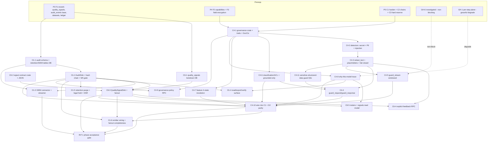

# Phase P6 (3b) · Governance/DLP + Ledger/Audit + Quality signals — Implementation Plan

> **For agentic workers:** REQUIRED SUB-SKILL: superpowers:subagent-driven-development. **TDD** — every code feature writes the failing test first (Rust `#[cfg(test)]` / `sqlx` integration test / a fixture corpus for detectors), then the implementation. **Heavy Rust builds + real cloud calls run via a BACKGROUND shell (controller), not inside a subagent** (the `services/gateway` + `governance` crate + ONNX + `sqlx` compile is minutes; the watchdog kills a subagent). DB changes go through **dbd** (`dbd reset && dbd apply && dbd import` — no migrations pre-v1, per `project_db_workflow`). Subagents WRITE code + tests; the controller compiles, migrates, and runs the paid E2E. `.svelte` meters (W2/W3) are **not** in this phase — only their backing endpoints.

**Goal (the phase acceptance gate — roadmap §2 P6):**
- **Redaction before egress:** a prompt containing a secret / API-key is **redacted before it egresses to any model** (cloud or local), leaving zero raw secret characters on the wire.
- **Complete record:** **every** inference call emits **one `audit_events` row** (`actor_id` = the caller for user-attributed events, or gateway/`service_role` for system events) **and one `quality_signals` row** keyed to its `inference_calls` id.
- **Tamper-evident, streamed:** the audit ledger **streams to a SIEM sink** (durable, at-least-once, per-tenant-ordered) and **denies `UPDATE`/`DELETE` to `authenticated` (and to `service_role`)** by DB trigger.

**Modules:** **C4** governance runtime + DLP · **O1** request ledger, audit & SIEM · **C6** quality-signal contract + capture + read model. Per roadmap §5.5, **C6's contract lands in this phase; C5 emits into it in P7** (contract-first, no circular build).

**Architecture (how the three modules compose):**
C4 is a **consumer-side wrapper** (Rust crate `crates/governance`) around the engine's `execute`/`execute_stream` — there is **no in-engine hook** (confirmed, GH-6). C1's hot path calls `guard_request` (redact/classify/injection-scan the prompt+context before egress) → C3 reserve → engine `execute` → `guard_response`/`guard_stream` (redact output, grounded-only, "why this model") → C3 commit → C1's `GatewayStore` persists the `inference_calls` row → C4 assembles the implicit **quality-signal batch** and calls C6's `QualitySignalSink::record`, which persists to `quality_signals` **and fans out** to O1's `AuditSink`. Every C4 guard/redaction/policy hit and every privileged write also calls `AuditSink::emit` (in the same DB tx as the write). O1's background streamer ships `audit_events` to the configured SIEM sink by a monotonic per-tenant cursor. The same `governance` crate compiles into **D2** (desktop local gateway) so redaction/classification apply identically on the local plane.

**Tech stack:** Rust · `services/gateway` (Axum 0.8, `sqlx` 0.8, `tokio`) · new crate `crates/governance` (C4) · new crate/module `quality-signals` (C6 contract) · ONNX Runtime (`ort`, reusing the D2 `OrtAdapter` infra) for the PII detector · a published secret-scanner ruleset (gitleaks-class) · Supabase Postgres (dbd) · a SIEM sink over HTTPS (JSON default). No new UI.

---

## Prerequisites

### Prior phases (must be green before P6 starts)
- **P3 (F1 security + scope rework)** — the reworked schema. P6 relies on: `quality_signals` (RW15), base `audit_events` + `alert_rules`/`notification_channels`/`alert_events` (RW8), `settings`/`feature_states`/`user_preferences` (RW6/RW10), `structured_datasets`/`dataset_columns` (RW15, §3c), `roles`/`role_permissions`/`profile_roles` (RW2), the single `inference_calls` ledger + `execution_traces` (RW7), the RW12 adversarial-authz harness (P6 extends it to `audit_events` + `quality_signals`).
- **P4 (Identity/RBAC + Key vault)** — the F2 canonical **capability set** + `SECURITY DEFINER` capability-resolution helper (server-side authz; capabilities are **not** in the JWT — it carries `tenant_id` + `role_ids` + a claims version). C4/O1 gate on `governance.manage`, `doc.declassify`, `audit.view`, `audit.export`.
- **P5 (Gateway hardening + Routing + Budgets)** — C1 rebuilt to the ratified posture (gateway-mediated `/rpc/*` writes, capability authz, RS256/JWKS verify), C2 named chains ↔ capability ↔ space/role, C3 hard reserve→commit on `inference_calls`. C4's wrapper hosts **inside** the P5 C1; the LLM-as-judge (C6) issues its own **metered** call that reserves against C3.

### Crate prerequisites (gateway-repo issues — `gateway-issues.md`)
| Issue | State entering P6 | Effect on P6 |
|---|---|---|
| **GH-6** streaming-safe redaction hook | **Investigated + filed** (prerequisite of this phase). Decision below (Decision 4). | C4 ships the **consumer-side token-buffered windowed transform** for streams; GH-6 stays a non-blocking enhancement. **Not a build blocker.** |
| **GH-1** per-step `plane`/exec-location on the trace | Released with the C2/D3 phase (P2b/P5). | `WhyThisModelTrace.plane` + `audit_events.execution_location` + `inference_calls.execution_location` are truthful. **Graceful degrade:** if not yet released, C4 renders `plane = unknown` and O1's exec-location column is cloud-only fidelity — P6 still passes its gate. |
| **GH-5** `inference_calls` ledger shape + attribution | Rides F1-rework/C3 (P3/P5). | C6 reads cost/latency/attribution from the ledger for signals + meters; O1 reads it for the Requests surface. |
| **GH-7** MCP/tool-calling | Investigate — **X1-owned (P11)**. | Out of P6 scope; C4 only exposes `redact_text(ToolInput|ToolOutput,…)` that X1 will call in P11. |

**No new gateway-repo issue is filed in P6** — C4/O1/C6 are consumers of GH-1/GH-5/GH-6 already filed. Governance is deliberately consumer-side (DECISIONS §3; C4 spec §7).

### Front-loaded human inputs / secrets (obtain before the noted feature)
| Human input | Needed by | Why |
|---|---|---|
| **A SIEM sink endpoint + auth credential** (a test HTTPS collector — e.g. a Splunk HEC token or a generic JSON/HTTPS receiver) | **O1-3 / INT-1** | The phase gate requires a live SIEM stream. The credential is stored as a **secret-ref** in `notification_channels.config` (never plaintext in the row) — resolved via the F3 vault. A local mock collector is acceptable for the automated test; a real sink for the manual acceptance. |
| **Paid-provider-call authorization (reconfirm from P2a/P5)** | **INT-1** (C4 wraps a real call) + **C6-judge** | C4's E2E wraps one real cloud chat call; the LLM-as-judge is itself a metered paid call. One sanctioned key + a cheap model; the judge toggle ships **default-off**. |
| **Detector artifacts** — a pinned **gitleaks-class secret ruleset version** + a **GLiNER-class PII NER ONNX model** file (+ optional Presidio sidecar image, off by default) | **C4-2** | The DLP detectors are vetted libraries, not hand-rolled regex (§2 W5). Pin the ruleset version and vendor the ONNX model into the model registry (reuse D2's pull path). |
| **LLM-as-judge chain + per-tenant judge budget default** | **C6-judge** (Decision C6-b) | The judge is metered inference; it needs a chain binding (C2) + a budget sub-cap (C3) + a governance toggle. Product picks the default judge model + budget; ships default-off. |

---

## Residual decisions resolved (zero TBDs — conforms to DECISIONS)

The module specs carried open questions; P6 resolves each so the build has no TBDs.

**C4 (governance/DLP):**
1. **PII detector deployment.** v1 default = **GLiNER-class ONNX NER in-process** (via the `ort`/`OrtAdapter` infra) — no extra service, and it runs on the **local plane (D2)**, which the local-parity gate (C4 AC 17) requires. A **Presidio HTTPS sidecar** is a **central-only optional upgrade** behind the same `Detector` trait, **feature-flagged off** by default. *Rationale:* one code path, local-plane parity, higher-recall central option without an ops surface on desktop.
2. **Grounding score = citation coverage (cheap, deterministic), computed on every grounded-only call.** The fraction of answer sentences/claims backed by a cited retrieved chunk. Thresholds (per-space policy, overridable): **`annotate` below 0.6, `block` below 0.3.** The **LLM-as-judge** (`implicit.judge_score`, C6) is a **separate opt-in metered signal**, *not* the grounding gate. *Rationale:* grounding runs on every call and must be cheap + deterministic; judging is metered and opt-in.
3. **Injection/jailbreak detector = a vetted small ONNX classifier** (deberta-class published model) behind the `Detector` trait; sensitivity is a **per-space policy knob** (parallels redaction `min_confidence`). Default action: **flag+signal** for `internal` spaces, **block** for `confidential`/`restricted`. *Rationale:* §2 W5 vetted-library rule; per-space strictness matches classification risk.
4. **Streaming redaction = consumer-side token-buffered sliding window; GH-6 non-blocking.** Ship the windowed transform (window `W ≥` the longest detectable pattern, e.g. a PEM block / JWT) for v1; GH-6 files a first-class crate stream-transform hook as a later enhancement. *Rationale:* preserves streaming UX while catching spans across chunk boundaries; a crate hook is nice-to-have.
5. **Redaction recall fixture thresholds (acceptance gates):** **secrets ≥ 0.98** recall (published ruleset + Shannon-entropy), **PII ≥ 0.90** recall on the fixture corpus; policy `min_confidence` default **0.5**, per-space overridable. *Rationale:* DLP is a build gate; a leak here reaches cloud providers.
6. **Redaction is fail-closed** on every egress path (pre-send / model-output / tool I/O / ingestion): a detector error/timeout **blocks or drops the span**, never passes it through, and logs an `Error`-outcome `redaction` meta-event (no raw content). *Rationale:* a DLP control that fails open is worse than none.

**O1 (audit/SIEM):**
7. **SIEM wire-format set enabled in v1:** **`JsonHttps` (default), `SyslogRfc5424`, `SplunkHec`** enabled; `Cef` / `Leef` / `Otlp` are behind the `SiemConnector` trait but return `Unsupported` in v1 (add later without a build change). *Rationale:* covers common collectors; format is per-sink operator config, architecture is fixed.
8. **Tamper-evidence = per-tenant hash chain (`prev_hash`/`row_hash`) + per-tenant `seq`**, assigned in the insert path under a **per-tenant advisory lock**. **Ship in v1**; a **load-test gate** decides whether to fall back to append-only + periodic Merkle anchoring only if the lock is hot. *Rationale:* both approaches detect tampering; the chain is simplest and the fallback is a perf, not correctness, question.
9. **Retention defaults:** `audit_events` **400d**, `inference_calls` **400d**, `execution_traces` **90d**, `quality_signals` **co-terminous with its subject** call/message; `min_severity_kept = critical` (never purged). Operator-overridable via `/rpc/retention/set-policy`. *Rationale:* C6 §3.4 + O1 D5; mechanism fixed regardless of the numbers.
10. **DSR erase = field-level redaction-in-place** (never a hard delete of audit rows), recorded as a new forward-hashed audit event. Per-subject **crypto-shred is post-v1** (needs F3 per-subject DEKs, not in v1 F3 scope). *Rationale:* reconciles GDPR erasure with immutability; both satisfy D5, redaction-in-place needs no new key model.
11. **Ledger read path:** the capability-gated audit surface (`GET /v1/audit`, full `GET /v1/requests`, export, verify) goes through **C1 endpoints** (uniform authz + saved views); a **member's self-owned Activity** read (own `inference_calls` rows) may go **direct PostgREST under RLS**. *Rationale:* uniform authz where a capability is required; less gateway load for benign self-reads.
12. **Cross-region audit aggregation = out of scope v1** (C1 is single-region in v1); per-region chains that merge is post-v1 when multi-region lands.

**C6 (quality signals):**
- **C6-a — Judge is a metered call owned by C4/C5; C6 records only the score.** The judge runs as its own `inference_calls` row + C3 reserve/commit; its result attaches to the *judged* subject. *Rationale:* judging is inference; budget + ledger apply.
- **C6-b — LLM-as-judge chain + budget:** v1 default = a dedicated **`judge` chain binding** (C2) on a cheap reasoning model + a per-tenant **judge budget sub-cap** (C3) + the **`quality-judge` feature toggle (default-off, `user-overridable`)**. *Rationale:* metered + governed + budgeted; opt-in.
- **C6-c — Session-only Playground experiments** are logged as **real `inference_calls`** (metered/counted) with an **`ephemeral` flag** on their `quality_signals` → short retention, **excluded from O2 default rollups**. *Rationale:* spend must meter; experiment noise must not skew analytics.
- **C6-d — Schema versioning cadence:** additive optional keys stay at the **same `schema_version`**; a bump is reserved for a **breaking change** to an existing key's shape/unit; O2 treats unknown keys as pass-through over a window.
- **C6-e — v2 go-between optimizer is out of P6 scope** (design-only surfaces elsewhere); P6 fixes only the v1 contract.

---

## Features

Feature IDs are module-prefixed. Each lists **Layers**, **Depends on**, **Decision** (spec/DECISIONS reference), **Acceptance criteria** (observable), and **Test scenarios** (Given/When/Then). DB features apply via **dbd**; code features are **TDD**.

### Workstream A — C6 signal store + contract (contract-first; lands before C4 emits)

#### C6-1 — `quality_signals` store finalization + RLS lockdown (DB)
- **Layers:** DDL → RLS → grants → seed(check)
- **Depends on:** P3 (RW15 added the table)
- **Decision:** C6 spec §3.1/§5; DECISIONS §2 W1, §3b.
- **Acceptance criteria:**
  - `quality_signals` exists in the F1 schema with the §3.1 columns; a **CHECK** enforces `signal_key` against the `schema_version = 1` domain (§3.3) and `signal_class ∈ {explicit,implicit}`, `source ∈ {user,governance,engine,retrieval,judge,system}`, `unit ∈ {ratio,percent,usd,ms,count,bool,label}`; a **CHECK** requires at least one of `inference_call_id`/`message_id` non-null; an **`ephemeral bool NOT NULL DEFAULT false`** column exists (Decision C6-c).
  - RLS enabled: `authenticated`/`anon` **`INSERT`/`UPDATE`/`DELETE` REVOKED**; tenant-scoped `SELECT` (`tenant_id = (auth.jwt()->>'tenant_id')::uuid`), message-scoped rows further narrowed to conversations the caller can access.
  - Indexes per §3.1 (`(tenant_id, inference_call_id)`, `(tenant_id, message_id)`, `(tenant_id, signal_key, created_at)`, `(tenant_id, conversation_id)`).
- **Test scenarios:**
  - Given a tenant-A member JWT, When they `INSERT`/`UPDATE`/`DELETE` `quality_signals` via PostgREST, Then denied.
  - Given rows in tenant A and B, When A selects, Then only A's rows return (cross-tenant = 0 rows — RW12 harness extended).
  - Given an insert with an unknown `signal_key` or with both subject FKs null, When applied, Then the CHECK rejects it.

#### C6-2 — Signal contract crate + JSON descriptor
- **Layers:** Rust lib → generated JSON
- **Depends on:** —
- **Decision:** C6 §4.1; Decision C6-d.
- **Acceptance criteria:**
  - A shared Rust module (in `services/gateway`, re-exported to `crates/governance`) defines `SignalKey`, `SignalClass`, `SignalSource`, `Unit`, `QualitySignal` exactly per §4.1; every §3.3 key is present.
  - A build step emits `quality-signals.v1.json` enumerating each key/class/unit/source; a test asserts the descriptor and the Rust enum are in sync (no key in one missing from the other).
  - Adding a key is additive (Decision C6-d); a doc comment states the version-bump rule.
- **Test scenarios:**
  - Given the descriptor and the enum, When the sync test runs, Then they enumerate the identical key set.
  - Given a TS client loading `quality-signals.v1.json`, When it renders meters, Then no key is hardcoded.

#### C6-3 — `QualitySignalSink` writer + O1/O2 fan-out
- **Layers:** Rust → `sqlx` → fan-out
- **Depends on:** C6-1, C6-2, O1-2 (`AuditSink` trait)
- **Decision:** C6 §4.1/§4.4; DECISIONS §2 W5, §3b.
- **Acceptance criteria:**
  - `QualitySignalSink::record(Vec<QualitySignal>)` writes as **`service_role`** in one batch per call/message; validates `actor_id` presence for `Explicit`; CHECKs each key against `schema_version`; **hard-rejects any `value_json` failing the W5-clean assertion** (a detectable raw secret/PII → reject).
  - After a successful write, **each signal fans out to O1's `AuditSink`** as a `QualitySignal`-category event, and triggers the O2 rollup path (a fan-out call; O2 math is P12).
  - Cost/latency are **read from `inference_calls`** and only denormalized into signals for the single-table meter read (Decision: one ledger).
- **Test scenarios:**
  - Given an implicit batch for a completed call, When recorded, Then N `quality_signals` rows exist keyed to `inference_call_id` and N `QualitySignal` audit events exist.
  - Given a `value_json` containing an `sk-ant-…` string, When recorded, Then the sink rejects it (or stores a placeholder) — never the raw value.

#### C6-4 — Explicit-signal capture RPC (`POST /v1/signals/feedback`)
- **Layers:** HTTP (C1) → authz → W5 redact → `service_role` write
- **Depends on:** C6-3, C4-3 (redact_text for `value_json`)
- **Decision:** C6 §4.2/§5.
- **Acceptance criteria:**
  - `POST /v1/signals/feedback` accepts `{ inference_call_id? , message_id? , key ∈ {rating,thumb,accept,edit,retry,correction}, value_num?, value_text?, value_json? }`; server sets `tenant_id` + **`actor_id = auth.uid()` from the verified JWT** (never client-supplied); verifies the subject belongs to the caller's tenant + is accessible; runs `value_json` through C4 redaction before store; writes via `service_role`; returns `201 { signal_id }`.
  - `403` if the subject is cross-tenant/inaccessible; `422` on unknown key / bad value shape; **no special capability** required beyond authenticated tenant membership + subject access.
- **Test scenarios:**
  - Given a valid own-call subject, When a member posts a `thumb=down`, Then a row with `actor_id = auth.uid()` is written.
  - Given a request supplying a different `actor_id` or another tenant's `inference_call_id`, When posted, Then `403`/ignored and nothing is written.
  - Given a `correction` `value_json` with an email + secret, When posted, Then the stored payload holds placeholders, not raw values.

#### C6-5 — Read model + meters endpoints (`/v1/meters`, `/v1/signals`)
- **Layers:** HTTP (C1) → RLS-scoped read
- **Depends on:** C6-3, C4-8 ("why this model" trace)
- **Decision:** C6 §4.2/§6.5.
- **Acceptance criteria:**
  - `GET /v1/meters?message_id=…|inference_call_id=…` returns `{ grounding, quality, cost, latency, why_model, fallbacks, guardrail_hits, redaction_hits }` derived from `quality_signals` + the ledger, RLS-scoped, read-only.
  - `GET /v1/signals?inference_call_id=…|message_id=…|conversation_id=…` returns the tenant-scoped signal list for the inspector.
  - Values match what a W3 client would render for the same call.
- **Test scenarios:**
  - Given a completed call with implicit signals, When a member reads `/v1/meters?inference_call_id=…`, Then grounding/quality/cost/latency/redaction_hits match the stored signals + ledger.
  - Given tenant B's call id, When a tenant-A member reads it, Then `403`/0 rows.

### Workstream B — O1 audit ledger + SIEM (append-only, tamper-evident, streamed)

#### O1-1 — Audit schema extension + retention/SIEM tables (DB)
- **Layers:** DDL → trigger → RLS → seed
- **Depends on:** P3 (RW8 base `audit_events` + `notification_channels`)
- **Decision:** O1 §3.1–§3.4; DECISIONS §2 (append-only, actor binding).
- **Acceptance criteria:**
  - `audit.audit_events` is extended to the O1 §3.1 shape: `seq bigint` (per-tenant monotonic), `category` (CHECK enum incl. `quality_signal`), `action`, `outcome`, `severity`, `actor_kind`, `resource_type`/`resource_id`, `space_id`, `execution_location`, `correlation jsonb`, `source_module`, `payload jsonb` (W5-clean), `prev_hash bytea`, `row_hash bytea NOT NULL`, `occurred_at`, `recorded_at`; indexes per §3.1.
  - A **`BEFORE INSERT` trigger** assigns `seq` + `prev_hash`/`row_hash = sha256(prev_hash ‖ canonical(row))` under a **per-tenant advisory lock**.
  - A **trigger raises on `UPDATE`/`DELETE` for EVERY role including `service_role`** (grants alone insufficient — `service_role` bypasses RLS). The **only** deletion path is the retention purge (O1-5).
  - New tables: `audit.retention_policies`, `audit.legal_holds`, `audit.siem_stream_state` (`service_role`-only), `audit.siem_dead_letter` (`service_role`-only). `notification_channels` (kind `siem`) is **reused** as the SIEM destination (no duplicate table). Seed default retention (Decision 9).
- **Test scenarios:**
  - Given any role (incl. `service_role`), When it `UPDATE`s or `DELETE`s an `audit_events` row, Then the trigger raises and the row is unchanged.
  - Given concurrent inserts for one tenant, When they commit, Then `seq` is gapless-monotonic and each `row_hash` chains to the prior `prev_hash`.
  - Given a tenant-A member, When they `SELECT audit_events`, Then only A's rows (with `audit.view`); cross-tenant = 0 rows.

#### O1-2 — `AuditSink` emission path (seq + hash chain + W5 gate + atomic tx)
- **Layers:** Rust → `sqlx` → tx
- **Depends on:** O1-1
- **Decision:** O1 §4.1/§5; DECISIONS §2 W5.
- **Acceptance criteria:**
  - `AuditSink::emit(AuditEvent)` and `emit_batch` are the **only** writers of `audit_events`; when called inside a privileged-write DB tx they **share that tx** (same connection) so the write + its audit row commit atomically.
  - `emit` **hard-rejects a non-W5-clean payload** (detectable raw secret/PII) and instead records an `Error`-outcome `redaction` meta-event (no raw content).
  - `actor_id = auth.uid()` for client-originated events (server-bound), `actor_kind='system'` + null `actor_id` for gateway events; a client-supplied `actor_id` is ignored.
  - `seq`/`prev_hash`/`row_hash` are assigned in the insert path (callers never set them).
- **Test scenarios:**
  - Given a `/rpc/*` privileged write that rolls back, When the tx aborts, Then **no** audit row exists.
  - Given an audit payload containing a raw AWS key, When `emit` is called, Then it is rejected/redacted and a meta-event is logged, not the raw key.
  - Given a client-emitted event with a spoofed `actor_id`, When inserted, Then the stored `actor_id` is the JWT identity.

#### O1-3 — SIEM connector + durable streamer (at-least-once, ordered, dead-letter)
- **Layers:** Rust → background task → retry/dead-letter
- **Depends on:** O1-1, O1-2; SIEM sink credential (front-loaded)
- **Decision:** O1 §4.2/§6.6; Decision 7.
- **Acceptance criteria:**
  - `SiemConnector` with impls for **`JsonHttps` (default), `SyslogRfc5424`, `SplunkHec`** (others return `Unsupported`); sink credential is a **secret-ref** in `notification_channels.config` resolved via F3, never plaintext; TLS transport.
  - The streamer, per (tenant, active `siem` channel), reads `audit_events WHERE seq > siem_stream_state.last_seq ORDER BY seq`, ships batches, advances `last_seq` on success; on repeated failure it parks the batch in `siem_dead_letter`, marks the sink `dead_letter`, and emits a `siem` audit event.
  - **At-least-once, per-tenant-ordered**; restart resumes from `last_seq`; `POST /rpc/siem/redrive` re-queues dead-lettered batches; `POST /rpc/siem/test` ships a synthetic event.
- **Test scenarios:**
  - Given a configured sink, When 100 events are emitted, Then all 100 are delivered in per-tenant `seq` order at least once.
  - Given a simulated sink outage, When the streamer runs, Then it retries then dead-letters (no loss); on recovery `redrive` re-delivers; restarting resumes from `last_seq`.

#### O1-4 — Read + export surface (`/v1/requests`, `/v1/audit`, `/v1/exports`, `/v1/audit/verify`)
- **Layers:** HTTP (C1) → capability authz → RLS
- **Depends on:** O1-1, O1-2, C4-8 (trace)
- **Decision:** O1 §4.3; Decisions 11, 8.
- **Acceptance criteria:**
  - `GET /v1/requests` (cap `audit.view`, or member self-owned) filters by space/model/outcome/`execution_location`/device/date; `GET /v1/requests/{id}/trace` resolves the `execution_traces` "why this model" + linked `quality_signals`; `GET /v1/audit` (cap `audit.view`) filters by category/actor/resource/action/severity/date + full-text over `payload` + saved views.
  - `POST /v1/exports` (cap `audit.export`) creates a filtered, **W5-clean** CSV/JSON job (itself an `export` audit event, actor-bound); `GET /v1/exports/{id}` returns a tenant-scoped signed URL.
  - `GET /v1/audit/verify?from=&to=` (cap `governance.manage`) recomputes the hash chain over a `seq` range → `{ ok, broken_at? }`.
  - `audit.view`/`audit.export` are **raised against F2** if absent from the canonical set (O1 mints no capability).
- **Test scenarios:**
  - Given a cloud call and a device-reported local call, When `GET /v1/requests` runs, Then both appear with correct `execution_location`/cost/outcome.
  - Given a caller without `audit.export`, When they `POST /v1/exports`, Then `403`; with it, the export matches the filter and appears as an `export` audit event.
  - Given a row mutated out-of-band, When `verify` runs over its range, Then `{ ok:false, broken_at:<seq> }`.

#### O1-5 — Retention purge + legal hold + DSR erase
- **Layers:** Rust → scheduled job → `/rpc/*`
- **Depends on:** O1-1, O1-2
- **Decision:** O1 §6.7/§6.9; Decisions 9, 10.
- **Acceptance criteria:**
  - A scheduled purge, per tenant per artifact, deletes rows older than `retention_policies.window_days` **except** rows matched by an active `legal_hold` and (audit) rows `severity ≥ min_severity_kept`; `quality_signals` purge **co-terminous with their subject**. Each run emits a `retention` audit event (counts per artifact).
  - `audit_events` purge preserves chain continuity by purging only whole contiguous prefixes + re-anchoring the head (the verify endpoint accounts for a purged prefix).
  - `POST /rpc/retention/set-policy`, `/rpc/audit/place-hold`, `/rpc/audit/release-hold`, `/rpc/audit/dsr-erase` (all cap `governance.manage`, each self-audited). **DSR erase = field-level redaction-in-place**, never a hard delete of audit rows, recorded as a new forward-hashed event; refuses while a hold applies.
- **Test scenarios:**
  - Given rows past their window and a legal hold on a subset, When purge runs, Then held rows + `critical` audit rows survive; the rest are purged; a `retention` event is emitted.
  - Given a DSR erase for a subject, When it runs, Then the subject's PII is unrecoverable across ledger/signals/audit payloads, **no** audit row is deleted, and the chain still verifies.

#### O1-6 — Emitter wiring + quality-signal fan-out completeness
- **Layers:** Rust integration
- **Depends on:** O1-2, C6-3, C4-10, C3 (P5)
- **Decision:** O1 §4.5.
- **Acceptance criteria:**
  - Every emitting path calls `AuditSink`: C1 privileged `/rpc/*` writes (`privileged_write`/`config_change`), sign-in/out + auth failures (`access`), device-revocation rejections (`device`); C4 policy/guardrail/**redaction**/classification/sensitive-compute hits + "why this model"; C3 budget events; C6 every signal (`quality_signal`); O3 device enroll/revoke (O3 lands P10 — the emit call site is present + stubbed).
  - Disabling C6 capture removes `quality_signal` events from the audit stream (proves the dependency) while C6 storage is unaffected.
- **Test scenarios:**
  - Given a governed call, When it completes, Then `redaction`/`policy_hit`/`quality_signal` audit rows exist with the correct `source_module`.
  - Given C6 capture disabled, When a call completes, Then no `quality_signal` audit events appear but the call still audits + meters degrade gracefully.

### Workstream C — C4 governance wrapper + DLP

#### C4-1 — `crates/governance` skeleton + core traits + `GovCtx`
- **Layers:** Rust lib
- **Depends on:** P4 (capability set), P5 (C1 host)
- **Decision:** C4 §4.1/§8.1.
- **Acceptance criteria:**
  - New crate `crates/governance` exports `GovernancePipeline`, `Detector`, `GovCtx`, `Guarded<T>`, `GuardResult`, `GuardBlock`, `RedactKind`, `Hit`, `EntityKind`, `RedactResult` exactly per §4.1; it compiles in both `services/gateway` (C1) **and** the desktop `src-tauri` (D2) targets (local-plane parity).
  - `GovCtx` carries `tenant_id`, `actor_id`, `identity_kind`, `space_id`, `role_ids`, `capabilities` (resolved server-side), `call_id`.
- **Test scenarios:**
  - Given the crate, When compiled for both the gateway and the Tauri target, Then it builds with no host-specific deps leaking in.

#### C4-2 — Detector stack: SecretScanner + PiiClassifier
- **Layers:** Rust → ONNX → ruleset
- **Depends on:** C4-1; detector artifacts (front-loaded)
- **Decision:** C4 §7; Decisions 1, 3, 5.
- **Acceptance criteria:**
  - `SecretScanner` behind `Detector`: a **pinned published ruleset** (AWS/GCP/Anthropic `sk-ant-`/OpenAI `sk-`/GitHub `ghp_`/PEM/JWT) **plus a Shannon-entropy** high-entropy-token detector; returns typed `Hit`s with confidence.
  - `PiiClassifier` behind `Detector`: **GLiNER-class ONNX NER in-process** (via `ort`/`OrtAdapter`); optional `PresidioSidecar` behind the same trait, feature-flagged **off**.
  - An **injection** detector (§ Decision 3) behind `Detector`.
  - A **fixture corpus** proves recall: **secrets ≥ 0.98**, **PII ≥ 0.90**; detectors **never log matched values**.
- **Test scenarios:**
  - Given a fixture with 50 seeded secrets across the ruleset families, When scanned, Then recall ≥ 0.98 and no matched value appears in any log.
  - Given a PII fixture (email/phone/SSN/person/IBAN), When scanned, Then recall ≥ 0.90.

#### C4-3 — `redact_text` + one-way placeholder engine (fail-closed)
- **Layers:** Rust
- **Depends on:** C4-2
- **Decision:** C4 §4.1 placeholder format; Decisions 2, 6.
- **Acceptance criteria:**
  - `redact_text(ctx, kind, text) -> RedactResult` runs the configured detectors and substitutes each hit with **`⟦REDACTED:{TYPE}#{n}⟧`** — a per-call, per-distinct-value counter (same value → same placeholder within one call; **no** cross-call/persisted mapping).
  - **Fail-closed:** a detector error/timeout blocks or drops the span and logs an `Error`-outcome `redaction` meta-event; never passes raw text.
  - `RedactResult` exposes **type + count + confidence** only; offsets/values are internal and never serialized to clients or the ledger.
- **Test scenarios:**
  - Given text with the same secret twice, When redacted, Then both map to the identical placeholder within the call; a second call gets a fresh counter (no stable cross-call mapping).
  - Given a detector that times out, When `redact_text` runs, Then the span is dropped/blocked and a fault meta-event (no raw content) is recorded.

#### C4-4 — Non-streaming pipeline: `guard_request` / `guard_response`
- **Layers:** Rust
- **Depends on:** C4-3, C4-6 (classification/grounded), C4-11 (sensitive-data guard hook)
- **Decision:** C4 §6.1.
- **Acceptance criteria:**
  - `guard_request` runs, in order: classification/ACL gate on retrieved context → injection scan (prompt + retrieved/tool content) → **redaction** of prompt+context+agent messages → sensitive-structured-data guard (§3c) → returns `Guarded<GuardInput>` or a `GuardBlock`.
  - `guard_response` runs: **redact model output** → grounded-only check → returns `Guarded` or block.
  - The `GuardResult` populates `redacted_spans` (types/counts), `classification_action`, `grounding`, `injection`, `policy_hits`, `sensitive_data`.
- **Test scenarios:**
  - Given a prompt with an AWS key + an Anthropic `sk-ant-` key + a PEM key + a JWT, When `guard_request` runs, Then the returned payload has placeholders and **zero** raw secret characters.
  - Given retrieved context with an email/phone/SSN/person name, When guarded, Then all are placeholder-substituted before egress.

#### C4-5 — Streaming-safe redaction: `guard_stream`
- **Layers:** Rust → stream transform
- **Depends on:** C4-3
- **Decision:** C4 §6.2; Decision 4 (GH-6).
- **Acceptance criteria:**
  - `guard_stream` wraps the engine SSE with a **sliding buffer of the last `W` chars** (`W ≥` longest detectable pattern); scans the window each tick; emits only the redaction-safe prefix; holds the tail; on stream end runs a final full-tail scan + flush.
  - A secret split across two chunks is caught before egress; the placeholder appears exactly once; a mid-stream detector fault terminates the stream fail-closed with a block event.
  - Grounding + trace finalize on the terminal chunk.
- **Test scenarios:**
  - Given a streamed response where a secret spans two SSE chunks, When streamed, Then no chunk (nor the concatenation) contains the raw secret; the placeholder appears once.
  - Given a mid-stream detector fault, When streaming, Then the stream terminates fail-closed and audits the fault.

#### C4-6 — Classification/ACL enforcement + grounded-only
- **Layers:** Rust → F1 reads
- **Depends on:** C4-1, P3 (spaces/space_members/documents.classification)
- **Decision:** C4 §6.5/§6.7; Decisions 2, 6, 10 of the C4 spec.
- **Acceptance criteria:**
  - For each retrieved chunk/citation, C4 checks the caller's **space membership + fixed 4-level classification**; non-permitted chunks are **dropped before prompt assembly** and are not citable; result recorded as `MaskedContext { dropped_docs }`. Group-ACL is not referenced (retired).
  - Grounded-only: per-space `off | annotate | block`; grounding = **citation coverage** (Decision 2); `annotate` attaches a low-grounding warning + score; `block` returns `GuardBlock::GroundedOnly`.
- **Test scenarios:**
  - Given a `confidential` doc and a non-member caller, When retrieval would include it, Then it is dropped, not citable, and a `MaskedContext` action is recorded; a space member sees it.
  - Given `grounded-only=block` and an answer with no supporting citation, When guarded, Then the answer is replaced by a `GroundedOnly` block; under `annotate` it returns with a score.

#### C4-7 — Feature-governance 4-state resolution
- **Layers:** Rust → F1 reads
- **Depends on:** C4-1, P3 (settings/feature_states/user_preferences RW6)
- **Decision:** C4 §4.2/§6.8; DECISIONS §4.
- **Acceptance criteria:**
  - `resolve_feature(ctx, feature) -> EffectiveFeature` implements precedence **workspace → space → role → user**; a `Locked` layer freezes all lower layers (`locked=true`); `UserOverridable` applies `user_preferences` last.
- **Test scenarios:**
  - Given `Locked=off` at workspace and a user override enabling it, When resolved, Then `enabled=false, locked=true, source=Workspace`.
  - Given `UserOverridable` with a user preference set, When resolved, Then the user value wins and `source=User`.

#### C4-8 — "Why this model" trace assembly
- **Layers:** Rust → engine trace read
- **Depends on:** C4-1; GH-1 (graceful degrade)
- **Decision:** C4 §4.3/§6.1.
- **Acceptance criteria:**
  - `WhyThisModelTrace` is assembled from `ChainEntry`/`Attempt`/`ExecutionTrace`: ordered `steps` (position/model/router/`plane`/outcome/latency), `served`, `budget` (reserve→commit / step-down, from C3), `guards` summary.
  - Per-step `plane` is populated once **GH-1** lands; otherwise `plane = unknown` (documented degrade). Exposed on the C1 response `governance.why_this_model` and via O1 `GET /v1/requests/{id}/trace`.
- **Test scenarios:**
  - Given a call that fell through one chain step to a fallback, When the response returns, Then the trace shows the ordered steps + outcomes + served model + budget decision.
  - Given GH-1 not yet released, When the trace renders, Then `plane=unknown` and the rest of the trace is intact.

#### C4-9 — Governance policy RPC (capability-gated writes)
- **Layers:** HTTP (C1) → capability authz → `service_role` write → audit
- **Depends on:** C4-1, O1-2, P4 (capabilities)
- **Decision:** C4 §4.4/§6.9.
- **Acceptance criteria:**
  - `POST /rpc/governance/{set-masking-policy, set-classification-labels (relabel display names only — **rejects** set changes), set-grounded-only, set-feature}` · `POST /rpc/documents/declassify` — each checks the capability **server-side** (`governance.manage`, or `doc.declassify` for declassify) and rejects on absence (`403` + audit); writes `settings`/`feature_states`/`documents.classification` as **`service_role`** via the gateway-mediated path; emits a `config_change` audit row.
- **Test scenarios:**
  - Given a caller without `governance.manage`, When they `POST /rpc/governance/set-masking-policy`, Then `403` + an audit row; with it, the write succeeds + audits.
  - Given a request to add a 5th classification level, When submitted, Then rejected (relabel-only).
  - Given a caller without `doc.declassify`, When they declassify a doc, Then denied; with it, the classification lowers (`service_role` write) + audits.

#### C4-10 — Wire C4 into C1 hot path + D2 local parity
- **Layers:** Rust integration (C1 + D2)
- **Depends on:** C4-3..C4-8, C6-3, O1-2, C3 (P5)
- **Decision:** C4 §6.1/§5 (local parity); DECISIONS §2 W5.
- **Acceptance criteria:**
  - C1's `/v1/{chat,generate,compare}` path runs `guard_request` → C3 reserve → `execute`/`execute_stream` → `guard_response`/`guard_stream` → C3 commit → `GatewayStore` persists `inference_calls` → C4 assembles the implicit signal batch → `QualitySignalSink::record` → `AuditSink::emit` for each guard/redaction hit; the response carries the `governance` block (`redactions [{type,count}]`, `classification`, `grounded`, `injection`, `why_this_model`) — **counts/types only, never offsets or raw text**.
  - The **same `governance` crate is compiled into D2**; a request served entirely on the local plane is redacted/classified identically.
- **Test scenarios:**
  - Given a `/v1/chat` call with a secret, When it completes, Then the engine/provider received placeholders (zero raw secret), the response `governance.redactions` lists types+counts, one `quality_signals` row and the matching `audit_events` rows exist.
  - Given a request served on the desktop local plane (D2) containing a secret/PII, When it runs, Then redaction + classification apply identically to the central path.

#### C4-11 — Sensitive-structured-data guard (§3c)
- **Layers:** Rust → F1 reads (structured_datasets/dataset_columns) → in-boundary compute
- **Depends on:** C4-3, C4-4, P3 (RW15 dataset tables), F3 (field-encryption, P4)
- **Decision:** C4 §6.6; DECISIONS §3c.
- **Acceptance criteria:**
  - For a queryable dataset, the model receives **schema + non-sensitive metadata/aggregates only** (sensitive columns are F3-field-encrypted, never decrypted into the prompt); the model emits a computation plan (text-to-SQL/filter/formula); the **app/gateway executes it inside the trusted boundary** with aggregate-only / k-anonymity / min-group thresholds; the derived result passes a final `redact_text(ModelOutput,…)` check.
  - **v1 scope:** the guard + in-boundary compute + output redaction land here against a **seeded test dataset**; the full C5 dataset ingestion pipeline is **P7**. Every compute is an audit + quality signal (`implicit.sensitive_compute`).
- **Test scenarios:**
  - Given a dataset with a `salary` column marked sensitive, When a user asks for an average, Then the model prompt contains schema + aggregates only (no raw salary rows), the app executes the plan in-boundary under the min-group threshold, and the result passes output redaction.
  - Given a query that would return fewer than the min-group threshold of rows, When executed, Then the result is suppressed/aggregated, not returned raw.

### Workstream D — Integration / acceptance gate

#### INT-1 — Phase acceptance E2E (the P6 gate)
- **Layers:** integration (controller-run; one real paid call + a SIEM sink)
- **Depends on:** C4-10, C6-3, O1-3, O1-6
- **Decision:** roadmap §2 P6 acceptance gate.
- **Acceptance criteria (the gate):**
  - **Redaction before egress:** a `/v1/chat` prompt containing a live-looking secret/API-key is redacted before egress — a request-capture assertion shows **zero raw secret characters** in the payload the provider adapter sends (cloud) and in the local-plane path (D2).
  - **Complete record per call:** the call produces exactly **one `audit_events` row** (with `actor_id` bound to the caller or `system`/`service_role`) **and one `quality_signals` row keyed to the `inference_calls` id**.
  - **Streamed + immutable:** the audit row is **delivered to the configured SIEM sink** (verified at the collector), and `UPDATE`/`DELETE` on `audit_events` is **denied to `authenticated` and `service_role`** (trigger raises).
- **Test scenarios:**
  - Given a running C1 (P5) + a configured SIEM sink + a sanctioned cheap cloud key, When a member posts a chat containing `AKIA…`/`sk-ant-…`, Then the provider receives only placeholders, one audit + one signal row exist keyed to the call, the audit row arrives at the SIEM collector in `seq` order, and both `UPDATE` and `DELETE` on that audit row fail.
  - Given the same flow on the desktop local plane (network off), When the secret-bearing prompt runs, Then redaction + the audit/signal rows behave identically (device-reconciled into the ledger).

---

## Dependency graph

---

## Suggested build order

1. **DB foundations (parallel, dbd):** **C6-1** (quality_signals lockdown) + **O1-1** (audit schema extension + retention/SIEM tables + append-only-for-all-roles trigger). One `dbd reset && dbd apply && dbd import`; extend the RW12 harness to both tables. *Controller runs dbd.*
2. **Contracts (Rust, parallel):** **C6-2** (signal contract crate + JSON descriptor), **O1-2** (`AuditSink` + hash chain + W5 gate + atomic tx), **C4-1** (governance crate skeleton + traits). These unblock everyone.
3. **C6 writer:** **C6-3** (`QualitySignalSink` + fan-out to O1) — needs O1-2.
4. **C4 DLP core:** **C4-2** (detectors + fixture corpus, recall gates) → **C4-3** (`redact_text` + placeholders + fail-closed).
5. **C4 pipeline (parallel where independent):** **C4-6** (classification/grounded), **C4-7** (feature 4-state), **C4-8** (trace), **C4-11** (sensitive-data guard), then **C4-4** (non-stream) + **C4-5** (stream).
6. **RPC + read models (parallel):** **C4-9** (policy RPC), **C6-4** (feedback RPC), **C6-5** (meters), **O1-4** (read/export/verify).
7. **Wire the hot path:** **C4-10** (C1 + D2 parity) — the integration that makes every call emit a guarded response + signal + audit.
8. **O1 streaming + ops:** **O1-3** (SIEM streamer), **O1-5** (retention/DSR), **O1-6** (emitter wiring + fan-out completeness).
9. **Gate:** **INT-1** — the P6 acceptance E2E (one real paid call + a SIEM sink; controller-run). `make clean`, commit, push `develop`.

> **Rationale for ordering (conforms to roadmap §5.5):** C6's **contract** (C6-1/2/3) and O1's `AuditSink` (O1-2) land first so C4 can emit into stable sinks; C4's DLP core is the critical sub-path (it satisfies two-thirds of the gate); the hot-path wiring (C4-10) precedes the SIEM streamer so INT-1 has real audit rows to stream. C5 emits retrieval-precision/recall/grounding signals into this contract in **P7** — no circular build.

---

## Self-review notes (author)

- **Spec coverage.** C4 §1–§9 → C4-1..C4-11 (wrapper, detectors, redaction, non-stream/stream pipelines, classification/grounded, feature 4-state, trace, policy RPC, hot-path wiring incl. D2 parity, §3c guard). O1 §1–§9 → O1-1..O1-6 (append-only tamper-evident schema, `AuditSink`, SIEM streamer, read/export/verify, retention/hold/DSR, emitter fan-out). C6 §1–§9 → C6-1..C6-5 (store lockdown, contract crate + descriptor, sink + fan-out, explicit RPC, meters). INT-1 nails the roadmap P6 gate verbatim.
- **Zero TBDs.** All 12 spec open questions (C4×5, O1×6, C6×4 minus overlaps) are resolved above with rationale, conforming to DECISIONS §2 W1/W5, §3b, §3c, §4. GH-6 is investigated + non-blocking (consumer-side windowed transform); GH-1 degrades gracefully (`plane=unknown`); GH-5 is consumed, not blocking.
- **Prerequisites flagged.** Prior phases P3/P4/P5; crate issues GH-1/5/6 with states + degrade paths; front-loaded human secrets (SIEM sink credential, paid-provider reconfirm, detector artifacts, judge chain + budget).
- **Security-gate posture.** The redaction path is **fail-closed** everywhere (Decision 6); `audit_events` denies UPDATE/DELETE to **every** role incl. `service_role` by trigger (O1-1); every sink/audit/signal payload is **W5-clean** (counts/labels/placeholders only) — enforced by `AuditSink`/`QualitySignalSink` hard-rejects. Redaction runs on the **local plane (D2)** too. Actor binding + tenant isolation + cross-tenant 0-rows extend the RW12 harness.
- **dbd + TDD.** Two DB features (C6-1, O1-1) apply via dbd (additive to the P3 cut — the O1 hash-chain columns, all-roles append-only trigger, and retention/SIEM tables are **new in P6**, layered on RW8's base `audit_events` + `notification_channels`). Every code feature is test-first; detector recall is a fixture-corpus gate; INT-1 is the observable phase gate.
- **Deferred (flagged, not cut):** reversible un-redaction mapping (post-v1); per-subject crypto-shred DSR (post-v1, needs F3 per-subject DEKs); Presidio sidecar (off by default); CEF/LEEF/OTLP SIEM formats (trait-ready, `Unsupported` in v1); the v2 interaction-intelligence go-between (design-only elsewhere); full C5 dataset ingestion feeding the §3c guard (P7); O3 device-event emit call site is present but stubbed until P10; W2/W3 meter UIs (P9) consume C6-5's endpoints.
- **Type consistency.** `QualitySignal`/`SignalKey` (C6-2) are consumed by C4-10's implicit batch + C6-4's RPC; `AuditEvent`/`AuditSink` (O1-2) are called by C4 (guards), C6-3 (fan-out), C3/O3 (events); `GovCtx`/`GuardResult` (C4-1) flow from C1's per-request context into the response `governance` block + the signal batch + the audit rows.
