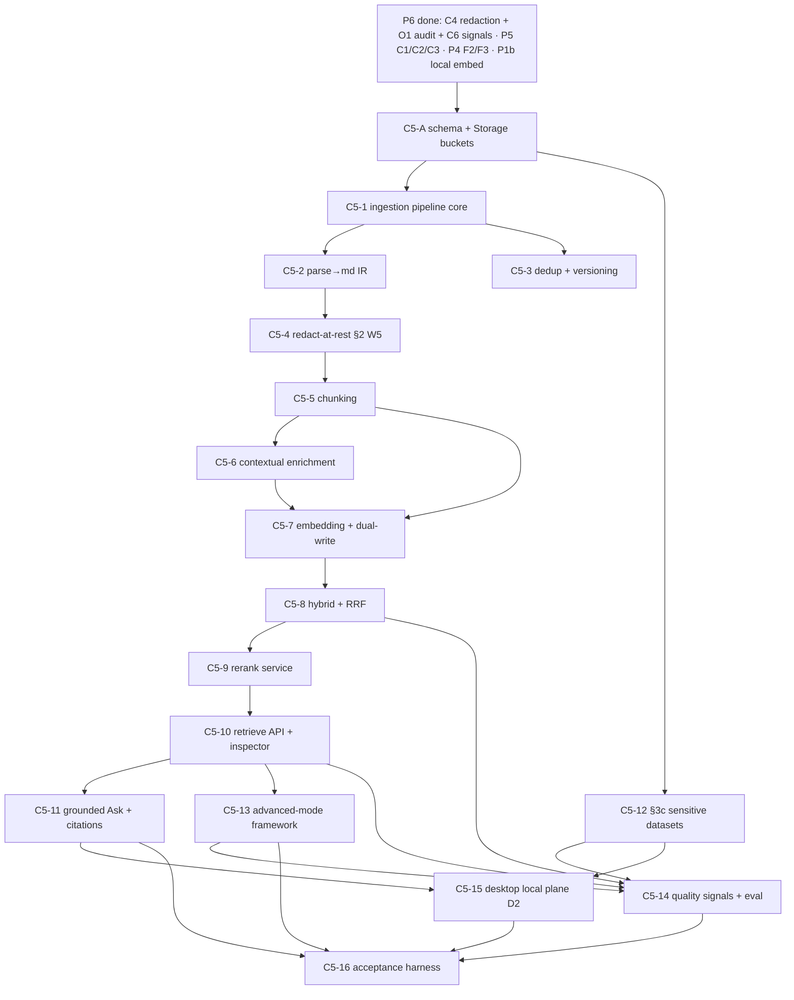

# Phase 4 (P7) · RAG + Document center (C5) — Implementation Plan

> **For agentic workers:** REQUIRED SUB-SKILL: `superpowers:test-driven-development` (TDD for all
> Rust/service code) and `superpowers:subagent-driven-development`. Features use checkbox
> (`- [ ]`) test-then-code steps. **Heavy builds (Rust `sensei-*` + ORT + DuckDB + Docling
> bindings) run via a BACKGROUND shell (controller), never inside a subagent** — the compile is
> minutes and a watchdog will kill a subagent mid-flight. Subagents WRITE code + tests; the
> controller compiles, runs models, and executes the live acceptance calls. All DB changes go
> through **dbd** (`dbd reset && dbd apply && dbd import` — no migrations pre-v1). See
> [`project_db_workflow`], [`feedback_doc_before_code`], [`feedback_regular_cleanup`].

**Goal (the P7 acceptance gate).** A tenant/space document **uploads and its ingestion status
reaches `ready`**; a **Playground query returns a grounded answer citing only chunks the caller can
access**; the **vector index holds no raw secrets** (redact-at-rest verified by scanning stored
chunks); and a **sensitive-column dataset answers an aggregate query without the model ever seeing
raw values** (§3c, executed inside the central trusted boundary).

**Architecture.** C5 runs in the central `services/gateway` Axum process (shares the `sensei-*`
engine + `GatewayStore` + auth with C1) and, on the desktop, in the D2 local gateway (Tauri
sidecar). It owns three surfaces over one substrate: **C5 core** (ingestion pipeline, composable
retrieval engine, embedding + rerank services, §3c compute, eval/signal wiring); **W2 Library** and
**W3 Playground** are the UI consumers (built in P9 — this phase delivers their backend contracts).
Every model id, chunk size/overlap, fusion weight, `k`, rerank model, threshold, parser backend,
and enabled-mode set is **operator-managed config with overridable fallback constants — never baked
into the library** ([`project-gateway-no-hardcoded-ops`]).

**Authoritative inputs.** [`../DECISIONS.md`](../DECISIONS.md) §3a/§3b/§3c + §2 W5 (source of
truth); [`../specs/C5-rag-document-intelligence.md`](../specs/C5-rag-document-intelligence.md)
(the buildable contract — tables, endpoints, traits, RLS, decisions §8); the research-backed
[`../design/rag-and-document-center.md`](../design/rag-and-document-center.md); the mockups under
`docs/mockups/app/*.jsx` (authoritative UI ground truth).

---

## Prerequisites (hard gates — confirm green before executing)

### Prior phases

| Prereq | Why C5 needs it |
|---|---|
| **P6 complete** (C4 · O1 · C6) | C4 supplies the **redaction/DLP wrapper contract** (`Redactor`, §2 W5) invoked at ingest and the **sensitive-data guard**; O1 is the immutable audit sink for declassify/dataset-policy/§3c-compute; C6 owns the **`quality_signals` contract** C5 emits into. Without P6, redact-at-rest and signal emission have no owner. |
| **P5 complete** (C1 hardened · C2 · C3) | C1 provides gateway-mediated privileged-write RPC (`/rpc/*`), embedding-chain execution, grounded generation + SSE, and JWT/`api_keys` auth; C2 resolves the embedding chain per space/role; C3 meters every embed/rerank/caption/judge/§3c-synthesis call on the single `inference_calls` ledger (no unmetered cloud spend). |
| **P4 complete** (F2 · F3) | F2 supplies the canonical capability set + JWT claims (C5 **requests F2 add** `doc.write`, `doc.delete`, `retrieval.manage`, `dataset.manage`, `dataset.compute`); F3 supplies the **per-tenant DEK** for §3c field-level column encryption + credential vault. |
| **P3 complete** (F1-rework) | The reworked schema — space+classification ACL (group-ACL retired), `document_embeddings` re-pointed to it and fixed to `vector(1024)`, `structured_datasets`/`dataset_columns` (RW15), catalog + config-read grants, `quality_signals` store. C5-A only *extends* this; it does not re-lay foundations. |
| **P1b** (embedded local) | The 1024-dim **embedded in-process** embed path (`EmbeddedLlamaAdapter` GGUF / `OrtAdapter` ONNX, no daemon) that the on-device local plane (C5-P) and sensitive `plane_pin='local'` datasets bind to. |

### Crate issues (gateway-repo; see [`gateway-issues.md`](gateway-issues.md))

- **GH-8 — rerank = C5 service, NOT a crate change (confirmed).** `TextRerank` is a reserved
  `Unsupported` variant; C5 runs cross-encoder rerank as a **separate in-process service** behind
  the provider-agnostic `RerankProvider` trait. No blocking gateway issue is filed by C5. A
  `RerankModel` gateway trait is a later optional issue only.
- **GH-3 — resolved (no crate change).** Local embedding via `EmbeddedLlamaAdapter`/`OrtAdapter`;
  wire a 1024-dim embed model into the embedding chain; `fastembed` disabled.
- **GH-1 (already released by P2b)** — per-step `plane` on the trace; reused so a sensitive
  dataset's steps and local-plane retrieval pin `plane=local` in the trace.
- **GH-5 (F1/C3)** — `inference_calls` node-attribution shape; C5's calls meter here.
- **GH-6 (C4-owned, investigate)** — streaming-safe redaction hook. C5's redact-**at-rest** does
  **not** depend on it (it runs synchronously at ingest); only C4's retrieved-context
  redact-in-flight on the streamed answer does. C5 ships regardless.

### Front-loaded human/infra inputs (obtain BEFORE the feature that needs them)

| Input | Needed by feature | Notes |
|---|---|---|
| **Supabase Storage buckets** provisioned — per-tenant/space-scoped, encrypted at rest, signed-URL policy | **C5-A / C5-1** | Originals + normalized artifacts live here; access via short-lived server-minted signed URLs after the RLS/classification check. This is an infra provisioning step, not code. |
| **Parser backend available** — self-hosted **Docling** (default) reachable from the gateway host (+ desktop footprint for D2) | **C5-2** | Operator-selectable; cloud parsers (LlamaParse-class) that egress content are gated behind per-tenant policy, data-locality default = self-hosted. Docling covers PDF/DOCX/PPTX/XLSX/HTML/images. |
| **OCR + VLM models** — Tier-1 CPU OCR (PaddleOCR/Tesseract) present; Tier-2 VLM OCR (olmOCR/Qwen-VL-class) + captioning VLM endpoint or local model selected | **C5-2** | Confidence thresholds + model choice are operator config. Tier-0 (skip when a clean text layer exists) needs no model. |
| **Rerank model weights** — `BAAI/bge-reranker-v2-m3` (Apache-2.0) + ONNX Runtime available for self-hosted default | **C5-9** | Avoid Jina v2 base weights (CC-BY-NC) in the paid product. Cohere/Voyage Rerank are opt-in managed alternatives (per-tenant). |
| **PII/secret detectors** — vetted libs wired via the C4 `Redactor` contract: regex+entropy+checksum layer + transformer NER (GLiNER-class ONNX / Presidio+GLiNER) | **C5-4** | Owned by C4 (§2 W5); C5 invokes it at ingest. "Vetted libraries, not hand-rolled regex." |
| **Paid-provider-call approval (reconfirm)** for contextual-enrichment LLM, image captioning VLM, LLM-judge, and any cloud embed/parse | **C5-6 / C5-2 / C5-14** | Reconfirms the §4 roadmap paid-call authorization; skeleton uses one sanctioned key + a cheap model + prompt caching. Cost is bounded by size/change-gating (C5-6). |
| **Versioned eval test set** — human-golden + RAGAS/ARES synthetic + production-mined failures, **per-tenant segregated + anonymized** | **C5-14** | Test sets carry tenant content → access-controlled, anonymized before promotion to shared suites. |

---

## Scope boundary (v1 / this phase)

**In P7 (built):** markdown-first ingestion (all listed formats → md + assets, originals kept);
content-hash dedup + versioning/lineage + stale-chunk retirement; redact-at-rest (one-way
placeholders); structural/semantic chunking + parent-document overlay; 1024-dim embedding chain;
**the DEFAULT retrieval stack fully** (hybrid dense+BM25 RRF → contextual → cross-encoder rerank
service → grounded+cited); the **composable per-space mode framework + selector + inspector**
backing contracts; query transforms (conversational rewrite always; HyDE/step-back/decomposition
feature-gated); **SQL-RAG / §3c** sensitive-data compute fully; quality-signal + offline-eval
wiring; the desktop local plane (D2 IPC).

**In P7 but sequenced last, behind the feature-gate (C5-13):** GraphRAG (**LazyGraphRAG** as the
first concrete engine), RAPTOR, ColBERT/multi-vector, agentic retrieve→reason→re-retrieve — the
**governance + selector + provider-agnostic interface land in this phase**; the heavy engines are
built as scoped feature-gated additions after the default stack proves out (LazyGraphRAG first).
This conforms to DECISIONS §3a ("selectable per space") and design §11 ("scheduled after the
default stack proves out").

**Out of scope for v1 (design-only screens / v2 runtime — DECISIONS §3a):** collaborative editing,
comments, corrections, agent-driven chat-to-edit, `document_collaborators`; the
interaction-intelligence go-between (§3b); reversible un-redaction (v1 one-way only); richer §3c
privacy (differential privacy, format-preserving tokenization); page-as-image (ColPali) retrieval;
**ColBERT storage-premium** billing (the ~2–4x per-tenant premium must be modeled into quota by
C3/O2 before it ships — gate documented, not built here).

---

## Features

Each feature edits code with tests-first (TDD) or `.ddl`/policy/seed files (dbd) and is
independently testable. Layers, dependencies, the governing decision, **observable** acceptance
criteria, and **Given/When/Then** scenarios are stated per feature.

### C5-A — Schema addenda + Storage buckets (dbd)
- **Layers:** DDL → RLS → grants → seed → object-storage config
- **Depends on:** F1-rework (P3: base doc-center tables, `structured_datasets`/`dataset_columns`, `vector(1024)` fix); Supabase Storage provisioned
- **Decision:** DECISIONS §5 "Document center" + §3c; C5 spec §3.
- **Note:** P3 already built `documents`/`document_collections`/`document_versions`/`document_assets`/`document_embeddings` and the dataset tables. This feature **extends** them with C5-specific columns/indexes/config that the spec requires but the rework did not fully land — it does not re-create them.
- **Acceptance criteria:**
  - `documents` carries `scope` (`org|space|individual`), `owner_id`, `content_hash` (SHA-256), `current_version_id`, `status` (`queued|parsing|chunking|embedding|ready|failed`), `status_reason`, `collection_id` (nullable); a partial index enforces one non-superseded current version per doc.
  - `document_assets` carries `kind` (`original|ir_json|markdown|table_csv|image|caption`), `storage_uri`, `content_hash`, `bytes`, `page_ref`, `bbox jsonb`, `caption`; originals are immutable + hash-addressed.
  - `document_embeddings` carries `parent_chunk_id`, `chunk_text`, `contextual_prefix`, `embedding vector(1024)` (HNSW), `tsv tsvector` (GIN), `section_path`, `char_offset`, `page_ref`, `bbox jsonb`, `element_type` (`prose|table|caption`), `redaction_count`; the ACL predicate is space-membership + 4-level classification (group-ACL absent).
  - Per-space **retrieval + chunking config** JSON persisted on `spaces`/`settings` (mode, fusion weights, chunker + params, enabled advanced modes, rerank model, contextual on/off, top-k) with documented default constants.
  - Storage buckets are tenant/space-scoped; a server-side function mints short-lived signed URLs only after the RLS/classification check.
  - RLS: all C5 tables `tenant_id`-scoped + composite FK; privileged columns (`documents.classification`, retrieval-config, dataset sensitivity) are `service_role`-write-only; `authenticated` gets scoped SELECT + self-owned benign writes (own draft doc metadata).
- **Test scenarios:**
  - Given `dbd reset && dbd apply && dbd import`, When it completes, Then all C5 columns/indexes exist and `tests/rls.sql` passes for the C5 tables.
  - Given an `authenticated` member, When they `UPDATE documents SET classification='public'` or write a retrieval-config row directly, Then denied (service_role only); When they read their own space's docs, Then rows return under the classification predicate.
  - Given a query embedding, When `similarity_search` runs, Then it executes at 1024 dims (no dimension mismatch) constrained by the tenant+space+classification filter.

### C5-1 — Ingestion pipeline core (register → upload → status state machine)
- **Layers:** HTTP handlers → status state machine → Realtime/SSE events
- **Depends on:** C5-A
- **Decision:** C5 spec §4.1/§6.1; design §2.1.
- **Acceptance criteria:**
  - `POST /v1/documents` registers a doc + returns a signed upload URL + `version_no`; client PUTs original bytes; `POST /v1/documents/:id/ingest` starts/resumes the pipeline; `POST .../reingest?from=<stage>` re-runs idempotently; `GET /v1/documents/:id` returns metadata + status + `status_reason` + versions; `GET .../assets` lists signed asset refs; `DELETE` soft-deletes + retires chunks (capability `doc.delete`).
  - The status machine advances `queued→parsing→chunking→embedding→ready`, each stage **idempotent** and **persisted**; any failure sets `failed` + a machine-readable `status_reason`.
  - Each transition emits one event on the RLS-scoped Realtime channel `documents:<space_id>` (`{document_id, status, status_reason, stage_ms}`), also available via `GET /v1/documents/:id?watch=1` SSE.
- **Test scenarios:**
  - Given a registered doc with uploaded bytes, When `/ingest` runs to completion, Then `status` walks each stage in order and ends `ready`, each transition observed on the Realtime channel.
  - Given a forced parse failure, When `/ingest` runs, Then `status='failed'` with a non-empty `status_reason`, and `/reingest` recovers it.
  - Given `/reingest?from=chunking` on a `ready` doc, When invoked twice, Then the second run is a no-op-equivalent (idempotent) with no duplicate chunks.

### C5-2 — Parse → markdown-first canonical IR (DocumentParser)
- **Layers:** Rust trait + Docling backend → asset export → tiered OCR → captioning
- **Depends on:** C5-1; Docling + OCR/VLM available
- **Decision:** C5 spec §4.3/§8.4/§8.5; design §2.2/§2.3.
- **Acceptance criteria:**
  - `trait DocumentParser { fn parse(bytes,mime,opts) -> Result<DocIR> }` with **Docling default**, operator-selectable backend; parses PDF/DOCX/PPTX/XLSX/HTML/images into an IR (reading order, heading hierarchy, tables-as-cells, figures+captions, page numbers, bboxes).
  - Exports per document, into `document_assets`: the **original** (immutable), **IR JSON**, normalized **markdown**, **one CSV per table** (tables never split across chunks), and **captioned image assets** (VLM caption stored as indexable text + a reference to the image crop).
  - OCR is **tiered + confidence-routed**: Tier-0 skip when a clean text layer exists; Tier-1 CPU OCR for clean scans; Tier-2 VLM OCR for mid-confidence/known-hard; a layout pass always runs before chunking. Thresholds + models are operator config.
- **Test scenarios:**
  - Given a PDF with a table and a figure, When parsed, Then `document_assets` holds md + a table CSV (cell-accurate, not column-linearized) + a captioned image asset + IR JSON, and the original is retrievable.
  - Given a scanned image-only PDF, When parsed, Then OCR escalates to the configured tier and produces structured md (not just raw text).
  - Given a space configured to a non-Docling backend, When a doc is parsed, Then the selected backend is used (asserted: no code change, config only).

### C5-3 — Dedup (content-hash) + versioning / lineage / stale-chunk retirement
- **Layers:** hash on upload → version rows → atomic chunk retirement
- **Depends on:** C5-1
- **Decision:** C5 spec §6.2/§8; design §2.4.
- **Acceptance criteria:**
  - SHA-256 computed on upload (document granularity; chunk-granularity hashes stored too), **strictly tenant-partitioned**; exact-hash match → idempotent no-op linking the existing doc.
  - Changed bytes for an existing doc → new `document_versions` row (history kept); on the new version reaching `ready`, the prior version's chunks are **atomically retired** (`superseded_at` set) so the index never holds contradictory content.
  - Dedup runs **before** chunking (so chunk→source association is preserved).
- **Test scenarios:**
  - Given identical bytes re-uploaded, When ingested, Then no duplicate chunks are created (idempotent link).
  - Given changed bytes for an existing doc, When ingested to `ready`, Then a new `document_versions` row exists and a retrieval returns **no** stale-version chunks (`superseded_at` set on the old ones in one transaction).

### C5-4 — Redact-at-rest before embedding (§2 W5)
- **Layers:** pipeline stage (post-parse, pre-embed) invoking the C4 `Redactor` contract
- **Depends on:** C5-2; C4 (P6) redaction/DLP wrapper; C6 `quality_signals`
- **Decision:** DECISIONS §2 W5; C5 spec §5/§8.7; design §2.5.
- **Acceptance criteria:**
  - After parse and **before embedding**, normalized markdown is passed through the C4 `Redactor` (layer-1 regex+entropy+checksum, layer-2 transformer NER — vetted libs); redaction is **one-way placeholders only — no reversible mapping store anywhere** (v1).
  - Stored `document_embeddings.chunk_text` (and the embedded/indexed text) contain **placeholders only**, never raw secrets/PII; `redaction_count` is recorded per chunk.
  - Detected **active secrets are flagged for rotation** (not merely masked); every redaction emits a `quality_signals` row; redaction/audit logs are themselves scrubbed.
- **Test scenarios:**
  - Given a document containing a live API key + an email + an SSN, When ingested, Then scanning stored chunks finds **placeholders only** (no raw secret/PII), the secret is flagged for rotation, and a `quality_signals` redaction row exists.
  - Given the reworked schema, When enumerated, Then **no reversible redaction-mapping table/row exists** (v1 one-way).
  - Given the redaction stage errors, When ingesting, Then the pipeline **fails closed** (does not embed unredacted text) with `status='failed'`.

### C5-5 — Chunking (structural/semantic + parent-document overlay)
- **Layers:** `Chunker` trait → per-space config
- **Depends on:** C5-2
- **Decision:** C5 spec §4.3/§8.6; design §3.
- **Acceptance criteria:**
  - `trait Chunker { fn chunk(ir,cfg) -> Result<Vec<Chunk>> }`; **default = structural/semantic (layout-first, two-stage)**: chunk along headings/sections keeping the H1>H2>H3 `section_path`, token-capped (default 512 tokens, 10–20% overlap); **tables chunked whole**; **parent-document overlay** (embed/search small children, feed larger parents; children-per-parent capped so top-K doesn't collapse).
  - Strategy + params (size, overlap, `parent_chunk_id` linkage) are read from per-space config; the full strategy menu (fixed/recursive/structural/semantic/sentence-window/parent/proposition/late) is selectable, structural default.
- **Test scenarios:**
  - Given a structured doc, When chunked with the default, Then each chunk carries `section_path`, `char_offset`, and `parent_chunk_id`; a table is one chunk (never split).
  - Given a space with `chunk_size=256`, When re-ingested, Then chunk sizes change with **no code change** (config-only).

### C5-6 — Contextual chunk enrichment (index-time, default-on, change-gated)
- **Layers:** pipeline stage → cheap-model call + prompt caching
- **Depends on:** C5-5; paid-provider approval; C3 metering
- **Decision:** C5 spec §8.3; design §2.6.
- **Acceptance criteria:**
  - A short (~50–100 token) LLM blurb situating each chunk in its parent is generated and stored in `contextual_prefix`; the enriched text feeds **both** the embedding model and the BM25 `tsv`.
  - **Default-on above a size threshold**, per-space overridable; skipped for very small corpora (whole-doc-in-context); re-contextualized **only on `content_hash` change** to bound churn cost; runs a cheap model + prompt caching; enrichment calls are metered (C3).
- **Test scenarios:**
  - Given a heterogeneous corpus above the threshold, When ingested, Then chunks have a non-empty `contextual_prefix` used in both index legs.
  - Given a re-ingest with unchanged bytes, When it runs, Then no re-contextualization occurs (change-gated).
  - Given a space that disables contextual enrichment, When ingested, Then `contextual_prefix` is empty (config-only).

### C5-7 — Embedding (chain-managed, 1024-dim, dual-write dense+lexical as one unit)
- **Layers:** embedding-chain invocation → transactional dual-write
- **Depends on:** C5-5/C5-6; embedding chain (C2/P5, P1b local)
- **Decision:** DECISIONS §3 (capabilities chain-managed); C5 spec §7.1/§7.3/§8.1; design §5.
- **Acceptance criteria:**
  - Embedding is invoked as a **chain-managed capability** (`EmbedModel`, same fallback/circuit-breaker/per-step-plane machinery as chat), **1024-dim**, capability per-model (`model_capabilities.embed`); desktop local = embedded in-process (`EmbeddedLlamaAdapter`/`OrtAdapter`, no daemon); `fastembed` disabled.
  - Any add/update/delete of a chunk writes **both** the `embedding vector` and the `tsv` in **one transaction** (no stale sparse index — the most common hybrid bug).
- **Test scenarios:**
  - Given a chunk insert/update/delete, When committed, Then both the vector and `tsv` reflect it atomically (dual-write test); a forced failure rolls back both.
  - Given a 1024-dim embed model bound in the embedding chain, When embedding runs, Then vectors are 1024-dim and metered on `inference_calls`.

### C5-8 — Retrieval engine: hybrid dense+BM25 + RRF fusion
- **Layers:** `RetrievalEngine` trait → dense (pgvector ANN) + BM25 (Postgres FTS) legs → RRF fuse
- **Depends on:** C5-7
- **Decision:** C5 spec §6.3/§8.1; design §4.1/§4.2.
- **Acceptance criteria:**
  - `trait RetrievalEngine { async fn retrieve(space,q,cfg) -> RetrieveResult }`; runs a **dense** (pgvector ANN) leg and a **BM25** (Postgres FTS `ts_rank_cd` over `tsv`/GIN) leg under a **hard tenant+space+classification filter**, then **RRF-fuses** (`score = Σ 1/(k+rank)`, `k=60` default, operator config); retrieve ~100–150 candidates.
  - The BM25 leg uses the single-store `tsvector`/GIN (spec decision §8.1); a native-hybrid store swap stays behind the trait (later).
- **Test scenarios:**
  - Given a query with an exact identifier + a paraphrased concept, When retrieved, Then the fused result surfaces both the lexical exact-match and the dense concept-match (hybrid beats either leg).
  - Given a tenant-A member with an adversarial near-duplicate of a tenant-B chunk, When retrieved, Then **zero** tenant-B chunks return (cross-tenant recall = 0; hard per-tenant filter).

### C5-9 — Cross-encoder rerank SERVICE (GH-8)
- **Layers:** `RerankProvider` trait → self-hosted BGE (ORT) default + hosted opt-in → adaptive gating
- **Depends on:** C5-8; BGE weights + ORT
- **Decision:** DECISIONS §3 (rerank = C5 service); C5 spec §7.2/§8.2; design §6.
- **Acceptance criteria:**
  - `trait RerankProvider { async fn rerank(query,cands,top_k) -> Vec<Ranked> }`, provider-agnostic; **default self-hosted `BAAI/bge-reranker-v2-m3` via ORT** (in-boundary, ~50–100ms); Cohere/Voyage opt-in per tenant/route; **no crate change** (TextRerank stays `Unsupported`).
  - **Two-stage:** retrieve ~100–150 → rerank → keep top ~10–20. **Adaptive:** fast mode (no rerank) default for easy queries; deep mode triggered by low retrieval confidence / high-risk intent / explicit citation requests.
  - Rerank model is operator config; deployment gated on NDCG@k_final, recall pre-vs-post rerank, and p95/p99 latency (C5-14 metrics).
- **Test scenarios:**
  - Given a candidate set where the answer chunk is at rank 7, When reranked, Then it rises into the top-k (precision improved).
  - Given a route where NDCG is flat with rerank on, When measured, Then the operator can disable rerank on that route (config-only).
  - Given the rerank model set to a hosted provider, When invoked, Then tenant chunks route per policy (data-residency respected for the self-hosted default).

### C5-10 — Retrieve API + retrieval inspector
- **Layers:** HTTP → assembly + per-stage instrumentation
- **Depends on:** C5-9
- **Decision:** C5 spec §4.1; design §10.
- **Acceptance criteria:**
  - `POST /v1/spaces/:space_id/retrieve` runs conversational rewrite (multi-turn) → hybrid legs → RRF → rerank → assemble ~6–10 chunks (must-include-top + dedupe); returns per-chunk `scores:{dense,bm25,fused,rerank}` and per-stage `{name,k_in,k_out,recall_at_k?,ms}`.
  - With `inspect:true` it returns **dropped candidates** + per-stage timings; `session_only:true` applies a member override without persisting; `GET/PUT /v1/spaces/:id/retrieval-config` reads/promotes the space default (`PUT` requires `retrieval.manage` via C1 RPC).
- **Test scenarios:**
  - Given `inspect:true`, When retrieve runs, Then the response includes dropped candidates + per-stage k_in/k_out/ms and the config_used.
  - Given a member with `session_only:true`, When they override the mode, Then `spaces`/`settings` are unchanged; When they `PUT` without `retrieval.manage`, Then denied.

### C5-11 — Grounded Ask integration (C1/C4 orchestration + citations)
- **Layers:** C1/C4 call C5 retrieve → grounded generation → `message_citations`
- **Depends on:** C5-10; C1/C4 (P5/P6)
- **Decision:** C5 spec §4.1/§6.3; design §4.2.
- **Acceptance criteria:**
  - C5 does **not** own generation: C1 calls `/v1/spaces/:id/retrieve`, C4 runs redact-in-flight + grounded-generation guardrails, C1 streams the answer over SSE and persists `messages` + `message_citations`.
  - Each `message_citation` resolves to a real `document_embeddings` chunk + (where the parser preserved coords) a `document_assets` bbox **evidence-pin**; citations resolve to **accessible documents only** (classification/space filter applied at retrieval).
- **Test scenarios:**
  - Given a grounded Ask, When answered, Then every citation resolves to a real chunk the caller can access; a chunk above the caller's clearance is never cited.
  - Given a chunk with bbox coords, When cited, Then the citation carries a resolvable evidence-pin.

### C5-12 — Sensitive structured data §3c (schema-to-LLM, execute-in-app)
- **Layers:** dataset ingest → schema/sensitivity → field encryption (F3) → SecureExecutor → guardrail pipeline → k-anon gate
- **Depends on:** C5-A; F3 DEK (P4); C4 sensitive-data guard; C3 metering
- **Decision:** DECISIONS §3c; C5 spec §4.1/§6.4/§7.4/§8.8; design §7.
- **Acceptance criteria:**
  - `POST /v1/datasets` ingests CSV/XLSX or promotes an extracted table (multi-table split into logical tables); `POST /v1/datasets/:id/schema` (re)classifies column `sensitivity` (`public|internal|sensitive|restricted`) with `stats` for non-sensitive columns only (capability `dataset.manage`).
  - **Sensitive/restricted columns are field-encrypted per-tenant (F3 DEK)**, decryptable only inside the trusted boundary (central `service_role` or, for `plane_pin='local'`, on-device). The LLM receives **schema + non-sensitive metadata/aggregates only** — never raw sensitive rows.
  - `POST /v1/datasets/:id/compute` (capability `dataset.compute`): schema-linking prune → LLM emits a plan (text-to-SQL/formula) → **fail-closed guardrail pipeline**: SQL AST allow `SELECT` only (reject DDL/DML/multi-statement/dynamic/procs/unresolved refs) → policy check vs tenant catalog → `SecureExecutor` (read-only DuckDB over CSV/Parquet in-boundary: statement timeout, row/cost caps, no fs/network) → **aggregate / k-anonymity gate** (suppress groups < k) → **W5 redaction check** → return derived result only.
  - Returns `{plan, result, k_anon_ok, suppressed_groups, redactions, executed_plane}`; `plane_pin='local'` datasets execute on-device; every compute emits an audit event (O1) + a `quality_signals` row.
- **Test scenarios:**
  - Given a dataset with a `sensitive` salary column, When asked "average salary by department", Then the response is an aggregate with **no raw salary value**, and (verified) the LLM prompt contained only schema + non-sensitive metadata.
  - Given an LLM plan containing a non-SELECT statement, When executed, Then it is **rejected fail-closed** (no execution).
  - Given a group below the k-anon threshold, When computed, Then that group is suppressed (`suppressed_groups > 0`).
  - Given `plane_pin='local'`, When computed on the desktop, Then `executed_plane='local'` and raw values never leave the machine.

### C5-13 — Composable advanced-mode framework (feature-gated per space)
- **Layers:** mode registry behind `RetrievalEngine` → 4-state governance → query transforms → LazyGraphRAG (first concrete advanced engine)
- **Depends on:** C5-10; C4/O3 feature governance (4-state)
- **Decision:** DECISIONS §3a/§4; C5 spec §6.5/§8.9; design §4.3/§11.
- **Acceptance criteria:**
  - The **default stack ships enabled**; **GraphRAG/RAPTOR/ColBERT/SQL-RAG/agentic + HyDE/step-back/decomposition are feature-gated per space** via 4-state governance (workspace→space→role→user); members' Playground experiments are session-only, admins/space-owners set defaults.
  - Each advanced mode is a pluggable implementation behind the `RetrievalEngine` interface, selectable via per-space config (no-hardcoded-ops); **query transforms** (conversational rewrite always-on; HyDE/step-back/decomposition routed by query type) built.
  - **GraphRAG = LazyGraphRAG** (index cost ≈ vector RAG, ~700x cheaper queries), per-tenant graph namespace partition, sequenced **after** the default stack proves out (first concrete advanced engine); RAPTOR/ColBERT/agentic land behind the same interface; **ColBERT multi-vector storage premium is deferred** to C3/O2 quota modeling before it ships.
- **Test scenarios:**
  - Given a space with GraphRAG off (default), When a member enables it in Playground, Then it applies **session-only** and `spaces`/`settings` are unchanged; When an admin promotes it, Then the space default changes via C1 RPC (`retrieval.manage`).
  - Given HyDE enabled for a vocabulary-gap space, When a query runs, Then the transform is applied and visible in the inspector; When latency-critical chat runs, Then expensive transforms are skipped by the query-type router.
  - Given LazyGraphRAG enabled, When a global "connect-the-dots" query runs against a tenant's graph namespace, Then results never cross the per-tenant partition.

### C5-14 — Quality signals + evaluation wiring (§3b / §8)
- **Layers:** signal emission per stage → offline eval CI harness → online OTel + sampled judge
- **Depends on:** C5-8..C5-13; C6 `quality_signals` contract (P6); versioned eval set
- **Decision:** DECISIONS §3b; C5 spec §4.4/§8; design §8.
- **Acceptance criteria:**
  - Every retrieve/redact/compute writes a `quality_signals` row keyed to `inference_calls`/`messages`: retrieval recall@k/precision@k/MRR/**nDCG@k**, rerank NDCG + recall pre-vs-post, **grounding/faithfulness** (context-recall canary), LLM-judge quality (bias-controlled — order-swap, never generator judging itself unblinded), cost, latency, fallbacks, guardrail/**W5 redaction** hits + §3c compute events, and the "why this model" trace. Routes to C6 (or, if C6 not ratified, C4-capture/O1-audit/O2-analytics — spec §8.10).
  - An **offline eval suite** runs the metric set on the **versioned test set in CI** and gates config/model swaps on regression thresholds; online emits **OpenTelemetry** traces + sampled LLM-judge scoring on live traffic; test sets/traces are per-tenant segregated + anonymized before promotion.
  - These signals back the W3/Ask **live meters** (grounding/quality/cost/latency), the quality-judge toggle, and auto-tune-prompt (surfaces built in P9).
- **Test scenarios:**
  - Given a retrieval, When it completes, Then a `quality_signals` row with recall/precision/NDCG/grounding/cost/latency exists keyed to the call.
  - Given a model/config swap in CI, When the offline eval regresses past threshold, Then the swap is gated (build fails / promotion blocked).
  - Given the judge, When it scores, Then candidate order is swapped+averaged and the generating model does not judge itself unblinded.

### C5-15 — Desktop local plane (D2 IPC)
- **Layers:** Tauri IPC commands → on-device ingest/retrieve/compute
- **Depends on:** C5-1..C5-12; D2 (P1b embedded engine)
- **Decision:** C5 spec §4.2/§6.7; design §5/§7.
- **Acceptance criteria:**
  - `c5_ingest_document`, `c5_document_status`, `c5_retrieve`, `c5_dataset_compute` mirror the HTTP shapes and run ingestion, embedding (`EmbeddedLlamaAdapter`/`OrtAdapter`, in-process, no daemon), retrieval, and §3c compute **entirely on-device**; sensitive datasets never leave the machine; traces pin `plane=local` (GH-1).
- **Test scenarios:**
  - Given the network off, When a doc is ingested + queried on the desktop, Then it reaches `ready` and returns a grounded local answer (`plane=local`).
  - Given a `plane_pin='local'` sensitive dataset, When computed on-device, Then raw values never egress and `executed_plane='local'`.

### C5-16 — Phase acceptance harness (the P7 gate)
- **Layers:** integration tests + a live end-to-end script
- **Depends on:** C5-1..C5-15
- **Decision:** roadmap P7 acceptance gate; C5 spec §9.
- **Acceptance criteria:**
  - A test-suite + a documented live script proves the four gate conditions end-to-end; the live paid-call portions are `#[ignore]`/opt-in (cost + secrets). Runs in CI (deterministic parts) with the live parts behind a flag.
- **Test scenarios (the gate, verbatim):**
  - Given a PDF/DOCX/PPTX/XLSX/image, When uploaded + ingested, Then `documents.status` reaches `ready`.
  - Given a space with accessible + inaccessible docs, When a Playground query runs, Then the grounded answer cites **only accessible chunks**.
  - Given a doc containing secrets, When ingested, Then scanning the vector index finds **no raw secrets** (redact-at-rest verified).
  - Given a sensitive-column dataset, When an aggregate query runs, Then it answers **without the model seeing raw values** (§3c, central boundary).

---

## Dependency graph

**Suggested build order (default stack first, per design §11):**

1. **C5-A** (schema + buckets) — unblocks everything.
2. **C5-1 → C5-2 → C5-3** (ingest core → parse → dedup/versioning) — the document center substrate.
3. **C5-4** (redact-at-rest) — must land **before** any embedding runs (security gate).
4. **C5-5 → C5-6 → C5-7** (chunk → contextual → embed+dual-write).
5. **C5-8 → C5-9 → C5-10 → C5-11** (hybrid → rerank → retrieve API/inspector → grounded Ask) — the **DEFAULT stack**, provable end-to-end here.
6. **C5-12** (§3c sensitive datasets) — parallelizable after C5-A; land before the gate.
7. **C5-14** (quality signals + eval) — wire as C5-8..C5-13 land (contract-first with C6, per roadmap §5.5).
8. **C5-13** (advanced-mode framework + query transforms; **LazyGraphRAG last**) — after the default stack proves out.
9. **C5-15** (desktop local plane) — mirrors the central path on-device.
10. **C5-16** (acceptance harness) — proves the P7 gate; `make clean` + push `develop`.

---

## Self-review notes (author)

- **Spec coverage (C5 §2 responsibilities → features):** ingest/normalize (C5-1/C5-2), redact-at-rest (C5-4), chunk (C5-5), embed (C5-7), retrieve default stack (C5-8/C5-9/C5-10), rerank service (C5-9), §3c compute (C5-12), dedup+version (C5-3), signals/audit (C5-14), inspector (C5-10), advanced modes (C5-13), desktop (C5-15). All ten §2 responsibilities + all §9 acceptance blocks are covered; the four-part P7 gate is C5-16.
- **Decisions honored (no TBDs):** BM25 = Postgres FTS single-store (spec §8.1); rerank = in-process ORT BGE service (§8.2, GH-8, no crate change); contextual default-on + change-gated (§8.3); Docling default parser (§8.4); tiered OCR (§8.5); structural chunking default (§8.6); one-way redaction, no mapping store (§8.7, DECISIONS §2 W5); DuckDB read-only SELECT-only executor + k-anon (§8.8); advanced modes feature-gated, LazyGraphRAG first (§8.9); C6-contract-first with C4/O1/O2 fallback (§8.10); ColBERT storage premium deferred to C3/O2 (§8.11). The design-doc "open questions" §11 that were genuinely open are resolved by the spec §8 decisions this plan builds to; the residual spec §11 open questions (managed-Postgres BM25 quality, Realtime-vs-SSE at scale, desktop VLM footprint, LazyGraphRAG namespace infra, §3c semantic layer, re-contextualization cost accounting) are **operational tuning knobs behind config/interfaces, not build blockers** — each has a shipped default + a swap point behind a trait.
- **Prerequisite chain:** P6 (redaction/audit/signals owners), P5 (embedding chain + metering + RPC), P4 (capabilities + F3 DEK), P3 (schema), P1b (embedded local), Supabase Storage, GH-8 (confirmed, no crate change). No new **blocking** gateway issue introduced.
- **Security invariants:** redact-at-rest is fail-closed before embedding (C5-4); cross-tenant recall = 0 via hard per-tenant index filter (C5-8); §3c model never sees raw values + fail-closed guardrails + k-anon (C5-12); privileged writes are `service_role`-only via C1 RPC (C5-A/C5-10). These are the operational/architectural gate ([`feedback_review_gate_operational`], [`project-gateway-no-hardcoded-ops`]).
- **Deferred (flagged, v2 / later):** collaborative editing runtime + `document_collaborators` (design-only screens, X2 v2); interaction-intelligence go-between; reversible un-redaction; differential privacy / format-preserving tokenization; page-as-image (ColPali); ColBERT storage-premium billing (C3/O2 quota model first).
- **Biggest risks:** (a) managed-Supabase FTS ranking quality as the BM25 leg — mitigated by the single-store default + a `RetrievalEngine` swap to ParadeDB `pg_search` / native-hybrid store if hybrid recall disappoints; (b) Docling + OCR/VLM + ORT footprint on the desktop local plane (C5-15) — operator-config model choice + tiered OCR bound it; (c) re-contextualization cost on churny corpora — bounded by size-threshold + change-gating (C5-6) and metered (C3); (d) the C4 `Redactor` contract must be finalized in P6 before C5-4 (hard prereq).
