# Phase 4a · Admin Portal (W1) — Implementation Plan

> **For agentic workers:** REQUIRED SUB-SKILLS: `superpowers:test-driven-development`, `superpowers:subagent-driven-development`, `command-system-rokkit` / `rokkit-components` / `semantic-styles-rokkit` (this is a Rokkit Svelte-5 app), and `sensei:tauri-playwright-testing` patterns for the E2E layer (SvelteKit web here, not Tauri, but the globalSetup/test-mode caveats transfer). Steps use checkbox (`- [ ]`) syntax. **W1 owns NO F1 schema and authors NO DDL** — there is no `dbd` step in this phase; all tables/RLS are already delivered by F1-rework (P3). W1 introduces **no new server endpoint**: every write is a call to an already-specced C1 `/rpc/*` (or `/v1/*` domain-RPC) endpoint; every read is a tenant-scoped PostgREST `SELECT` under RLS or a masked C1 GET. Svelte components are authored by subagents; **heavy/long commands (E2E against a running C1 + Postgres, full `bun run build`) run via a BACKGROUND controller shell**, not inside a watchdog-limited subagent.

**Goal (acceptance gate — DECISIONS/roadmap P8):** An admin, in the deployed `apps/admin` portal, **connects a router** (OAuth-connect Anthropic or paste a BYOK key), **defines a routing chain** (with per-step plane + a space×role binding), **sets a budget tree** (hard/soft nodes), **sets a governance policy** (masking/DLP + grounded-only), and **issues a reveal-once API key** — **all via C1 `/rpc/*`** (never a direct PostgREST write to a privileged table) — and the very next inference call routed through the gateway **enforces** the connection, chain, budget, governance policy, and key. Every hidden-for-capability control, invoked directly, returns `403` from C1 (the UI gate is never the only gate).

**Architecture:** `apps/admin` is a **SvelteKit + Rokkit** SPA/SSR client (scaffolded in P0 on Rokkit + Kavach client session; boots today at `:5273`). It is **a client, not a trust boundary**: it renders the ratified admin surface, gates controls by the caller's **server-resolved** capability set (from `GET /v1/whoami`) for UX only, and routes every privileged mutation through a single typed **data-access layer** (`lib/api.ts`) that (a) attaches the Supabase browser-session **RS256** JWT as `Authorization: Bearer`, (b) issues **reads** via supabase-js/PostgREST under RLS or a masked C1 GET, and (c) issues **writes** as `POST` to C1 `/rpc/*` / `/v1/*` **only**. The screens port `docs/mockups/app/admin.jsx` + its `view-*.jsx` onto W4's Rokkit named-token vocabulary, per `docs/design/mockup-review.md` §A/§B/§C. Live freshness comes from RLS-scoped Supabase Realtime channels.

**Tech stack:** SvelteKit (Svelte 5 runes) · Rokkit (W4 tokens/atoms/⌘K palette) · UnoCSS `presetRokkit` · `@supabase/supabase-js` (browser session + RLS SELECT + Realtime) · typed `fetch` client for C1 `/rpc/*` + `/v1/*` · Kavach client-only session + `@kavach/sentry` route guard · Vitest (component/unit) + Playwright (E2E) · deploy target Cloudflare Pages (`admin.strategos.sensei-hq.com`); local dev = Vite `:5273` against a running C1 (`:8787`) + Supabase.

**Reference (adapt the patterns):** the canonical UI ground truth is `docs/mockups/app/admin.jsx` + `view-{overview,requests,organization,models,routing,connections,governance,billing,onboarding}.jsx` + `shell.jsx`/`atoms.jsx`/`icons.jsx`; the new screens (Tools & MCP, Device fleet, Feature management, Spaces & KB, Alerts, Prompt library, permission-matrix, API-keys) are authored per `docs/design/mockup-review.md` §A/§B/§C (no screens invented beyond that ratified set). Token/skin porting from `app/zs.css` → W4 named vocabulary. Server contracts: C1 §4.1 (`/v1/whoami`, reads) + §4.2 (`/rpc/*` write table); C2 §4.2 (chains/bindings/simulate); C3 §4.2 (budgets/requests); C4 §4.4 (governance/features/redaction shape); F2 §4 (capabilities, device lifecycle); F3 (masked credential projection).

---

## Prerequisites & decisions (confirm before executing)

### Prior-phase prerequisites (all must be GREEN before P8 starts)
1. **P0 / W4 — build blocker (mockup-review #42).** The Rokkit **named-token map + dark skin** and the ~30 shared atoms + ⌘K palette must exist in `packages/ui`; `apps/admin` already boots on them. W1 cannot be styled without W4. This is W1's **only hard build blocker** (it files no gateway issue of its own).
2. **P4 / F2 + F3.** Full RBAC matrix + `core.capabilities` enumeration + `GET /v1/whoami` capability resolution + device lifecycle/revoke; F3 credential vault + masked-credential C1 read projection + OAuth connect/refresh (Anthropic). RS256/JWKS verify-only confirmed.
3. **P5 / C1 + C2 + C3.** C1 `/rpc/*` write surface (budgets, roles, chains, connections, governance, spaces, mcp, apikeys, models) + `/v1/whoami` + reveal-once `apikeys.create`; C2 chain resolution + `/v1/routing/{chains,steps,bindings,policy,simulate}`; C3 reserve→commit + `budget_node_status` view + `budget_requests` approve/deny.
4. **P6 / C4 + O1.** Governance/DLP policy backend (`/v1/governance/*`), `WhyThisModelTrace`, `GuardResult` (types/counts only), the redaction indicator contract; O1 `audit_events` + `execution_traces` reads.
5. **P7 / C5.** Space-config RPC (retrieval/chunking/embedding defaults) + `datasets`/`dataset_columns` column-sensitivity policy surface.
6. **GH-1 released (per-step `plane`/execution-location on the trace).** Required for the Routing per-step-plane selector + simulator plane badges + the Requests exec-location column. Until GH-1 lands, plane renders `unknown` (C4 §4.3) — but per roadmap GH-1 is released before P5, so it is available here.
7. **GH-2 released (OAuth/bearer provider credential).** Required for Connections **OAuth-connect (Anthropic)**; paste-key works without it. Released at P4.

### Later-phase backends → **STUBBED in P8, wired in P10/P11** (zero-TBD resolutions)
8. **O3 (P10) is NOT built yet → Feature management + Device fleet screens ship against the P0 swappable mock-data layer.** *Resolution:* build both screens now in full fidelity; wire the write RPCs that already exist (`/v1/governance/feature/{feature}` for 4-state — C1/C4 land at P6; `/devices/{id}/revoke` — F2 device lifecycle lands at P4), but back the **fleet listing** and the **effective-feature-resolution preview across the fleet** with the mock layer behind a single `read.*` adapter. A P10 follow-up task swaps the mock for the live O3 backend with **no screen rewrite** (the swap is a data-layer change only). Acceptance for P8 = screen renders + the already-live RPCs succeed against real tables; fleet/resolution reads served from mock and labelled `preview (backend: P10)`.
9. **X1 (P11) is NOT built yet → Tools & MCP registry/allow-list editing ships now, contract-stubbed against the mock.** *Resolution:* the registry CRUD (`mcp_servers`/`tenant_mcp_servers`/`tool_allow_lists`) and the per-(role×space) allow-list matrix editor are **contract-stubbed against the mock until P11** — the `/v1/mcp/*` write handlers land in P11 (`phase-5-tools-mcp`), **NOT at P6** (F1-rework RW3 delivers the tables, but the write RPCs do not exist until X1). Both the registry writes and the **resolved allow-list state** (granted / blocked-by-policy, which needs X1's `mcp_server_tools` discovery cache + tool-call-time enforcement) render from the mock layer, labelled `resolution (backend: P11)`, and are swapped to the live `/v1/mcp/*` in a P11 follow-up task. (The only P6-live governance write endpoint here is `/v1/governance/feature/*`, which backs AP13 — not AP14.)

### Residual decisions resolved (W1 §10 open questions — no TBDs)
- **OQ1 · Tenant-switch UX.** *Resolved:* a **header tenant-switcher** in the shell that re-mints the token (F2 §8.5). Single-tenant admins see no switcher (hidden when `whoami` reports one tenant). *Rationale:* W1 §10 default; avoids a per-tenant sub-domain topology decision that would leak into deploy config.
- **OQ2 · Alerts CRUD capability + RPC.** *Resolved:* alert-rule/channel CRUD is gated by **`governance.manage`** in v1 (do **not** invent `alert.manage` — that would force an F2 capability-set edit mid-phase); the RPC is a C1 alert-CRUD endpoint coordinated with C3/O3. Adding a dedicated `alert.manage` capability is a **fast-follow F2 edit**, not P8. *Rationale:* F2 freezes the capability enumeration for v1 (W1 §8.1); `governance.manage` already covers policy-adjacent config.
- **OQ3 · Per-device sync-policy surface.** *Resolved:* the Device fleet screen renders enrolled devices + **revoke** (live via F2) now; the **per-device sync-policy** control renders **disabled** with a `available with device fleet backend (P10)` note. Knobs (allowed planes, buffer limits) land with O3/D4. *Rationale:* O3 has no backend before P10; revoke is the safety-critical control and is already live.
- **OQ4 · Onboarding orchestration.** *Resolved:* onboarding is a **deep-linking checklist** (no server-persisted `onboarding_state` table) — each step deep-links to its owning screen's RPC and reads completion state from the target tables. *Rationale:* RW15 marks `onboarding_state` **optional**; the no-table checklist avoids an unplanned F1 addition and keeps P8 schema-free.
- **OQ5 · Licence/usage summary source.** *Resolved:* Budgets & billing renders a **licence/usage summary** from `budget_node_status` + `inference_calls` aggregates + a static seat/plan-tier read from `core.tenants`; **no payment flow** (Stripe unratified, C3 §10). *Rationale:* client-facing metering is read-only (§2 W2); external billing is out of v1 scope (W1 §8.11).

### Non-negotiable build gates (DECISIONS §2 W1)
- **Server is the sole authority.** W1 holds **no `service_role` key**, no privileged credential — only the caller's browser RS256 JWT. Capability gating is **UX-only**; every write hits a `/rpc/*` handler that runs `require(ctx, cap)` server-side. A W1 bug can *offer* a forbidden control; the server still returns 403 and writes nothing.
- **No direct PostgREST write to a privileged table**, ever (they are `service_role`-write-only in F1). Every mutation is a POST to a C1 `/rpc/*` or `/v1/*` endpoint.
- **Secrets are masked-only.** `router_credentials` ciphertext/tokens are never fetched; Connections shows the masked projection. `api_keys` secrets appear **exactly once** (reveal-once) and are never persisted to localStorage/query cache.
- **No raw redaction leak (§2 W5).** Governance traces/panels show **types + counts + confidence** only — never raw matched secret/PII text or span offsets.

---

## File structure (SvelteKit routes mirror the §4.1 route map)

```
apps/admin/
  src/
    lib/
      api.ts                    # the ONLY module that talks to the server (rpc.* + read.* + whoami)
      capabilities.ts           # whoami cache + can(cap) helper (UX gating only)
      realtime.ts               # RLS-scoped Supabase Realtime subscriptions
      shell/                    # exec-location badge, offline/sync chip, locked-toggle, redaction chip, tenant-switcher
      mock/                     # P0 swappable mock adapter — backs O3 (fleet/feature-resolution) + X1 (allow-list resolution) reads until P10/P11
    routes/
      (app)/
        +layout.svelte          # capability-gated nav rail + ⌘K palette + shell chrome
        +page.svelte            # / Overview
        requests/+page.svelte
        organization/
          people/+page.svelte
          roles/+page.svelte    # permission matrix
          budget/+page.svelte
          api-keys/+page.svelte
        onboarding/+page.svelte
        models/+page.svelte
        routing/+page.svelte
        connections/+page.svelte
        governance/+page.svelte
        billing/+page.svelte
        spaces/+page.svelte
        tools/+page.svelte       # Tools & MCP (resolution stubbed → P11)
        features/+page.svelte    # Feature mgmt 4-state (fleet resolution stubbed → P10)
        devices/+page.svelte     # Device fleet (fleet listing stubbed → P10)
        alerts/+page.svelte
        templates/+page.svelte
        settings/+page.svelte
  e2e/                          # Playwright: acceptance-gate flow + negative-authz + masking + tenant-isolation
```

No `database/` changes in this phase.

---

## Features

Each feature is independently testable (Vitest component/unit + Playwright E2E where a flow crosses to C1). "Observable AC" = a rendered/asserted behavior; every feature carries Given/When/Then scenarios. Capability names are F2's canonical `core.capabilities` (W1 §8.1) — W1 invents none.

### AP0 — App shell + data-access layer + capability gating (foundation)
- **Layers:** SvelteKit shell → `lib/api.ts` → capability resolution → Realtime → cross-cutting affordances
- **Depends on:** W4 (P0), F2 whoami (P4), C1 `/v1/whoami` (P5)
- **Decision:** W1 §4.2/§4.4/§5, §8.3.
- **Observable AC:**
  - `lib/api.ts` is the **only** module issuing network calls: `rpc.*` (POST to `/rpc/*` + `/v1/*`), `read.*` (supabase-js RLS SELECT + masked C1 GET), and `whoami()`. It attaches the browser RS256 JWT; a `token_stale` 401 triggers a silent supabase-js refresh + one retry; a 403 → "you don't have permission" toast (not a silent no-op); 402 (`budget_exceeded`) and 409 (stale config) get typed handling.
  - Nav rail + per-screen edit affordances render from `whoami().capabilities[]` (server-resolved) — **never** inferred from `role_ids` or by reading `role_permissions` client-side.
  - Cross-cutting shell: execution-location badge driven by `plane`/`execution_location` (GH-1) not provider name; offline/sync chip (`synced · config vN` / `N queued`); locked-toggle visual (greyed + lock + tooltip) for `resolve_feature.locked=true`; redaction "N items redacted" chip (types/counts only); header tenant-switcher (OQ1) hidden for single-tenant.
  - Realtime subscriptions (RLS-scoped) for `chain.config.changed`, `provider.health.changed`, `budget.alert`/`budget.overshoot`/`alert_events`, `devices` status, `feature_states` — wired so screens refresh without polling.
- **Test scenarios:**
  - Given a JWT with only `budget.read`, When the shell renders, Then no Roles/Connections/Governance edit affordances appear and the budget nav is present read-only.
  - Given any mutation, When the network is inspected, Then it is a POST to a C1 `/rpc/*`|`/v1/*` endpoint — never a PostgREST `PATCH/POST/DELETE` on a privileged table.
  - Given a `token_stale` 401, When a call returns it, Then the client silently refreshes and retries exactly once.

### AP1 — Overview dashboard (read-only)
- **Layers:** screen (reads only)
- **Depends on:** AP0
- **Decision:** W1 §4.3 Overview; mockup-review #44.
- **Observable AC:** KPI tiles (spend vs budget from `budget_node_status`, calls, top models, redaction count), `provider_health` list, recent `alert_events`, device-fleet summary. The hardcoded "gateway v2.4" footer label is **removed** (#44). Purely read-only (no write affordance).
- **Test scenarios:**
  - Given seeded spend/health/alerts, When Overview loads, Then tiles render live values and no "gateway v2.4" string is in the DOM.
  - Given a Realtime `budget.alert`, When it fires, Then the alerts tile updates without a manual refresh.

### AP2 — Requests & audit
- **Layers:** screen (reads + budget-request approve/deny write)
- **Depends on:** AP0; GH-1; C3 `budget_requests`; C4 `WhyThisModelTrace`
- **Decision:** W1 §4.3 Requests (#17, #40, #36); §9.2/§9.10/§9.14.
- **Observable AC:**
  - Table over `inference_calls`+`execution_traces` with **execution-location + device columns** (driven by per-step `plane`, GH-1) and filters (space/task/outcome/date).
  - **Why-this-model** trace panel (C4 `WhyThisModelTrace`) with per-step plane badges.
  - **Budget-increase approval queue** (`budget_requests` → approve/deny via `rpc.budgets.approveRequest`/`denyRequest`, `require(budget.approve/write)`).
  - **Redaction "what was redacted" panel** shows types/counts/confidence only — **never** raw secret/PII text or span offsets in DOM or network payload.
- **Test scenarios:**
  - Given a local step and a cloud step in one call, When the row renders, Then the exec-location column matches the trace `plane` per step (not the provider name).
  - Given a pending `budget_requests` row, When an admin with `budget.write` approves, Then `budget_nodes.cap_amount` updates and the queue row clears; a caller without the capability gets 403 on the direct RPC.
  - Given a redacted answer in a trace, When the panel opens, Then only `{type, count, confidence}` appears — no matched text, asserted against the network payload.

### AP3 — Organization / people & teams
- **Layers:** screen (reads + invite/assign writes)
- **Depends on:** AP0, F2 `/members` `/rbac`
- **Decision:** W1 §4.3 Organization-people; mockup-review #47.
- **Observable AC:** directory (`profile_tenants` + `profile_roles`), invite (`rpc.members.invite`, `require(member.manage)`), team placement in the org tree. IdP/SCIM directory import rendered **designed-but-stubbed** ("available in v1.x").
- **Test scenarios:**
  - Given `member.manage`, When an admin invites a user, Then the invite RPC succeeds and the directory shows the pending member; without the capability the direct RPC returns 403.
  - Given the SCIM import control, When clicked, Then it shows the stubbed-notice and issues no call.

### AP4 — Organization / permission matrix
- **Layers:** screen (reads + role CRUD/assign writes)
- **Depends on:** AP0, F2 capabilities + roles
- **Decision:** #3 / W1 §4.3 roles, §8.1/§8.2; F2 §4.3/§5.4.
- **Observable AC:**
  - A **role × capability** grid whose columns equal `core.capabilities` **exactly** (count + keys), rows = seeded system roles + tenant custom roles. Cells are boolean grants (no invented sub-granularity).
  - Create/edit custom roles; assign/unassign (`rpc.roles.*`, `require(role.manage)`; assignment bumps target `claims_version`).
  - Reconciles the three divergent mockup role vocabularies into F2's one model.
  - **Capabilities are tenant-wide (union-of-roles), NOT narrowed per space** (OQ resolved in W1 §8.2 — space/user layering is the *feature* axis, AP13, not the capability matrix).
- **Test scenarios:**
  - Given the matrix, When columns render, Then their set equals `core.capabilities` (assert count + keys).
  - Given an admin lacking `chain.write`, When they create a custom role granting `chain.write`, Then the server subset-guard rejects it (403) and the UI surfaces it.
  - Given a role assignment, When it commits, Then the target user's `claims_version` bumps.

### AP5 — Organization / budget tree (single editable home)
- **Layers:** screen (reads + budget-node writes)
- **Depends on:** AP0, C3 budgets
- **Decision:** #15/#28 / W1 §4.3 budget-tree, §8.7; DECISIONS §2 W2.
- **Observable AC:**
  - The **single editable** org→dept→team→user tree; per node: `cap_amount`, `period` (D/W/M), `enforcement` hard/soft, `alert_threshold`, `free_floor_enabled`. **Soft** nodes render the **bounded-overshoot** visual (+ alert), not "hard limit". `service_account` leaves shown as `kind='service'`.
  - Writes via `rpc.budgets.upsertNode`/`deleteNode` (`require(budget.write)`); subtree refreshes from `budget_node_status`; other open admins update via Realtime.
- **Test scenarios:**
  - Given `budget.write`, When an admin sets a node hard cap, Then the node persists and a subsequent over-budget inference is rejected (402) by the gateway (verified in AP18 gate).
  - Given a soft node, When rendered, Then it shows bounded-overshoot copy, not "hard limit".
  - Given the same node id on Budgets & billing (AP11), When compared, Then caps/periods match (single source).

### AP6 — Organization / API keys & service accounts
- **Layers:** screen (reads + apikey/service-account writes)
- **Depends on:** AP0, C1 reveal-once `apikeys.create`
- **Decision:** #2 / W1 §4.3 API-keys, §8.6; DECISIONS §1(#2)/§2 W2.
- **Observable AC:**
  - Issue key (**reveal-once**: secret shows exactly once from the create response, copy-to-clipboard, warning it won't reappear; dropped from memory on modal close — **never** in localStorage/query cache). Subsequent reads show prefix + metadata only (no `hashed_secret`).
  - Scope/capabilities (∩ the identity's caps), rate-limit, rotate, revoke, last-used, status. Service accounts as first-class identities (`budget_nodes.kind='service'`).
  - **No per-key budget field**; a note states spend rolls up to the identity's budget node.
- **Test scenarios:**
  - Given key creation, When the modal shows the secret and is closed, Then re-reading the key returns prefix/metadata only and the secret is absent from localStorage + query cache.
  - Given the create form, When rendered, Then there is **no** budget field (assert absence) and the roll-up tooltip is present.
  - Given a revoked key, When presented to the gateway, Then the call is rejected (rides C1/RW4).

### AP7 — Connections (editable — OAuth + paste-key, masked)
- **Layers:** screen (reads masked + connection writes)
- **Depends on:** AP0, F3 masked projection, GH-2 (OAuth)
- **Decision:** #11 / W1 §4.3 Connections, §5; DECISIONS §3 (credential vault).
- **Observable AC:**
  - Per router: **OAuth connect (Anthropic v1)** via `rpc.connections.oauthStart`→`oauthCallback`, **and paste-a-key** (`rpc.connections.upsert` type `api_key`); rotate/revoke (`require(connection.manage)`).
  - **Masked-only** display (label, `type`, `status`, `expires_at`, `scopes`, `refresh_status`, `provider_account_label`, `last_used_at`) — **never** ciphertext or a token; no `encrypted_*` column is ever fetched.
  - Per-router scope (which spaces/roles); device-local-vs-server custody toggle.
- **Test scenarios:**
  - Given any Connections load/action, When the network log is inspected, Then no request fetches `encrypted_*`/token columns.
  - Given OAuth-connect Anthropic, When the callback completes, Then the account shows masked (label/scopes/expiry/refresh_status) and reaches "connected".
  - Given a pasted BYOK key, When upserted, Then F3 encrypts and the masked row shows `type=api_key`, `status=connected`.

### AP8 — Routing (editable — chain editor + plane + bindings + policy + simulator)
- **Layers:** screen (reads + chain/binding/policy writes + simulate)
- **Depends on:** AP0, C2, GH-1 (per-step plane)
- **Decision:** #12/#29/#49/#50 / W1 §4.3 Routing, §9.9/§9.10; C2 §8.5.
- **Observable AC:**
  - Chain editor: create/reorder steps, per-step model/router, **per-step plane (local/cloud) selector** (NOT inferred from `route==='Ollama'`), multiple named chains per capability, **per-(space×role) binding** (`chain_bindings`), editable **`routing_policies`** (retry/timeout/region-pin/health — operator config, not baked constants).
  - Read-only **simulator** (`rpc.chains.simulate` → `/v1/routing/simulate`) shows served-by reason + candidates/skips + plane badges.
  - Fallback triggers limited to the **5 engine `FallbackTrigger`s** (C2 §8.5).
  - Writes via `rpc.chains.setSteps`/`setBinding`/`setPolicy` (`require(chain.write)`); fires `chain.config.changed`.
- **Test scenarios:**
  - Given a reordered chain with a local first step whose router is not Ollama, When rendered, Then the step shows the "on device" badge from the `plane` column (regression guard for #49).
  - Given a persisted chain + (space×role) binding, When the simulator runs, Then served-by/candidates/skips render with plane badges and only the 5 triggers are selectable.
  - Given `chain.write` absent, When the step-write RPC is invoked directly, Then 403 and no row written.

### AP9 — Models (editable — catalog + overrides + pricing)
- **Layers:** screen (reads + model enable/pricing writes)
- **Depends on:** AP0, C1 `/rpc/models/*` (RW10 override tables)
- **Decision:** #13 / W1 §4.3 Models; DECISIONS §5 (catalog overrides), §3 (no hardcoded ops).
- **Observable AC:** catalog view + add/edit custom model & endpoint (`api_model_id`, pricing, context, capabilities); enable/disable **per tenant/space/role** (override tables, RW10); mark **local-capable** + device availability; pull/refresh; "verified" state. Writes via `rpc.models.enable`/`setPricing` (`require(model.manage)`). No model/version/endpoint is hardcoded — all operator-managed.
- **Test scenarios:**
  - Given `model.manage`, When an admin enables a model for a specific space and sets custom pricing, Then the override persists and the next call for that space resolves the model at the override price.
  - Given `model.manage` absent, When the enable RPC is invoked directly, Then 403.

### AP10 — Governance / DLP (editable — masking/retention/redaction + classification relabel)
- **Layers:** screen (reads + governance policy writes)
- **Depends on:** AP0, C4 `/v1/governance/*`
- **Decision:** #14/#36/#37 / W1 §4.3 Governance, §8.9; DECISIONS §2 W5, §4.
- **Observable AC:**
  - Classification **relabel** (fixed 4 levels, display-name only — add/remove level is **disabled** in UI and **rejected** by the server).
  - Masking-policy editor = the **redaction-DLP config** (PII + secrets/credentials): enabled detectors, min-confidence, safe-term allow-list.
  - Grounded-only mode (off/annotate/block); retention editor + legal hold + export/erase (DSR); assign owners to unowned items; **redaction-event audit inspector** (types/counts only).
  - Writes via `rpc.governance.setMasking`/`relabelClassification`/`setGroundedOnly` (`require(governance.manage)`); C4 emits an audit config-change row.
- **Test scenarios:**
  - Given a masking policy with a secret detector enabled, When set, Then the next inference containing an API key is redacted before egress (verified in AP18 gate).
  - Given the classification editor, When an admin tries to add/remove a level, Then the affordance is disabled and a direct server attempt is rejected.
  - Given a relabel of "confidential" display name, When saved, Then it persists via `/v1/governance/*` and emits an audit row.

### AP11 — Budgets & billing (read-only tree mirror + licence/usage summary)
- **Layers:** screen (reads only)
- **Depends on:** AP0, AP5, C3
- **Decision:** W1 §4.3 Budgets&billing, §8.7/§8.11; OQ5.
- **Observable AC:** the same budget tree **read-only** (mirror of Organization — identical node ids/caps), plus a **licence/usage summary** from `budget_node_status` + `inference_calls` aggregates + static seat/plan-tier from `core.tenants`. **No payment flow** (Stripe unratified). Client-facing metering is read-only.
- **Test scenarios:**
  - Given the Organization tree edited in AP5, When Budgets & billing renders, Then the same nodes appear with no save controls.
  - Given the licence summary, When rendered, Then it shows usage + seat/plan-tier and no payment UI.

### AP12 — Spaces & KB
- **Layers:** screen (reads + space/member/config writes)
- **Depends on:** AP0, C5 space-config RPC
- **Decision:** #4/#33/#35/#52 / W1 §4.3 Spaces&KB; DECISIONS §3a/§3c.
- **Observable AC:** all spaces; membership + fixed 4-level classification ACL; per-space **retrieval-mode/chunking/embedding** defaults (feature-governed; member Playground experiments are session-only); storage/quota, re-index, orphan/dup cleanup; **column-level sensitivity + allowed-operations** (aggregate-only / k-anon threshold) policy for §3c datasets. Writes via `rpc.spaces.*` (`require(space.manage)`/`member.manage`) + C5 config RPC (`dataset.manage`).
- **Test scenarios:**
  - Given `space.manage`, When an admin sets a space's default retrieval mode + chunking, Then it persists and the space's next query uses it.
  - Given a sensitive dataset column, When marked `restricted` + aggregate-only, Then the policy persists and a §3c query cannot return row-level sensitive values (rides C5).

### AP13 — Feature management (4-state matrix) — **fleet resolution stubbed → P10**
- **Layers:** screen (reads + feature-state writes; fleet resolution via mock adapter until O3)
- **Depends on:** AP0, C4 `/v1/governance/feature/*` (live at P6); **O3 fleet-resolution backend stubbed until P10**
- **Decision:** #5 / W1 §4.3 Feature-mgmt, §8.2; DECISIONS §4.
- **Observable AC:**
  - The **4-state** matrix (`locked`/`default-on`/`default-off`/`user-overridable`) per feature × role × space; precedence **workspace→space→role→user**; **effective-resolution preview**.
  - Writes via `rpc.governance.setFeature` (`require(feature.manage)`) — **live** (feature_states table + C4 land earlier).
  - The **fleet-wide effective-resolution preview** reads through the P0 mock adapter labelled `preview (backend: P10)`; a P10 follow-up swaps it to O3 with **no screen rewrite**.
- **Test scenarios:**
  - Given a feature set `locked` at workspace scope, When the preview resolves, Then lower scopes show `locked=true` and the locked-toggle visual renders.
  - Given `feature.manage`, When a 4-state is set, Then `/v1/governance/feature/{feature}` persists it (live); without the capability the direct RPC returns 403.
  - Given O3 not yet built, When the fleet-resolution preview renders, Then it is served from mock and labelled `backend: P10` (no live-backend claim).

### AP14 — Tools & MCP (registry + allow-list editing) — **resolved state stubbed → P11**
- **Layers:** screen (reads + mcp registry/allow-list writes; resolved state via mock until X1)
- **Depends on:** AP0, F1-rework RW3 tables; **`/v1/mcp/*` registry-write RPCs + X1 resolution both contract-stubbed against the mock until P11** (the `/v1/mcp/*` handlers land in `phase-5-tools-mcp`, NOT at P6)
- **Decision:** #1 / W1 §4.3 Tools&MCP; DECISIONS §1.
- **Observable AC:**
  - Register `mcp_servers` (transport `stdio` desktop / `http`·`sse` shared; url/command; scope platform|tenant; enable) and the **per-(role×space) tool allow-list** matrix — **contract-stubbed against the mock until P11**: `rpc.mcp.registerServer`/`enable`/`setAllowList` are wired to the mock adapter now, and the live `/v1/mcp/*` handlers with `require(mcp.manage)` land in P11 (`phase-5-tools-mcp`), not P6.
  - The **resolved granted/blocked-by-policy state** (needs X1 `mcp_server_tools` discovery + tool-call-time enforcement) reads through the mock adapter labelled `resolution (backend: P11)`; a P11 follow-up swaps it to X1.
- **Test scenarios:**
  - Given `mcp.manage`, When an admin registers a server + edits an allow-list, Then the write is issued against the contract-stubbed `/v1/mcp/*` mock (RW3 tables exist; the live handlers + `require(mcp.manage)` 403 enforcement land in P11), swapped to live with no screen rewrite.
  - Given X1 not yet built, When the resolved allow-list state renders, Then it is served from mock and labelled `backend: P11`.

### AP15 — Alerts (channels + rules + history)
- **Layers:** screen (reads + alert-rule/channel writes)
- **Depends on:** AP0, C1 alert-CRUD RPC (OQ2)
- **Decision:** #7 / W1 §4.3 Alerts, §10.2 (OQ2).
- **Observable AC:** `notification_channels` (email/Slack/webhook/SIEM) + `alert_rules` (budget breach, outage, policy hit, anomaly); `alert_events` history + dispatch status. CRUD gated by **`governance.manage`** (OQ2 — no new capability in v1).
- **Test scenarios:**
  - Given `governance.manage`, When an admin creates a budget-breach rule + a Slack channel, Then both persist and a subsequent breach produces an `alert_events` row + dispatch record (rides C3/RW8).
  - Given `governance.manage` absent, When the alert-CRUD RPC is invoked directly, Then 403.

### AP16 — Prompt / template library
- **Layers:** screen (reads + template writes)
- **Depends on:** AP0, C1 `/rpc/templates/*`
- **Decision:** #8 / W1 §4.3 Prompt-library.
- **Observable AC:** shared, versioned, per-space `prompt_templates` for Ask "Draft" + saved workflows. Writes via `rpc.templates.upsert`/`remove` (`require(template.manage)`).
- **Test scenarios:**
  - Given `template.manage`, When an admin creates a versioned template, Then it persists with a new version; editing creates a new version (history kept).

### AP17 — Onboarding (deep-linking checklist, SSO stubbed) + Settings
- **Layers:** screen (reads completion state + deep-links)
- **Depends on:** AP3–AP12, AP7 (connect), AP5 (budgets)
- **Decision:** W1 §4.3 Onboarding/Settings, §8.8; OQ4; mockup-review #46/#47.
- **Observable AC:**
  - Onboarding **checklist** (OQ4 — no `onboarding_state` table): org identity → SSO (**stubbed** "available in v1.x") → residency → connect router (deep-links to Connections) → budgets (deep-links) → invite → device-rollout + KB-setup steps. Each step reads completion from its target tables; the SSO/SCIM step is designed-but-stubbed.
  - Settings: workspace defaults re-expressed as governed `settings`/`feature_states` (writes via `/v1/governance/*`); the "gateway v2.4 · daemon running" footer copy is **removed**.
- **Test scenarios:**
  - Given a fresh tenant, When onboarding loads, Then incomplete steps show unchecked and each deep-links to the owning screen; completing "connect router" (AP7) flips that step checked on return.
  - Given the SSO step, When rendered, Then it is non-functional and labelled "available in v1.x"; email + Google/GitHub sign-in works.
  - Given Settings, When rendered, Then no "gateway v2.4 / daemon running" string is in the DOM.

### AP18 — Acceptance-gate E2E + negative-authz + hygiene harness
- **Layers:** Playwright E2E (controller-run against live C1 + Postgres) + component negative tests
- **Depends on:** AP0–AP17
- **Decision:** roadmap P8 gate; W1 §9 (all 18 AC); DECISIONS §2 W1/W2/W5.
- **Observable AC:**
  - **The gate flow (single E2E):** an admin (a) **connects a router** (OAuth Anthropic *or* paste-key), (b) **defines a chain** with a per-step plane + a space×role binding, (c) **sets a budget tree** with a hard node, (d) **sets a governance policy** (masking/DLP + grounded-only), (e) **issues a reveal-once API key** — each step's network call is a POST to a C1 `/rpc/*`|`/v1/*` endpoint (asserted; **no** PostgREST privileged write). Then a **subsequent `/v1/chat` through the gateway** demonstrably enforces: the connected credential, the bound chain (served-by reason), the hard budget cap (402 when over), the masking (an embedded API key is redacted before egress), and the API key (valid → 200, revoked → rejected).
  - **Negative-authz:** for every capability-gated control, invoking its RPC directly as a capability-less caller returns **403** and writes no row (rides C1 §5 / F1 RW12).
  - **Hygiene:** reveal-once secret absent from localStorage/query cache post-close; Connections network log shows no `encrypted_*`/token fetch; redaction panels carry no raw text/offsets; a forged tenant id in a body changes nothing (RLS + C1 re-scope); a chain/budget/feature/device change in one session appears in another via Realtime.
- **Test scenarios:**
  - Given the full gate flow, When executed end-to-end, Then all five configs persist via `/rpc/*` and the next inference enforces each (connection used, chain served, hard cap rejects over-budget, secret redacted, key valid/revoked honored).
  - Given a hidden control's RPC invoked directly by a capability-less caller, When called, Then 403 and no row.
  - Given a completed reveal-once flow, When storage is inspected, Then the secret is absent everywhere.

---

## Dependency graph

```mermaid
graph TD
  W4[W4 design system P0] --> AP0
  F2[F2 whoami/RBAC/devices P4] --> AP0
  C1[C1 /rpc + /v1/whoami P5] --> AP0
  GH1[GH-1 per-step plane] --> AP0
  AP0[AP0 shell + api.ts + capability gating] --> AP1[AP1 Overview]
  AP0 --> AP2[AP2 Requests & audit]
  AP0 --> AP3[AP3 Org · people/teams]
  AP0 --> AP4[AP4 Org · permission matrix]
  AP0 --> AP5[AP5 Org · budget tree]
  AP0 --> AP6[AP6 Org · API keys]
  AP0 --> AP7[AP7 Connections OAuth+key]
  AP0 --> AP8[AP8 Routing chain editor]
  AP0 --> AP9[AP9 Models]
  AP0 --> AP10[AP10 Governance/DLP]
  AP5 --> AP11[AP11 Budgets & billing]
  AP0 --> AP12[AP12 Spaces & KB]
  AP0 --> AP13[AP13 Feature mgmt · fleet stubbed→P10]
  AP0 --> AP14[AP14 Tools & MCP · resolution stubbed→P11]
  AP0 --> AP15[AP15 Alerts]
  AP0 --> AP16[AP16 Prompt library]
  AP3 --> AP17[AP17 Onboarding + Settings]
  AP5 --> AP17
  AP7 --> AP17
  AP1 --> AP18[AP18 acceptance gate + negative-authz]
  AP2 --> AP18
  AP4 --> AP18
  AP5 --> AP18
  AP6 --> AP18
  AP7 --> AP18
  AP8 --> AP18
  AP9 --> AP18
  AP10 --> AP18
  AP12 --> AP18
  AP13 --> AP18
  AP14 --> AP18
  AP15 --> AP18
  AP16 --> AP18
  AP17 --> AP18
  GH2[GH-2 OAuth adapter P4] --> AP7
  C2[C2 chains/simulate P5] --> AP8
  C3[C3 budgets/requests P5] --> AP5
  C4[C4 governance/DLP P6] --> AP10
  C5[C5 space config P7] --> AP12
  O3[O3 fleet backend P10] -.swap mock.-> AP13
  O3 -.swap mock.-> AP19[AP-post · Device fleet live]
  X1[X1 allow-list resolution P11] -.swap mock.-> AP14
```



**Reading it:** **AP0 is the hinge** — the shell + `lib/api.ts` + capability gating; every screen builds on it. The **four editable editors** (AP7 Connections, AP8 Routing, AP9 Models, AP10 Governance) plus the **budget tree** (AP5) and **API keys** (AP6) form the acceptance-gate spine (AP18). **AP13/AP14** ship full-fidelity now — AP13's feature write path is live (`/v1/governance/feature/*`, P6) while AP14's `/v1/mcp/*` registry writes are contract-stubbed against the mock until P11 — and their *fleet-resolution* / *allow-list-resolution* reads are served from the P0 mock adapter, swapped to O3 (P10) and X1 (P11) with no screen rewrite. Device fleet's live listing similarly waits on O3 (revoke is live via F2).

---

## Suggested build order

1. **AP0** (shell + `lib/api.ts` + capability gating + cross-cutting affordances + Realtime) — nothing renders without it.
2. **AP5 → AP7 → AP8 → AP10 → AP6** — the acceptance-gate spine (budgets, connections, routing, governance, API keys), each behind its live C1 RPC. Build these first so AP18 can be exercised early against a running C1.
3. **AP4 → AP3** — permission matrix + people (RBAC surface).
4. **AP9, AP12, AP2, AP1, AP11, AP15, AP16** — remaining live-backend screens (models, spaces, requests/audit, overview, billing, alerts, templates), parallelizable across subagents (all depend only on AP0 + their module).
5. **AP13, AP14** — feature management (write path live via `/v1/governance/feature/*`) + Tools & MCP (`/v1/mcp/*` registry writes contract-stubbed against the mock until P11) with fleet/resolution reads on the mock adapter (label the stubbed writes/reads).
6. **AP17** — onboarding checklist + settings (depends on the screens it deep-links).
7. **AP18** — the acceptance-gate E2E + negative-authz + hygiene harness (controller-run against live C1 + Postgres); this is the phase exit.
8. **Follow-ups filed for later phases (not P8 exit):** P10 swaps AP13's fleet-resolution + Device-fleet listing from mock → O3; P11 swaps AP14's resolved allow-list state from mock → X1. Both are **data-layer swaps only** (no screen rewrite), tracked as P10/P11 tasks.

---

## Self-review notes (author)

- **Scope coverage (roadmap P8 + W1 spec §4.1 route map):** shell + data-access layer (AP0); Overview (AP1); Requests & audit (AP2); Organization people/matrix/budget/API-keys (AP3–AP6); the **four editable editors** Connections/Routing/Models/Governance (AP7–AP10); Budgets & billing (AP11); Spaces & KB (AP12); Feature management 4-state (AP13); Tools & MCP (AP14); Alerts (AP15); Prompt library (AP16); Onboarding + Settings (AP17); acceptance gate (AP18). Every §4.1 route is covered.
- **Acceptance gate mapped 1:1:** AP18 executes "connect router → define chain → set budgets → set governance policy → issue reveal-once key, all via `/rpc/*`, enforced on the next call" and asserts no direct privileged PostgREST write.
- **Prerequisites honored:** W4 (P0) build blocker; F2/F3 (P4); C1–C5 (P5–P7); GH-1/GH-2 released by P4/P5. **O3 (P10) and X1 (P11) are LATER phases** → Feature mgmt/Device fleet/Tools-MCP-resolution ship stubbed against the P0 mock adapter with explicit `backend: P10`/`P11` labels and no-rewrite swap tasks. This is the one genuine sequencing wrinkle and is resolved, not left TBD.
- **No DDL / no dbd:** W1 owns no F1 schema and authors no HTTP endpoint (W1 §3/§4). The one candidate table (`onboarding_state`, RW15-optional) is resolved **out** (OQ4 — deep-linking checklist). This phase touches no `database/`.
- **All W1 §10 open questions resolved with rationale** (OQ1 header switcher, OQ2 `governance.manage` for alerts, OQ3 disabled sync-policy, OQ4 no onboarding table, OQ5 licence summary source) — zero TBDs.
- **Security premise front-and-center:** server-is-authority + no-direct-privileged-write + masked-secrets + reveal-once hygiene + no-raw-redaction-leak are build gates (AP0 + AP6 + AP7 + AP10) and are all asserted in AP18's negative-authz/hygiene harness, riding the C1 §5 / F1 RW12 adversarial harness.
- **TDD:** each feature is Vitest-testable in isolation (component + `lib/api.ts` unit); AP18 is the Playwright E2E exit gate run by the controller against live C1 + Postgres. Use the Svelte MCP autofixer on every `.svelte` component per the project's Svelte-5 workflow.
- **Biggest risks:** (a) `lib/api.ts` staying the single network chokepoint — enforce via a lint/test that no screen imports `fetch`/`supabase` directly; (b) the mock→live swap for AP13/AP14 must be a pure data-layer change — keep the `read.*` adapter interface identical to O3/X1's future shape; (c) GH-1 plane data actually populated on traces or exec badges render `unknown` (mitigated: GH-1 released at P5); (d) reveal-once secret hygiene (no cache/localStorage) is easy to regress — dedicated AP18 assertion.
