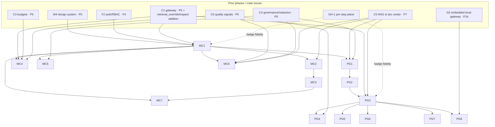

# Phase 4b (P9) · Member Console breadth + Playground — Implementation Plan

> **For agentic workers:** SUB-SKILL: `superpowers:subagent-driven-development` + `superpowers:test-driven-development`. This is a **pure-client** phase — SvelteKit + Svelte 5 (Runes) + Rokkit (W4). W2 and W3 **own no F1 tables and mint no capability** (W2 §3, W3 §3); there are **no `dbd` changes in this phase** — every table used already exists from the F1-rework (P3) and is written only via C1/C5/C6. Code is TDD: Vitest unit for the data layer/resolvers/config model, Playwright E2E for the flows and the phase acceptance gate. The E2E gate runs against the P5–P7 services (C1/C5/C6) plus the P4 auth stack; unit/component tests run against the P0 swappable mock data layer.

## Objective

Bring the **member console (W2)** to its **full v1 surface** and ship the **Playground retrieval lab (W3)** it hosts. The walking skeleton already delivered the desktop shell + client-only session (P1a) and a minimal local Ask (P1b); the central plane is hardened and the RAG/quality engines exist (C1/C2/C3 in P5, C4/O1/C6 in P6, C5 in P7). P9 turns those contracts into the day-to-day member product: a **document workspace** (browse versioned/deduped docs, extracted assets, ingestion status, preview, bulk actions), an **Activity** ledger with execution-location + budget cascade + increase-request, personal **Settings** under 4-state governance, and the **Playground** — the "show by example" surface where a member assembles a retrieval pipeline layer-by-layer and watches the trace, answer, and live meters change, then (if authorized) promotes a configuration to the space default.

Both modules are **pure clients**: a client-only Supabase session (never `service_role`), reads via PostgREST under RLS + module read-model endpoints, and **every privileged mutation through C1 `/rpc/*`** (DECISIONS §2 W1). All capability gating in the UI is **affordance-only** — the server is the sole authority (W2 §5, W3 §5).

**Phase acceptance gate (roadmap P9):** *A member browses a versioned document, runs a Playground query switching retrieval modes with the inspector showing the pipeline + live grounding/quality/cost/latency meters, and promotes a config to the space default.* (End-to-end scenario in §Phase acceptance gate.)

## Prerequisites

### Prior phases (must be green)
| Prereq | Provides | Consumed by |
|---|---|---|
| **W4 (P0)** — design system | Rokkit tokens + dark skin + migrated atoms + ⌘K palette (mockup-review #42). **Blocks all W1/W2/W3 screen builds.** | Every feature (MC1–MC7, PG1–PG8). |
| **F2 (P4)** — identity/RBAC | Client-only Supabase session (email + Google/GitHub), JWT capability claims, `GET /v1/whoami`, device lifecycle/`device_status`. | MC1 (auth/gating), all screens. |
| **C1 (P5, hardened)** — gateway | `/v1/whoami`, `/v1/chat(/stream)`, `/v1/compare`, gateway-mediated `/rpc/*` writes; the `inference_calls` ledger. | MC1/MC4/MC6, PG3/PG5/PG6. |
| **C5 (P7)** — RAG & document center | `/v1/documents*`, `/v1/spaces/:id/retrieve`, `/v1/spaces/:id/retrieval-config`, `/v1/datasets/:id/compute`; ingestion-status Realtime; rerank service (rerank picker options). | MC2/MC3, PG1–PG3, PG6, PG8. |
| **C6 (P6)** — quality signals | `GET /v1/meters`, `GET /v1/signals`, `POST /v1/signals/feedback`; the live-meter Realtime channel; `quality-signals.v1.json` descriptor. | MC4/MC6, PG3/PG4/PG7. |
| **C4 (P6)** — governance runtime | Guardrail/redaction (§2 W5) wrapper, `implicit.redaction_hit` counts, feature-governance evaluation. | MC1 (redaction chip), PG4/PG7. |
| **D2 (P1b)** — embedded local gateway | Desktop local-plane IPC (`c5_retrieve`, `c5_dataset_compute`, local inference). | MC (desktop reuse), PG8. |

> **Sequenced after (not a build blocker, noted per feature):** **W1 (P8)** owns the admin **budget-increase approval queue** (the counterpart to MC4's request), the **Feature management (4-state) authoring** and **Spaces & KB** editors; those authoring surfaces land in P8/P10 (O3). P9 **reads** `feature_states`/`settings`/`user_preferences` (present from F1-rework RW6 + C4 P6) and **submits** `budget_requests` — the authoring/approval UIs are elsewhere and already sequenced *before* P9 (W1 in P8) or noted where they follow (O3 Feature-management in P10).

### Crate issues (gateway-repo, `gateway-issues.md`)
| Issue | Effect on P9 | Blocking? |
|---|---|---|
| **GH-1** — per-step `plane` + execution-location on the trace | The ExecBadge + inspector per-step local/cloud badges + "why this model" render **per-step plane**, not a provider name (DW/mockup #49). Released before the C2/D3 phase (P5/P10). Until fully landed, the badge **degrades gracefully** to served-model + coarse location. | No — badge fidelity improves when it lands. |
| **GH-6** — streaming-safe redaction hook | Whether SSE tokens are redacted incrementally or buffered-then-redacted changes Ask/Playground streaming feel; W2/W3 render whatever C1/C4 emit and show the "N redacted" chip on completion. | No — affects streaming feel only. |
| **GH-8** — `RerankModel` trait (deferred) | Resolved: rerank is a **C5 service**; the rerank picker options (none/BGE/Cohere/Voyage) come from C5 §6, not a crate trait. | No (v1 uses C5 service). |
| **GH-7** — MCP / tool-calling | The Playground tools allow-list rail + SQL-RAG-as-tool routing reflect the C1-enforced per-(role×space) allow-list (X1, P11). W3 renders granted/blocked state; it does not enforce. | No — X1 follows in P11; render granted/blocked only. |

**W2/W3 introduce no new gateway-repo issue** — both are pure consumers.

### Required upstream contract addition (C1, coordinate with the P5 owner)
Per W3 §4.2 note + open-q1, C1 `/v1/chat`(`/stream`) and `/v1/compare` **MUST accept a session `retrieval_override` (a non-persisted `Partial<RetrievalConfig>`) + `inspect:true`**, forwarding them to the C5 retrieve step and returning the `RetrieveResult` inspector block on the response / `done` event. Resolved (**DR2**) as the **single-call** path (avoids a double retrieve, keeps the answer consistent with the session config). This is a small, additive C1 contract change; it is a prerequisite for PG3/PG5 at full fidelity, with a documented two-call fallback (C5 `/retrieve` then C1 `/v1/chat`).

### Front-loaded human inputs
- **No new secrets.** P9 is a pure client — it holds no `service_role`, no provider key, no KEK. It reuses the Supabase project + email/OAuth login (P1a) and the JWKS verify path (P2a/P4).
- **Paid-provider-call approval remains in effect.** Every Playground run — **including a session-only experiment** — is a **real metered `inference_calls` row** (DR5); it costs real money and the C1 reserve→commit budget cascade applies (a `hard` node at cap returns `402`, DECISIONS §2 W2). The paid-provider approval front-loaded at P2a and reconfirmed at P5 must still hold; no new approval is required, but the Playground makes the spend member-initiated, so this is called out explicitly.

## Decisions resolved (residuals → conform to DECISIONS)

| # | Decision | Rationale |
|---|---|---|
| **DR1** | **P9 completes W2 to full**: the headline scope (Library workspace, Activity, Settings) **plus** the Home orientation screen and the **Ask meter/feedback parity + citation-open-at-chunk** completion (MC6) and the **design-only** surfaces W2 owns (MC7). | roadmap P9 = **W2·(full)**. The Ask *skeleton* (P1b) predates C6; meter parity + explicit feedback (DW5, mockup #45/#31) only became buildable once C6 landed (P6) and reuse the exact C6 client this phase builds — completing them here is efficient, not gold-plating. MC6/MC7 are lighter-depth than the headline features. |
| **DR2** | **Single-call inspector path**: C1 `/v1/chat`+`/v1/compare` accept `retrieval_override` + `inspect`; W3 sends one call and reads the `inspector` block. Two-call (C5 `/retrieve` + C1 `/v1/chat`) is the documented fallback. | Avoids a double retrieve; keeps the streamed answer consistent with the session config (W3 §4.2 note, open-q1). |
| **DR3** | **Hybrid weight slider switches fusion to `alpha` mode** (score-normalized α-weighting); **RRF stays the calibration-free default**. Member **session** α-tuning is allowed but **never persisted** unless promoted (`retrieval.manage`). | W3 open-q3 + C5 §4.1: RRF is rank-based/calibration-free; a weight slider implies α-fusion. Session isolation keeps a member from mutating the space default. |
| **DR4** | **4-state `GovernanceState` reaches the client via a resolver endpoint `GET /v1/features?space_id=`** (owned jointly O3/C4), not re-implemented precedence in TS. | W3 open-q2: avoids duplicating the workspace→space→role→user precedence in the client (drift risk); the server (C5/C4) is the boundary regardless. Client falls back to RLS-scoped `feature_states`/`settings`/`user_preferences` SELECTs only if the resolver is unavailable. |
| **DR5** | **Session-only experiments are real metered `inference_calls`** (budget reserved; `402` on a `hard` cap), but their `quality_signals` are **experiment-tagged + short-retention and excluded from O2 space-default rollups**. | W3 §8.1 / C6 §10: a run hits the engine and costs money (budget cannot be bypassed, §2 W2), so a real ledger row — but experiments must not skew the space's default-quality analytics. |
| **DR6** | **Promote-to-space-default is a gateway-mediated capability-checked write** (C5 `PUT /v1/spaces/:id/retrieval-config`, capability `retrieval.manage`); locked without it; emits an `audit_events` row. | W3 §8.3 / §2 W1: per-space retrieval config is a privileged field on `spaces`/`settings`; members are SELECT-only. |
| **DR7** | **Compare is an inline Playground mode**, not a separate screen (v1). | W3 §8.2 / mockup #10: reuses the session config + `/v1/compare`; a dedicated Compare screen is deferred. |
| **DR8** | **Ingestion-status primary transport = the RLS-scoped Realtime channel `documents:<space_id>`**; per-doc SSE `GET /v1/documents/:id?watch=1` is the **bulk-upload fallback**. | W2 open-q3 / C5 open-q2: fewer connections at steady state; SSE fallback when a tenant bulk-uploads hundreds of docs. |
| **DR9** | **Playground session save/load is client-only** (`localStorage`) for v1; server-side shared session persistence is deferred. | W3 open-q4 / mockup #56: the mockup Sessions/Templates stores are client-side; a shared `prompt_templates`-variant is a later decision. |
| **DR10** | **ExecBadge is driven by the per-step `plane` (local\|cloud), never the provider/route name**; degrades to served-model + coarse location until GH-1 is fully released. | DW2 / W3 §8.6 / mockup #49: capability is a model attribute (DECISIONS §3) — an Ollama-over-HTTP *cloud* step must read "cloud." |
| **DR11** | **W2 "ask the data" (§3c) is a design-direction surface**: schema + column-sensitivity display; the **gated compute panel lives in the W3 Playground SQL-RAG path** (PG8). Raw sensitive values are **never** fetched client-side. | DW3 / DECISIONS §3c: schema-to-LLM/execute-in-app is a v1 direction; the compute engine + guards are C5-owned; W2 shows the schema, W3 shows the gated result. |
| **DR12** | **Single-tenant active context for v1**; the tenant switcher lands in the ⌘K workspace switcher (design-noted, non-blocking). | W2 open-q1 (shared F2 open-q1): the token model supports multi-tenant, but the switcher location is undesigned and does not block the single-tenant build. |

---

## Part A — W2 Member Console (full)

### MC1 — Member SPA shell, routing, GatewayClient + capability/governance resolvers + cross-cutting states
- **Layers:** SvelteKit routes → Rokkit shell (W4) → typed client lib → Svelte state (runes)
- **Depends on:** W4 (P0), F2 (P4), C1 (P5). Reuses the P1a desktop shell chrome.
- **Decision:** W2 §4.1/§4.7/§2; DW7; DECISIONS §2 W1.
- **Acceptance criteria (observable):**
  - The member SvelteKit route map exists exactly per W2 §4.1 — nav groups **Workspace** {`/(app)/home`, `/(app)/ask`, `/(app)/library`, `/(app)/library/[documentId]`} · **Tools** {`/(app)/playground`, `/(app)/workflows`, `/workflows/[id]`} · **You** {`/(app)/activity`, `/(app)/settings`} — with the Rokkit shell (rail, chrome, ⌘K workspace switcher, mobile tabs, device footer) ported from `app.jsx`/`ToriiShell`. The **same build renders inside the D1 desktop shell** (verbatim reuse).
  - One typed `GatewayClient` wraps every C1/C5/C6 call: injects `Authorization: Bearer <supabase-jwt>`, maps RFC-7807 errors to toast/inline states, and centralizes silent refresh on `401 token_stale`.
  - `GET /v1/whoami` populates `{tenant_id, identity, capabilities[], device_status}`; `can(caps, cap)` hides/disables controls the caller lacks (affordance only) and the UI **degrades gracefully on `403`** (surfaces "you don't have permission", no crash).
  - `resolveGov(key)` returns the 4-state `{state, value, editable}` via `GET /v1/features?space_id=` (DR4).
  - Cross-cutting UI atoms render everywhere relevant: plane-driven **ExecBadge** (DR10), **offline banner**, **device/sync chip**, **"N items redacted"** chip, and the **locked-toggle** visual for governed controls.
- **Test scenarios:**
  - Given a signed-in member, When the console loads, Then all W2 §4.1 routes resolve and the shell/nav/⌘K render with W4 tokens; the same bundle renders in the D1 shell.
  - Given a capability set lacking `doc.declassify`, When Home renders, Then the declassify affordance is hidden/disabled; When a forged `/rpc/spaces/declassify-doc` is issued, Then it returns `403` and the UI shows a permission error without crashing.
  - Given a `401 token_stale` on any call, When it occurs, Then `GatewayClient` refreshes silently and retries once; a second failure surfaces a re-auth state.

### MC2 — Library index (collections/tags/filters/storage) + upload → ingest + bulk actions
- **Layers:** SvelteKit route → C5 HTTP → Realtime
- **Depends on:** MC1, C5 (P7).
- **Decision:** W2 §3a/§6.3; DECISIONS §3a; mockup #19/#34.
- **Acceptance criteria (observable):**
  - `/(app)/library` lists documents via `GET /v1/documents?space_id=&collection=&tag=&status=` with working **collection/folder/tag** grouping and **filters** (space/collection/tag/status); a **storage/quota** indicator renders from the space read model.
  - **Upload:** drop a PDF/DOCX/PPTX/XLSX/image → `POST /v1/documents` → client `PUT`s bytes to the returned signed URL → `POST /v1/documents/:id/ingest`.
  - A **bulk toolbar** with multi-select performs bulk tag/move-to-collection/delete (delete capability-gated `doc.delete`) via the C5 endpoints; a lacking capability disables the action.
  - Each row shows a live **ingestion-status** badge fed by the `documents:<space_id>` Realtime channel (DR8).
- **Test scenarios:**
  - Given docs across two collections + three tags, When a member filters by `tag=finance&status=ready`, Then only matching ready docs list.
  - Given a dropped PDF, When upload completes, Then a `POST /v1/documents` + signed-URL `PUT` + `/ingest` fire in order and a new row appears at `queued`.
  - Given three selected docs and `doc.delete`, When "Delete" is clicked, Then three `DELETE /v1/documents/:id` calls fire and the rows leave the list; Given no `doc.delete`, Then the bulk-delete control is disabled.

### MC3 — Document workspace + ingestion-status pipeline (preview / chunks / lineage / versions / dedup / assets)
- **Layers:** SvelteKit route → C5 HTTP → Realtime
- **Depends on:** MC2, C5 (P7).
- **Decision:** W2 §3a/§6.3; DECISIONS §3a; mockup #19/#34/#51.
- **Acceptance criteria (observable):**
  - `/(app)/library/[documentId]` renders tabs: **Preview** (rendered md / table-as-data-grid / image gallery from signed `document_assets`), **Chunks** (contextual-prefix text + per-stage scores + dropped-by-rerank), **Lineage** (original → md/csv/images, **original always kept + download-original**), **Versions** (history; only the current version indexed).
  - A **dedup** indicator surfaces from `documents.content_hash`; the **extracted-asset browser** switches between md / table-grid / image gallery.
  - The **ingestion-status stepper** renders `queued→parsing→chunking→embedding→ready`/`failed` (+ `status_reason`) live from the `documents:<space_id>` Realtime channel (DR8), with per-doc SSE `?watch=1` fallback; a **failed** doc offers a working **re-process** (`POST /v1/documents/:id/reingest`).
  - Space **owners** see a space-settings entry link (the governed defaults are authored in W3/W1; W2 only links).
- **Test scenarios:**
  - Given a `ready` document, When opened, Then Preview/Chunks/Lineage/Versions render, a dedup indicator shows, and download-original returns the original bytes.
  - Given a forced parse failure, When the doc ingests, Then the stepper reaches `failed` with a non-empty `status_reason` and a re-process button that fires `/reingest`.
  - Given a re-uploaded document, When ingestion completes, Then Versions shows a new version, and only the current version is marked indexed.

### MC4 — Activity (ledger + exec-location + budget cascade + increase-request)
- **Layers:** SvelteKit route → PostgREST SELECT (RLS) + C1 `/rpc/*` + C6 meters
- **Depends on:** MC1, C1 (P5), C3 budgets (P5), C6 (P6).
- **Decision:** W2 §6.4; DECISIONS §2 W2; mockup #17/#30.
- **Acceptance criteria (observable):**
  - `/(app)/activity` renders the member's own request/spend history (from `inference_calls` via the read model) with **execution-location** + **device** columns, filters (space/task/outcome/date), and an **offline-queued** state that reconciles ("pending sync" → settled) on reconnect.
  - A read-only **budget cascade** meter shows the org→dept→team→user ceiling + `spent`/headroom for the member's node(s) (client-facing metering is read-only, §2 W2).
  - **Budget-increase request:** "Request increase" → `POST /rpc/budgets/request-increase {node_id, amount, reason}` → a `budget_requests` row renders as **pending** and reflects admin approval/denial when it lands (approval queue is W1/P8). The member has **no control** that writes `budget_nodes`.
- **Test scenarios:**
  - Given a member with prior calls, When Activity loads, Then only their own rows show, each with execution-location + device columns; a cross-tenant id returns nothing.
  - Given "Request increase" submitted, When the RPC returns, Then a `budget_requests` row shows **pending**; When an admin approves (W1), Then the row flips to approved and the ceiling updates.
  - Given a scripted direct PostgREST `UPDATE budget_nodes`, When attempted, Then it is denied (no client write authority).

### MC5 — Settings (4-state governed personal preferences)
- **Layers:** SvelteKit route → governance resolver (DR4) → self-owned `user_preferences` write
- **Depends on:** MC1, RW6 (feature 4-state + `user_preferences`, from P3), C4 (P6).
- **Decision:** W2 §6.5; DECISIONS §4; mockup #18.
- **Acceptance criteria (observable):**
  - `/(app)/settings` renders personal preferences (theme light/dark/system, default model/tier within allow-list, citation density, context-retention/auto-tune defaults, locale) each resolved through `resolveGov(key)` (precedence workspace→space→role→user).
  - A `user-overridable` key renders an editable control that persists to `user_preferences` (self-owned write, `owner_id = auth.uid()`); a `locked`/`default-on`/`default-off` key renders **locked** (greyed + lock + tooltip "set by your administrator") and is non-interactive.
  - A scripted write to a **locked** key is rejected by RLS/C4 (the UI never claims success).
- **Test scenarios:**
  - Given a `user-overridable` theme pref, When toggled, Then a `user_preferences` upsert persists and re-load shows the new value.
  - Given a `locked` pref, When rendered, Then it is non-interactive with the lock visual; When a direct write to that key is scripted, Then it is denied.

### MC6 — Home orientation + Ask completion (meter parity + explicit feedback + citation open-at-chunk)  *(W2-full completion, DR1)*
- **Layers:** SvelteKit routes → C1 SSE + C6 meters/feedback → C5 citation resolution
- **Depends on:** MC1, the P1b Ask skeleton, C1 (P5), C6 (P6), C4 redaction (P6), C5 (P7).
- **Decision:** W2 §6.1/§6.2; DW5/DW6; mockup #16/#31/#45/#51.
- **Acceptance criteria (observable):**
  - `/(app)/home` renders the orientation screen ("your lane": active space, allowed models, budget ceiling), recent work, space grid, and quick-start.
  - **Ask (completing the P1b skeleton):** `POST /v1/chat/stream` streams a grounded answer with a plane-driven **ExecBadge**, answering **model + tier**, **cost** (shows `free` when `execution_location='local'`), and a **why-this-model** panel resolved from `trace_id`; exactly one user turn + one assistant turn persist after completion (user turn is a self-owned write; the assistant turn/citations/ledger are C1/C4-written, DW6).
  - **Live meters** (grounding/quality/cost/latency) render from `GET /v1/meters?message_id=…` (optionally the Realtime channel) and match C6 for that `inference_call_id`; a redaction shows the **"N items redacted"** chip.
  - **Explicit feedback** (thumb/rating/accept/edit/retry/correction) each `POST /v1/signals/feedback` and confirm capture; a typed `correction` containing a secret-shaped string is stored **redacted** (verified via the C6 read model) — W2 never displays raw secret material.
  - **Citation → open-at-chunk:** clicking a citation resolves `message_citations` → navigates to `/(app)/library/[documentId]`, opens the Chunks/Preview tab, scrolls to the chunk, and highlights the **bbox evidence-pin** where coordinates exist.
- **Test scenarios:**
  - Given an Ask query, When the stream completes, Then the ExecBadge reads the served step's plane, cost shows `free` for a local answer, meters populate from `GET /v1/meters`, and one user + one assistant turn appear.
  - Given a `correction` containing `sk-...`, When submitted, Then the stored signal is a placeholder (C6 read model), and no raw secret appears in the DOM, logs, or W2-originated network payload.
  - Given an answer with a citation carrying a `bbox`, When the citation is clicked, Then the document workspace opens at that chunk with the evidence-pin highlighted.

### MC7 — Design-only surfaces (render, don't run)  *(W2-full completion, DR1)*
- **Layers:** SvelteKit routes → mock/read-only data
- **Depends on:** MC1, MC3.
- **Decision:** W2 §6.7; DECISIONS §1(#3)/§3a/§3c; DW3/DW4; mockup #20/#21/#25/#52.
- **Acceptance criteria (observable):**
  - **Collaborative editing** (X2 v2): comment threads, suggestion/correction review, a **chat-to-edit** panel, and per-doc collaborators (owner/editor/commenter/viewer) render on a doc-workspace tab, **badged v2**, with **no** runtime wiring (no live agent action).
  - **"Ask the data" (§3c, W2-side, DR11):** a dataset **schema view** + **column-sensitivity** display (values never fetched client-side); the gated compute panel itself is the W3 SQL-RAG path (PG8).
  - **Workflows / agent-builder** (X2): the `/(app)/workflows` List⇄DAG builder + runs render from mock data, badged **"v2 · preview"**, with no runtime path or runtime tables.
- **Test scenarios:**
  - Given the collaborative tab, When opened, Then threads/suggestions/collaborators render with the v2 badge and expose no live agent-runtime action.
  - Given a dataset with a `sensitive` column, When the schema view opens, Then the column shows a sensitivity marker and **no raw values** are present in the payload or DOM.
  - Given `/(app)/workflows`, When opened, Then the builder renders from mock data with the "v2 · preview" badge and no runtime execution.

---

## Part B — W3 Playground (retrieval lab)

### PG1 — Playground shell, session config model + governance/capability resolution
- **Layers:** SvelteKit route slot (hosted by W2 MC1) → C5 config read + governance resolver + whoami
- **Depends on:** MC1 (route slot + shell + client), W4 (P0), C5 (P7), C4/O3 governance (P6/read model), F2 (P4).
- **Decision:** W3 §4.1/§6.1; DR4; no-hardcoded-ops (`project-gateway-no-hardcoded-ops`).
- **Acceptance criteria (observable):**
  - The `/(app)/playground` route renders inside the W2 console (W2 hosts, W3 owns the component) to the fidelity of `view-playground.jsx` on W4 atoms.
  - On open, W3 loads the active space's baseline `GET /v1/spaces/:id/retrieval-config`, resolves the 4-state `GovernanceState` per control (`GET /v1/features?space_id=`, DR4), and resolves `whoami` capabilities.
  - Session pipeline state is a **client-only** `PlaygroundSession { base_config, override, session_only: true }` that **forks** the space baseline; the `override` is **never persisted** unless promoted (PG6).
  - The **enabled-mode set, default config, rerank options, and chunker params are read from `spaces`/`settings` + feature governance** — **never baked into the client** (changing a space's config changes the Playground UI with no code change).
- **Test scenarios:**
  - Given a space where `graphrag` is `locked` and `hybrid` is `default-on`, When Playground opens, Then the GraphRAG control renders non-interactive (lock + tooltip) and hybrid renders enabled — with no client code change.
  - Given a member session, When any control is changed, Then only `PlaygroundSession.override` mutates and a subsequent `GET /v1/spaces/:id/retrieval-config` returns the baseline **unchanged**.

### PG2 — Retrieval controls (mode selector + hybrid weight slider + rerank + chunking + query transforms + top-k)
- **Layers:** Svelte state (runes) → `RetrievalConfig` override
- **Depends on:** PG1.
- **Decision:** W3 §1/§6.2; DR3; mockup #22/#32.
- **Acceptance criteria (observable):**
  - The **mode selector** exposes the composable set (classic/BM25 · dense · hybrid · contextual · query transforms {rewrite/HyDE/step-back/decompose} · GraphRAG · RAPTOR · ColBERT/multi-vector · SQL-RAG · agentic), each gated per PG1's governance.
  - The **hybrid weight slider** switches fusion to `alpha` mode (DR3) and updates `override.fusion`; RRF remains the default when the slider is untouched.
  - The **rerank picker** (none / BGE / Cohere / Voyage — options from C5 §6) sets `override.rerank`; the **chunking selector** sets `override.chunking.{strategy,size,overlap}`; **top-k** and **query transforms** update `override` accordingly.
- **Test scenarios:**
  - Given hybrid selected, When the slider moves from 0.3→0.7, Then `override.fusion` becomes `{method:'alpha', alpha:0.7}`.
  - Given the rerank picker set to `none`, When applied, Then `override.rerank.provider='none'`; set to `bge`, Then `provider='bge'`.
  - Given a `locked` advanced mode, When the user attempts to select it, Then the control is non-interactive (governance from PG1).

### PG3 — Run + grounded answer + retrieval inspector
- **Layers:** SvelteKit → C1 `/v1/chat(/stream)` (single-call, DR2) → C5 inspector payload → C5 citation/bbox
- **Depends on:** PG2, C1 (P5, +`retrieval_override`/`inspect` addition), C5 (P7).
- **Decision:** W3 §6.3/§6.4; DR2/DR10; mockup #23/#38/#51.
- **Acceptance criteria (observable):**
  - **Run:** `POST /v1/chat/stream` with `{space_id, model, retrieval_override, inspect:true}` (DR2) streams the grounded answer + citations; the response carries `inference_call_id`, `trace_id`, and the `inspector` (`RetrieveResult`) block. The **ExecBadge** reads the served step's **plane** (DR10).
  - **Inspector:** renders per-chunk **dense / BM25 / fused / rerank** scores, **dropped** candidates, per-stage `k_in/k_out` + timings + `recall_at_k`, grounding, and the `config_used`; each **citation resolves** to a real chunk and highlights a **bbox evidence-pin** in the preview where coordinates exist.
  - Changing a control **visibly changes the trace/answer**: dragging the slider changes `fused` scores + chunk order; changing chunking re-runs retrieval with a different chunk set; `rerank=none` removes the rerank stage from `stages[]`.
- **Test scenarios:**
  - Given two slider positions for the same query, When each runs, Then the inspector shows a different `fused` order (observable diff) and `spaces`/`settings` remains unchanged (session-only).
  - Given `inspect:true`, When a run completes, Then the inspector shows per-chunk `dense/bm25/fused/rerank`, `dropped` candidates, per-stage `k_in/k_out`+timings, and `config_used`; a citation with a `bbox` highlights an evidence-pin.
  - Given `rerank=none`, When a run completes, Then `stages[]` contains no rerank stage.

### PG4 — Live meters + quality-judge + auto-tune
- **Layers:** SvelteKit → C6 `/v1/meters` (+ Realtime) → C4/C5 judge chain (toggle only)
- **Depends on:** PG3, C6 (P6), C4 (P6).
- **Decision:** W3 §6.5; DECISIONS §3b; mockup #23/#26/#27.
- **Acceptance criteria (observable):**
  - **Live meters** (grounding / answer-quality / cost / latency) render from `GET /v1/meters?inference_call_id=…` (optionally the RLS-scoped Realtime channel), animating during a run; values match C6's read model for that call.
  - **Quality-judge** (feature-governed): toggling on issues the judge as a **separate metered inference call** (its own `inference_calls` row + budget reserve); its `implicit.judge_score` attaches to the run and the **Answer-quality** meter shows the judge score. W3 only toggles and renders — it owns no model-selection policy.
  - **Auto-tune-prompt** (feature-governed): toggling on surfaces the tuned prompt in the trace.
- **Test scenarios:**
  - Given a completed run, When meters load, Then grounding/quality/cost/latency match `GET /v1/meters` for the `inference_call_id`.
  - Given quality-judge on, When a run completes, Then the Answer-quality meter shows a `judge_score` **and** a separate judge `inference_calls` row exists (metered).
  - Given a `locked` judge toggle, When rendered, Then it is non-interactive.

### PG5 — Model-compare (2–4, inline mode)
- **Layers:** SvelteKit → C1 `/v1/compare` → per-slot C6 meters
- **Depends on:** PG3, PG4, C1 (P5).
- **Decision:** W3 §6.6; DR7; mockup #10/#32.
- **Acceptance criteria (observable):**
  - Selecting 2–4 models → `POST /v1/compare {models[2..4], space_id, retrieval_override, mode:'panel'}` renders answers **side-by-side**, each with its own meters + ExecBadge + optional per-slot judge; each slot persists an `inference_calls` row sharing one `compare_group_id`. It is an **inline** Playground mode (DR7), not a separate screen.
- **Test scenarios:**
  - Given 3 selected models, When compare runs, Then three answers render side-by-side, three `inference_calls` rows share one `compare_group_id`, and each slot has its own meters + ExecBadge.

### PG6 — Promote-to-space-default (gated, gateway-mediated)
- **Layers:** SvelteKit → C5 `PUT /v1/spaces/:id/retrieval-config` (capability `retrieval.manage`)
- **Depends on:** PG1–PG3, C5 (P7), F2 capability `retrieval.manage`.
- **Decision:** W3 §6.8; DR6; DECISIONS §2 W1; mockup #24/#33.
- **Acceptance criteria (observable):**
  - An admin/space-owner with `retrieval.manage` clicks **Promote** → `PUT /v1/spaces/:id/retrieval-config` (gateway-mediated, capability-checked) persists the session config to `spaces`/`settings`; a subsequent `GET …/retrieval-config` returns the new default and an `audit_events` row exists.
  - A member **without** `retrieval.manage` sees the Promote control **locked** (lock + tooltip); a scripted direct `PUT` returns `403` and `spaces`/`settings` is **unchanged**.
- **Test scenarios:**
  - Given `retrieval.manage`, When Promote is clicked, Then `GET …/retrieval-config` returns the promoted config and an `audit_events` row is present.
  - Given no `retrieval.manage`, When rendered, Then Promote is locked; When a direct `PUT` is scripted, Then `403` and the config is unchanged.

### PG7 — Explicit feedback + redaction indicator (§2 W5)
- **Layers:** SvelteKit → C6 `/v1/signals/feedback` → C4 redaction counts
- **Depends on:** PG3, C6 (P6), C4 (P6).
- **Decision:** W3 §6.7; DECISIONS §2 W5; mockup #27/#36.
- **Acceptance criteria (observable):**
  - Clicking thumb/rating/accept/edit/retry/correction → `POST /v1/signals/feedback` writes a `quality_signals` row with `actor_id = auth.uid()` (server-bound); a `correction` containing a secret is stored as a **placeholder**, not the raw value.
  - A run over redacted content shows an **"N items redacted"** chip in the guardrails trace step; the inspector chunk text contains **placeholders, never raw secrets/PII**. W3 logs no raw prompt/answer/chunk content.
- **Test scenarios:**
  - Given a thumb click, When submitted, Then a `quality_signals` row exists with `actor_id = auth.uid()` (a request supplying a different `actor_id` or a cross-tenant subject is rejected `403`).
  - Given a run over a document with redacted content, When it completes, Then the "N items redacted" chip shows and the inspector chunk text contains only placeholders.

### PG8 — SQL-RAG §3c compute panel + desktop local plane
- **Layers:** SvelteKit → C5 `/v1/datasets/:id/compute` (HTTP) / D2 IPC (`c5_retrieve`, `c5_dataset_compute`)
- **Depends on:** PG3, C5 (P7, §3c), D2 (P1b, desktop).
- **Decision:** W3 §6.10/§6.11; DECISIONS §3c; DR11; mockup #35/#52.
- **Acceptance criteria (observable):**
  - In SQL-RAG mode the "ask the data" panel calls `POST /v1/datasets/:id/compute` → the inspector shows the generated **plan (SQL)** + the **aggregate/k-anon-gated result** + a **"computed in-app · values never sent to the model"** badge; below-threshold groups show `suppressed_groups > 0`. No raw sensitive value is ever rendered.
  - **Desktop:** on the desktop shell, runs (PG3) + SQL-RAG compute run via D2 IPC entirely on-device; the ExecBadge shows "ran on your device"; sensitive datasets pinned local show `executed_plane='local'`. Offline shows the banner and gates cloud-only modes/models.
  - Every Playground run — including a **session-only experiment** — is a **real metered `inference_calls`** row (budget reserved); a `hard` node at cap returns `402` (budget cannot be bypassed, DR5); experiment `quality_signals` are excluded from the space's O2 default-quality panel.
- **Test scenarios:**
  - Given a dataset with a `sensitive` salary column, When "ask the data" runs, Then an aggregate result returns with no raw value, the "computed in-app" badge shows, and a below-threshold group yields `suppressed_groups > 0`.
  - Given a desktop session offline, When a local-pinned dataset computes, Then it runs via D2 IPC with `executed_plane='local'`, the ExecBadge reads "ran on your device", and cloud-only modes are gated.
  - Given a `hard` budget node at cap, When any Playground run is attempted, Then it is rejected `402`; the run creates no ledger row beyond the reserve rejection.
  - Given a member session experiment, When it runs, Then exactly one `inference_calls` row per model is created and its `quality_signals` are excluded from the space O2 default-quality rollup (experiment-tagged).

---

## Dependency graph

## Suggested build order

1. **MC1** (foundation — shell/routing/data layer/resolvers/cross-cutting states). Everything else depends on it; build first.
2. **PG1** in parallel with **MC2** once MC1 lands (PG1 needs only MC1 + C5 config; MC2 needs MC1 + C5). Both unblock the two headline tracks.
3. **Library track:** MC2 → **MC3** (document workspace + ingestion pipeline — the "browse a versioned doc" half of the gate).
4. **Playground track:** PG1 → **PG2** → **PG3** (run + inspector — the "switch modes with the inspector" half of the gate) → **PG4** (live meters — the "live grounding/quality/cost/latency meters" half) → **PG6** (promote-to-default — the final clause of the gate). PG5/PG7/PG8 layer on after PG3/PG4.
5. **MC4** (Activity) and **MC5** (Settings) in parallel with the Playground track (independent of it; depend only on MC1 + engines).
6. **MC6** (Home + Ask completion) after C6 client parts exist (shared with PG4/PG7) — schedule alongside PG4/PG7 to reuse the meter/feedback components.
7. **MC7** (design-only surfaces) last (render-only, lowest risk).

The **phase acceptance gate** is satisfied once **MC3 + PG3 + PG4 + PG6** are green; the remaining features complete W2 to full and round out the Playground.

## Phase acceptance gate (E2E scenario)

> **Given** a signed-in member of a space that contains a **versioned** document and a `hybrid`-default retrieval config, and a space-owner session with `retrieval.manage`:
> **When** the member opens `/(app)/library/[documentId]`, sees the **Versions** history (only the current version indexed) and a **dedup** indicator, then opens the **Playground**, switches the **retrieval mode** (e.g., dense → hybrid, drags the weight slider, changes the rerank picker), runs a query, expands the **inspector** (per-stage dense/BM25/fused/rerank scores + dropped + timings + recall + `config_used`) with the **ExecBadge** reading the served step's plane and the **live grounding/quality/cost/latency meters** populated from C6, and finally (as the owner) clicks **Promote**:
> **Then** each mode switch visibly changes the inspector/answer without mutating `spaces`/`settings` (session-only), the meters match C6 for the run's `inference_call_id`, and Promote issues `PUT /v1/spaces/:id/retrieval-config` (capability-checked) so a subsequent `GET …/retrieval-config` returns the promoted config and an `audit_events` row exists — while a member **without** `retrieval.manage` sees Promote locked and a direct `PUT` returns `403`.

## Testing strategy (TDD; no dbd this phase)

- **No schema changes.** W2/W3 own no F1 tables; there is **no `dbd` step** in P9. All tables (`documents`/`document_*`, `conversations`/`messages`/`message_citations`, `budget_nodes`/`budget_requests`, `user_preferences`, `feature_states`/`settings`, `quality_signals`, `datasets`/`dataset_columns`, `inference_calls`) exist from F1-rework (P3) and are written only via C1/C5/C6.
- **Unit (Vitest):** `GatewayClient` (bearer injection, 401 refresh/retry, RFC-7807 mapping), `can()` gating, `resolveGov()`/`GovernanceState`, the `RetrievalConfig`/`PlaygroundSession` fork+serialize (session override never leaks into the baseline), slider→`alpha` mapping (DR3).
- **Component/integration:** each screen against the **P0 swappable mock data layer** (mock C1/C5/C6 responses + a mock Realtime channel) — inspector rendering, ingestion stepper transitions, locked-toggle visuals, meter rendering, redaction chip.
- **E2E (Playwright):** the phase acceptance gate + per-feature scenarios against a running C1/C5/C6 stack (P5–P7) with a seeded space/doc/dataset; desktop scenarios via the D1 shell + D2 IPC. Live paid-call E2E kept minimal/opt-in (costs real money; budget applies).
- **Security assertions (client-side):** a DOM/log/network scan test asserts **no provider key/OAuth token/raw redacted secret** ever appears in a W2/W3-rendered surface, console log, or W2/W3-originated payload (W2 AC#12, W3 §5).

## Self-review notes (author)

- **Spec coverage:** W2 §1 in-scope screens map to MC1–MC7 (Library workspace MC2/MC3, Activity MC4, Settings MC5 = the headline P9 scope; Home+Ask completion MC6, design-only MC7 = W2·full per DR1). W3 §1 in-scope surface maps to PG1–PG8 (mode selector/slider/pickers PG2, inspector PG3, meters/judge/auto-tune PG4, compare PG5, promote PG6, feedback/redaction PG7, §3c compute + desktop local plane PG8).
- **Zero TBDs:** every W2/W3 open question is resolved in **Decisions resolved** (DR1–DR12) conforming to DECISIONS: single-call inspector (DR2), slider α-mode (DR3), governance resolver (DR4), metered-but-segregated experiments (DR5), gated promote (DR6), inline compare (DR7), Realtime-primary ingestion transport (DR8), client-only sessions (DR9), plane-driven badge (DR10), §3c split W2/W3 (DR11), single-tenant v1 (DR12).
- **Prerequisites honored:** W4 (P0) blocks all screen builds; C1/C5/C6 (P5–P7) supply every contract; D2 (P1b) supplies the desktop local plane; F2 (P4) supplies auth/capabilities. GH-1 improves badge fidelity but is non-blocking (graceful degradation). The one **new upstream requirement** — C1 `retrieval_override`+`inspect` — is flagged for the P5 owner with a two-call fallback.
- **Deferred (flagged, not TBD):** tenant-switch UX (DR12), server-side shared Playground sessions (DR9), the admin-side budget-increase **approval queue** + Feature-management authoring (W1/O3, P8/P10), MCP tools allow-list *enforcement* (X1, P11 — W3 renders granted/blocked only), and the collaborative-edit / interaction-intelligence **runtime** (X2, v2 — MC7 renders design-only).
