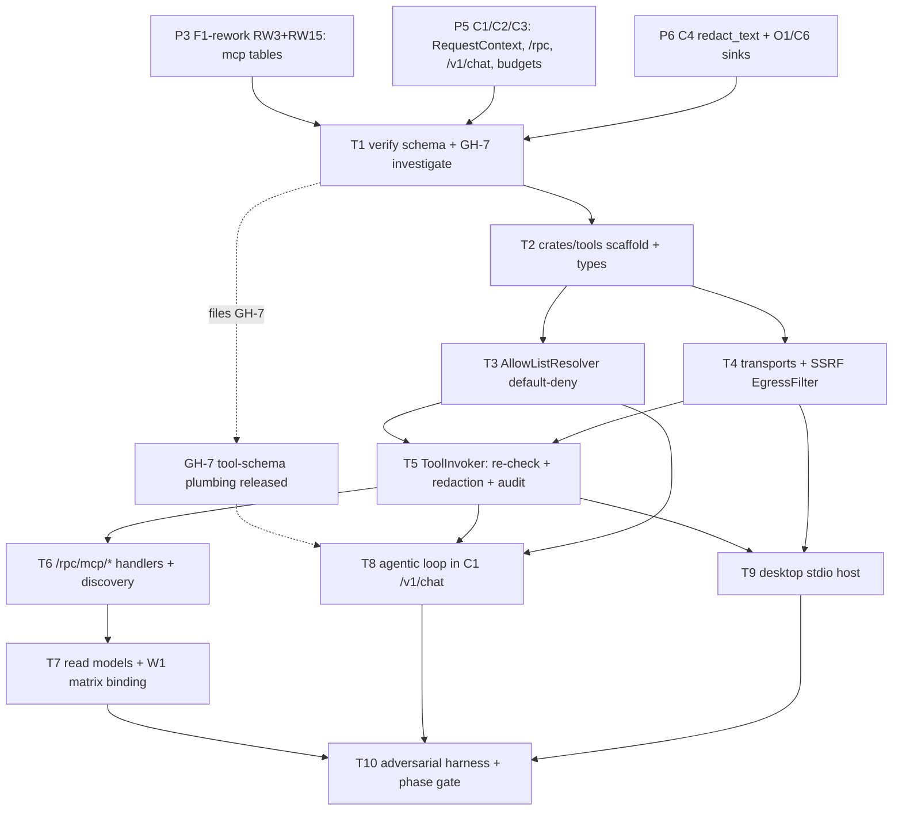

# Phase 5 (P11) · Tools & MCP (X1) — Implementation Plan

> **For agentic workers:** REQUIRED SUB-SKILL: `superpowers:subagent-driven-development` (execution) and `superpowers:test-driven-development` (every code task is RED→GREEN→REFACTOR — write the failing test first). Steps use checkbox (`- [ ]`) syntax. **Heavy Rust builds (`crates/tools` + C1 relink + `src-tauri`) run via a BACKGROUND shell (controller), not inside a subagent** (the `sensei-*` + axum + sqlx + rmcp compile is minutes; the watchdog will kill a subagent). Subagents WRITE code + tests; the controller compiles + runs. DB changes go through **dbd** (`dbd reset && dbd apply && dbd import`) per the project workflow. **X1 is a security control — its negative tests are a build gate (Task 10); the phase is not "done" until every adversarial case in §9 is red-on-regression.**

**Goal:** Strategos models can **invoke MCP tools** under a **default-deny, per-(role × space) allow-list** that the gateway enforces **server-side at tool-call time**. A tool absent from a member's resolved allow-list is never offered and never executed even if a client forges the call; an `http`/`sse` tool whose URL resolves to a private/link-local/metadata address is SSRF-blocked before any connection; `stdio` servers run only sandboxed on the desktop (never spawned centrally); and every tool **input and output** passes C4 W5 redaction (fail-closed) before it egresses to the tool or re-enters the model. A `mcp_server_tools` discovery cache backs the offered tool set and the Admin matrix.

**Architecture:** X1 is **not** a network service. It is a **consumer-side Rust library — `crates/tools`** (mirrors C4's `governance` crate) that is compiled into **two hosts**: (1) **C1** (`services/gateway`, central plane) where it drives the agentic tool loop inside `/v1/chat`, serves the `/rpc/mcp/*` write handlers and the `/v1/mcp/*` read models, and reaches `http`/`sse` servers behind an SSRF filter; and (2) the desktop **`src-tauri`** (device plane) where it hosts sandboxed `stdio` MCP subprocesses via D1's sidecar. The `sensei-*` engine (`v0.4.6`) has **no MCP crate and no tool-invocation orchestrator** — allow-list enforcement, SSRF, sandboxing, and W5 redaction are all Strategos-owned and live in `crates/tools`, never in the engine (GH-7, DECISIONS §1.1). GH-7 narrows to engine **request/response tool-schema plumbing only** (carry tool *definitions* on the request; surface provider-normalized `tool_use` blocks on the response/stream). The registry + allow-list tables were built in P3 (F1-rework RW3 + RW15 `mcp_server_tools`); this phase is the **runtime + enforcement + `/rpc` handlers** over that schema.

**Tech Stack:** Rust · `crates/tools` (library) · MCP client SDK (`rmcp` official Rust SDK, or vetted equivalent) for `stdio`/`http`/`sse` transports · an SSRF-safe HTTP client with **explicit IP-pinning** (resolve → check → connect to the pinned IP; do not re-resolve) · `sensei-*` @ `v0.4.6` (tool-schema plumbing via GH-7) · C4 `governance::redact_text` (W5) · C1 `services/gateway` (axum 0.8, sqlx, `RequestContext`, `/rpc/*`) · desktop `src-tauri` (D1 sidecar host) · Supabase Postgres (registry/allow-list, `service_role`-write).

**Reference (adapt the patterns):** the ratified spec [`../specs/X1-tools-mcp.md`](../specs/X1-tools-mcp.md) is the authoritative contract (§3 tables, §4 Rust surface, §5 security, §6 flows, §9 acceptance). C4 [`../specs/C4-governance-runtime.md`](../specs/C4-governance-runtime.md) for the `redact_text(ctx, ToolInput|ToolOutput, …)` signature + fail-closed semantics. C1 [`../specs/C1-gateway-service.md`](../specs/C1-gateway-service.md) for `RequestContext`, `require(ctx, cap)`, the `/rpc/*` write surface, and the `/v1/chat` inference loop. F1-rework [`F1-rework-plan.md`](F1-rework-plan.md) RW3/RW15 for the built tables.

---

## Prerequisites & decisions (confirm before executing)

### Prior phases (hard prerequisites)
1. **P5 (C1 hardened + C2/C3).** `RequestContext`, `require(ctx, cap)`, the gateway-mediated `/rpc/*` write surface, the `/v1/chat` inference loop, and budget reserve→commit exist. X1 supplies handler bodies and a loop driver *inside* C1 — it does not re-implement auth/budget/ledger.
2. **P6 (C4 governance + O1 + C6).** The `governance` crate exposes `redact_text` with `ToolInput`/`ToolOutput` surfaces (§2 W5) and is fail-closed; O1 `audit_events` and C6 `quality_signals` write paths (via C4/C1) exist. X1 emits into these; it owns no audit/signal schema.
3. **P3 (F1-rework RW3 + RW15).** `config.mcp_servers`, `public.tenant_mcp_servers`, `public.mcp_server_tools`, `public.tool_allow_lists` are built with the RLS posture in X1 §3.5, and the `mcp_servers.jsonl` seed is wired into `loader.sql`. This phase **verifies + finalizes** that shape (Task 1) rather than authoring it fresh; any gap is a small additive dbd delta, not a rework.
4. **P4 (F2 + F3).** F2 owns the `mcp.manage` capability and role/space resolution; F3 stores `http`/`sse` auth + `stdio` env secrets (`router_credentials` / referenced credential), decrypted only at invoke time. X1 references credentials by id — never plaintext.
5. **P1a/P10 (D1 desktop shell).** D1's sandboxed sidecar host exists for launching `stdio` subprocesses (jailed working dir, minimal env, resource/time caps, kill-on-revocation). X1 defines the `stdio` contract; D1 owns the process lifecycle.

### Crate prerequisite (filed → implemented → closed → released via lockstep tag bump)
6. **GH-7 — MCP / tool-calling support, investigated + narrowed.** No `mcp` crate exists among the six `sensei-*` crates. **Resolution (X1 §8 D1):** invocation stays consumer-side; GH-7's scope is engine **request/response plumbing only** — (a) accept tool/function *definitions* on `InferenceRequest`; (b) surface provider `tool_use`/`tool_call` blocks on `InferenceResponse` **and** `StreamChunk` in a **provider-normalized** shape (Anthropic tool use first — the v1 OAuth/BYOK provider); (c) round-trip `tool_result` messages into the next turn. **Task 1 investigates whether the engine already normalizes this**; if yes X1 consumes it, if not GH-7 adds it and is released before Task 8. Registry + allow-list + `stdio`-desktop tools (Tasks 1–7, 9) do **not** need GH-7; only the *cloud agentic loop* (Task 8) does.

### Human inputs / secrets
7. **No new front-loaded human secret.** Paid-provider approval (P2a/P5) and the KMS/KEK + Anthropic OAuth client (P4) already cover the cloud calls the tool loop makes. The one new **operational decision** is the MCP client SDK choice (`rmcp` vs alternative) — resolved in Task 2 D-note (default: official `rmcp`).

### Reconciliation note — W1 ⇄ X1 (mutual dependency)
8. The roadmap lists **W1 (P8) admin allow-list UI as a prerequisite** *and* the graph draws `{C1,C4,W1} → X1`, while W1 depends on X1. Resolve **contract-first** (as C5⇄C6): the **Admin Tools & MCP screen shell was scaffolded in P8 against the read-model + `/rpc/mcp/*` contracts declared in X1 §4** (stubbed/mock responses). **P11 delivers the real `/rpc/mcp/*` handlers (Task 6) and `/v1/mcp/*` read models (Task 7)** that the P8 screen binds to. No W1 rework — P8 built to the contract; P11 fulfills it. (If the P8 build stubbed against a different shape, Task 7 reconciles the read-model JSON to X1 §4.1 and files a W1 follow-up; expected: none.)

### Design decisions inherited (X1 §8 — no TBDs)
- **D1** invocation consumer-side; GH-7 = plumbing only.
- **D2** `stdio` = device-plane only; central never spawns a subprocess; web callers get `http`/`sse` + platform tools only.
- **D3** allow-list = default-deny, grant-only, `(role × space) → (server, tool)` with a per-server `*` wildcard; no `deny` rows in v1.
- **D4** `http`/`sse` auth + `stdio` env secrets in F3 vault; never in `mcp_servers` plaintext.
- **D5** `mcp_server_tools` discovered-tool cache (RW15) backs the offered set + Admin matrix.
- **D6** agentic loop bounded (`max_iterations` default 8); each model turn = one metered `inference_calls` row.
- **D7** tool-egress redaction fail-closed, both planes.
- **D8** tools carry no separate budget; surrounding inference turns accrue spend.
- **D9** v1 MCP scope = tools only (no resources/prompts).

---

## File structure

```
monorepo/
  Cargo.toml                          # add "crates/tools" to workspace members
  crates/tools/
    Cargo.toml                        # rmcp, ssrf http client, C4 governance dep, sensei-* (tool schema), sqlx, serde
    src/
      lib.rs                          # re-exports; public surface per X1 §4.3
      types.rs                        # ToolDef, ToolKey, ToolBinding, AllowedToolSet, ToolCall, ToolResult, ToolOutcome, Plane, RedactionSummary
      resolver.rs                     # AllowListResolver (default-deny; role×space union; tenant-enable filter; stdio web-drop; C4 feature gate)
      invoker.rs                      # ToolInvoker (enforcement re-check → C4 redact in → SSRF/sandbox → call_tool → C4 redact out → audit+signal)
      egress.rs                       # EgressFilter (SSRF: private/link-local/metadata deny, scheme allowlist, IP-pin, redirect/rebind guard, size/time caps)
      client/
        mod.rs                        # McpClient trait
        stdio.rs                      # StdioClient (device-only; D1 sidecar handle)
        http.rs                       # HttpClient (SSRF-filtered, IP-pinned)
        sse.rs                        # SseClient  (SSRF-filtered, IP-pinned)
      discovery.rs                    # tools/list → mcp_server_tools upsert
      loop.rs                         # ToolLoopConfig + the agentic loop driver (called by C1 /v1/chat)
      rpc.rs                          # /rpc/mcp/* handler bodies (register/enable/refresh/set-allow-list/disable/delete)
      read.rs                         # read models: server list, tools, resolved allow-list matrix
      error.rs                        # ToolError, SsrfReject
    tests/
      resolver_test.rs                # default-deny, grant, wildcard, space scoping, feature gate
      egress_test.rs                  # SSRF: loopback/private/metadata/redirect/rebind (unit, no network)
      invoker_test.rs                 # enforcement re-check, redaction fail-closed, block outcomes
      loop_test.rs                    # bounded iterations, per-turn metering hooks (mock engine)
  services/gateway/                   # C1 — wire X1 in
    src/routes/mcp.rs                 # /rpc/mcp/* + /v1/mcp/* (thin: auth + require(cap) → crates/tools handler bodies)
    src/routes/chat.rs               # /v1/chat gains tools:"auto"|"none"|[..] + agentic loop
  apps/desktop/src-tauri/            # device — host stdio
    src/tools_host.rs                 # StdioClient wiring over D1 sidecar; local governance redaction
  database/                           # verify/finalize only (Task 1) — RW3/RW15 built in P3
    ddl/.../mcp_server_tools.ddl      # confirm columns per X1 §3.1 D5 (additive delta only if gap)
  tests/authz.sql                     # extend with X1 negative cases (cross-tenant, service_role-write, no-secret-leak)
```

---

## Task 1: verify F1 registry/allow-list schema + investigate GH-7

**Files:** read `database/ddl/.../{mcp_servers,tenant_mcp_servers,mcp_server_tools,tool_allow_lists}.ddl` + `database/policies/`; read the `sensei-*` engine tool-request/response types; additive dbd delta only if a gap is found.

- [ ] **Step 1 (verify schema):** confirm the four tables exist per X1 §3.1 with the exact columns (esp. `mcp_server_tools.input_schema jsonb`, `annotations jsonb`, unique `(mcp_server_id, tool_name)`; `tool_allow_lists` keyed `(role_id, space_id NULL, mcp_server_id, tool_name NULL)` with `effect='allow'`; composite in-tenant FKs). Confirm RLS: platform `mcp_servers` readable in-tenant + `service_role`-write; the other three tenant-scoped SELECT + INSERT/UPDATE/DELETE **revoked** from `authenticated`/`anon`.
- [ ] **Step 2 (seed):** confirm `import/dev/staging/mcp_servers.jsonl` loads as platform `config.mcp_servers` rows via `loader.sql` (`dbd import`).
- [ ] **Step 3 (gap delta, if any):** if a column/constraint/RLS is missing, add a **minimal additive** `.ddl`/policy edit and run `dbd reset && dbd apply && dbd import` (CONTROLLER). No rework of RW3/RW15 — only close a verified gap.
- [ ] **Step 4 (GH-7 investigation):** read the `sensei-*` request/response types (`InferenceRequest`, `InferenceResponse`, `StreamChunk`). Determine whether tool *definitions* can be attached to a request and whether provider `tool_use` blocks are surfaced normalized. **File GH-7** with the finding: either "already normalized — X1 consumes" or "add request tool-defs + normalized `tool_use` on response+stream". If an enhancement is needed, it is implemented + released (lockstep tag bump) **before Task 8**.
- **Acceptance criteria:**
  - The four tables + RLS match X1 §3; `dbd reset && dbd apply && dbd import` is green and `mcp_servers` holds the seeded platform rows.
  - GH-7 is filed with a concrete finding and (if needed) a scoped enhancement PR, sequenced before Task 8.
- **Test scenarios:**
  - Given a fresh DB, When `dbd import` runs, Then `config.mcp_servers` contains the seeded `strategos` + `filesystem` `stdio` demo servers as platform-scoped rows.
  - Given an `authenticated` tenant-A JWT, When it attempts `INSERT`/`UPDATE` on `tool_allow_lists`, Then it is denied (writes are `/rpc/mcp/*` only).

---

## Task 2: scaffold `crates/tools` + core types (§4.3)

**Files:** root `Cargo.toml` (add member); `crates/tools/Cargo.toml`, `src/lib.rs`, `src/types.rs`, `src/error.rs`.

- [ ] **Step 1:** add `"crates/tools"` to the workspace; deps: `rmcp` (MCP client), an SSRF-safe HTTP client (reqwest with a custom resolver, or hyper + explicit connect), `governance` (C4, path/workspace dep for `redact_text`), `sensei-*` (for the tool-schema types via GH-7), `sqlx`, `serde`/`serde_json`, `url`, `async-trait`, `thiserror`, `uuid`, `tracing`. **D-note:** MCP SDK = official `rmcp` (default); if it can't do IP-pinned `http`/`sse` egress, wrap transport with the Strategos SSRF client and use `rmcp` only for the JSON-RPC framing.
- [ ] **Step 2 (types, TDD):** define `ToolDef { name, description, input_schema, server_id, transport, plane }`, `ToolKey { server_id, tool_name }`, `ToolBinding`, `AllowedToolSet { tools, by_key }`, `ToolCall { server_id, tool_name, arguments }`, `ToolOutcome { Invoked, BlockedNotAllowed, BlockedSsrf, BlockedRedactionFailClosed, Error(String) }`, `ToolResult { outcome, output, redactions, plane, latency_ms }`, `RedactionSummary { direction, r#type, count }`, `Plane { Local, Cloud, Unknown }`, `ToolError`, `SsrfReject`. Serde round-trip unit tests.
- [ ] **Step 3 (CONTROLLER, background):** `cargo build -p tools` compiles; `cargo test -p tools` green. Report.
- [ ] **Step 4:** commit — `feat(x1): scaffold crates/tools + core tool types`.
- **Acceptance criteria:** the public surface in X1 §4.3 type-checks; only tool name/outcome/redaction counts+types are serde-exposed (no raw args/results/offsets in any `Serialize`).
- **Test scenarios:**
  - Given a `ToolResult` with an output containing a secret, When serialized for a client response, Then only `outcome` + `redactions` (type+count) serialize — the raw `output` field is `skip_serializing` on the client-facing DTO.

---

## Task 3: `AllowListResolver` — default-deny resolution (§6.3, D3)

**Files:** `crates/tools/src/resolver.rs`, `tests/resolver_test.rs`.

- [ ] **Step 1 (RED):** tests first — default-deny (no grants ⇒ empty set); a `(role, space)` grant for `filesystem.read_file` ⇒ that tool present in that space only; a role-level tenant-wide grant (`space_id IS NULL`) ⇒ present across spaces; a per-server `*` wildcard ⇒ all discovered tools of that server; multi-role union; a server disabled for the tenant (`tenant_mcp_servers.enabled=false`) ⇒ dropped; on web plane, `stdio` servers dropped; the C4 4-state "tools" feature `locked/off` for the space ⇒ empty set regardless of grants.
- [ ] **Step 2 (GREEN):** implement `AllowListResolver::resolve(ctx, space_id)`: (1) validate `space_id` membership via `space_members` (non-member ⇒ empty + audit); (2) union `tool_allow_lists` grants across `ctx.roles` scoped to `space_id` plus role-level tenant-wide grants; (3) resolve concrete tools from `mcp_server_tools` (expand `*` wildcard, `tool_name IS NULL` ⇒ all); (4) filter to tenant-`enabled` servers; (5) drop `stdio` servers when `ctx.plane == web`; (6) apply the C4 feature gate (call C4 resolve for `(feature=tools, role, space, user)`); (7) build `AllowedToolSet` (definitions + `by_key` fast map).
- [ ] **Step 3 (CONTROLLER):** `cargo test -p tools resolver` green. Commit — `feat(x1): default-deny (role×space) allow-list resolver`.
- **Acceptance criteria (observable):** for any `RequestContext` + `space_id`, `resolve` returns exactly the union of granted `(server, tool)` for the caller's roles in that space, filtered by tenant-enable + plane + feature gate; absence ⇒ excluded.
- **Test scenarios:**
  - Given a member whose `(role × space)` has no grant, When `resolve` runs, Then `AllowedToolSet.tools` is empty (default-deny).
  - Given `set-allow-list` granted `filesystem.read_file` to `(editor, space-X)`, When an editor in space-X resolves, Then `read_file` is present; When the same editor resolves for space-Y, Then it is absent.
  - Given the space's `tools` feature resolves `locked/off`, When resolve runs, Then the set is empty regardless of grants.
  - Given a web-plane context, When resolving a set that includes a `stdio` server, Then the `stdio` tools are dropped and only `http`/`sse` + platform tools remain.

---

## Task 4: MCP transport clients + `EgressFilter` (SSRF) (§4.3, §5)

**Files:** `crates/tools/src/client/{mod,stdio,http,sse}.rs`, `src/egress.rs`, `tests/egress_test.rs`.

- [ ] **Step 1 (RED — SSRF, no network):** `egress_test.rs` — `EgressFilter::check(url)` **denies**: loopback `127.0.0.0/8` + `::1`; link-local + cloud metadata `169.254.0.0/16` (incl. `169.254.169.254`); private `10/8`, `172.16/12`, `192.168/16`, `fc00::/7`; `0.0.0.0`; non-`https` scheme (except an explicit local-dev flag); a redirect that resolves to a denied range; a DNS-rebind (host resolves to a public IP on first check but a private IP on connect — pin the first-resolved IP and refuse a changed IP). **Allows** a public `https` host and returns a `PinnedIp`.
- [ ] **Step 2 (GREEN — EgressFilter):** implement `check` to resolve the host, evaluate every resolved IP against the deny table, enforce the scheme allowlist, and return a `PinnedIp` used for the actual connection (connect to the pinned IP, set the `Host` header from the original URL). Enforce a response **size cap + timeout** and refuse redirects to denied ranges (re-run `check` on each hop). Optional per-tenant hostname allowlist hook.
- [ ] **Step 3 (transport clients):** `McpClient` trait (`list_tools`, `call_tool`); `HttpClient`/`SseClient` route every request through `EgressFilter` + pinned connect; `StdioClient` wraps a D1-sidecar handle (device-only — constructing one centrally is a compile/`debug_assert` guard + a runtime `ToolError::StdioNotOnDevice`).
- [ ] **Step 4 (CONTROLLER):** `cargo test -p tools egress` green (unit, deterministic, no live sockets — inject a resolver). Commit — `feat(x1): MCP transports + SSRF egress filter (IP-pinned, rebind-safe)`.
- **Acceptance criteria (observable):** every `http`/`sse` request passes through `EgressFilter`; a URL resolving to any denied range (directly, via redirect, or via rebind) is rejected **before a socket opens**; `stdio` cannot be instantiated on the central plane.
- **Test scenarios:**
  - Given an `http` tool with `url` resolving to `169.254.169.254`, When invoked, Then `EgressFilter::check` returns `SsrfReject` and no connection is attempted.
  - Given a host that resolves to a public IP at check time then a `10.0.0.5` at connect time, When the client connects, Then it connects only to the pinned public IP (rebind refused).
  - Given a `301` redirect from a public host to `http://127.0.0.1`, When followed, Then the hop is re-checked and rejected.

---

## Task 5: `ToolInvoker` — enforcement + redaction + audit (§4.3, §5, §6.5, D7)

**Files:** `crates/tools/src/invoker.rs`, `tests/invoker_test.rs`.

- [ ] **Step 1 (RED):** tests — an unknown/non-granted `ToolKey` ⇒ `BlockedNotAllowed` and `call_tool` is **never reached** (mock `McpClient` asserts zero calls); a tool input containing a secret ⇒ C4 `redact_text(ToolInput)` replaces it before send; a tool output containing a secret ⇒ `redact_text(ToolOutput)` replaces it before it returns; a redaction detector fault/timeout ⇒ `BlockedRedactionFailClosed` with **no raw pass-through**; every outcome (Invoked/Blocked*/Error) emits exactly one audit row + one signal row (mock sinks) with no raw args/results.
- [ ] **Step 2 (GREEN):** implement `ToolInvoker::invoke(ctx, allowed, call)`: (1) **re-check** `allowed.by_key.contains(call.key())` → else `BlockedNotAllowed`; (2) `redact_text(ctx, ToolInput, call.arguments)` (fail-closed → `BlockedRedactionFailClosed`); (3) for `http`/`sse`, `EgressFilter` (→ `BlockedSsrf`); for `stdio`, assert device plane; (4) inject the F3 credential (`auth_credential_id`/`env_ref`) decrypted at invoke time (never logged); (5) `McpClient::call_tool`; (6) `redact_text(ctx, ToolOutput, result)` (fail-closed); (7) build `ToolResult` (outcome, redacted output, redaction summaries, plane, latency); (8) emit audit + signal (via C4/C1 sinks — server, tool, outcome, redaction counts/types; **never** raw args/results or secrets).
- [ ] **Step 3 (CONTROLLER):** `cargo test -p tools invoker` green. Commit — `feat(x1): ToolInvoker — allow-list re-check + fail-closed W5 redaction + audit`.
- **Acceptance criteria (observable):** no tool executes without an allow-list `by_key` hit; both tool input and tool output are W5-redacted (fail-closed) around every invocation; each invocation emits an audit + a signal row carrying only tool name/outcome/redaction counts.
- **Test scenarios:**
  - Given a forged `ToolCall` for a key not in `AllowedToolSet`, When `invoke` runs, Then it returns `BlockedNotAllowed`, the mock transport records **zero** `call_tool` invocations, and one audit row with the block reason exists.
  - Given a tool input `"key=sk-live-ABC123"` and an output containing `"token abcd.efgh"`, When invoked, Then both are `⟦REDACTED:SECRET_*⟧` before send/return and `redactions` reports `[{input,SECRET_*,1},{output,SECRET_*,1}]`.
  - Given the C4 detector times out, When invoke redacts, Then it returns `BlockedRedactionFailClosed` and the raw text never reaches the transport or the model.
  - Given any invocation, When it completes, Then no `auth_credential_id`/`env_ref` plaintext appears in the audit/signal row or logs.

---

## Task 6: `/rpc/mcp/*` write handlers + discovery (§4.1, §6.1–6.2, D5)

**Files:** `crates/tools/src/rpc.rs`, `src/discovery.rs`; `services/gateway/src/routes/mcp.rs` (thin C1 wiring).

- [ ] **Step 1 (RED):** tests — `register-server` requires `mcp.manage` (403 + audit without it); `stdio` central registration for web use is rejected (`stdio` = device-only); a successful `register-server` runs discovery and upserts `mcp_server_tools`; `set-allow-list` validates each grant's server/tool is tenant-visible then replaces the `(role, space)` grants; `refresh-tools` reconciles new/removed tools (`is_active` toggled); cross-tenant register/enable/read returns 0 rows / denied.
- [ ] **Step 2 (GREEN — handlers):** implement handler bodies (called by C1 after auth + `require(ctx, mcp.manage)`, all `service_role` writes): `register-server` (validate transport rules → INSERT `config.mcp_servers` → `discovery::discover` → UPSERT `mcp_server_tools` → audit), `enable` (UPSERT `tenant_mcp_servers`), `refresh-tools` (`tools/list` → reconcile cache), `set-allow-list` (validate grants exist in `mcp_server_tools` + tenant-visible → replace `tool_allow_lists` for the `(role_id, space_id)` scope → audit), `disable`/`delete` (soft/hard; platform servers only tenant-disable via `enable{enabled:false}`).
- [ ] **Step 3 (discovery):** `discovery::discover(server) -> Vec<ToolDef>` instantiates the transport `McpClient` (SSRF-filtered for `http`/`sse`, sidecar for `stdio`), calls `list_tools`, and upserts name/title/description/`input_schema`/annotations into `mcp_server_tools`.
- [ ] **Step 4 (C1 wiring):** `services/gateway/src/routes/mcp.rs` mounts `POST /rpc/mcp/{register-server,enable,refresh-tools,set-allow-list,disable,delete}` — each: C1 auth → `RequestContext` → `require(ctx, mcp.manage)` → `crates/tools::rpc::*` → JSON result; tenant scoped from `ctx` (never the body).
- [ ] **Step 5 (CONTROLLER):** build C1 + `cargo test`; live-register a demo `http` MCP server and confirm `mcp_server_tools` populated. Commit — `feat(x1): /rpc/mcp/* registry write handlers + tools/list discovery`.
- **Acceptance criteria (observable):** every `/rpc/mcp/*` write is capability-gated + `service_role` + audited; registering a server discovers + caches its tools; setting an allow-list replaces the `(role, space)` grants.
- **Test scenarios:**
  - Given a caller **without** `mcp.manage`, When they POST any `/rpc/mcp/*`, Then `403` + an audit row; With the capability, Then the write succeeds + is audited.
  - Given `register-server` for an `http` server, When it completes, Then `tools/list` ran and `mcp_server_tools` holds each discovered tool's JSON-Schema, visible in the Admin read model.
  - Given a central `register-server` with `transport='stdio'` for web use, When validated, Then it is rejected (device-only).
  - Given a tenant-A caller, When they attempt to enable/read a tenant-B server, Then 0 rows / denied.

---

## Task 7: read models — server list, tools, resolved allow-list matrix (§4.1, W1)

**Files:** `crates/tools/src/read.rs`; `services/gateway/src/routes/mcp.rs` (`/v1/mcp/*` GET routes).

- [ ] **Step 1 (RED):** tests — the resolved-allow-list matrix for a `(role, space)` renders each discovered tool as `granted | blocked-by-policy`; the server list is tenant-scoped (platform + own + enabled); no F3 credential material appears in any read model.
- [ ] **Step 2 (GREEN):** `read::servers(ctx)`, `read::tools(ctx, server_id)`, `read::allow_list_matrix(ctx, role_id, space_id)` (join `mcp_server_tools` × `tool_allow_lists` → per-tool `granted`/`blocked-by-policy`). Mount `GET /v1/mcp/servers`, `/v1/mcp/servers/:id/tools`, `/v1/mcp/allow-list?role_id&space_id` (authenticated, tenant-scoped SELECT). Confirm the JSON shape matches the X1 §4.1 contract the P8 W1 screen was built against (Prereq 8); if it diverged, reconcile here + file a W1 follow-up.
- [ ] **Step 3 (CONTROLLER):** build + test; confirm the W1 Tools & MCP screen (P8) binds live. Commit — `feat(x1): /v1/mcp/* read models (servers, tools, allow-list matrix)`.
- **Acceptance criteria (observable):** the Admin matrix shows granted vs blocked-by-policy per tool for a `(role, space)`; all reads are tenant-scoped; no credential material leaks.
- **Test scenarios:**
  - Given a `(role, space)` with `read_file` granted and `write_file` not, When the matrix loads, Then `read_file=granted` and `write_file=blocked-by-policy`.
  - Given any read model, When inspected, Then no `auth_credential_id`/`env_ref` value or decrypted secret is present.

---

## Task 8: agentic tool loop in C1 `/v1/chat` (§4.2, §4.4, §6.4–6.5, D6)

**Files:** `crates/tools/src/loop.rs`, `tests/loop_test.rs`; `services/gateway/src/routes/chat.rs`. **Requires GH-7 released (Task 1 Step 4).**

- [ ] **Step 1 (RED, mock engine):** tests — `tools:"none"` ⇒ no tools offered; `tools:"auto"` ⇒ the resolved `AllowedToolSet` definitions attached; an explicit `["server.tool"]` list is **intersected** with the allow-list (a non-allowed name is dropped, not honored); a response with a `tool_use` block ⇒ `ToolInvoker::invoke` runs, a `tool_result` is appended, and the loop takes another turn; each turn is a separate metered call (one reserve→commit + one `inference_calls` row — assert via mock C3/store hooks); the loop terminates at `max_iterations` (default 8) with a bounded result; a blocked tool feeds a `tool_error` back so the model can recover (call is never executed).
- [ ] **Step 2 (GREEN):** `ToolLoopConfig { max_iterations: u8 = 8, per_call_timeout_ms }` + a driver: resolve `AllowedToolSet` → C4 `guard_request` → budget reserve → engine turn with allowed tool defs (GH-7) → if `tool_use` blocks present, for each `ToolInvoker::invoke` (re-check → redact in → SSRF/sandbox → call → redact out) → append `tool_result` → next turn (new reserve→commit + `inference_calls` row) → loop until final answer or `max_iterations` → C4 `guard_response` → budget commit → persist → return with `governance.tools[]` provenance (server, tool, outcome, redaction counts/types, latency, plane).
- [ ] **Step 3 (C1 wiring):** extend `/v1/chat` request with `space_id` + `tools` and the response `governance.tools[]` (§4.2). `plane` populated from GH-1 trace where present, else `unknown`.
- [ ] **Step 4 (CONTROLLER):** build C1; run a real cloud agentic call (Anthropic, one grant, a tool that triggers 2 calls) — confirm one `inference_calls` row per turn, budget commit covers all turns, provenance correct. Commit — `feat(x1): bounded agentic tool loop in C1 /v1/chat + governance.tools provenance`.
- **Acceptance criteria (observable):** an agentic chat completes within `max_iterations`, writes one `inference_calls` row per model turn, the budget commit covers all turns, and only allowed tools execute; the response carries `governance.tools[]` with tool name/outcome/redaction counts (no raw args/results).
- **Test scenarios:**
  - Given `tools:"auto"` and a prompt that triggers two tool calls, When it runs, Then it completes ≤ `max_iterations`, writes 3 `inference_calls` rows (2 tool turns + final), and the budget commit sums all turns.
  - Given an explicit `tools:["web.fetch"]` where `web.fetch` is **not** granted, When resolved, Then it is dropped and the model is offered zero tools.
  - Given a model that keeps emitting `tool_use` past 8 iterations, When the loop runs, Then it terminates at `max_iterations` with a bounded (non-runaway) result.
  - Given a `hard` budget node at cap during a tool turn, When the reserve for that turn runs, Then the turn is rejected (≤ headroom), consistent with C3.

---

## Task 9: desktop `stdio` host wiring (§5, §6.6, D2)

**Files:** `apps/desktop/src-tauri/src/tools_host.rs` (+ Cargo wiring to depend on `crates/tools` + the local `governance` crate).

- [ ] **Step 1:** compile `crates/tools` + the C4 `governance` crate into `src-tauri`; wire `StdioClient` to D1's sandboxed sidecar (jailed working dir, minimal env — only `env_ref` secrets injected on-device from F3, no ambient network unless declared, resource/time caps, kill-on-device-revocation).
- [ ] **Step 2:** on the desktop, `stdio` tool invocation runs `ToolInvoker` locally: allow-list re-check → **local** C4 redaction (governance crate compiled in) → sidecar `tools/call` → local redaction → `plane=local`. Central plane is never involved for `stdio`.
- [ ] **Step 3 (CONTROLLER):** build the Tauri app; register the seeded `filesystem` `stdio` server on the desktop, grant a tool, invoke it — confirm a result with `plane=local` and that I/O is redacted locally. Commit — `feat(x1): desktop stdio MCP host (sandboxed, local redaction)`.
- **Acceptance criteria (observable):** the same `stdio` server rejected centrally runs sandboxed on the desktop and returns a result with `plane=local`; its I/O is W5-redacted on-device.
- **Test scenarios:**
  - Given the `filesystem` `stdio` server, When invoked on the desktop, Then it runs in the sandbox and returns `plane=local`; When the same server is registered centrally for web use, Then it is rejected.
  - Given a secret in a `stdio` tool's output, When it returns on-device, Then the local governance crate redacts it before it re-enters the model.
  - Given the device is revoked mid-session, When a `stdio` tool is invoked, Then the subprocess is killed and the invocation is blocked.

---

## Task 10: adversarial acceptance harness + phase gate (§5 negative-test gate, §9)

**Files:** extend `tests/authz.sql` (DB negatives) + a `crates/tools/tests/acceptance.rs` (runtime negatives) + a scripted E2E under `services/gateway/tests/`.

- [ ] **Step 1 (DB negatives):** `tests/authz.sql` — cross-tenant `mcp_servers`/`tool_allow_lists` SELECT returns 0 rows; `authenticated` INSERT/UPDATE/DELETE on the four tables is denied; the seed loads.
- [ ] **Step 2 (runtime negatives, must be red-on-regression):** assert each §9 case — default-deny (zero tools offered with no grant); a forged tool call never executes (`BlockedNotAllowed` + zero transport calls); SSRF block for metadata/private/redirect/rebind; `stdio` central-register/invoke rejected; tool-egress redaction on input **and** output + fail-closed; capability gate 403 without `mcp.manage`; tenant isolation; **secret hygiene** log-scan (no `auth_credential_id`/`env_ref` plaintext in any response/log/trace/audit/signal); feature-gate empties the set.
- [ ] **Step 3 (E2E acceptance — the roadmap gate):** a scripted run proving the three-part gate: **(a)** a tool not in a member's `(role × space)` allow-list is **absent at resolve time** and blocked if forged; **(b)** an `http` tool call to a private IP is **SSRF-blocked**; **(c)** tool inputs/outputs **pass W5 redaction before egress**. Record outputs.
- [ ] **Step 4 (CONTROLLER):** full workspace build + `bun run test`/`check`/`lint` green; `cargo test`; `dbd` green; `make clean`. Commit — `chore(phase5): X1 acceptance — allow-list enforced, SSRF blocked, tool egress redacted`. **Push `develop`.**
- **Acceptance criteria (the P11 gate, verbatim from roadmap):** *A tool not in a member's role × space allow-list is absent at resolve time; an http tool call to a private IP is SSRF-blocked; tool inputs/outputs pass W5 redaction before egress.* Plus all 12 X1 §9 criteria pass and the harness fails loudly on any regression.
- **Test scenarios:**
  - Given no grant for `(member-role × space)`, When `/v1/chat` with `tools:"auto"` runs, Then zero tools are offered; When a forged `tool_use` names one, Then it is `blocked_not_in_allow_list` and no `tools/call` reaches any server.
  - Given an `http` tool whose URL resolves to `169.254.169.254` / `10.0.0.5` (also via redirect + rebind), When invoked, Then `blocked_ssrf` before any socket; audited.
  - Given a secret in a tool input and one in a tool output, When invoked, Then both are redacted before egress/re-entry and `governance.tools[].redactions` reports them; a detector fault ⇒ `blocked_redaction_fail_closed`.
  - Given a regression re-granting `authenticated` write on `tool_allow_lists`, When the harness runs, Then it fails and names the table.

---

## Dependency graph



**Reading it:** T1 is the hinge — it verifies the P3 schema is enforcement-ready and files/scopes GH-7. The library core (T2→T3/T4→T5) is pure Strategos security logic testable without the engine or a network. T6/T7 expose it through C1's write + read surfaces (T7 fulfills the P8 W1 contract). T8 (the *cloud* agentic loop) is the only task that needs GH-7 released; T9 (desktop `stdio`) does not. T10 is the build gate — the roadmap acceptance criteria plus all 12 §9 cases.

---

## Suggested build order

1. **T1** — verify F1 registry/allow-list schema + RLS; wire/confirm seed; **file + scope GH-7** (release the plumbing enhancement, if needed, before T8).
2. **T2** — scaffold `crates/tools` + the §4.3 type surface (client-facing DTOs hide raw args/results).
3. **T3 ∥ T4** (parallel) — `AllowListResolver` (default-deny) and the transport clients + `EgressFilter` (SSRF, IP-pinned, rebind/redirect-safe). Both are unit-testable with injected resolvers/mocks (no live network).
4. **T5** — `ToolInvoker` (allow-list re-check → fail-closed W5 redaction in/out → SSRF/sandbox → audit+signal). Depends on T3+T4.
5. **T6** — `/rpc/mcp/*` write handlers + `tools/list` discovery, wired into C1.
6. **T7** — `/v1/mcp/*` read models + the resolved allow-list matrix; bind the P8 W1 Tools & MCP screen.
7. **T8** — the bounded agentic tool loop in `/v1/chat` (**after GH-7 released**); per-turn metering + `governance.tools[]` provenance.
8. **T9** — desktop `stdio` host (sandboxed, `plane=local`, local redaction) — can proceed in parallel with T8 (both depend only on T5/T4).
9. **T10** — adversarial harness + the E2E phase gate; `make clean`; push `develop`; **human checkpoint**.

---

## Self-review notes (author)

- **Spec coverage (X1 §1–§9):** registry + discovery cache (T1, T6), default-deny `(role×space)` resolver (T3), server-side enforcement at tool-call time (T5 re-check, T8 offer-only-allowed), SSRF filter (T4), `stdio` device-sandbox (T9), tool-egress W5 redaction fail-closed both planes (T5, T9), agentic loop bounded + per-turn metered (T8), `/rpc/mcp/*` + read models (T6, T7), audit+signal emission (T5), and the full §9 acceptance set (T10). The X1 §8 decisions D1–D9 are all realized (no TBDs) — D9 keeps v1 to **tools only** (resources/prompts deferred, §10 Q4).
- **Roadmap acceptance gate — met by T10 Step 3:** (a) absent-at-resolve (T3 default-deny + T8 offer-only), (b) private-IP SSRF block (T4 `EgressFilter`), (c) tool I/O passes W5 redaction before egress (T5). All three are asserted as the phase gate.
- **Prerequisites honored:** {C1,C4} = P5/P6 (RequestContext, `/rpc`, `/v1/chat`, budgets, `redact_text`, audit/signal sinks); W1 admin allow-list UI = P8 (reconciled contract-first — Prereq 8, T7); GH-7 investigated + scoped (T1 Step 4), released before the *cloud* loop (T8). F1 RW3/RW15 (P3), F2 `mcp.manage` (P4), F3 credential vault (P4), D1 sidecar (P1a/P10) all upstream.
- **Deferred (flagged, not TBD):** MCP resources/prompts (v1 = tools only, D9); a future central `stdio` sandbox (gVisor/Firecracker) — v1 keeps `stdio` strictly desktop (§10 Q2); per-tool rate limits/quotas beyond API-key rate limit + budget (§10 Q5); tool-output-as-citation provenance (§10 Q6, coordinate C5/C6); reserve estimation for unknown multi-turn count (§10 Q3, shared with C1) — v1 over-reserves per turn and lets the `hard`-cap block behave like any call (D6).
- **Biggest risks:** (a) GH-7's real shape — whether `sensei-gateway` already normalizes Anthropic `tool_use` (T1 resolves before T8; T8 is the only GH-7-gated task); (b) `rmcp` transport IP-pinning — if the SDK re-resolves internally, the Strategos SSRF client must own the socket (T4 D-note); (c) fail-closed redaction latency on tool loops (buffer full `tool_use`/`tool_result`, coordinate GH-6 — non-blocking for X1 per X1 §7); (d) D1 sidecar sandbox maturity for `stdio` (T9 depends on P10 device-plane completion).
- **Type consistency:** `RequestContext` (C1) → `AllowListResolver::resolve` (T3) → `AllowedToolSet` → `ToolInvoker::invoke` (T5) → `ToolResult`→ `governance.tools[]` (T8). `EgressFilter::check` (T4) returns a `PinnedIp` used by `HttpClient`/`SseClient`. Credential refs (`auth_credential_id`/`env_ref`) stay opaque F3 handles end-to-end — decrypted only inside `ToolInvoker::invoke`, never serialized.
