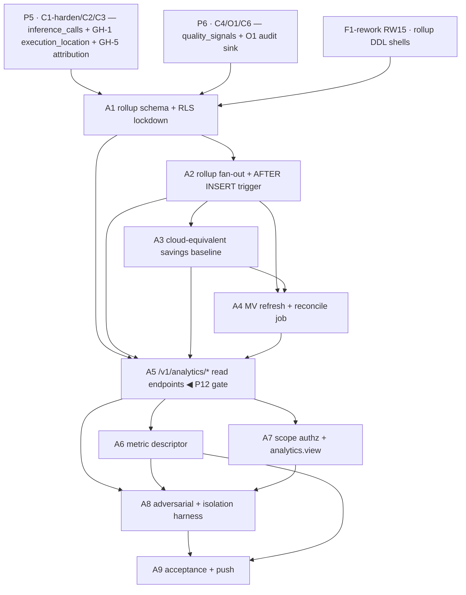

# Phase 5a · Analytics & cost insights (O2) — Implementation Plan

> **For agentic workers:** REQUIRED SUB-SKILL: `superpowers:subagent-driven-development`; TDD per `superpowers:test-driven-development` (write the failing SQL/Rust test first). Steps use checkbox (`- [ ]`) syntax. **Heavy Rust builds run via a BACKGROUND shell (controller), not inside a subagent** (the `services/gateway` + `sensei-*` + `sqlx` compile is minutes; the watchdog will kill a subagent). Subagents WRITE code + tests; the controller compiles, runs `dbd`, and runs the live E2E. DB changes go through **dbd** (`dbd reset && dbd apply && dbd import` — no migrations pre-v1, per `project_db_workflow`).

**Goal:** From the **one authoritative `inference_calls` ledger** (joined to `quality_signals`, the catalog/pricing tables, and the `budget_nodes` tree), serve tenant/RLS-scoped read-only analytics that back the W1 Overview, W2 spend chips + Activity, and O3 plane-split fleet views — with (a) **per-scope spend** grouped by org→dept→team→user **without recursive joins** (denormalized attribution columns from GH-5), and (b) a **local-vs-cloud savings** number where every `$0` local call has a defensible cloud-equivalent dollar figure derived from `execution_location` (GH-1) + the cheapest cloud step in its capability chain. O2 owns **no** hot-path write, **no** enforcement, and **no** second cost table; it maintains only reconstructable rollup artifacts reconciled against the immutable ledger.

**Acceptance gate (roadmap P12):** `GET /v1/analytics/spend?group_by=team|user` returns per-scope spend **without recursive joins** (verified by query plan: no recursive CTE), and the local-vs-cloud savings dashboard attributes **`$0` local vs cloud cost from `execution_location`** (each `execution_location='local'` call → `cost_usd=0`, `cloud_equiv_usd>0`, `savings_usd=cloud_equiv_usd−cost_usd`).

**Architecture:** O2 is a **pure consumer** — it does not touch `execute`/`execute_stream` or the `sensei-*` crate directly. It adds (1) DB-side derived artifacts in the F1 schema (`analytics_usage_daily`, `analytics_quality_daily` rollup **tables**; `analytics_model_mix_daily`, `analytics_overview_current` materialized **views**), refreshed by `service_role` functions (`analytics_rollup_apply`, `analytics_rollup_reconcile`) and an `AFTER INSERT` trigger on `inference_calls`; (2) read-only HTTP query endpoints mounted on the existing C1 `services/gateway` Axum service under `/v1/analytics/*`, tenant-scoped from the **verified credential** (never the body), served from the rollups on the hot path and on-the-fly against `inference_calls` for ad-hoc ranges; (3) a published, versioned `analytics-metrics.v1.json` descriptor so TS clients (W1/W2/O3) never hardcode metric keys. The cloud-equivalent savings baseline is computed **at rollup time** (snapshotted pricing) inside `analytics_rollup_apply`, not per read.

**Tech Stack:** Rust · Axum 0.8 (reuse C1's `services/gateway`) · `sqlx` 0.8 (postgres) · Postgres 15+ (rollup tables, materialized views, `REFRESH MATERIALIZED VIEW CONCURRENTLY`, `percentile_cont`, `AFTER INSERT` triggers, `SECURITY DEFINER` `service_role` functions) · `pg_cron` (or the existing scheduled-job runner) for the 60 s MV refresh + periodic reconcile · Supabase Postgres. No new gateway-crate dependency (O2 rides GH-1 + GH-5, both released by P5).

**Reference (adapt the patterns):** O2 spec `docs/specs/O2-analytics.md` (§3 data model, §4 contracts, §6 flows, §8 decisions, §9 acceptance) is authoritative for O2 behavior. C3 spec §3/§7/§10 for the `inference_calls` attribution columns (`budget_node_id`, `{org,dept,team,user}_node_id`, `execution_location`) + reconcile pattern (flow-10). C6 spec §3.3 for the `quality_signals` `signal_key` taxonomy + `quality-signals.v1.json` descriptor pattern to mirror. C1 `services/gateway` (phase-2a) for the Axum handler + `PgGatewayStore { tenant_id }` scoping + JWT/device-status middleware to reuse. F1-rework RW15 for the rollup-artifact DDL shells this phase finalizes.

---

## Prerequisites & decisions (confirm before executing)

### Prior-phase prerequisites (must be green)
1. **P5 (C1-harden, C2, C3)** — the hardened C1 gateway + `PgGatewayStore` write the `inference_calls` ledger with **GH-5 attribution columns** (`budget_node_id`, denormalized `org_node_id`/`dept_node_id`/`team_node_id`/`user_node_id`, `subject_id := budget_node_id`) and **GH-1 `execution_location`** (`local|cloud`); C3 owns the `budget_nodes` tree + `ModelPricing` catalog + reconcile pattern. **Without GH-5 the spend group-by would need recursive joins (gate fails); without GH-1 plane-split degrades to "unknown plane" and savings cannot be attributed.** Both are released by P5 — confirm `\d inference_calls` shows the columns before starting.
2. **P6 (C4, O1, C6)** — C6 writes `quality_signals` keyed to `inference_call_id`/`message_id` under the published `signal_key` taxonomy, **guaranteed W5-clean** (counts/labels/placeholders only — no prompt/response content); O1 owns the immutable audit ledger + retention policy (O2 emits `analytics.reconciled` into it and shares its retention window). C4 governance emits guardrail/redaction-hit signals O2 aggregates as *rates*.
3. **F1-rework RW15 (P3)** — the rollup-artifact **DDL shells** (`analytics_usage_daily`, `analytics_quality_daily`, `analytics_model_mix_daily`, `analytics_overview_current`) were introduced as reconstructable-cache tables/MVs. This phase **finalizes** their columns to O2 §3.2, adds the refresh functions/trigger/reconcile logic, RLS lockdown, and indexes. If RW15 landed only placeholder DDL, A1 reconciles it; if RW15 is absent, A1 authors it in full (dbd, additive).

### Crate / issue prerequisites
4. **GH-1 (per-step `plane` + execution-location on the trace)** — released before P2b/P5; supplies `execution_location` on `inference_calls`. O2 consumes, does not own. Confirm released.
5. **GH-5 (`inference_calls` ledger shape — attribution columns)** — released for C3/P5; supplies the denormalized org→dept→team→user columns O2 groups by without recursion. Confirm released. **No new gateway-repo issue is required by O2.**

### Front-loaded human inputs
6. **None new.** O2 is a read-only aggregation layer over metadata (token counts, cost, model names, node ids, latency, W5-clean signal counts). It reads **no** prompt/response content and **no** `router_credentials`, makes **no** paid provider call, and needs **no** new secret/approval. It rides the credentials/approvals already obtained for P2a/P4/P5. The only data-precondition is that the **pricing catalog** (`config.model_endpoints` costs + per-tenant overrides) is populated for the cloud models in tenants' chains so the savings baseline can price the counterfactual (a chain with no priced cloud step yields `savings_unpriced`, surfaced — never guessed).

### Decisions resolved (from O2 spec §8; restated as build constraints — zero TBDs)
7. **Savings baseline = "cheapest cloud step in the same capability chain, priced on the call's actual tokens, at call-time pricing."** Conservative floor (never overstates). Edge cases: **local-only chain** → `cloud_equiv_usd=0`, call counted separately as "local-only" (not inflated); **unpriced counterfactual** → call flagged `savings_unpriced`, excluded from the savings total, surfaced as a data-quality count (never guessed). *(§8 bullet 1.)*
8. **Pricing snapshotted at rollup time, not recomputed at read time** — `cloud_equiv_usd`/`savings_usd` stored on the rollup row using pricing in effect when the call ran; a later price edit triggers `analytics_rollup_reconcile` for the affected window, it does not silently shift history. *(§8 bullet 2.)*
9. **Precomputed rollups for the dashboard hot path; on-the-fly against `inference_calls` (under RLS) for ad-hoc ranges / drill-downs finer than the rollup grain.** One ledger, two read paths — never a second cost table. *(§8 bullets 3–4.)*
10. **Local calls: `cost_usd=0` to spend, `savings_usd>0` to savings — reported separately, never conflated.** Overview shows both "spend today" (actual) and "savings" (avoided). *(§8 bullet 5.)*
11. **Latency p95 approximated per-day at reconcile (`percentile_cont` over the day's rows) + exact on-the-fly for ad-hoc windows.** Rollup stores `latency_ms_sum`/`count` for exact averages + a per-bucket `latency_ms_p95`. *(§8 bullet 6.)*
12. **Analytics reads are gateway-mounted C1 routes** (device-status check + capability resolution + `PgGatewayStore` tenant scoping), not direct PostgREST — except trivial tenant-scoped `SELECT` on rollup tables which stays available under RLS for simple widgets. *(§8 bullet 7.)*
13. **`analytics.view` capability (F2-owned canonical set) gates cross-subtree/tenant-wide analytics; own-subtree needs none.** O2 mints **no new capability**; it references F2's set (shared with O1's audit gating). *(§8 bullet 8.)*
14. **No external billing/invoicing in v1** (mirrors C3 §10) — O2 shows internal metered spend + savings; emitting to a billing provider is a later product call, not a build blocker. *(§8 bullet 9.)*

---

## File structure

```
monorepo/
  services/gateway/                    # reuse the existing C1 Axum service (phase-2a)
    src/
      routes/
        analytics.rs                   # NEW: /v1/analytics/{overview,cost-trend,model-mix,plane-split,spend,quality,export}
        mod.rs                         # wire analytics routes under the auth'd /v1/* group
      analytics/
        mod.rs
        query.rs                       # pure SQL builders (group_by → column set; window → bounds) + unit tests
        model.rs                       # response DTOs matching O2 §4.1 JSON shapes
        descriptor.rs                  # serves analytics-metrics.v1.json (embedded, versioned)
    static/analytics-metrics.v1.json   # NEW: published metric descriptor (§4.2)
    tests/
      analytics_e2e.rs                 # #[ignore] live E2E: seed ledger → assert endpoint shapes + savings math
  database/
    ddl/table/public/
      analytics_usage_daily.ddl        # rollup table (finalize RW15 shell to O2 §3.2)
      analytics_quality_daily.ddl      # rollup table
    ddl/mview/public/
      analytics_model_mix_daily.ddl    # materialized view over analytics_usage_daily
      analytics_overview_current.ddl   # materialized view (per-tenant snapshot)
    functions/public/
      analytics_rollup_apply.sql       # SECURITY DEFINER; AFTER INSERT fan-out; idempotent on inference_call_id
      analytics_cloud_equiv.sql        # cheapest-cloud-step baseline pricing (§8) — helper for _apply/_reconcile
      analytics_rollup_reconcile.sql   # recompute a day from the ledger; correct drift; emit analytics.reconciled
      analytics_refresh_mviews.sql     # REFRESH MATERIALIZED VIEW CONCURRENTLY (scheduled + on-demand)
    triggers/public/
      inference_calls_analytics_ai.sql # AFTER INSERT ON inference_calls → analytics_rollup_apply(tenant, id)
    policies/
      analytics.sql                    # RLS: tenant-scoped SELECT; REVOKE INSERT/UPDATE/DELETE from authenticated/anon
    jobs/
      analytics_schedule.sql           # pg_cron: MV refresh (60s) + reconcile (periodic)
    tests/
      analytics.sql                    # rollup correctness + reconstructability + savings math + reconcile drift
      authz.sql                        # EXTEND RW12: cross-tenant 0-rows + authenticated-write-denied on analytics_*
```

---

## Feature A1 — Rollup schema finalization + RLS lockdown (dbd)

- **Layers:** DDL → grants → RLS → indexes
- **Depends on:** F1-rework RW15 (shells), P5 (`inference_calls` GH-1/GH-5 columns), P6 (`quality_signals`)
- **Decision:** O2 §3.2; DECISIONS §3 (one ledger, rollups are reconstructable cache); §3b.
- **Acceptance criteria (observable):**
  - `analytics_usage_daily` exists at grain `(tenant_id, day, budget_node_id, served_model, provider, capability, execution_location)` with columns `calls`, `input_tokens`, `output_tokens`, `cost_usd`, `cloud_equiv_usd`, `savings_usd`, `fallback_calls`, `latency_ms_sum`, `latency_ms_count`, `latency_ms_p95`, `local_only_calls`, `savings_unpriced_calls`; PK covers the grain tuple.
  - `analytics_quality_daily` exists at grain `(tenant_id, day, budget_node_id, served_model)` with `grounding_avg`, `judge_score_avg`, `retrieval_precision_avg`, `retrieval_recall_avg`, `guardrail_hit_calls`, `redaction_hit_calls`, `rated_calls`, `rating_avg`, `thumb_up`, `thumb_down`, `accept_calls`, `edit_calls`, `retry_calls`.
  - `analytics_model_mix_daily` (MV over `analytics_usage_daily`) and `analytics_overview_current` (per-tenant MV) exist with the O2 §3.2 columns; both created with a unique index so `REFRESH … CONCURRENTLY` is legal.
  - **Grants/RLS:** `authenticated` and `anon` have `INSERT`/`UPDATE`/`DELETE` **REVOKED** on every `analytics_*` table/MV; tenant-scoped `SELECT` RLS predicate `tenant_id = (auth.jwt()->>'tenant_id')::uuid`; `service_role` retains full access for the refresh functions.
  - Indexes support the endpoint reads: `(tenant_id, day)`, `(tenant_id, budget_node_id, day)`, `(tenant_id, served_model, day)` on `analytics_usage_daily`; matching on `analytics_quality_daily`.
  - Every `analytics_*` artifact is **reconstructable** — dropping and rebuilding it from `inference_calls` + `quality_signals` loses nothing (proven by A4's reconcile test).
- **Test scenarios (Given/When/Then):**
  - Given a fresh `dbd reset && dbd apply`, When the schema is enumerated, Then all four `analytics_*` artifacts exist with exactly the O2 §3.2 columns and the CONCURRENTLY-required unique indexes.
  - Given a tenant-A member JWT, When they `INSERT`/`UPDATE`/`DELETE` any `analytics_*` row via PostgREST, Then it is **denied** (grant revoked).
  - Given a tenant-A member JWT, When they `SELECT` `analytics_usage_daily`, Then only tenant-A rows return (0 rows for tenant B).
- **Implementation tasks:**
  - [ ] **A1.1 (test-first):** in `database/tests/analytics.sql`, add assertions that the four artifacts + columns + unique indexes exist and that `authenticated` write is denied (expect them to FAIL pre-implementation).
  - [ ] **A1.2:** author/reconcile `analytics_usage_daily.ddl` + `analytics_quality_daily.ddl` to O2 §3.2 (superset the RW15 shell; additive columns `local_only_calls`, `savings_unpriced_calls`, `latency_ms_p95`).
  - [ ] **A1.3:** author `analytics_model_mix_daily.ddl` + `analytics_overview_current.ddl` as MVs with unique indexes.
  - [ ] **A1.4:** `policies/analytics.sql` — tenant `SELECT` RLS + `REVOKE INSERT,UPDATE,DELETE … FROM authenticated, anon` on all `analytics_*`; add indexes.
  - [ ] **A1.5 (CONTROLLER):** `dbd reset && dbd apply && dbd import` green; `database/tests/analytics.sql` A1 assertions pass.
  - [ ] **A1.6:** commit — `feat(o2): finalize analytics rollup tables + MVs + RLS lockdown (dbd)`.

---

## Feature A2 — Incremental rollup fan-out (`analytics_rollup_apply`) + `AFTER INSERT` trigger

- **Layers:** function → trigger → tests
- **Depends on:** A1
- **Decision:** O2 §3.2 refresh strategy, §4.3, §6 flow-1; §9 AC-2 (idempotent on `inference_call_id`).
- **Acceptance criteria (observable):**
  - `analytics_rollup_apply(p_tenant uuid, p_call_id uuid)` (`SECURITY DEFINER`, `service_role`) reads the one `inference_calls` row (+ its `quality_signals`) and **upserts** the matching `analytics_usage_daily` bucket (increment `calls`, `input_tokens`, `output_tokens`, `cost_usd`, `fallback_calls`, `latency_ms_sum`, `latency_ms_count`) and the `analytics_quality_daily` bucket (accumulate grounding/judge/rate aggregates from the C6 `signal_key` taxonomy — never hardcoded keys).
  - **Idempotent on `inference_call_id`:** applying the same call twice does **not** double-count (an applied-calls ledger/marker or a `NOT EXISTS` guard keyed on `inference_call_id`).
  - An `AFTER INSERT` trigger on `inference_calls` calls `analytics_rollup_apply(NEW.tenant_id, NEW.id)` so a completed call lands in the rollup with no application code path.
  - The `cloud_equiv_usd`/`savings_usd` accrual is delegated to A3's baseline helper (called inside `_apply`) so savings are stored, not recomputed per read.
- **Test scenarios (Given/When/Then):**
  - Given a cloud `inference_calls` row (`cost_usd=0.0041`, node attribution, model `sonnet-4.6`, `execution_location='cloud'`), When it is inserted, Then `analytics_usage_daily` for `(tenant, day, node, sonnet-4.6, anthropic, chat, cloud)` shows `calls=1`, `cost_usd=0.0041`.
  - Given the same call is re-applied via `analytics_rollup_apply` (a replayed reconcile), When it runs, Then the bucket is **unchanged** (idempotent — no double count).
  - Given a call with a `quality_signals` grounding=0.86 + judge=0.91 batch, When applied, Then `analytics_quality_daily` reflects the weighted grounding/judge averages and increments the relevant count columns.
- **Implementation tasks:**
  - [ ] **A2.1 (test-first):** `analytics.sql` — insert a known cloud call, assert the usage/quality bucket values; re-apply, assert idempotency (FAIL first).
  - [ ] **A2.2:** author `analytics_rollup_apply.sql` — upsert usage + quality buckets from the ledger + signals; idempotency guard on `inference_call_id`; read C6 keys via the taxonomy (join, not literals).
  - [ ] **A2.3:** author `triggers/public/inference_calls_analytics_ai.sql` — `AFTER INSERT` fan-out.
  - [ ] **A2.4 (CONTROLLER):** `dbd apply`; run `analytics.sql` A2 cases green.
  - [ ] **A2.5:** commit — `feat(o2): incremental rollup fan-out + AFTER INSERT trigger (idempotent)`.

---

## Feature A3 — Cloud-equivalent savings baseline (`analytics_cloud_equiv`) ◀ headline claim

- **Layers:** function → tests
- **Depends on:** A2; P5 (`execution_location`, catalog/`ModelPricing`, `fallback_chains`+`plane`)
- **Decision:** O2 §8 bullet 1–2, §6 flow-3, §9 AC-3/AC-4.
- **Acceptance criteria (observable):**
  - For an `execution_location='local'` call (`cost_usd=0`), `analytics_cloud_equiv` resolves the **capability chain that served it**, selects the **cheapest cloud (`plane='cloud'`) model bound in that chain**, and prices the call's **actual** `input_tokens`/`output_tokens` at that model's **call-time-snapshotted** `ModelPricing` → `cloud_equiv_usd > 0`; `savings_usd = cloud_equiv_usd − cost_usd` (≥ 0).
  - For a cloud call, `cloud_equiv_usd = cost_usd` and `savings_usd = 0`.
  - **Edge — local-only chain (no cloud step):** `cloud_equiv_usd = 0`; call excluded from savings and counted in `local_only_calls` (not inflated).
  - **Edge — unpriced counterfactual (chosen cloud model has no `ModelPricing`):** call flagged, counted in `savings_unpriced_calls`, excluded from the savings total; **never guessed**.
  - **Conservative-floor property:** for a fixed ledger, `savings_usd` computed against the *cheapest* cloud step ≤ the figure against any other cloud step in the chain.
  - Pricing is snapshotted at rollup time (the baseline reads the pricing effective at `inference_calls.created_at`), so a later catalog price edit does not silently shift historical savings (it triggers A4 reconcile instead).
- **Test scenarios (Given/When/Then):**
  - Given a local call (in=512, out=128) on a chain whose cheapest cloud step is `sonnet-4.6` at known `$/token`, When rolled up, Then `cloud_equiv_usd` equals `512·in_rate + 128·out_rate` and `savings_usd = cloud_equiv_usd` (since `cost_usd=0`).
  - Given a local call on a **local-only** chain, When rolled up, Then `cloud_equiv_usd=0`, `savings_usd=0`, and `local_only_calls` increments.
  - Given a local call whose cheapest cloud step lacks pricing, When rolled up, Then the call is excluded from `savings_usd` and `savings_unpriced_calls` increments (no phantom price).
  - Given a chain with two cloud steps priced differently, When savings are computed, Then the stored `savings_usd` uses the cheaper step (≤ the pricier-step figure).
- **Implementation tasks:**
  - [ ] **A3.1 (test-first):** `analytics.sql` — the four savings cases above with known token/price fixtures (FAIL first).
  - [ ] **A3.2:** author `analytics_cloud_equiv.sql` — resolve chain → cheapest priced cloud step → price actual tokens at snapshotted pricing; return `(cloud_equiv_usd, is_local_only, is_unpriced)`.
  - [ ] **A3.3:** wire it into `analytics_rollup_apply` (A2) so `cloud_equiv_usd`/`savings_usd`/`local_only_calls`/`savings_unpriced_calls` accrue on the usage bucket.
  - [ ] **A3.4 (CONTROLLER):** `dbd apply`; A3 savings cases green.
  - [ ] **A3.5:** commit — `feat(o2): cloud-equivalent savings baseline (cheapest-cloud-step, snapshotted pricing)`.

---

## Feature A4 — Materialized-view refresh + reconciliation job (`analytics_rollup_reconcile`)

- **Layers:** function → job schedule → tests → audit emit
- **Depends on:** A2, A3; O1 (`analytics.reconciled` audit sink)
- **Decision:** O2 §3.2 refresh strategy, §4.3, §6 flow-8, §9 AC-1/AC-11; DECISIONS §3 (rollups are a reconstructable cache reconciled against the immutable ledger).
- **Acceptance criteria (observable):**
  - `analytics_refresh_mviews()` runs `REFRESH MATERIALIZED VIEW CONCURRENTLY analytics_model_mix_daily` + `analytics_overview_current`; scheduled every **60 s** (default) via `pg_cron` and callable on-demand for the Overview load.
  - `analytics_rollup_reconcile(p_tenant uuid, p_day date)` **recomputes** that day's `analytics_usage_daily` + `analytics_quality_daily` from `inference_calls` + `quality_signals` alone (including re-pricing savings via A3), compares to the maintained rollup, and **corrects drift**; `latency_ms_p95` is computed here via `percentile_cont(0.95)` over the day's rows.
  - Drift beyond a configured tolerance emits an `analytics.reconciled` **audit row to O1** (mirrors C3 flow-10 `budget.reconciled`) so a corrected number is itself auditable.
  - **Reconstructability:** zeroing all `analytics_*` rollups and running `analytics_rollup_reconcile` for every tenant/day reproduces **identical** figures from the ledger alone (proves rollups add no source of truth).
  - Reconcile is **idempotent** — running it twice for the same day yields the same result and does not double-count (via A2's `inference_call_id` idempotency + full recompute semantics).
- **Test scenarios (Given/When/Then):**
  - Given a rollup with all `analytics_*` rows deleted, When `analytics_rollup_reconcile` runs for each day, Then every endpoint's figures match a direct `SELECT … FROM inference_calls` for the same window/scope (AC-1 reconstructability).
  - Given an **out-of-band** `inference_calls` row inserted directly (e.g. a C3 device-usage reconciliation, flow-7), When `analytics_rollup_reconcile` runs for that day, Then the affected day's rollup is corrected **and** one `analytics.reconciled` audit row exists in O1.
  - Given a catalog **price back-fill** changing a cloud model's `ModelPricing`, When reconcile runs for the affected window, Then `cloud_equiv_usd`/`savings_usd` are recomputed at the corrected pricing and the drift is audited.
- **Implementation tasks:**
  - [ ] **A4.1 (test-first):** `analytics.sql` — reconstructability (zero-then-reconcile-equals-ledger), out-of-band-row-drift-corrected, price-backfill-recompute (FAIL first).
  - [ ] **A4.2:** author `analytics_rollup_reconcile.sql` (full-recompute-from-ledger + drift correction + `percentile_cont` p95 + `analytics.reconciled` emit) and `analytics_refresh_mviews.sql`.
  - [ ] **A4.3:** author `jobs/analytics_schedule.sql` — `pg_cron` 60 s MV refresh + periodic reconcile (per-tenant, current + prior day).
  - [ ] **A4.4 (CONTROLLER):** `dbd apply`; A4 cases green; confirm `REFRESH … CONCURRENTLY` succeeds against the unique indexes.
  - [ ] **A4.5:** commit — `feat(o2): MV refresh + reconcile job (reconstructable cache, drift audited to O1)`.

---

## Feature A5 — Analytics read endpoints (C1-mounted, tenant/RLS-scoped, read-only)

- **Layers:** Rust routes → SQL query builders → DTOs → tests
- **Depends on:** A1–A4 (rollups populated); C1 `services/gateway` (JWT + device-status middleware + `PgGatewayStore`)
- **Decision:** O2 §4.1, §6 flows 2/4/5/6/7/9, §9 AC-5/AC-6/AC-7/AC-8/AC-13; **roadmap P12 gate.**
- **Acceptance criteria (observable):**
  - The following endpoints mount under the auth'd `/v1/*` group in `services/gateway`, tenant-scoped from the **verified credential** (never the body): `GET /v1/analytics/overview`, `/cost-trend`, `/model-mix`, `/plane-split`, `/spend`, `/quality`, `/export`. JSON shapes match O2 §4.1 exactly.
  - **`GET /v1/analytics/spend?group_by=org|dept|team|user|model|provider|capability&scope_node_id=…`** groups by the **denormalized attribution columns** — verified by `EXPLAIN` showing **no recursive CTE / no `WITH RECURSIVE`**; each node's `cost_usd` equals the ledger sum for that subtree. **(Gate half 1.)**
  - **`GET /v1/analytics/plane-split`** returns `local` (`cost_usd=0`, `cloud_equiv_usd>0`), `cloud`, `savings_usd = Σ cloud_equiv_usd(local)`, `savings_pct`, and a `baseline` label, all keyed off `execution_location`. **(Gate half 2.)**
  - `overview` served from `analytics_overview_current` (≤60 s stale) with spend-today (+cap+pct), calls-today (+delta), fallbacks (outage/budget split), latency avg+p95, blended cost/call 14d (+delta), savings-14d.
  - `model-mix` returns per-model `calls` + `share_pct` (summing ~100% for the window) tagged by provider + `execution_location`; `cost-trend` returns the blended-cost-per-call series + `delta_pct`; `quality` returns grounding/judge/guardrail-hit/redaction-hit/rating aggregates from `quality_signals`.
  - **Two read paths:** day-or-coarser + current-period reads hit the rollups; arbitrary date ranges / drill-downs finer than the rollup grain run **on-the-fly** against `inference_calls` under RLS (exact `percentile_cont` for ad-hoc latency).
  - Error surface: `400` on bad `window`/`group_by`/`bucket`; `422` on unknown metric key; `403 {error:"capability_required",capability:"analytics.view"}` for out-of-subtree scope without the capability (A7).
  - `/export?report=…&format=csv|json` streams **aggregated** rollups only — there is **no** O2 path to export raw per-call rows (that is O1), enforced by a contract test.
- **Test scenarios (Given/When/Then):**
  - Given a seeded ledger with team/user attribution, When `GET /v1/analytics/spend?group_by=team`, Then rows are grouped by `team_node_id` with `cost_usd` = the per-team ledger sum **and** `EXPLAIN` shows no recursive CTE.
  - Given local calls with `cost_usd=0` on cloud-bearing chains, When `GET /v1/analytics/plane-split`, Then `local.cost_usd=0`, `local.cloud_equiv_usd>0`, `savings_usd=Σ cloud_equiv_usd`, and `baseline="cheapest_cloud_in_chain"`.
  - Given `window` omitted or malformed, When any endpoint is called, Then `400`; Given `report=raw-calls`, When `/export` is called, Then it is rejected (no raw-row export).
  - Given C6 capture disabled (empty `quality_signals`), When `GET /v1/analytics/quality`, Then quality panels are empty **while** cost panels still populate from the ledger (proves the C6 dependency is isolated).
- **Implementation tasks:**
  - [ ] **A5.1 (test-first):** `analytics_e2e.rs` (`#[ignore]`, opt-in) — seed a small ledger via `PgGatewayStore`, assert each endpoint's shape + the two gate assertions (spend no-recursion via `EXPLAIN`, plane-split savings math). Rust unit tests in `analytics/query.rs` for the pure `group_by → column`/`window → bounds` builders (no DB).
  - [ ] **A5.2:** `analytics/query.rs` — pure builders mapping `group_by` to the denormalized column (e.g. `team` → `team_node_id`), `window`/`bucket` to date bounds, rollup-vs-on-the-fly path selection; unit-tested.
  - [ ] **A5.3:** `analytics/model.rs` — response DTOs matching O2 §4.1; `routes/analytics.rs` — the seven handlers reading rollups (hot path) / `inference_calls` (ad-hoc) via `PgGatewayStore { tenant_id: claims.tenant_id }`; CSV/JSON export streaming aggregates only.
  - [ ] **A5.4:** wire `analytics` routes into `routes/mod.rs` under the auth'd `/v1/*` group (JWT + device-status middleware applies).
  - [ ] **A5.5 (CONTROLLER, background):** `cargo build -p` the gateway crate; `cargo test` the pure builders; run the `#[ignore]` E2E against the seeded DB; capture `EXPLAIN` for the spend query (assert no recursive CTE) + the plane-split JSON.
  - [ ] **A5.6:** commit — `feat(o2): /v1/analytics/* read endpoints (spend no-recursion + plane-split savings) — P12 gate`.

---

## Feature A6 — Published metric descriptor (`analytics-metrics.v1.json`)

- **Layers:** static asset → route → client-contract test
- **Depends on:** A5
- **Decision:** O2 §4.2, §9 AC-12 (descriptor-driven client); mirrors C6 `quality-signals.v1.json`.
- **Acceptance criteria (observable):**
  - `analytics-metrics.v1.json` enumerates every metric key with `unit` (`usd`/`ms`/`percent`/`ratio`/`count`), `dimension`, and `source` (`ledger`/`quality-signal`/`derived`), plus a `schema_version`.
  - A `GET /v1/analytics/metrics` (or static-served) endpoint returns the descriptor; W1/W2/O3 TS clients render metric labels/units **from the descriptor**, hardcoding no keys.
  - Adding a metric **bumps `schema_version` additively** without breaking an existing client (no key removed/renamed in-version).
- **Test scenarios (Given/When/Then):**
  - Given a client rendering purely from `analytics-metrics.v1.json`, When it loads, Then all metrics show with correct units and no hardcoded keys.
  - Given a new metric is added, When the descriptor is published, Then `schema_version` increments and an existing client still renders its known metrics unchanged.
  - Given a metric key not present in the descriptor is requested, When an endpoint receives it, Then `422 unknown metric key`.
- **Implementation tasks:**
  - [ ] **A6.1 (test-first):** a contract test asserting every metric key returned by the endpoints appears in the descriptor with a valid unit/source, and vice-versa (no orphan keys).
  - [ ] **A6.2:** author `static/analytics-metrics.v1.json` + `analytics/descriptor.rs` (embed + serve); reject unknown keys with `422`.
  - [ ] **A6.3 (CONTROLLER):** build; contract test green.
  - [ ] **A6.4:** commit — `feat(o2): publish analytics-metrics.v1.json descriptor (versioned, client-driven)`.

---

## Feature A7 — Scope authz + `analytics.view` capability gating

- **Layers:** authz resolution → route guard → tests
- **Depends on:** A5; F2 (canonical capability set; `role_permissions`; JWT `role_ids`)
- **Decision:** O2 §5 (scope authz), §8 bullet 8, §9 AC-9; DECISIONS RBAC default (capabilities resolved server-side).
- **Acceptance criteria (observable):**
  - A member reads analytics for **their own** `budget_node` subtree (their leaf + descendants they own) **without** any special capability.
  - Viewing **tenant-wide** or **another subtree's** spend/quality requires the F2-owned **`analytics.view`** capability, resolved **server-side** from `role_permissions` via the JWT `role_ids` — the JWT carries no raw analytics grant. O2 mints **no new capability**.
  - A reader requesting a `scope_node_id` outside their permitted subtree without `analytics.view` gets `403 {error:"capability_required",capability:"analytics.view"}`.
  - Scope narrowing/widening is enforced on **every** analytics endpoint (overview/cost-trend/model-mix/plane-split/spend/quality/export), not just `/spend`.
- **Test scenarios (Given/When/Then):**
  - Given a member whose leaf node is `team:Payments` **without** `analytics.view`, When they `GET /v1/analytics/spend?scope_node_id=<own leaf>`, Then it succeeds; When they request a sibling team's `scope_node_id`, Then `403`.
  - Given an admin **with** `analytics.view`, When they request any tenant subtree, Then it succeeds.
  - Given a member requesting `overview` (tenant-wide by nature) **without** `analytics.view`, Then the response is scoped to their subtree (or `403` for the tenant-wide cards) — never leaks other subtrees.
- **Implementation tasks:**
  - [ ] **A7.1 (test-first):** `analytics_e2e.rs` — own-subtree-succeeds, out-of-subtree-403, admin-with-capability-succeeds (FAIL first).
  - [ ] **A7.2:** implement a `scope_guard(claims, scope_node_id) -> Result<ScopedNodeSet, 403>` in `analytics/mod.rs` — resolves the caller's subtree, checks `analytics.view` for wider scope; apply in every handler before querying.
  - [ ] **A7.3 (CONTROLLER):** build; A7 cases green.
  - [ ] **A7.4:** commit — `feat(o2): scope authz + analytics.view capability gating (own-subtree free)`.

---

## Feature A8 — Adversarial + tenant-isolation test harness (extends RW12)

- **Layers:** tests (SQL + Rust)
- **Depends on:** A1–A7
- **Decision:** O2 §5 (tenant isolation, no secret surface), §9 AC-9/AC-10/AC-13; extends F1-rework RW12.
- **Acceptance criteria (observable):**
  - `database/tests/authz.sql` (RW12 harness) is **extended** to cover `analytics_*` tables + the analytics endpoints: a tenant-A reader gets **0 rows** for tenant B on every rollup table and every endpoint; `authenticated` INSERT/UPDATE/DELETE on `analytics_*` is **denied**.
  - **No secret/PII surface:** no analytics endpoint returns prompt/response content or `router_credentials` material — only aggregated metadata + W5-clean signal counts. A test asserts the response schema contains no free-text content field.
  - The harness **fails loudly** naming any reopened hole (e.g. a re-granted `authenticated` write on `analytics_usage_daily`), runnable in CI.
- **Test scenarios (Given/When/Then):**
  - Given tenant-A JWT, When any analytics endpoint or rollup `SELECT` is issued for tenant-B data, Then 0 rows.
  - Given a regression that grants `authenticated` INSERT on an `analytics_*` table, When the harness runs, Then it **fails** and names the table.
  - Given any endpoint response, When inspected, Then it contains only metadata/counts — no prompt/response text, no credential material.
- **Implementation tasks:**
  - [ ] **A8.1:** extend `database/tests/authz.sql` with cross-tenant 0-rows + write-denied assertions on all `analytics_*`.
  - [ ] **A8.2:** add a Rust contract test asserting no analytics DTO carries a content/secret field.
  - [ ] **A8.3 (CONTROLLER):** run the full harness in CI mode; green.
  - [ ] **A8.4:** commit — `test(o2): adversarial + tenant-isolation harness for analytics (extends RW12)`.

---

## Feature A9 — Acceptance, docs, cleanup, push

- **Layers:** E2E → docs → cleanup
- **Depends on:** A1–A8
- **Acceptance criteria:** the **roadmap P12 gate** demonstrably passes end-to-end; docs updated; workspace clean; pushed to `develop`.
- **Implementation tasks:**
  - [ ] **A9.1 (CONTROLLER):** full E2E — seed a ledger with mixed local/cloud calls across a `budget_nodes` tree (org→dept→team→user) + `quality_signals`; run the trigger fan-out + reconcile; then: (a) `GET /v1/analytics/spend?group_by=team` and `?group_by=user` → assert per-scope sums match the ledger **and** capture `EXPLAIN` proving no recursive join; (b) `GET /v1/analytics/plane-split` → assert `$0` local `cost_usd`, `cloud_equiv_usd>0` from `execution_location`, and `savings_usd=Σ cloud_equiv_usd`. Record both outputs.
  - [ ] **A9.2:** `services/gateway/README.md` — document the `/v1/analytics/*` endpoints, the descriptor, the rollup/reconcile jobs, and the "rollups are a reconstructable cache reconciled against the immutable ledger" invariant.
  - [ ] **A9.3:** update `docs/modules/O2-analytics.md` open-questions section — mark "precomputed vs on-the-fly" and "how local $0 factors into savings" **resolved** (point to O2 spec §8); leave the three genuine open questions (BYOK/discounted cloud pricing baseline, session-only Playground experiment counting, long-horizon rollup grain/retention) flagged as deferred.
  - [ ] **A9.4:** `make clean`; `bun run test`/`check`/`lint` green; `cargo build` workspace green; commit (`chore(phase5a): acceptance — O2 serves per-scope spend + local-vs-cloud savings`); **push `develop`**.

---

## Dependency graph



**Suggested build order:** A1 → A2 → A3 → A4 → A5 → (A6, A7 in parallel) → A8 → A9.

Rationale: the DB layer is the foundation and must be reconstructable-correct before any endpoint reads it (A1→A4), so bugs surface as SQL-test failures, not endpoint flakiness. A3 (savings baseline) is on the critical path because it is half the P12 gate and is exercised by both A2 (accrual) and A4 (recompute). A5 lands both gate halves once the rollups are trustworthy. A6 (descriptor) and A7 (authz) are independent refinements over A5. A8 (adversarial harness) runs last to lock every hole shut and must be green before A9 pushes.

---

## Self-review notes (author)

- **Spec coverage** (O2 spec §1–§9): aggregation catalog + rollup layer (A1), incremental fan-out (A2), savings baseline (A3), refresh + reconcile (A4), read contracts §4.1 (A5), metric descriptor §4.2 (A6), security/RLS/scope authz §5 (A7 + A8), all 13 acceptance criteria §9 mapped across A1–A8. The refresh job §4.3 lives in A2/A4; the flows §6 map: flow-1→A2, flow-3→A3, flows-2/4/5/6/7/9→A5, flow-8→A4.
- **Acceptance-gate mapping (roadmap P12):** *spend without recursive joins* → A5 AC + A5.5 `EXPLAIN` assertion (denormalized GH-5 columns, no `WITH RECURSIVE`); *`$0` local vs cloud from `execution_location`* → A3 (baseline) + A2 (accrual) + A5 plane-split endpoint + A9.1 E2E. Both are proven by opt-in E2E with captured output.
- **Deferred (flagged, not TBD):** external billing/invoicing (§8 bullet 9 — later product call); per-tenant effective/BYOK cloud pricing for the savings baseline (spec §10 open q — v1 uses catalog list pricing with a `baseline` disclosure label); session-only Playground experiment counting (spec §10, tied to C6 §10); long-horizon month-grained rollups + retention past 90 days (spec §10, tied to O1 retention). All three are genuine open questions carried forward, not build blockers.
- **No new gateway-repo issue.** O2 rides GH-1 (execution_location) + GH-5 (attribution), both released by P5. O2 touches the crate **not at all** — it reads the SQL artifacts C1/C3/C6 persist.
- **One-ledger discipline:** O2 reads only `inference_calls` (+ `quality_signals`); the retired `gateway_tasks` cost fields are never read (asserted in A4 reconstructability test); rollups are an explicitly reconstructable cache, never a second source of truth.
- **Biggest risks:** (a) GH-5/GH-1 columns actually present on `inference_calls` after P5 — confirm `\d inference_calls` before A1; (b) the pricing catalog populated for tenants' cloud chain steps so the baseline prices the counterfactual (else `savings_unpriced` — surfaced, not silent); (c) `REFRESH MATERIALIZED VIEW CONCURRENTLY` requires the unique indexes from A1 (checked in A4.4); (d) reconcile idempotency + drift tolerance tuning (A4) — keep the tolerance auditable via `analytics.reconciled`; (e) `pg_cron` availability on the Supabase project for the 60 s refresh — fall back to the existing scheduled-job runner if absent.
- **Type/contract consistency:** `claims.tenant_id` (C1 auth) → `PgGatewayStore { tenant_id }` (A5) → RLS predicate on `analytics_*` (A1); `group_by` enum (A5 query builder) → denormalized column names matching C3/GH-5 (`{org,dept,team,user}_node_id`); metric keys (A5 responses) ⇔ `analytics-metrics.v1.json` (A6, contract-tested); `signal_key` reads (A2) via C6's published taxonomy, never literals.
