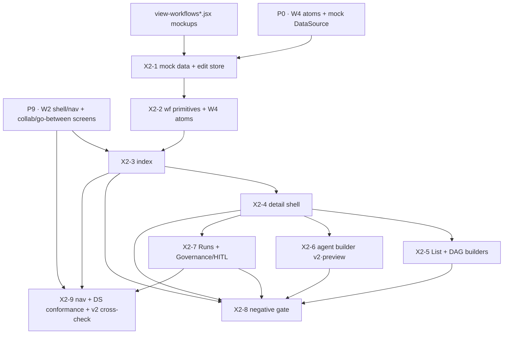

# Phase 5b · P13 — Agents & workflows (design-only) [X2] — Implementation Plan

> **For agentic workers:** REQUIRED SUB-SKILL: `superpowers:test-driven-development` (TDD — write the
> `*.spec.svelte.js` / E2E spec first, watch it fail, then implement). Svelte work goes through the
> `svelte:svelte-code-writer` skill + the Svelte MCP autofixer. Screens are **ported from the canonical
> mockups** (`docs/mockups/app/view-workflows*.jsx`) — they are **not** re-invented (X2 spec §8; the
> "not in the current mockups" claim is FALSE and corrected). This phase touches **no database, no
> service, no gateway crate** — it is a pure client surface with a **negative build gate** (X2-8). Do
> NOT wire any HTTP/RPC/IPC call from these screens.

**Goal.** A member opens **Workflows** in the desktop/member console and sees the ported Workflows
index (cards, metrics strip incl. *Needs review*, filters, share tags), can open a workflow into its
detail (Builder / Runs / Governance tabs), can author steps in the **List** and **DAG Canvas**
builders, and can open an `agent`-kind workflow into the **agent builder** badged **`agent · v2`** with
editing disabled — all rendered **from a mock/localStorage data layer**, with **no** backend call,
**no** `plans`/`planned_tasks`/`planned_task_interactions` tables, and **no** `/v1/agents` endpoint in
existence. This satisfies the P13 acceptance gate verbatim: *the Workflows + agent-builder screens
render from mock data with the "agent · v2" badge; no runtime execution path or runtime tables exist.*

**Architecture.** SvelteKit + Svelte 5 (Runes) + Rokkit, inside the existing desktop member console
(`apps/desktop`, reused verbatim from W2). The two mockups become:
(1) a shared **`wf` primitives module** (step/trigger/run-status metadata + `ToolChip` + helpers) — the
Svelte analogue of the mockup's `window.ToriiWF`; (2) a set of route components under
`(app)/workflows`. Data comes **only** from the mock `DataSource` (`@torii/core` — extends the
existing `packages/core/src/mock` layer with `WORKFLOWS` + `TOOLS` fixtures) plus a
**localStorage-backed edit store** that mirrors the mockup's create/patch/toggle/share/flow behaviour
(mockup-local persistence only). The screens **never** import `$lib/gateway.js` (the C1 client) — the
absence of a network call is an asserted invariant (X2-8).

**Tech stack.** SvelteKit · Svelte 5 Runes · Rokkit (W4 named-token vocab: `paper`/`ink`/`primary`/
`primary-soft`) · UnoCSS presetRokkit · Zod (fixture schemas, `@torii/core`) · Vitest
(`*.spec.svelte.js`) · Playwright + `@srsholmes/tauri-playwright` (E2E via the `tauriPage` fixture).

---

## Prerequisites & front-loaded inputs

| Kind | Item | State for P13 |
|---|---|---|
| **Prior phase** | **P0** (W4 design system + `packages/ui` atoms + `packages/core` mock data layer + Rokkit skin/tokens) | **Required.** Provides the atom set + the swappable mock `DataSource` this phase extends. |
| **Prior phase** | **P9** (W2 member-console breadth — shell, nav **Tools** group, Library document workspace incl. the design-only *collaborative-doc* + *go-between* surfaces, per W2 §6.7) | **Required.** P13 mounts into the P9 shell/nav; the collaborative-edit + go-between **screens** already ship in P9/P7 — P13 only **cross-checks their v2 badging** (X2-9), it does **not** re-build them. |
| **Existing assets** | `docs/mockups/app/view-workflows.jsx` + `view-workflows-builder.jsx` (+ `data.jsx` `WORKFLOWS`/`TOOLS`/`WF()`) | **Present** (verified on disk). Canonical source of the port. |
| **Crate issue (GH-x)** | none | X2 **v1 consumes the `sensei-*` crate not at all** (X2 spec §7). All crate deps (GH-1/4/6/7) are **v2** and already filed for other modules — **nothing to file here.** |
| **Human secret / approval** | none | Design-only, no provider call, no spend, no secret. **No front-loaded human input.** |

**Not in P13 build scope (owned elsewhere, noted so it is not gold-plated here):**
- The **v2 agent runtime** — ReAct loop, DAG scheduler, HITL routing/enforcement, agent-driven doc
  edits, the interaction-intelligence go-between optimizer, `/v1/agents`/`/v1/plans` endpoints, and the
  `plans`/`planned_tasks`/`planned_task_interactions`/`hitl_approvals`/`document_collaborators`/
  `doc_comments`/`doc_suggestions` tables (X2 spec §3.3/§4b/§6b — **v2**).
- The **collaborative-doc design-only screens** and the **go-between affordance previews** — their
  *screens* are built in **W2 (P9)** / **C5 (P7)** (W2 §6.7); P13 only verifies badging (X2-9).
- **Admin** Workflows visibility, agent governance policy editors — none in v1.

---

## Decisions resolved (residuals → rationale; conform to DECISIONS)

- **PD1 — Design-only, zero runtime.** *Rationale:* DECISIONS §1(#3) + X2 spec §8. P13 ships screens
  only; no agent executes, no runtime table ships, no metered agent call occurs. Enforced as a build
  gate (X2-8).
- **PD2 — Data source is mock + localStorage, never the gateway.** *Rationale:* the mockup persists
  edits to `localStorage`; DECISIONS §2 W1 + X2 §3.1 make workflow state **mockup-local** in v1 (no
  PostgREST, no `/rpc/*`, no gateway RPC). P13 extends the existing `packages/core` **mock**
  `DataSource` (the swappable layer from P0) with `WORKFLOWS`/`TOOLS`; user edits persist to
  `localStorage` under keys `zs-wf-*` (parity with the mockup). The Supabase adapter of the DataSource
  gets **no** workflow method in v1.
- **PD3 — Nav owner = member console → Tools group; label "Workflows".** *Rationale:* W2 §DW4 +
  `app.jsx` nav + X2 §8. The route is `(app)/workflows` (+ `/workflows/[id]` for detail); it lives in
  the **Tools** nav group (P9's grouped nav). If P9's nav is still the flat list at build time,
  "Workflows" is already present — X2-9 confirms the grouped placement or files a one-line W2 follow-up
  (does not block P13).
- **PD4 — Agent runtime badged `agent · v2` (index) / `v2 · preview` (builder); editing disabled;
  "Run now"/"Preview" is a no-op.** *Rationale:* X2 §9 AC-2 + the mockup badges. `agent`-kind cards
  show `agent · v2`; the detail header shows `agent · v2 preview`; the agent builder panel shows
  `v2 · preview` with all controls disabled; the primary button reads **"Preview"** (not "Run now") and
  performs **no** action.
- **PD5 — Classic-workflow "Run now" is mockup-local only.** *Rationale:* X2 §9 AC-3. Clicking "Run
  now" on a `flow`-kind workflow flips a transient "Queued" label for ~1.6s and mutates **nothing** —
  no run row is created, no backend called. (Kept faithful to the mockup's optimistic label.)
- **PD6 — Exec-location badge is plane-driven, not provider-derived.** *Rationale:* DECISIONS §3 +
  mockup-review #49 + W2 §DW2. Where the Runs "What ran" panel shows an `ExecBadge`, it is driven by a
  `plane` prop on the (mock) run/step, **never** by `route==='Ollama'`. Mock runs carry an explicit
  `plane` field.
- **PD7 — Route the detail via a URL id, not in-page state only.** *Rationale:* the mockup opens the
  detail in-page (`openId`); the Svelte port uses `(app)/workflows/[id]` so deep-linking, the back
  button, and E2E navigation work in the built Tauri WKWebView (matches the repo's routing pattern).
  The index still supports click-to-open.
- **PD8 — Reuse existing atoms; add missing W4 atoms in `packages/ui`.** *Rationale:* the mockup uses
  `Switch`, `Meter`, `PageHeader`, `WorkspaceChip`, `Icon` — only `ExecBadge`/`Pill`/shell atoms exist
  in `@torii/ui` today. Missing atoms are **W4-owned** primitives; P13 adds them to `packages/ui`
  (data-first, Rokkit-tokenised, unit-tested) if absent, so W1/W2 reuse them. No bespoke one-off
  styling inside the workflows route.
- **PD9 — Fixtures are seeded verbatim from `data.jsx`.** *Rationale:* keeps the ported screens
  pixel/behaviour-faithful and gives realistic *Needs review*/agent/stepped states for the AC. The six
  `WORKFLOWS` entries + four `TOOLS` entries + the `WF()` defaults are transcribed into typed
  (`Zod`-validated) `@torii/core` fixtures.

---

## File structure

```
monorepo/
  packages/core/src/
    types.ts                         # +Workflow/WfStep/WfRun/Tool Zod schemas; +DataSource.listWorkflows/listTools
    mock/
      fixtures.ts                    # +WORKFLOWS (6), +TOOLS (4), +WF() defaults — transcribed from data.jsx
      index.ts                       # mock DataSource gains listWorkflows()/listTools()
      workflows.store.svelte.ts      # localStorage edit store (zs-wf-over / zs-wf-drafts / zs-wf-builder)
      workflows.store.spec.ts        # store unit tests (create/patch/toggle/share/flow persist; no fetch)
  packages/ui/src/lib/
    Switch.svelte  Meter.svelte  PageHeader.svelte  WorkspaceChip.svelte  Icon.svelte   # W4 atoms (add if absent)
    *.spec.svelte.js                 # atom unit tests
  apps/desktop/src/routes/(app)/workflows/
    +page.svelte                     # Workflows index (replaces the stub)
    [id]/+page.svelte                # Workflow detail (Builder/Runs/Governance)
    _wf/
      wf.ts                          # shared step/trigger/status metadata + helpers (ToriiWF analogue)
      ToolChip.svelte
      WorkflowCard.svelte
      NewWorkflowDialog.svelte
      SharePanel.svelte
      ListBuilder.svelte             # editable + read-only paths; EditStep/TriggerEdit/AddStepMenu
      CanvasBuilder.svelte           # SVG DAG canvas
      AgentBuilder.svelte            # v2 · preview, disabled
      RunsTab.svelte
      GovTab.svelte                  # HITL "Review & approval" surface
    *.spec.svelte.js                 # component unit tests (colocated or under __tests__)
  apps/desktop/e2e/tests/
    workflows.spec.ts                # E2E: render + badge + no-network + design-only gate
  tools/checks/
    no-agent-runtime.mjs             # CI negative-gate script (schema + endpoint + import scan)
```

---

## Features

Each feature lists its **layers**, **depends-on**, the **DECISIONS/spec** it satisfies, **observable
acceptance criteria**, and **Given/When/Then** scenarios. TDD: the spec/E2E is authored first.

### X2-1 — Workflow mock data layer (fixtures + DataSource + edit store)
- **Layers:** `@torii/core` types → mock fixtures → DataSource method → localStorage store
- **Depends on:** P0 (mock `DataSource`)
- **Satisfies:** X2 §3.1, PD2, PD9; DECISIONS §2 W1 (mockup-local only)
- **Acceptance criteria:**
  - `types.ts` gains `Zod` schemas `WfStep`, `WfTrigger`, `WfRun`, `WfBudget`, `WfGuardrails`,
    `Workflow` (`kind: 'flow'|'agent'`, `status: 'active'|'paused'|'draft'`, `share`,
    `cls: public|internal|confidential|restricted`, `flow[]`, `tools[]`, `runs[]`, optional
    `goal`/`guardrails`/`trace`), and `Tool` (`allowed`, `via`, `mcp`); `DataSource` gains
    `listWorkflows(): Promise<Workflow[]>` and `listTools(): Promise<Tool[]>`.
  - The **mock** DataSource returns the six `WORKFLOWS` + four `TOOLS` fixtures (deep-cloned),
    transcribed verbatim from `data.jsx`; the **Supabase** adapter throws/omits these methods (no v1
    workflow read path server-side).
  - A `workflows.store.svelte.ts` Runes store loads/saves overrides (`zs-wf-over`), user drafts
    (`zs-wf-drafts`), and the builder-mode pref (`zs-wf-builder`) to `localStorage` **only**;
    `create`/`patch`/`toggle`/`applyShare`/`setFlow`/`setTrigger`/`delete` mutate the store and persist.
  - No method in this layer performs `fetch`/`XMLHttpRequest`/PostgREST/`/rpc` — asserted by a store
    test that stubs `fetch` and asserts it is never called.
- **Test scenarios:**
  - Given the mock DataSource, When `listWorkflows()` resolves, Then it returns 6 workflows including
    one `kind:'agent'` (`wf-agent`) and one with a `review`-status last run (`wf-renewal`).
  - Given an empty `localStorage`, When `create({name,kind,...})` runs then the app reloads (store
    re-reads), Then the new draft persists and appears in `listDrafts()`.
  - Given a `fetch` spy, When any store mutation runs, Then `fetch` is not called.

### X2-2 — Shared `wf` primitives + missing W4 atoms
- **Layers:** route-local `_wf/wf.ts` + `ToolChip.svelte`; `packages/ui` atoms
- **Depends on:** P0/W4 (atoms), X2-1 (`Tool` type)
- **Satisfies:** the mockup's `window.ToriiWF`; PD8
- **Acceptance criteria:**
  - `wf.ts` exports `STEP` (glyph+label for `trigger·retrieve·draft·tool·classify·notify·branch·
    output·agent`), `TRIG` (`schedule·event·manual`), `STATUS` (`success·review·stepped·failed·
    running` → label + Rokkit token), `STEP_TYPES`, `mkStep(type)`, `toolName(id)`, and the
    `shareOf(w)`/`SHARE` scope metadata — matching the mockup values.
  - `ToolChip.svelte` renders a tool by id (name + lock/router glyph; `allowed===false` → warning tone).
  - The W4 atoms `Switch`, `Meter`, `PageHeader`, `WorkspaceChip`, `Icon` exist in `@torii/ui`
    (added here if absent), are **data-first** (props in, `onchange`/`onclick` out), use W4 named tokens
    (no hard-coded hex, no `--accent` literal), and each has a `*.spec.svelte.js`.
  - Status/step colours resolve to **named Rokkit tokens** (e.g. `success`/`primary`/`warning`/
    `danger`), not the mockup's raw `var(--accent)`/`oklch(...)`.
- **Test scenarios:**
  - Given `STATUS.review`, When a `RunStat` renders, Then its label is "Needs review" and its dot uses
    the warning token.
  - Given `Meter` with `value>max*0.8`, When rendered, Then it applies the `warning` tone.
  - Given `ToolChip id="web"` (allowed:false), When rendered, Then it shows a lock glyph in warning tone.

### X2-3 — Workflows index screen
- **Layers:** route `(app)/workflows/+page.svelte` + `WorkflowCard`, `NewWorkflowDialog`
- **Depends on:** X2-1, X2-2
- **Satisfies:** X2 §4.1/§6.1, §9 AC-1/AC-3; PD3/PD5
- **Acceptance criteria:**
  - The route replaces the "Coming in a later phase" stub and renders: a `PageHeader`
    (eyebrow "Workflows", workspace chip, title "Automations", **New workflow** action); a metrics
    strip **Active / Runs · 7d / Spent · 7d / Needs review** (the *Needs review* tile turns warning-toned
    when `>0`); a filter tab row (**All/Scheduled/Event/Manual/Agents**); a **mine** grid and a
    **Shared across the company** grid; and an empty state per filter.
  - `WorkflowCard` shows trigger glyph, name, `agent · v2` badge for `kind:'agent'`, the step pips
    (`→`-separated), classification + share tags + first tool chip, an active/paused `Switch` (hidden
    for agents), and the last-run stat + per-run cost (`free` when 0).
  - **New workflow** opens `NewWorkflowDialog` (name / trigger kind / classification); Create adds a
    `localStorage` draft (`kind:'flow'`, `status:'draft'`, empty `flow`) via the X2-1 store and routes to
    `/workflows/[id]`. **No** backend write.
  - The workspace filter is honoured: only workflows for the active workspace **or** `share:'company'`
    render (mirrors `workflowsFor`).
- **Test scenarios:**
  - Given the 6 fixtures in one workspace, When the index renders, Then the *Needs review* metric = the
    count of workflows whose `lastRun.status==='review'` and is warning-toned.
  - Given the **Agents** filter, When selected, Then only `kind:'agent'` cards show, each with the
    `agent · v2` badge and no active/paused switch.
  - Given **New workflow** with name "Test", When created, Then a draft persists to `localStorage`, the
    route becomes `/workflows/<id>`, and no `fetch`/PostgREST call is made.

### X2-4 — Workflow detail shell (tabs, share, run-now no-op)
- **Layers:** route `(app)/workflows/[id]/+page.svelte` + `SharePanel`
- **Depends on:** X2-1, X2-2, X2-3
- **Satisfies:** X2 §4.1/§6.1(1), §9 AC-2/AC-3; PD4/PD5/PD7
- **Acceptance criteria:**
  - The detail resolves the workflow by `[id]` from `listWorkflows()` + store overrides/drafts; a
    missing/foreign-workspace id renders a graceful "not found / back to Workflows".
  - Header: back button, trigger glyph, classification + share tags, `agent · v2 preview` badge for
    agents, an **editable title** for `flow`-kind (persists to the store) / static `<h1>` for agents,
    owner/trigger sub-line, an active/paused `Switch` (flows only), a **Share** button opening
    `SharePanel` (private/workspace/people/company; people-picker), and a primary button that is
    **"Preview" + disabled** for agents / **"Run now"** for flows.
  - Clicking **Run now** (flow) flips a transient "Queued" label (~1.6s) and mutates nothing (no run
    row, no backend). Clicking **Preview** (agent) does nothing.
  - Tabs **Builder / Runs / Governance** switch content; Builder shows the List⇄Canvas toggle (flows)
    or the `AgentBuilder` (agents).
- **Test scenarios:**
  - Given an `agent` workflow, When the detail opens, Then the header shows `agent · v2 preview`, the
    primary button reads "Preview" and is disabled, and no active/paused switch appears.
  - Given a `flow` workflow, When "Run now" is clicked, Then the label shows "Queued" then reverts, the
    workflow's `runs` are unchanged, and `fetch` was never called.
  - Given `applyShare('company', …)` from the SharePanel, When applied, Then the share tag updates and
    the change persists to `localStorage` (override), with no backend write.

### X2-5 — List builder + DAG canvas builder
- **Layers:** `_wf/ListBuilder.svelte`, `CanvasBuilder.svelte` (+ `EditStep`/`TriggerEdit`/`AddStepMenu`)
- **Depends on:** X2-2, X2-4
- **Satisfies:** X2 §4.1/§6.1(1); the `view-workflows-builder.jsx` port
- **Acceptance criteria:**
  - **List builder** (editable path): renders the trigger editor + ordered step cards; supports add
    (`retrieve·draft·tool·classify·notify·branch·output`), edit (title/detail/type; tool picker for
    `tool`; condition + else-branch fields for `branch`), reorder (↑/↓), and delete — each change writes
    `flow`/`trigger` to the X2-1 store. Read-only path (no setters) renders step cards + branch forks.
  - **DAG Canvas**: computes the node/edge layout from `wf.flow` (trigger → steps in a row; branch
    `fail` on a second row with a "no" edge), draws SVG edges with an arrow marker + edge labels, and
    positions node cards; it **mirrors** List edits (canvas is presentational — "edit steps in List").
  - Builder-mode (`list`/`canvas`) persists to `localStorage` (`zs-wf-builder`).
- **Test scenarios:**
  - Given a flow with 0 steps, When "Add step → Draft" is used, Then a `draft` step appears, persists to
    the store, and the DAG canvas shows a trigger→draft edge.
  - Given a `branch` step with an else-branch, When the canvas renders, Then a second-row `fail` node
    with a downward "no"-labelled edge is drawn.
  - Given a step reorder ↓, When applied, Then the `flow` order updates in the store and the List
    re-renders in the new order.

### X2-6 — Agent builder (v2 · preview, disabled)
- **Layers:** `_wf/AgentBuilder.svelte`
- **Depends on:** X2-2, X2-4
- **Satisfies:** X2 §6.1(2), §9 AC-2; PD4
- **Acceptance criteria:**
  - Renders the `v2 · preview` banner ("The agent decides its own steps… Shipping in v2; editing is
    disabled"), the **Goal** (read-only prose), the **last dry-run** chosen-steps trace (read-only step
    cards from `wf.trace`), the **Guardrails** card (max steps / budget cap / grounding), and the
    **Tools it may call** chips.
  - **All controls are non-interactive** — there is no editable field, no add/save, and no run/preview
    action that mutates state or calls a backend.
- **Test scenarios:**
  - Given `wf-agent`, When the agent builder renders, Then the `v2 · preview` badge is present, the goal
    + guardrails (maxSteps 8, cap $0.50, grounded) + tool chips render, and there is no enabled input,
    button, or textarea in the panel.
  - Given any interaction attempt (click/type) in the agent builder, When performed, Then no store
    mutation and no `fetch` occurs.

### X2-7 — Runs tab + Governance tab (HITL "Review & approval" surface)
- **Layers:** `_wf/RunsTab.svelte`, `GovTab.svelte`
- **Depends on:** X2-2, X2-4
- **Satisfies:** X2 §6.1(3), §9 AC-6; PD6; the HITL design-only surface
- **Acceptance criteria:**
  - **Runs tab**: a run-history list (status stat, timestamp, touched, duration, cost/`free`) selecting
    into a "What ran" panel that lists the run's steps (agent → `trace`, flow → `flow`) with per-step
    ok/warn/flag glyphs, an **`ExecBadge` driven by the run's `plane`** (PD6), and cost; empty state
    when no runs.
  - **Governance tab**: a **Tools it may call** allow-list (per-tool in-use/available/blocked from the
    `TOOLS` catalog), a **Budget impact** meter (per-run + est/month vs the ceiling, warning ≥80%), and
    the **Review & approval** card — which lists the human gates derived from `branch` steps whose
    `fail` matches `review|flag|hold|escalate` (the "Needs review — awaiting a human" HITL surface), or
    a "runs complete unattended — add a Branch to hold for review" empty state; plus region-pin + owner.
  - Both tabs are **presentational** — no approval is routed, no run is created, no backend called
    (HITL is design-only; the v2 runtime backs it with `hitl_approvals`).
- **Test scenarios:**
  - Given `wf-renewal` (branch "Rent uplift over 5%?" → "Flag for review"), When the Governance tab
    opens, Then the Review & approval card lists that gate.
  - Given a run with `plane:'cloud'`, When its "What ran" panel renders, Then the `ExecBadge` shows the
    gateway/region variant (not "on your device") and is driven by `plane`, not a provider/route string.
  - Given a workflow at ≥80% of month estimate vs ceiling, When the budget meter renders, Then it uses
    the warning tone.

### X2-8 — Negative-invariant build gate (no runtime, no backend, no network)
- **Layers:** CI check script + E2E asserts
- **Depends on:** X2-1..X2-7
- **Satisfies:** X2 §2 (negative invariant), §9 AC-3/AC-4/AC-5; DECISIONS §1(#3), PD1/PD2
- **Acceptance criteria:**
  - `tools/checks/no-agent-runtime.mjs` (wired into `bun run test`/CI) asserts, and **fails loudly** if
    any of the following appears: (a) a `plans` / `planned_tasks` / `planned_task_interactions` /
    `hitl_approvals` / `document_collaborators` / `doc_comments` / `doc_suggestions` DDL under
    `database/`; (b) an `/v1/agents`, `/v1/plans`, or `/rpc/agents` route in `services/gateway`; (c) any
    import of `$lib/gateway`, `@torii/core` Supabase adapter, `fetch`, or PostgREST from the
    `(app)/workflows` tree or the `_wf`/workflow store files.
  - An E2E asserts **zero network requests** originate from the Workflows screens during index → detail
    → builder → runs → agent-builder navigation (Playwright request interception / `browser_network_requests`).
- **Test scenarios:**
  - Given the built v1 schema, When the check runs, Then none of the deferred runtime tables exist.
  - Given the running gateway, When probed, Then `/v1/agents/run` and `/rpc/agents*` are absent/404.
  - Given an E2E walk of every Workflows screen, When network is observed, Then no request is issued by
    these routes (mock/localStorage only).
  - Given a regression that imports `$lib/gateway` into a workflows file, When the check runs, Then it
    fails and names the file.

### X2-9 — Reconciliation: nav placement, design-system conformance, v2-badge cross-check
- **Layers:** nav config + cross-module verification
- **Depends on:** X2-3..X2-7; P9 (W2 nav + collaborative/go-between screens)
- **Satisfies:** X2 §8 (nav owner), §9 AC-9; W2 §DW4; mockup-review #25/#49/#20/#41/#53
- **Acceptance criteria:**
  - **Workflows** is reachable under the member console **Tools** nav group (or, if P9 still ships the
    flat nav, present in the flat nav) and is not orphaned; a one-line W2 follow-up is filed if the
    grouped placement is missing (non-blocking).
  - **Design-system conformance:** the ported screens use W4 named tokens (`paper`/`ink`/`primary`/
    `primary-soft`, one accent) — no raw hex / `oklch()` literal / `--accent` string; exec badges are
    plane-driven (PD6); governed/disabled controls use the locked/disabled visual.
  - **v2-badge cross-check:** the collaborative-doc surfaces (comment threads, suggestion/correction
    review, chat-to-edit, per-doc collaborators) and the go-between affordances — **owned/rendered in
    P9/P7** — carry the correct `v2`/`preview` badging and expose no live agent-runtime action. P13 does
    **not** rebuild them; it records a pass/fail on their badging (files a follow-up if drifting).
- **Test scenarios:**
  - Given the console nav, When rendered, Then a "Workflows" entry navigates to `(app)/workflows`.
  - Given a lint/scan over the workflows route, When run, Then no raw-hex / `--accent` literal is
    present (all colour via Rokkit tokens).
  - Given the P9 collaborative surfaces, When inspected, Then they are v2-badged and non-functional
    (cross-check recorded).

---

## Dependency graph



## Suggested build order

1. **X2-1** — data layer + edit store (unblocks everything; TDD the store first).
2. **X2-2** — `wf` primitives + any missing W4 atoms (shared by every screen).
3. **X2-3** — index (first visible surface; proves fixtures + cards + metrics).
4. **X2-4** — detail shell + share + run-now no-op (routing + tabs).
5. **X2-5 / X2-6 / X2-7** — builders, agent-builder, Runs+Governance (parallelisable; each is a tab).
6. **X2-8** — negative gate (author its asserts alongside 1–7; finalise once screens land).
7. **X2-9** — reconciliation, nav, DS conformance, v2-badge cross-check (closes the phase).

---

## Task checklist (build-ready, per feature)

- [ ] **X2-1** Add Zod schemas + `DataSource.listWorkflows/listTools` (`types.ts`); transcribe
      `WORKFLOWS`/`TOOLS`/`WF()` into `fixtures.ts`; extend mock `index.ts`; write
      `workflows.store.svelte.ts` (+ `.spec.ts` first). Commit `feat(x2): workflow mock data + edit store`.
- [ ] **X2-2** Author `_wf/wf.ts` + `ToolChip.svelte`; add/verify `Switch/Meter/PageHeader/WorkspaceChip/Icon`
      in `packages/ui` (+ specs). Run the Svelte MCP autofixer. Commit `feat(x2,ui): wf primitives + W4 atoms`.
- [ ] **X2-3** Replace the workflows stub with the index (`WorkflowCard`, `NewWorkflowDialog`, metrics,
      filters, groups, empty states); spec first. Commit `feat(x2): workflows index screen`.
- [ ] **X2-4** Add `[id]/+page.svelte` detail shell (header, tags, badges, tabs, `SharePanel`, run-now
      no-op); spec first. Commit `feat(x2): workflow detail shell`.
- [ ] **X2-5** `ListBuilder.svelte` (editable + read-only) + `CanvasBuilder.svelte` (SVG DAG); specs
      first. Commit `feat(x2): list + DAG builders`.
- [ ] **X2-6** `AgentBuilder.svelte` (v2·preview, fully disabled); spec asserting no enabled control.
      Commit `feat(x2): agent builder (v2 preview)`.
- [ ] **X2-7** `RunsTab.svelte` + `GovTab.svelte` (plane-driven ExecBadge, budget meter, HITL Review &
      approval); specs first. Commit `feat(x2): runs + governance (HITL surface)`.
- [ ] **X2-8** `tools/checks/no-agent-runtime.mjs` + wire into CI; E2E `workflows.spec.ts` (render +
      badge + zero-network). Commit `test(x2): design-only negative gate`.
- [ ] **X2-9** Confirm Tools-nav placement; DS-token scan; v2-badge cross-check of P9/P7 collab +
      go-between surfaces; file any non-blocking follow-ups. Commit `chore(x2): reconcile nav + DS + v2 badges`.
- [ ] **Acceptance** `bun run test` (unit) green; `playwright test` (E2E) green; the negative gate
      passes; `make clean`; push `develop`.

---

## Acceptance gate (phase-level, verbatim from roadmap P13)

> *The Workflows + agent-builder screens render from mock data with the "agent · v2" badge; no runtime
> execution path or runtime tables exist.*

Demonstrated by: the index + detail + List/DAG builders + agent builder rendering from the mock
`DataSource`/localStorage (X2-1..X2-7); the `agent · v2` / `v2 · preview` badging (X2-3/X2-4/X2-6); and
the negative gate (X2-8) proving no `plans`/`planned_tasks`/… tables, no `/v1/agents` endpoint, and zero
network requests from these screens — plus the E2E walk (X2-8) and the reconciliation pass (X2-9).

---

## Self-review notes (author)

- **Spec coverage (X2 §9 AC map):** AC-1 → X2-3/X2-9 (screens owned + reachable under Tools); AC-2 →
  X2-4/X2-6 (agent badged v2, non-functional); AC-3 → X2-3/X2-4 (classic workflows localStorage-only);
  AC-4 → X2-8 (no runtime tables); AC-5 → X2-8 (no agent endpoint); AC-6 → X2-7 (HITL surface present);
  AC-7/AC-8 → **out of P13 build scope** (collaborative-doc + go-between screens ship in P9/P7; X2-9
  cross-checks badging only); AC-9 → X2-2/X2-9 (design-system conformance).
- **Deliberately out of scope (flagged, not gold-plated):** the v2 agent runtime and all v2 tables
  (§3.3/§4b/§6b); the collaborative-doc + go-between *screens* (W2 P9 / C5 P7 — P13 only verifies their
  v2 badging); admin/agent-governance editors.
- **Zero DB / crate / service work:** this phase writes no DDL, files no gateway-repo issue (X2 §7 —
  v1 consumes the crate not at all), and needs no front-loaded human secret/approval. The only "DB"
  interaction is the **negative** schema assertion in X2-8.
- **Biggest risks:** (a) fixture fidelity — transcribe `data.jsx` exactly so the *Needs review*/agent/
  stepped AC states exist (X2-1); (b) the DAG SVG layout port (X2-5) — keep it presentational and
  List-driven; (c) built-Tauri routing — use `/workflows/[id]` + `goto()` (PD7) so E2E navigation works
  in the WKWebView (matches the repo's existing E2E note); (d) accidental network — the X2-8 import scan
  + zero-network E2E are the guardrail; (e) token drift — enforce W4 named tokens (X2-9), never the
  mockup's raw `--accent`/`oklch()`.
- **Type consistency:** the `Workflow`/`WfStep`/`Tool` schemas (X2-1) flow into `wf.ts` (X2-2) and every
  screen (X2-3..X2-7); the mock `DataSource` is the sole read source and the localStorage store the sole
  write sink — neither touches the gateway client.
