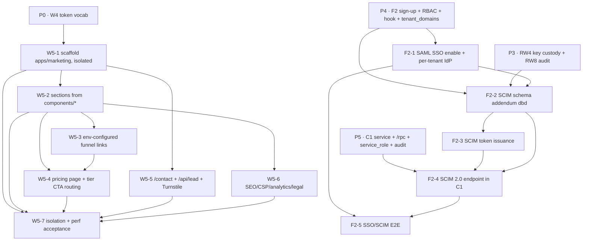

# Phase P14 · Marketing site (W5) + SSO/SCIM (F2 fast-follow) — Implementation Plan

> **For agentic workers:** REQUIRED SUB-SKILL: `superpowers:subagent-driven-development`. `.svelte` → the **svelte** skill; named Rokkit tokens only (W4 vocabulary — DECISIONS §6); eslint + prettier enforced. Turnstile wiring uses the **`turnstile-spin`** skill. **Heavy Rust rebuilds of `services/gateway` (SCIM endpoint) run via a BACKGROUND shell (controller), not inside a subagent** (the `sensei-*` + sqlx compile is minutes — the watchdog kills a subagent). Subagents WRITE code; the controller compiles + runs. DB changes go through **dbd** (`dbd reset && dbd apply && dbd import`) per `project_db_workflow`. TDD: write the failing test first, then the code.

**Goal.** Two deliverables that share nothing operationally but ship together as the v1.x fast-follow:

1. **W5 — public marketing app.** A separate SvelteKit codebase (built from `docs/mockups/components/*.jsx`, **not** the product `app/*` consoles) on Cloudflare Pages that carries **zero tenant data and zero F1/Supabase access**. It renders the product story (hero / controls / pricing / enterprise), and every CTA routes into a **real F2 sign-up** (`app.` console) or a **sales lead** (`/api/lead` → Turnstile-verified → email/CRM sink).
2. **F2 — SSO/SCIM enablement.** Turn on the enterprise identity path that was **designed-but-stubbed** in v1 onboarding (F2 §6.6): **SAML SSO login** (Supabase Auth SSO, per-tenant IdP registered by verified email domain) + **SCIM 2.0 provisioning** (an endpoint that creates/updates/deactivates directory users → `profile_tenants` + `profile_roles`), with directory-group→role mapping.

**Acceptance gate (from roadmap P14):** *A visitor hits `/pricing` and a tier CTA routes to a real F2 sign-up or a sales lead; an enterprise tenant completes a SAML SSO login and SCIM provisions/deprovisions a user.*

**Architecture.**
- **W5:** new `apps/marketing` SvelteKit app, `adapter-cloudflare`, all content routes `prerender = true`; the single server surface is a `/api/lead` Pages Function. Brand consistency via the W4 **named-token vocabulary only** (ported from `app/zs.css` per DECISIONS §6) — it does **not** import `packages/ui` product components. Deployed to its own Cloudflare Pages project with an **independent** CI cadence.
- **F2 SSO:** Supabase Auth **native SAML 2.0 SSO** — enable SSO on the project, register one IdP per enterprise tenant (`auth.sso_providers`) keyed to the tenant's **verified email domain** (`core.tenant_domains`). The existing `custom_access_token_hook` (F2 §6.3) already stamps `tenant_id` + `role_ids`; SSO login reuses the **domain auto-assignment** path (F2 §6.1) unchanged. No new JWT contract — SAML sessions are ordinary Supabase sessions.
- **F2 SCIM:** Supabase has **no native SCIM server**, so we build a **SCIM 2.0 endpoint in C1** (`services/gateway`, `/scim/v2/*`) — the only place holding the `service_role`, consistent with gateway-mediated writes (DECISIONS §2 W1). Per-tenant **SCIM bearer token** (hashed, custody like `api_keys`) authenticates the IdP's SCIM client. `Users` map to `profiles`/`profile_tenants`; `Groups` map to `profile_roles` via a `directory_role_mappings` table. Deprovision = deactivate membership + revoke devices + bump `claims_version` + audit.

**Tech stack.** W5: SvelteKit · `@sveltejs/adapter-cloudflare` · Cloudflare Pages + Pages Functions · Cloudflare Turnstile · Cloudflare Email Routing (transactional lead email) · UnoCSS/presetRokkit (token vocab only). F2 SSO/SCIM: Supabase Auth (SAML) · Rust/Axum (`services/gateway`, existing C1) · `sqlx` · dbd.

---

## Prerequisites

### Prior phases (hard)
| Prereq | From | Why |
|--------|------|-----|
| **W4 token vocabulary** | P0 | W5 reuses the named-token vocab (`paper`/`ink`/`primary`/…) ported from `app/zs.css` for brand consistency; no product components. |
| **F2 sign-up live** (email + Google/GitHub) | P4 | Every W5 CTA must land somewhere real — `PUBLIC_SIGNUP_URL` points at the F2 sign-up on `app.`. |
| **F2 RBAC + `custom_access_token_hook` + `tenant_domains` + `profile_roles`** | P4 (RW2/RW10) | SSO reuses domain auto-assignment (F2 §6.1); SCIM writes `profile_tenants`/`profile_roles`; both need the reworked schema. |
| **C1 gateway service + RS256/JWKS verify + `/rpc/*` write path** | P5 | The SCIM endpoint is a new route family in the existing C1 service (service-role writes, audit binding). |
| **`api_keys` custody pattern + `audit_events` actor binding** | P3/P4 (RW4/RW8) | SCIM tokens mirror `api_keys` (hash + prefix, reveal-once, revoke); every SCIM/SSO mutation emits an actor-bound audit row. |

### Crate issues (GH-x)
**None.** W5 uses no `sensei-*` crate (W5 spec §7). F2 SSO/SCIM adds no gateway-engine capability — SAML is Supabase-native and SCIM is a consumer-side C1 endpoint over Postgres (F2 spec §7). GH-2 (outbound provider OAuth) is **unrelated** — that is provider-credential auth, not end-user identity (F2 §7). No gateway-repo issue is filed by this phase.

### Front-loaded human inputs (secrets / product decisions — obtain before the dependent feature)
| Human input | Needed by | Notes |
|-------------|-----------|-------|
| **Product decision — content model** | W5-1 | Resolved default: **static-in-repo** (W5 spec D1). No CMS in v1. |
| **Product decision — pricing tiers** (tier names, feature splits, price points, per-tier CTA target self-serve vs enterprise) | W5-4 | The **architecture** (pricing page + CTA routing) is fully specced here; only the **editorial tier content** is a product call. Delivered as a **structured content file** (`src/content/pricing.ts`, schema in W5-4) so build proceeds and content drops in — no invented prices in the bundle. This is the one genuine content gap (W5 spec §10 Q1). |
| **Product decision — funnel/lead routing** | W5-5 | Resolved default: **hybrid, sales-led-primary** (W5 spec D3). Both CTAs present; hero emphasis is a config choice. |
| **Cloudflare Pages project + build/deploy creds** | W5-1 | Separate Pages project from the product apps (independent cadence). |
| **`PUBLIC_TURNSTILE_SITE_KEY` + `TURNSTILE_SECRET_KEY`** | W5-5 | Turnstile widget + server-side siteverify on `/api/lead`. Site key public; secret is a Pages secret. |
| **`SALES_INBOX` (+ optional `LEAD_WEBHOOK_URL`)** | W5-5 | Lead sink. v1 default = Cloudflare Email Routing transactional email to a sales inbox; CRM webhook optional via env. |
| **`PUBLIC_APP_URL` / `PUBLIC_ADMIN_URL` / `PUBLIC_SIGNUP_URL` / `PUBLIC_STATUS_URL` / `PUBLIC_DOCS_URL`** | W5-3 | Env-configured funnel links (dev/staging/prod); **no hardcoded product URLs** in the bundle. Domain final form (`torii.sensei-hq.com` apex + `app.`/`admin.`) confirmed at deploy. |
| **Supabase SAML SSO enabled on the project** | F2-1 | Native SAML 2.0 SSO must be turned on (Supabase Pro/enterprise feature) before any IdP is registered. Front-loaded like RS256/JWKS in P2a. |
| **Per-tenant IdP metadata** (SAML metadata URL or XML, entity id, attribute mapping) | F2-1 | Enterprise-tenant onboarding artifact; supplied by the customer's IdP admin (Okta/Azure AD/etc.) at tenant setup. |
| **Per-tenant SCIM bearer token issuance approval** | F2-3 | The reveal-once SCIM token handed to the customer's IdP SCIM connector. |

---

## Track A — W5 public marketing site

> Isolation invariant (the premise): **W5 is architecturally incapable of reading F1** — no Supabase/PostgREST client, no `service_role`, no provider keys. Tenant isolation is achieved by *absence of access* (W5 spec §5). The build-bundle grep (W5-7) is the enforcing test.

### W5-1 — Scaffold `apps/marketing` (SvelteKit + adapter-cloudflare, isolated)
- **Layers:** app scaffold → workspace → CI
- **Depends on:** P0 (W4 tokens), Cloudflare Pages project
- **Decision:** W5 spec §4.4, §8 (separate app/codebase & cadence)
- **Acceptance criteria:**
  - New `apps/marketing` SvelteKit app added to the bun workspace, using `@sveltejs/adapter-cloudflare`; **all content routes `export const prerender = true`**; SSR of user data does not exist.
  - The app has **no** `@supabase/*` dependency, no `packages/ui` (product component) dependency, and no `packages/core` data-layer dependency — only the W4 **token vocabulary** (UnoCSS presetRokkit config / `zs.css`-derived tokens) is shared.
  - A **separate CI pipeline** builds + deploys `apps/marketing` to its **own** Cloudflare Pages project; a change here does not trigger a product-app (`apps/admin`/`apps/desktop`) build, and vice-versa.
  - `bun run --filter marketing build` produces a static prerendered output + a single `/api/lead` function.
- **Test scenarios:**
  - Given the `apps/marketing` `package.json`, When its dependency tree is inspected, Then no `@supabase/*`, no product `packages/ui`, and no F1 client are present.
  - Given a content-only PR touching only `apps/marketing/**`, When CI runs, Then only the marketing Pages pipeline executes (product apps are not rebuilt).

### W5-2 — Marketing sections (hero / controls / showcases / footer) from `components/*.jsx`
- **Layers:** components → routes → tokens
- **Depends on:** W5-1
- **Decision:** W5 spec §1, §6.1, §9(2); mockup grounding
- **Acceptance criteria:**
  - `/` renders the ratified single long-scroll landing composing (from `docs/mockups/components/`): Nav + Hero ("Every model. One governed doorway.") + StatBand (`chrome.jsx`), Playground showcase (`pg-*.jsx`), Governance (`governance.jsx`), Observability/Requests-&-audit (`observability.jsx`), Enterprise (`enterprise.jsx`), ClosingCTA, Footer.
  - Anchor navigation (`#playground`, `#governance`, `#observability`, `#enterprise`) is preserved for the in-page scroll.
  - Every section renders in **both light and dark skins** using **W4 named tokens only** (no raw hex, no legacy `-z` utilities — semantic-styles-rokkit).
  - Optional `/enterprise` split-out route renders the security/deployment-mode/whitelabel deep-dive.
- **Test scenarios:**
  - Given `/` served from a cold cache, When view-source is inspected (no JS execution), Then hero copy + every section's text is present in the prerendered HTML.
  - Given the dark skin toggled, When each section renders, Then colors resolve from named tokens (a grep of built CSS finds no non-token hex in component styles).

### W5-3 — Env-configured funnel links (no hardcoded product URLs)
- **Layers:** env → components
- **Depends on:** W5-2; `PUBLIC_*` env from prereqs
- **Decision:** W5 spec §4.2, §9(3)
- **Acceptance criteria:**
  - Nav "Sign in"/"Open console" → `PUBLIC_APP_URL`; "Admin" → `PUBLIC_ADMIN_URL`; primary "Get started / Sign up" CTA → `PUBLIC_SIGNUP_URL` (F2 sign-up on `app.`); footer "Status"/"Docs" → `PUBLIC_STATUS_URL`/`PUBLIC_DOCS_URL`.
  - All product URLs are resolved from Cloudflare Pages env vars at build; **no product URL string-literal exists in any component**.
- **Test scenarios:**
  - Given `PUBLIC_SIGNUP_URL` is changed and the app re-deployed, When the "Get started" CTA is clicked, Then it navigates to the new URL (proving env resolution, not a literal).
  - Given the built client bundle, When grepped for `app.torii`/`admin.torii`/`supabase.co`, Then no hardcoded product origin is found.

### W5-4 — Pricing page + tier CTA routing (new surface)
- **Layers:** content-schema → route → CTA routing
- **Depends on:** W5-2, W5-3; **pricing-tiers product decision** (content only)
- **Decision:** W5 spec §4.1, §6.4, §8 D2, §10 Q1 — publish tiers, enterprise "contact us", **no live checkout in v1**
- **Acceptance criteria:**
  - `/pricing` renders named tiers from a typed content file `src/content/pricing.ts` (schema: `{ tiers: Array<{ key, name, blurb, priceLabel, features: string[], cta: { label, kind: 'signup' | 'sales' } }> }`). The **surface + routing are fixed here**; the tier *content* is the delivered product decision.
  - A **self-serve** tier CTA (`kind: 'signup'`) routes to `PUBLIC_SIGNUP_URL`; an **enterprise** tier CTA (`kind: 'sales'`) routes to `/contact` (Talk-to-sales).
  - No live checkout / Stripe / self-serve billing runtime exists (deferred — W5 spec §1 out-of-scope, D2).
  - If `pricing.ts` is empty/unprovided, the build fails with a clear "pricing content required" error (no placeholder prices ever ship).
- **Test scenarios:**
  - Given a self-serve tier, When its CTA is clicked, Then the browser navigates to `PUBLIC_SIGNUP_URL` (a real F2 sign-up).
  - Given the enterprise tier, When its CTA is clicked, Then it navigates to `/contact` (a sales lead).
  - Given `src/content/pricing.ts` with an empty `tiers`, When `bun run build` runs, Then the build errors (fails closed) rather than shipping blank/placeholder pricing.

### W5-5 — Talk-to-sales lead capture (`/contact` + `/api/lead` Pages Function + Turnstile)
- **Layers:** route → Pages Function → Turnstile → sink
- **Depends on:** W5-1; Turnstile keys + `SALES_INBOX`/`LEAD_WEBHOOK_URL`
- **Decision:** W5 spec §4.3, §5, §6.3; `turnstile-spin` skill
- **Acceptance criteria:**
  - `/contact` renders the lead form (`{ name, workEmail, company, teamSize?, message? }`) + the Turnstile widget (`PUBLIC_TURNSTILE_SITE_KEY`).
  - `POST /api/lead` (the **only** server surface): (1) server-side Turnstile **siteverify** with `TURNSTILE_SECRET_KEY`; (2) validate/normalize (reject missing/invalid email); (3) deliver to `SALES_INBOX` (transactional email) and/or `LEAD_WEBHOOK_URL`; (4) return `202 { ok: true }`. Responses: `202` accept · `400` validation/turnstile-fail · `429` per-IP rate-limit · `502` sink-down (client shows a graceful "email us at …" mailto fallback).
  - **No PII in logs:** a lead request logs only a request id + status code — never `name`/`workEmail`/`company`. **No lead is written to F1** (external sink only).
- **Test scenarios:**
  - Given a submission with a valid Turnstile token, When posted to `/api/lead`, Then it returns `202` and a lead is delivered to the configured sink.
  - Given a submission with a missing/invalid Turnstile token, When posted, Then it returns `400` and **no** lead is delivered.
  - Given any `/api/lead` request, When function logs are inspected, Then they contain a request id + status code but **no** submitter name/email/company.
  - Given the sink is unavailable, When a valid lead is posted, Then `502` is returned and the client renders the mailto fallback.

### W5-6 — SEO, headers/CSP, analytics, legal stubs
- **Layers:** build assets → `_headers` → analytics
- **Depends on:** W5-2
- **Decision:** W5 spec §4.1, §5 (CSP/headers/analytics), §9(7,9)
- **Acceptance criteria:**
  - `/sitemap.xml` + `/robots.txt` generated at build; per-page OpenGraph/meta tags present; `/privacy`, `/terms`, `/status` resolve (`/status` may redirect to an external status page).
  - Cloudflare Pages `_headers` serves a **strict CSP** (self + Turnstile + the analytics origin only), HSTS, `X-Content-Type-Options: nosniff`, `Referrer-Policy`.
  - Analytics = **Cloudflare Web Analytics (cookieless)** → **no consent banner** required in v1 (W5 spec §10 Q3 default). If a cookie-based tool is later chosen, a consent banner is added then.
- **Test scenarios:**
  - Given a page response, When its headers are inspected, Then CSP + HSTS + `X-Content-Type-Options` + `Referrer-Policy` are present and Turnstile/analytics are the only third-party allowances.
  - Given the deployed site, When `/sitemap.xml`, `/robots.txt`, `/privacy`, `/terms`, `/status` are requested, Then each resolves.

### W5-7 — Isolation & performance acceptance (build-bundle grep + Lighthouse)
- **Layers:** tests → CI gate
- **Depends on:** W5-1..W5-6
- **Decision:** W5 spec §5, §9(1,5,8)
- **Acceptance criteria:**
  - A CI check greps the **built client bundle** and finds **no** Supabase URL/key, no `service_role`, no provider key, no KEK; and asserts the app makes **no** network request to the product PostgREST/Supabase origin at runtime.
  - `/` passes a Lighthouse SEO + performance check (LCP within target on a cold cache); prerendered HTML paints without JS.
  - A content-only change deploys via the W5 Pages pipeline **without** rebuilding the product apps (separate cadence demonstrated end-to-end).
- **Test scenarios:**
  - Given the built bundle, When the isolation grep runs in CI, Then it finds zero secrets/product origins and the check passes (fails the build if any appears).
  - Given a cold-cache load of `/`, When Lighthouse runs, Then SEO + performance meet the target thresholds.

---

## Track B — F2 SSO/SCIM enablement (designed-but-stubbed → enabled)

> This track **enables** the F2 §6.6 stub. It reuses the frozen F2 JWT contract (§4.1), the `custom_access_token_hook` (§6.3), domain auto-assignment (§6.1), the RBAC matrix (§4.2/§4.3), and gateway-mediated writes (§5.5) **unchanged**. **Capability decision:** IdP/SSO + SCIM configuration is guarded by the existing **`tenant.manage`** capability (which already guards "tenant identity, domains, onboarding, residency" — F2 §4.3). This **avoids amending the closed v1 capability enumeration** (F2 §8.7) — no new capability rows, no enumeration churn across the ~10 consuming modules. Rationale recorded in "Decisions resolved" below.

### F2-1 — SAML SSO: enable + per-tenant IdP registration by verified domain
- **Layers:** Supabase config → DDL(small) → C1 RPC → RLS
- **Depends on:** P4 (F2 full: `tenant_domains`, hook, RBAC); **Supabase SAML SSO enabled**; per-tenant IdP metadata
- **Decision:** DECISIONS §3 (SAML SSO fast-follow v1.x); F2 spec §6.6, §8(1)
- **Acceptance criteria:**
  - Native SAML 2.0 SSO is enabled on the Supabase project (front-loaded prereq).
  - A `tenant.manage` holder registers an IdP for their tenant via a C1 RPC `POST /v1/tenants/sso` (`{ metadata_url | metadata_xml, attribute_mapping }`) — the RPC calls the Supabase Auth Admin SSO API (`auth.sso_providers`) and links the provider to the tenant's **verified** `core.tenant_domains.domain`. A `core.sso_providers` mirror row (`tenant_id`, `supabase_sso_provider_id`, `domain`, `enabled`, attribute mapping) records the linkage for RLS-scoped reads. Writes are `service_role`-only (gateway-mediated, §5.5).
  - SSO login: a user entering a work email whose domain maps to a registered, verified IdP is routed to that IdP; on a valid SAML assertion Supabase mints an ordinary session; the `custom_access_token_hook` (F2 §6.3) stamps `tenant_id` + `role_ids` via the **unchanged** domain auto-assignment path (§6.1). No JWT-contract change.
  - `tenant.sso_added` / `tenant.assigned` audit events emit (actor-bound, F2 §4.6).
- **Test scenarios:**
  - Given a tenant with a verified domain `northwind.co` and a registered IdP, When a `@northwind.co` user completes the IdP SAML login, Then they land in the Northwind tenant with the mapped default role and a `tenant.assigned` audit row — **completing a SAML SSO login** (the gate's first half).
  - Given a `member` (lacking `tenant.manage`), When they call `POST /v1/tenants/sso`, Then it is denied `403` server-side.
  - Given an email domain with **no** registered/verified IdP, When SSO is attempted, Then the user falls back to the v1 email/OAuth path (no SSO), not an error state.

### F2-2 — SCIM schema addendum (dbd): tokens + directory→role mappings + provisioning metadata
- **Layers:** DDL → RLS → grants → seed
- **Depends on:** P3/P4 (RW4 custody pattern, RW8 audit); F2-1
- **Decision:** F2 spec §6.6 (SCIM directory import + group→role mapping); DECISIONS §2 W1 (service_role-write)
- **Acceptance criteria:**
  - New `core.scim_tokens` (`tenant_id`, `id`, `prefix`, `hashed_secret`, `status active|revoked`, `last_used_at`, `created_by`) — **reveal-once**, hash-only custody mirroring `api_keys` (RW4); **no** usable secret is SELECTable. RLS: tenant-scoped read of metadata; `service_role`-write.
  - New `core.directory_role_mappings` (`tenant_id`, `directory_group text`, `role_id uuid fk→core.roles`) — maps an IdP/SCIM group to a tenant role. `service_role`-write, tenant-scoped read.
  - `core.profile_tenants` gains a provisioning-source marker (`provisioned_by ∈ {self, sso, scim}` + `scim_external_id text null unique-per-tenant`) so a SCIM-provisioned membership is distinguishable and idempotently matchable on the IdP's external id. (Additive; does not touch F2's frozen JWT/RLS contracts.)
  - `dbd reset && dbd apply && dbd import` is green; `tests/authz.sql` (RW12 harness) is extended so an `authenticated`/`anon` write to `scim_tokens`/`directory_role_mappings` is **denied**.
- **Test scenarios:**
  - Given an `authenticated` client, When it SELECTs `core.scim_tokens`, Then no usable secret is returned (prefix/hash/status only); When it attempts INSERT/UPDATE/DELETE on `scim_tokens` or `directory_role_mappings`, Then denied.
  - Given `dbd reset && dbd apply && dbd import`, When it completes, Then the new tables exist with RLS and the adversarial harness passes.

### F2-3 — SCIM bearer token issuance (reveal-once, per tenant)
- **Layers:** C1 RPC → custody
- **Depends on:** F2-2
- **Decision:** F2 spec §4.4 custody pattern; DECISIONS §2 W1
- **Acceptance criteria:**
  - A `tenant.manage` holder issues a SCIM token via `POST /v1/tenants/scim-token` — C1 generates `prefix.secret`, stores only `prefix` + `hash(secret)`, and returns the full token **once** (reveal-once); subsequent reads never expose it. `POST /v1/tenants/scim-token/:id/revoke` sets `status='revoked'`.
  - The token authenticates the IdP's SCIM connector to `/scim/v2/*` (F2-4); C1 validates by `prefix` + hash + `status='active'` and resolves the **tenant** (the token is tenant-scoped, not user-scoped).
  - `tenant.scim_token_issued` / `tenant.scim_token_revoked` audit events emit (actor-bound).
- **Test scenarios:**
  - Given a token issued once, When any later read of `scim_tokens` occurs, Then the secret is not returned (hash/prefix only).
  - Given a revoked SCIM token, When presented to `/scim/v2/*`, Then the request is rejected `401`.

### F2-4 — SCIM 2.0 endpoint in C1: provisioning + deprovisioning
- **Layers:** C1 routes → service_role writes → audit → RLS
- **Depends on:** F2-2, F2-3; P5 (C1 `/rpc/*` write path, service_role, audit binding)
- **Decision:** F2 spec §6.6, §4.6 (gateway-mediated); DECISIONS §2 W1 + apply-without-asking (device revoke, claims_version bump)
- **Acceptance criteria:**
  - C1 serves a **SCIM 2.0** route family `/scim/v2/{ServiceProviderConfig, ResourceTypes, Schemas, Users, Groups}` authenticated by the tenant SCIM bearer (F2-3), returning SCIM-compliant JSON + status codes (`201`/`200`/`204`/`404`/`409`).
  - **Provision (Users):** `POST /scim/v2/Users` creates/links a `profiles` + `core.profile_tenants` membership (`provisioned_by='scim'`, `scim_external_id=<IdP id>`, `active=true`) and assigns a default role; `PATCH`/`PUT` updates attributes. Idempotent on `scim_external_id` (a repeated create returns `409`/the existing resource, no duplicate membership).
  - **Deprovision (Users):** `PATCH` with `active:false` (or `DELETE`) **deactivates** the membership — sets `profile_tenants.active=false`/status, **revokes the user's devices** (`devices.status='revoked'`), and **bumps `profiles.claims_version`** so the next request with an old token returns `TokenStale`/is blocked (F2 §5.7, §6.4). The user immediately loses tenant data visibility (RLS returns nothing without a live membership).
  - **Groups → roles:** `POST/PATCH /scim/v2/Groups` membership changes resolve the directory group via `core.directory_role_mappings` → insert/remove `profile_roles` (bumping the target's `claims_version` per F2 §4.6); an unmapped group is a no-op with a logged warning (not an error).
  - All writes go through the **service role** inside C1 (no direct PostgREST); every provision/deprovision/role-change emits an actor-bound `audit_events` row (`actor` = the SCIM token's tenant/service identity).
- **Test scenarios:**
  - Given a valid SCIM token, When the IdP `POST /scim/v2/Users` provisions a new user, Then a `profile_tenants` membership (`provisioned_by='scim'`) + default role + a `scim.user_provisioned` audit row exist, and the user can sign in via SSO into that tenant — **SCIM provisions a user** (gate).
  - Given a provisioned user, When the IdP `PATCH`es `active:false` (deprovision), Then their membership is deactivated, their devices are revoked, `claims_version` is bumped, a subsequent request with their old token is blocked (`TokenStale`/`DeviceRevoked`), RLS returns zero tenant rows, and a `scim.user_deprovisioned` audit row exists — **SCIM deprovisions a user** (gate).
  - Given a duplicate `POST /scim/v2/Users` with the same `externalId`, When processed, Then no second membership is created (idempotent — `409`/existing resource).
  - Given a SCIM `Group` add mapped to role `editor`, When processed, Then the user gains a `profile_roles` row for `editor` and their `claims_version` is bumped; Given an unmapped group, Then it is a logged no-op.

### F2-5 — SSO/SCIM end-to-end acceptance
- **Layers:** integration tests
- **Depends on:** F2-1..F2-4
- **Decision:** roadmap P14 gate; F2 spec §9
- **Acceptance criteria:**
  - An integration test (extending C1 integration tests + `tests/authz.sql`) drives the full enterprise path against a test tenant with a **test IdP** (a SAML test harness / mock IdP) and a SCIM client: register IdP → SCIM-provision a user → user SAML-logs-in → SCIM-deprovision → user blocked.
  - The frozen F2 JWT contract (§4.1) is **unchanged** (grep: no new custom claim added by this track); the `custom_access_token_hook` is unmodified.
- **Test scenarios:**
  - Given the full harness, When the sequence runs, Then: IdP registers (F2-1), SCIM provisions (F2-4), the SSO login succeeds with the mapped role (F2-1), and SCIM deprovision blocks the user within the freshness/device gate (F2-4) — the complete P14 identity gate.
  - Given the reworked tokens, When a SAML-minted session's JWT is decoded, Then it carries exactly the F2 §4.1 claims (no SSO/SCIM-specific claim leaked in).

---

## Dependency graph

**Reading it:** The two tracks are **fully independent** (W5 touches no F1/C1; F2 SSO/SCIM touches no marketing app) and can be built in parallel by separate implementers. Within Track A, W5-1 (isolation scaffold) is the hinge; W5-7 is the closing gate. Within Track B, F2-2 (schema) precedes the token issuance and the endpoint; F2-1 (SSO) is parallel to the SCIM chain until they meet at F2-5.

---

## Suggested build order

1. **Front-load** the human inputs (pricing content, Cloudflare Pages project + Turnstile/sales secrets, Supabase SAML enablement + per-tenant IdP metadata) — the two product decisions with resolved defaults unblock immediately; only the pricing tier *content* and the enterprise IdP metadata are hard external gates.
2. **Parallel kickoff** (two implementers):
   - **Track A:** W5-1 → W5-2 → (W5-3, W5-5, W5-6 in parallel) → W5-4 → **W5-7** (gate).
   - **Track B:** F2-1 (SSO, parallel) ‖ F2-2 → F2-3 → F2-4 → **F2-5** (gate).
3. **Converge on the P14 acceptance gate:** demonstrate (a) `/pricing` tier CTA → real F2 sign-up **or** a delivered sales lead (W5-4 + W5-5), and (b) an enterprise tenant completing a **SAML SSO login** + **SCIM provision/deprovision** (F2-5).
4. **Cleanup + push:** `make clean` after the heavy builds; extend the CI isolation-grep (W5-7) and the adversarial authz harness (F2-2); commit per feature; push `develop` at the phase checkpoint (per `feedback_regular_cleanup`).

---

## Decisions resolved (zero TBDs — residuals settled with rationale, conforming to DECISIONS)

- **Content model = static-in-repo (CMS deferred).** W5 spec D1 — small editorial set, keeps the app dependency-free and fully prerenderable; a thin content loader localizes a future headless-CMS swap.
- **Pricing = published named tiers + enterprise "contact us", no live checkout.** W5 spec D2 — v1 has no self-serve billing runtime; the **surface + CTA routing are fully specced (W5-4)** and the tier *content* is delivered as a typed `pricing.ts` file (build fails closed if absent, so no invented prices ship). This is the single genuine content gap (W5 spec §10 Q1).
- **Funnel = hybrid, sales-led-primary.** W5 spec D3 — governed multi-tenant BYOK platform aimed at orgs; both CTAs present, hero emphasis is a config/copy choice, not architecture.
- **Lead sink = Cloudflare Email Routing transactional email to `SALES_INBOX` (v1 default); CRM webhook optional via `LEAD_WEBHOOK_URL`.** W5 spec §10 Q2 — the `/api/lead` contract is sink-agnostic; email is the zero-standup default.
- **Analytics = Cloudflare Web Analytics (cookieless) → no consent banner in v1.** W5 spec §10 Q3 default.
- **W5 carries zero F1 access** — isolation by absence (no Supabase client, no `service_role`), enforced by the CI build-bundle grep (W5-7). Conforms to DECISIONS §2 W1 (a public app gets neither privileged reads nor writes) and §6 (`components/*` ≠ product `app/*`).
- **SSO = Supabase-native SAML 2.0, per-tenant IdP keyed to a verified email domain, reusing the unchanged domain auto-assignment + `custom_access_token_hook`.** DECISIONS §3 + F2 §6.6/§8(1) — no JWT-contract change; SAML sessions are ordinary Supabase sessions.
- **SCIM = a SCIM 2.0 endpoint built in C1** (not Supabase-native, which has no SCIM server), service-role-write, per-tenant reveal-once bearer token (custody mirrors `api_keys`). Conforms to DECISIONS §2 W1 (only the central trusted boundary holds `service_role`; all privileged writes gateway-mediated).
- **SSO/SCIM config guarded by the existing `tenant.manage` capability** (already covers tenant identity/domains/onboarding/residency) — **no amendment to the closed v1 capability enumeration** (F2 §8.7), avoiding drift across the ~10 consuming modules. Deprovision reuses the apply-without-asking primitives (device revoke + `claims_version` bump — F2 §5.7).
- **No gateway-repo (GH-x) issue is filed by this phase** — W5 uses no crate; SSO is Supabase-native; SCIM is consumer-side over Postgres. GH-2 (outbound provider OAuth) is explicitly *not* related to end-user SSO (F2 §7).
- **Sequencing:** P14 is a **fast-follow (v1.x)**, off the critical path — no product module depends on W5, and SSO/SCIM enables a designed-but-stubbed step. It runs after P4 (F2 sign-up live) + P5 (C1 write path) so CTAs and the SCIM endpoint land somewhere real.

---

## Self-review notes (author)

- **Spec coverage — W5:** scaffold/isolation (W5-1), sections (W5-2), env links (W5-3), pricing (W5-4), lead capture + Turnstile (W5-5), SEO/CSP/analytics/legal (W5-6), isolation+perf gate (W5-7) — covers W5 spec §1/§4/§5/§6/§9 in full. **Out of scope kept out:** authed product surfaces, F1 access, blog/docs/changelog, self-serve checkout.
- **Spec coverage — F2 SSO/SCIM:** SAML enable + IdP (F2-1), SCIM schema (F2-2), token issuance (F2-3), SCIM endpoint provision/deprovision + group→role (F2-4), E2E (F2-5) — covers the F2 §6.6 stub + §8(1) fast-follow decision. **Frozen contracts untouched:** F2 §4.1 JWT claims, §6.3 hook, §4.3 capability enumeration (guarded via existing `tenant.manage`).
- **Deferred (flagged):** headless CMS (W5 D1), self-serve billing/checkout (W5 D2), reversible un-redaction + OS-level device attestation (F2 out-of-scope), SCIM `Group`-driven space membership beyond role mapping (v2). 
- **Biggest risks:** (a) the pricing tier *content* is a hard external product input — the build fails closed without it (W5-4) so it can't silently ship blank; (b) Supabase SAML SSO is a paid/enterprise feature that must be enabled before F2-1; (c) SCIM has no Supabase-native server, so the C1 endpoint must be SCIM-2.0-compliant enough for the target IdP connectors (Okta/Azure AD) — F2-5's mock-IdP harness de-risks it; (d) deprovision must be *effective*, not cosmetic — the test asserts token-blocking + zero RLS visibility, not just an `active=false` flag.
- **Type/contract consistency:** SCIM `externalId` ↔ `profile_tenants.scim_external_id` (idempotency key); SCIM token custody mirrors `api_keys` (`prefix`+`hash`, reveal-once, revoke); deprovision reuses F2 §5.7 device-revoke + `claims_version` bump; W5 `PUBLIC_*` env vars are the single source for every funnel URL (no literals). Both tracks emit actor-bound `audit_events` (F2 §4.6 / RW8).
